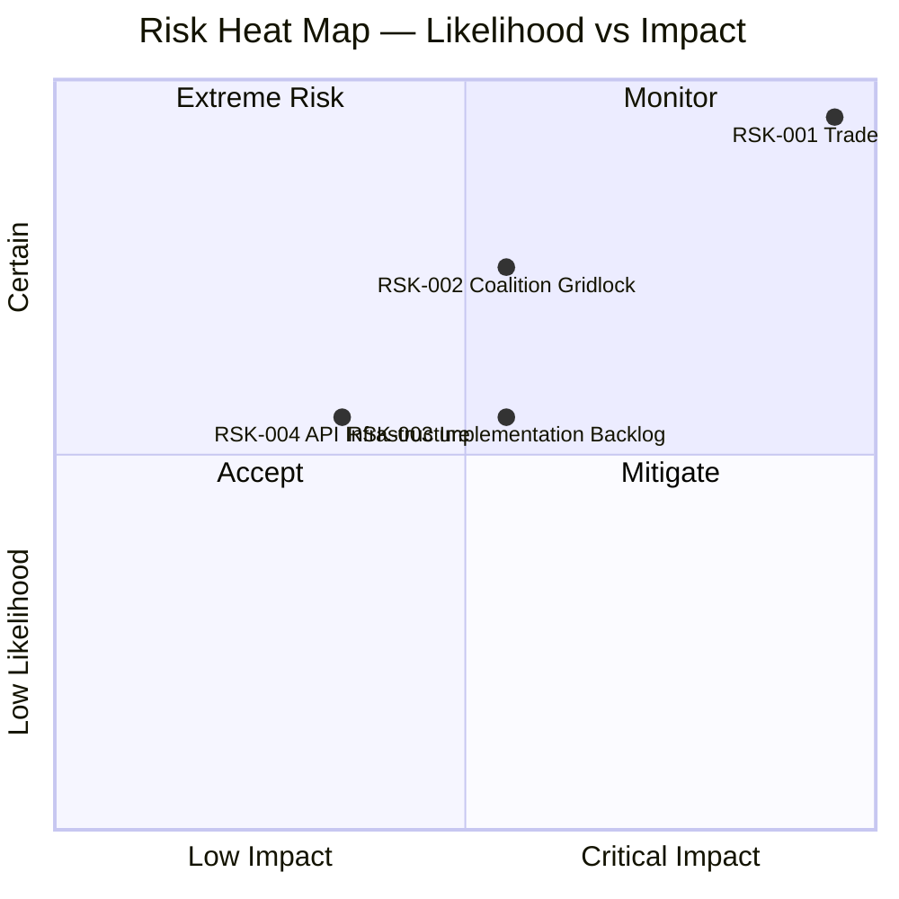
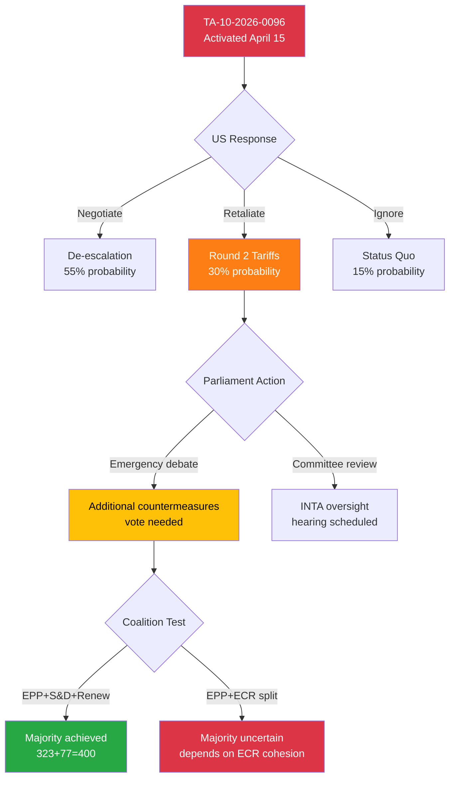
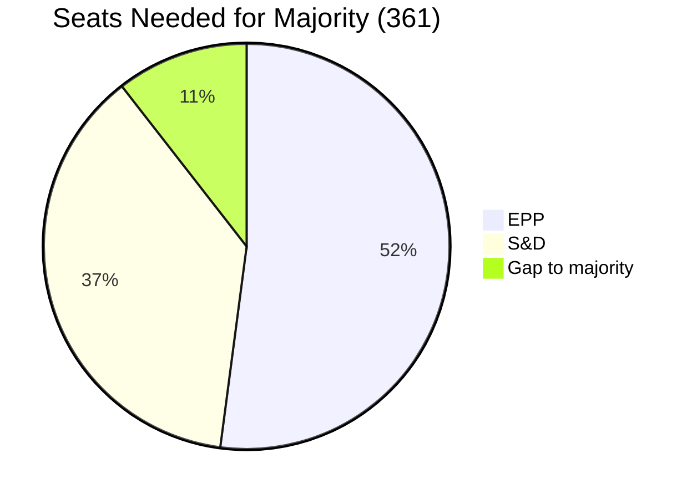
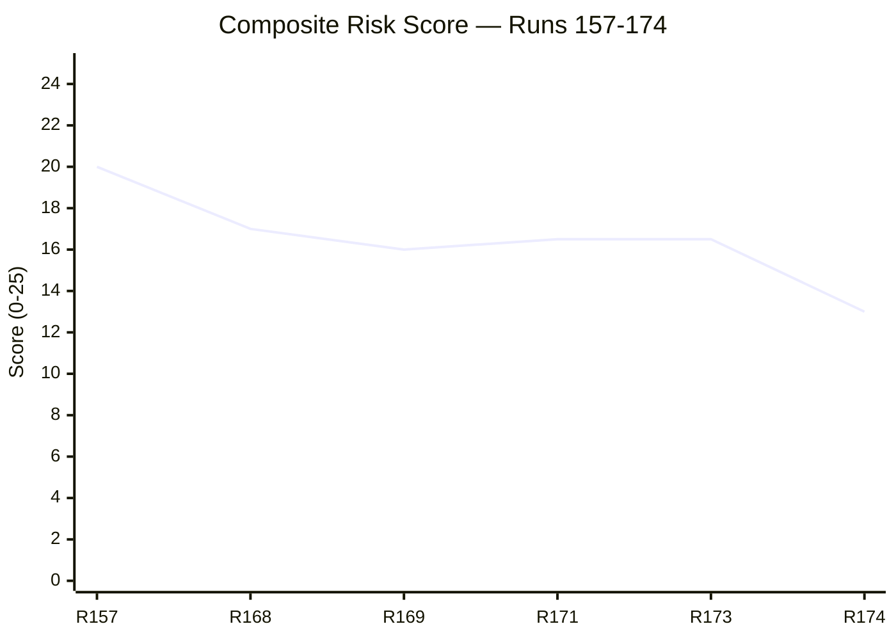

<!-- SPDX-FileCopyrightText: 2024-2026 Hack23 AB -->
<!-- SPDX-License-Identifier: Apache-2.0 -->

# ⚖️ Political Risk Assessment — 15 April 2026 (Run 174)

  
  
  
  

---

articleType: breaking

---

## 📋 Risk Assessment Context

| Field | Value |
|-------|-------|
| **Assessment ID** | `RSK-2026-04-15-174` |
| **Assessment Date** | 2026-04-15 07:20 UTC |
| **Methodology** | 5×5 Likelihood × Impact matrix (per political-risk-methodology.md) |
| **Data Sources** | 41 adopted texts, 737 MEPs, precomputed stats (85KB), coalition dynamics |
| **EP API Status** | DEGRADED MODE — 2/13 feeds operational |
| **Prior Assessment** | Run 173: Composite 16.5/25 |
| **Current Assessment** | **Composite 13.0/25 (↓ from 16.5)** |
| **Trend Rationale** | Tariff activation reduces anticipatory uncertainty but realizes trade risk |

---

## 📊 Risk Heat Map

---

## 🔴 RSK-001: Trade Policy Crisis — Tariff Activation

| Dimension | Rating | Detail |
|-----------|:------:|--------|
| **Likelihood** | 5/5 CERTAIN | TA-10-2026-0096 activates today (April 15). Legal entry into force confirmed. |
| **Impact** | 5/5 CRITICAL | EU-US trade disruption. Affected sectors: agriculture, industrial goods, consumer products. Market volatility expected. Supply chain reconfiguration for trans-Atlantic trade flows. |
| **Risk Score** | **25/25 EXTREME** | 🔴 Maximum risk — certain event with critical impact |
| **Category** | External + Policy | Externally triggered by US trade policy; EP response now in implementation phase |
| **Velocity** | Immediate | Tariffs become legally enforceable today |

### Mitigants & Controls

| Mitigant | Effectiveness | Confidence |
|----------|:------------:|:----------:|
| Commission has pre-authorised negotiation mandate | 🟡 MEDIUM | 🟢 HIGH — TA-10-2026-0096 text confirms |
| Parliament can vote additional countermeasures if needed | 🟡 MEDIUM | 🟢 HIGH — COD procedure available |
| WTO dispute resolution channels remain open | 🔴 LOW | 🟡 MEDIUM — WTO backlog makes this slow |

### Escalation Pathways

### Trend Analysis

| Period | Risk Score | Trend | Driver |
|--------|:---------:|:-----:|--------|
| Apr 11 (Run 157) | 20/25 | ↑ | T-4 anticipation |
| Apr 13 (Run 168) | 25/25 | ↑ | T-2 peak uncertainty |
| Apr 14 (Run 171) | 25/25 | → | T-1 maintained |
| Apr 15 (Run 173) | 25/25 | → | T-0 activation |
| **Apr 15 (Run 174)** | **25/25** | **→** | **T-0 activated — realized risk** |

---

## 🟠 RSK-002: Legislative Gridlock — Coalition Arithmetic Deficit

| Dimension | Rating | Detail |
|-----------|:------:|--------|
| **Likelihood** | 4/5 LIKELY | EPP (188) + S&D (135) = 323 seats — 38 below 361 majority. Mathematical constraint, not political failure. Every major vote requires 3+ group coalition. |
| **Impact** | 3/5 MODERATE | Delays legislation but doesn't prevent it. Issue-specific coalitions remain viable (EPP+Renew+ECR on trade; EPP+S&D+Greens on environment). |
| **Risk Score** | **12/25 ELEVATED** | 🟠 Structural risk — persistent throughout EP10 term |
| **Category** | Internal + Structural | EP composition constraint since July 2024 elections |
| **Velocity** | Slow-burn | Chronic condition; acute moments at each plenary vote |

### Coalition Arithmetic

| Coalition Option | Seats | Viable? | Policy Domain |
|-----------------|:-----:|:-------:|---------------|
| EPP + S&D + Renew | 400 | ✅ Yes | Environment, digital, social |
| EPP + S&D + Greens | 376 | ✅ Yes | Climate, Green Deal |
| EPP + ECR + Renew | 346 | ❌ No (-15) | — |
| EPP + ECR + PfE | 355 | ❌ No (-6) | — |
| EPP + S&D + ECR | 404 | ✅ Yes | Trade, defence, security |
| S&D + Renew + Greens + Left | 311 | ❌ No (-50) | — |

---

## 🟡 RSK-003: Implementation Backlog — Post-Recess Pipeline Pressure

| Dimension | Rating | Detail |
|-----------|:------:|--------|
| **Likelihood** | 3/5 POSSIBLE | 13 new COD procedures + Banking Union trilogue + anti-corruption trilogue + water pollutants all restart simultaneously after 18-day Easter recess. |
| **Impact** | 3/5 MODERATE | Delays transposition timelines. If Banking Union delayed, eurozone financial stability framework incomplete. If anti-corruption delayed, institutional credibility cost. |
| **Risk Score** | **9/25 MODERATE** | 🟡 Manageable with committee scheduling coordination |
| **Category** | Internal + Procedural | Calendar constraint amplified by record Q1 output |
| **Velocity** | Medium | Effects materialise over weeks as committees reconvene |

### Pipeline Status

| Legislative File | EP Reference | Stage | Next Step | Risk |
|-----------------|-------------|-------|-----------|------|
| SRMR3 — Single Resolution Mechanism Reform | TA-10-2026-0092 | Trilogue | Council common position | 🟡 |
| BRRD3 — Bank Recovery and Resolution | TA-10-2026-0091 | Trilogue | Council common position | 🟡 |
| DGSD2 — Deposit Guarantee Scheme | TA-10-2026-0090 | Trilogue | Council common position | 🟡 |
| Anti-Corruption Directive | TA-10-2026-0094 | Trilogue | Compromise text | 🟡 |
| US Tariff Countermeasures | TA-10-2026-0096 | Activated | Commission implementation | 🟢 |
| Water Pollutants Revision | TA-10-2026-0097 | Committee | Rapporteur assignment | 🟡 |

---

## 🟢 RSK-004: EP API Infrastructure Degradation

| Dimension | Rating | Detail |
|-----------|:------:|--------|
| **Likelihood** | 3/5 POSSIBLE | 8+ consecutive days of degraded service during Easter recess. 2/13 feeds operational in current assessment. Pattern: feed endpoints use /feed API path which is more fragile than direct endpoints. |
| **Impact** | 2/5 LOW | Affects monitoring and analysis capability only. Does not impact EP governance or legislative process. Workaround available via precomputed stats. |
| **Risk Score** | **6/25 LOW** | 🟢 Operational nuisance, not governance risk |
| **Category** | Technical + Infrastructure | EP Open Data Portal maintenance/reliability issue |
| **Velocity** | Variable | Can resolve suddenly when EP IT team addresses; or persist for weeks |

---

## 📊 Composite Risk Assessment

| Risk ID | Description | Score | Trend | Category |
|---------|-------------|:-----:|:-----:|----------|
| RSK-001 | Trade Policy Crisis (Tariff T-0) | 25/25 | → | External |
| RSK-002 | Coalition Gridlock | 12/25 | → | Structural |
| RSK-003 | Implementation Backlog | 9/25 | ↗ | Procedural |
| RSK-004 | API Infrastructure | 6/25 | → | Technical |
| **COMPOSITE** | **Weighted Average** | **13.0/25** | **↓** | **Mixed** |

### Composite Trend

**Trend Interpretation:** The composite risk score decreased from 16.5 to 13.0 between Run 173 and Run 174. This decrease reflects the transformation of tariff risk from anticipatory (uncertain) to realized (certain but now manageable). The trade policy risk score remains at maximum 25/25, but its character has shifted from "will it happen?" to "how will it be managed?" — which reduces compound uncertainty across other risk factors.

---

*Risk assessment produced by EU Parliament Monitor — news-breaking Run 174. Methodology: 5×5 Likelihood × Impact matrix per analysis/methodologies/political-risk-methodology.md. Data: EP Open Data Portal (DEGRADED MODE).*
