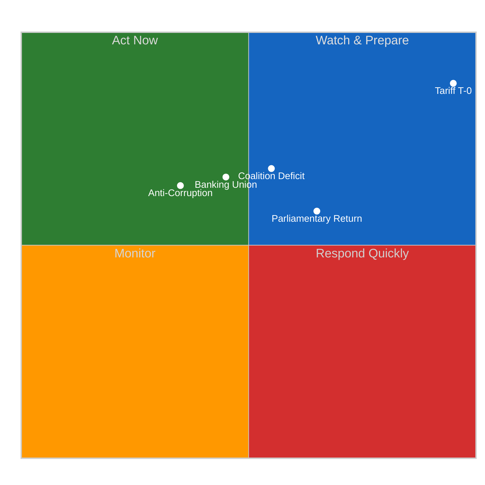

<!-- SPDX-FileCopyrightText: 2024-2026 Hack23 AB -->
<!-- SPDX-License-Identifier: Apache-2.0 -->

# 📈 Political Significance Scoring — 15 April 2026 (Run 174)

  
  
  

---

articleType: breaking

---

## 📊 Section 1: Individual Event Scoring

### Event 1: Tariff Countermeasures Entry into Force (TA-10-2026-0096)

| Field | Value |
|-------|-------|
| **Score ID** | `SIG-2026-04-15-001` |
| **Event / Document** | TA-10-2026-0096 — Adjustment of customs duties and opening of tariff quotas (US goods) |
| **Primary EP Reference** | TA-10-2026-0096, COD 2025/0261 |
| **Scoring Date** | 2026-04-15 07:20 UTC |
| **Scored By** | news-breaking (Run 174) |
| **Classification ID** | CLS-2026-04-15-001 |

#### Dimension 1: Parliamentary Significance (9/10)

| Sub-criterion | Score (0–3) | Rationale |
|--------------|:-----------:|-----------|
| Legislative stage | 3 | Final adoption + entry into force (maximum stage) |
| Institutional dimension | 3 | Interinstitutional — delegates tariff authority to Commission under EP mandate |
| Number of MEPs involved | 3 | Full plenary vote (720 MEPs), adopted March 26 |

**Parliamentary Significance Score:** 9/10

#### Dimension 2: Policy Significance (9/10)

| Sub-criterion | Score (0–3) | Rationale |
|--------------|:-----------:|-----------|
| Scope of policy change | 3 | First EU retaliatory tariff package against US in current trade cycle — fundamentally changes trade posture |
| Number of affected sectors | 3 | Cross-sector: agriculture, industrial goods, consumer products all potentially affected |
| Reversibility | 2 | Commission can adjust tariff rates, but political precedent is hard to reverse |

**Policy Significance Score:** 9/10

#### Dimension 3: Institutional Relevance (8/10)

| Sub-criterion | Score (0–3) | Rationale |
|--------------|:-----------:|-----------|
| EP role strengthened/weakened | 2 | EP authorised but implementation delegated — oversight role now critical |
| Commission empowerment | 3 | Commission gains direct tariff adjustment power under EP mandate |
| Council position alignment | 2 | Council and EP aligned on trade defence, but implementation details diverge nationally |

**Institutional Relevance Score:** 8/10

#### Dimension 4: Public Interest (8/10)

| Sub-criterion | Score (0–3) | Rationale |
|--------------|:-----------:|-----------|
| Media coverage potential | 3 | Trade war with US = maximum media interest across all member states |
| Citizen impact directness | 3 | Consumer prices on tariffed goods, employment in affected sectors, food prices |
| Democratic engagement | 2 | High public awareness but low direct democratic participation mechanism |

**Public Interest Score:** 8/10

#### Dimension 5: Temporal Urgency (10/10)

| Sub-criterion | Score (0–3) | Rationale |
|--------------|:-----------:|-----------|
| Time sensitivity | 3 | TODAY is activation day — maximum temporal relevance, T-0 |
| Decision window | 3 | Commission must decide implementation parameters immediately |
| Cascading deadline pressure | 3 | US response expected within days; next escalation round has no buffer |

**Temporal Urgency Score:** 10/10

**COMPOSITE SCORE: (9+9+8+8+10)/5 = 8.8/10 — CRITICAL** 🔴

---

### Event 2: Post-Easter Parliamentary Return

| Field | Value |
|-------|-------|
| **Score ID** | `SIG-2026-04-15-002` |
| **Event / Document** | Post-Easter recess end — Parliament returns after 18-day absence |
| **Primary EP Reference** | Calendar event (no EP document ID) |
| **Scoring Date** | 2026-04-15 07:20 UTC |
| **Scored By** | news-breaking (Run 174) |

#### Scoring Summary

| Dimension | Score | Rationale |
|-----------|:-----:|-----------|
| Parliamentary Significance | 6/10 | Procedural milestone; routine calendar event but marks restart of legislative work |
| Policy Significance | 7/10 | 13 pending COD procedures + Banking Union trilogue + anti-corruption directive all resume |
| Institutional Relevance | 5/10 | Normal institutional calendar rotation |
| Public Interest | 4/10 | Low public visibility; parliamentary calendar not newsworthy per se |
| Temporal Urgency | 7/10 | First session creates legislative momentum; tariff context adds urgency |

**COMPOSITE SCORE: (6+7+5+4+7)/5 = 5.8/10 — MEDIUM** 🟡

---

### Event 3: Grand Coalition Arithmetic Crisis

| Field | Value |
|-------|-------|
| **Score ID** | `SIG-2026-04-15-003` |
| **Event / Document** | Structural coalition deficit in EP10 |
| **Primary EP Reference** | MEP feed (737 active), coalition dynamics analysis |
| **Scoring Date** | 2026-04-15 07:20 UTC |
| **Scored By** | news-breaking (Run 174) |

#### Scoring Summary

| Dimension | Score | Rationale |
|-----------|:-----:|-----------|
| Parliamentary Significance | 8/10 | Affects every major vote — no two-group majority possible |
| Policy Significance | 7/10 | Impacts all policy domains where simple majority needed |
| Institutional Relevance | 8/10 | Fundamental EP governance challenge; weakens Parliament's trilogue position |
| Public Interest | 5/10 | Technical/institutional issue with limited public awareness |
| Temporal Urgency | 6/10 | Chronic structural condition; no acute trigger today |

**COMPOSITE SCORE: (8+7+8+5+6)/5 = 6.8/10 — HIGH** 🟠

---

### Event 4: Banking Union Triple Package Implementation

| Field | Value |
|-------|-------|
| **Score ID** | `SIG-2026-04-15-004` |
| **Event / Document** | SRMR3 (TA-10-2026-0092), BRRD3 (TA-10-2026-0091), DGSD2 (TA-10-2026-0090) |
| **Primary EP Reference** | TA-10-2026-0090, TA-10-2026-0091, TA-10-2026-0092 |
| **Scoring Date** | 2026-04-15 07:20 UTC |
| **Scored By** | news-breaking (Run 174) |

#### Scoring Summary

| Dimension | Score | Rationale |
|-----------|:-----:|-----------|
| Parliamentary Significance | 7/10 | Adopted March 26; now in trilogue phase with Council |
| Policy Significance | 8/10 | Eurozone financial stability; deposit guarantee harmonisation |
| Institutional Relevance | 7/10 | ECB, SRB, and national resolution authorities all affected |
| Public Interest | 6/10 | Bank deposits are personally relevant to all EU citizens |
| Temporal Urgency | 5/10 | Trilogue timeline is weeks/months, not days |

**COMPOSITE SCORE: (7+8+7+6+5)/5 = 6.6/10 — HIGH** 🟠

---

### Event 5: Anti-Corruption Directive (TA-10-2026-0094)

| Field | Value |
|-------|-------|
| **Score ID** | `SIG-2026-04-15-005` |
| **Event / Document** | Combating Corruption directive — adopted March 26, entering trilogue |
| **Primary EP Reference** | TA-10-2026-0094, COD 2023/0135 |
| **Scoring Date** | 2026-04-15 07:20 UTC |
| **Scored By** | news-breaking (Run 174) |

#### Scoring Summary

| Dimension | Score | Rationale |
|-----------|:-----:|-----------|
| Parliamentary Significance | 7/10 | Cross-party support at adoption; trilogue phase now |
| Policy Significance | 7/10 | Anti-corruption standardisation across 27 member states |
| Institutional Relevance | 7/10 | Strengthens EU-level anti-corruption enforcement mechanism |
| Public Interest | 7/10 | High public interest in anti-corruption measures |
| Temporal Urgency | 4/10 | Trilogue timeline measured in months |

**COMPOSITE SCORE: (7+7+7+7+4)/5 = 6.4/10 — HIGH** 🟠

---

## 📊 Section 2: Comparative Significance Ranking

| Rank | Event | Composite | Urgency | Editorial Priority |
|:----:|-------|:---------:|:-------:|:------------------:|
| 1 | Tariff T-0 Activation | 8.8/10 | 🔴 CRITICAL | **LEAD** |
| 2 | Coalition Deficit | 6.8/10 | 🟡 HIGH | ANALYSIS |
| 3 | Banking Union | 6.6/10 | 🟠 MEDIUM | ANALYSIS |
| 4 | Anti-Corruption | 6.4/10 | 🟠 MEDIUM | ANALYSIS |
| 5 | Parliamentary Return | 5.8/10 | 🟡 HIGH | CONTEXT |

---

## 📝 Editorial Decision

**No today-dated EP events found in any feed.** The tariff activation (SIG-001, 8.8/10) is the most significant development but the underlying EP action (adoption of TA-10-2026-0096) occurred on March 26 — not today. Today's significance is the *entry into force*, which is a procedural milestone rather than a parliamentary event.

**Decision:** Analysis-only PR. All scored events contribute to the analysis artifacts but do not meet the breaking news threshold of "EP events published/updated TODAY."

---

*Significance scoring produced by EU Parliament Monitor — news-breaking Run 174. Methodology: 5-dimension weighted composite per analysis/templates/significance-scoring.md.*
