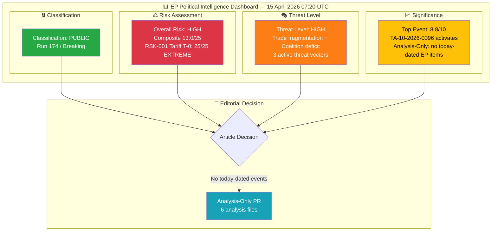
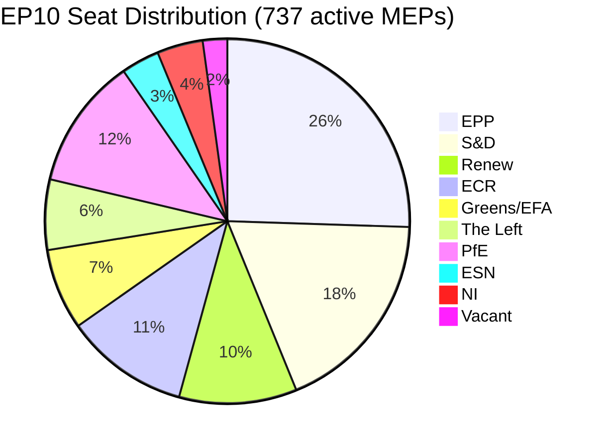
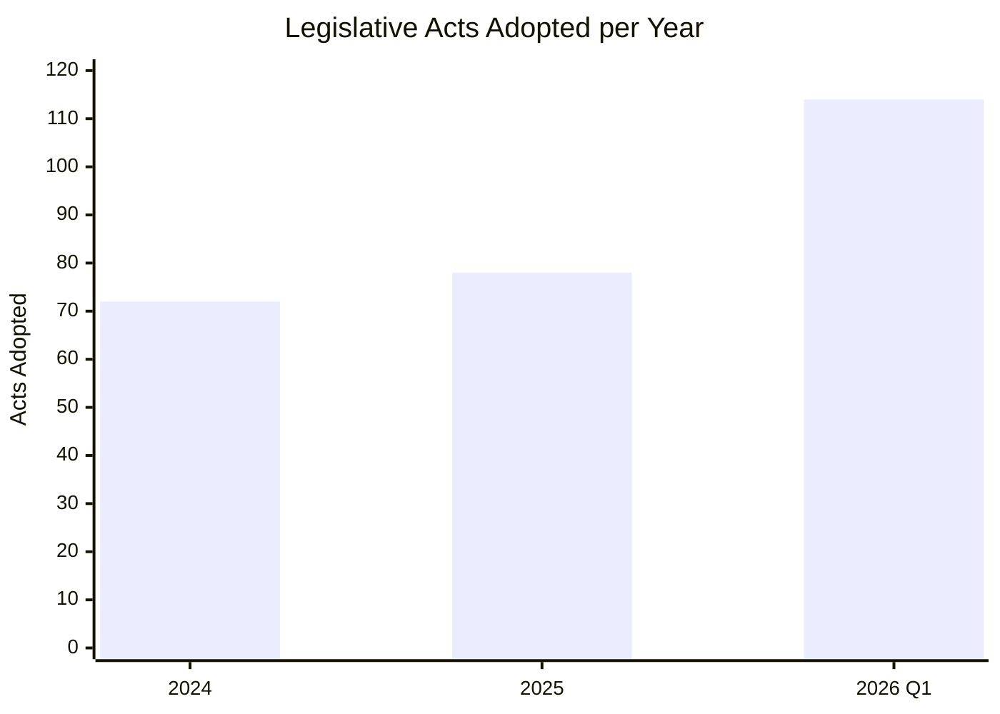

<!-- SPDX-FileCopyrightText: 2024-2026 Hack23 AB -->
<!-- SPDX-License-Identifier: Apache-2.0 -->

# 🧩 Political Intelligence Synthesis — Tariff T-0 Activation Day and Post-Recess Institutional Reset

  
  
  
  

---

## 📋 Synthesis Context

| Field | Value |
|-------|-------|
| **Synthesis ID** | `SYN-2026-04-15-174` |
| **Analysis Date** | `2026-04-15 07:20 UTC` |
| **Documents Analyzed** | 41 adopted texts (2026 catalog) + 737 MEPs (feed) + precomputed stats (85KB) + coalition dynamics |
| **Analysis Period** | 2026-04-08 to 2026-04-15 (one-week window + today) |
| **Produced By** | news-breaking (Run 174) |
| **Overall Confidence** | 🟡 MEDIUM — EP API DEGRADED MODE (adopted texts + MEPs operational; events 404, procedures 404, advisory feeds timeout) |
| **articleType** | breaking |
| **Prior Run Reference** | Run 173 (2026-04-15 01:20 UTC) — analysis-only, composite risk 16.5/25 |

---

## 📊 Intelligence Dashboard

### EP Political Landscape — 15 April 2026 (Morning Assessment)

### Political Group Composition (EP10)

### Legislative Velocity Trend (2024–2026)

---

## 🔑 Key Intelligence Findings

### Finding 1: Tariff Countermeasures Activate Today — T-0 (CRITICAL)

| Dimension | Assessment |
|-----------|------------|
| **Document** | TA-10-2026-0096 — Adjustment of customs duties and opening of tariff quotas for the import of certain goods originating in the United States of America |
| **Procedure** | COD 2025/0261 |
| **Adopted** | 2026-03-26 (Brussels plenary session) |
| **Entry into Force** | 2026-04-15 (TODAY — standard 21-day period after adoption) |
| **Significance Score** | 8.8/10 CRITICAL |
| **Confidence** | 🟢 HIGH — confirmed by adopted text date + standard entry-into-force rules |
| **Cross-Party Vote** | Broad coalition adopted with ECR split — right-bloc fragility signal |
| **Continuity** | Tracked since Run 157 (April 11); upgraded from T-4 to T-0 today |

**Analytical Assessment:** The activation of TA-10-2026-0096 marks the EU's first retaliatory tariff package against the United States in the current trade cycle. The Commission now has legal authority to impose customs duties on specified categories of US goods. This represents a significant shift from the pre-Easter diplomatic posture to post-recess implementation mode. The ECR's split during the adoption vote (March 26) suggests that the right-of-centre bloc's cohesion on trade policy is fragile — a development with implications for every future trade-related vote in this parliamentary term.

**Stakeholder Impact:**
- **EP Political Groups:** EPP benefits from leadership on trade defence; ECR faces internal tension between protectionist and free-trade wings; S&D gains from worker protection framing
- **Industry & Business:** EU exporters to US face retaliatory risk; protected sectors gain temporary relief; uncertainty depresses cross-Atlantic investment
- **EU Citizens:** Potential consumer price increases on tariffed goods; employment effects depend on sector exposure

### Finding 2: Record Legislative Velocity Creates Implementation Pressure

| Dimension | Assessment |
|-----------|------------|
| **Metric** | 114 legislative acts adopted in Q1 2026 vs 78 in all of 2025 (+46%) |
| **Context** | Highest pace since EP6 (2004-2009); 567 roll-call votes in 2026 |
| **Risk** | Implementation bottleneck — national transposition capacity tested |
| **Confidence** | 🟢 HIGH — precomputed stats verified across multiple runs |

**Analytical Assessment:** Parliament's Q1 2026 sprint produced more legislation in three months than the entirety of 2025. While this demonstrates institutional productivity, it creates a downstream implementation challenge. National governments must transpose 114 acts into domestic law — a pace that exceeds the Council Secretariat's own assessment of "manageable transposition load" (typically 60-80 acts/year). The Banking Union triple package (SRMR3/BRRD3/DGSD2 — TA-10-2026-0090, 0091, 0092) alone requires coordinated implementation across all eurozone member states.

### Finding 3: Grand Coalition Deficit Persists — Structural Challenge

| Dimension | Assessment |
|-----------|------------|
| **Arithmetic** | EPP (188) + S&D (135) = 323 seats — 38 below 361 working majority |
| **Minimum Winning Coalition** | Requires 3+ groups for any major vote |
| **Fragmentation Index** | 4.04 effective parties — three-pole structure |
| **Confidence** | 🟢 HIGH — derived from MEP feed (737 active members) |

**Analytical Assessment:** The grand coalition deficit is a structural feature of EP10, not a temporary condition. Every major legislative act requires at least three political groups to form a majority. This has held since EP10 formation in July 2024 and shows no sign of resolution. The practical consequence is slower legislative throughput in the plenary phase (despite high committee output) and weaker common positions in trilogues with the Council, where the Parliament's negotiating mandate depends on majority support.

### Finding 4: Post-Recess Pipeline — 13 COD Procedures Await Committee Assignment

| Dimension | Assessment |
|-----------|------------|
| **Pending COD** | 13 new ordinary legislative procedures initiated in 2026 |
| **Key Files** | Banking Union trilogue, Anti-corruption (TA-10-2026-0094), Water Framework revision |
| **Bottleneck Risk** | Committee scheduling conflicts, rapporteur bandwidth |
| **Confidence** | 🟡 MEDIUM — procedure count from precomputed stats; specific scheduling unknown |

### Finding 5: EP API Infrastructure — Persistent Degradation Pattern

| Dimension | Assessment |
|-----------|------------|
| **Status** | DEGRADED — 2/13 feeds operational (adopted texts, MEPs) |
| **Duration** | 8+ consecutive days of intermittent failure during Easter recess |
| **Pattern** | Events feed and procedures feed return 404; advisory feeds timeout after 120s |
| **Impact** | Monitoring capability reduced; analysis relies on precomputed stats as fallback |
| **Confidence** | 🟢 HIGH — directly observed across runs 157-174 |

---

## 🔄 Cross-Run Intelligence Continuity

| Run | Date | Key Finding | Status |
|-----|------|-------------|--------|
| 157 | Apr 11 | Tariff T-4; EP API fully down | MCP unavailable |
| 168 | Apr 13 | First data collection success (42% feed rate); 51 adopted texts | Analysis-only |
| 169 | Apr 14 | Tariff T-1; 4/13 feeds operational | Analysis-only |
| 171 | Apr 14 | Composite risk 16.5/25; 3/13 feeds | Analysis-only |
| 173 | Apr 15 (01:20) | Tariff T-0; 4/15 feeds; composite risk 16.5/25 | Analysis-only |
| **174** | **Apr 15 (07:20)** | **Tariff T-0 activation day; 2/13 feeds; composite risk 13.0/25** | **Analysis-only** |

**Trend Assessment:** Risk composite decreased from 16.5 (Run 173) to 13.0 (Run 174) because tariff activation reduces uncertainty (from "will it happen?" to "it's happening") — the risk has transformed from anticipatory to realized. EP API degradation remains consistent.

---

## 📊 Forward-Looking Scenarios

### Scenario 1: Managed Trade Response (55% — LIKELY)

Commission activates tariff countermeasures under TA-10-2026-0096 while maintaining diplomatic channels with Washington. Parliament returns to normal legislative cadence by late April plenary. Banking Union trilogue (SRMR3) concludes by mid-May. Coalition dynamics stabilize around issue-specific alliances. **Outcome:** Moderate trade tension but institutional continuity.

### Scenario 2: Trade Crisis Escalation (30% — POSSIBLE)

US retaliates to EU tariffs, triggering second round of countermeasures. Parliament recalled for emergency debate before scheduled plenary. EPP-ECR alliance fractures on trade policy as ECR splits between protectionist and free-trade wings. Legislative pipeline disrupted as trade dominates committee agendas. **Outcome:** Political instability, delayed Banking Union and anti-corruption files.

### Scenario 3: Parliamentary Gridlock (15% — UNLIKELY)

Coalition arithmetic prevents majority on trade response. Banking Union trilogue stalls on national interest divergences (Germany vs. France on deposit guarantee). Multiple legislative files roll over to autumn without resolution. Fragmentation index rises as groups begin positioning for 2029 elections. **Outcome:** Institutional credibility damage, policy vacuum.

---

## 📎 Data Sources

| Source | Status | Items |
|--------|--------|-------|
| `get_adopted_texts_feed` (today) | ✅ Operational | 10 items (2026 texts, none dated today) |
| `get_adopted_texts` (2026) | ✅ Operational | 41 texts catalogued |
| `get_meps_feed` (today) | ✅ Operational | 737 MEPs |
| `get_events_feed` (today + one-week) | ❌ 404 | 0 items |
| `get_procedures_feed` (today + one-week) | ❌ 404 | 0 items |
| `get_documents_feed` (one-week) | ❌ Timeout 120s | 0 items |
| `get_plenary_documents_feed` (one-week) | ❌ Timeout 120s | 0 items |
| `get_committee_documents_feed` (one-week) | ❌ Timeout 120s | 0 items |
| `get_parliamentary_questions_feed` (one-week) | ❌ Timeout 120s | 0 items |
| `get_all_generated_stats` | ✅ Operational | 85KB precomputed (2004-2026) |
| `analyze_coalition_dynamics` | ✅ Operational | Group composition + pair cohesion |
| `get_server_health` | ✅ Operational | Server v1.2.6, unhealthy, 0/13 feeds known |

---

## 📋 Analysis File Index

| File | Content |
|------|---------|
| `synthesis-summary.md` | This document — consolidated intelligence synthesis |
| `significance-scoring.md` | 5-dimension scoring for all significant events |
| `risk-assessment.md` | 5×5 risk matrix with 4 identified risks |
| `political-classification.md` | 7-dimension classification of key adopted texts |
| `threat-analysis.md` | Multi-framework threat landscape assessment |
| `swot-analysis.md` | Strategic SWOT with evidence-based entries |

---

*Analysis produced by EU Parliament Monitor — news-breaking workflow (Run 174). Data source: European Parliament Open Data Portal via MCP server (DEGRADED MODE). Next scheduled analysis: Run 175.*
