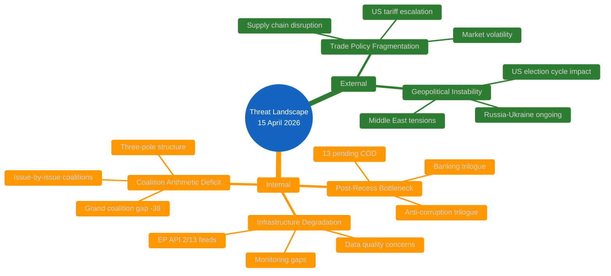
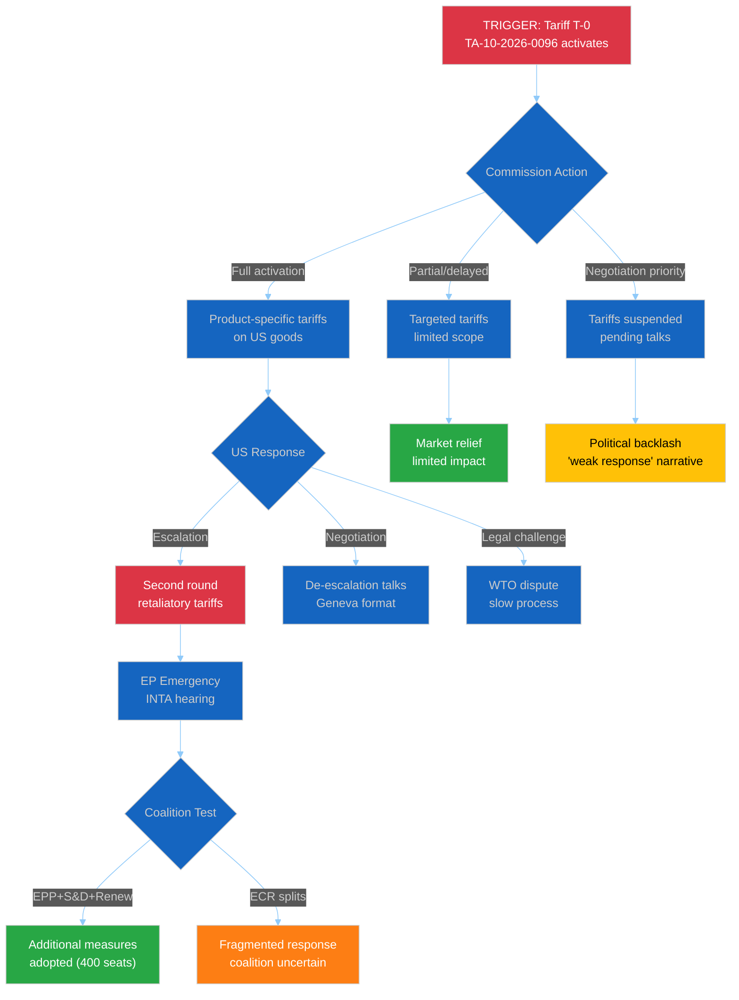
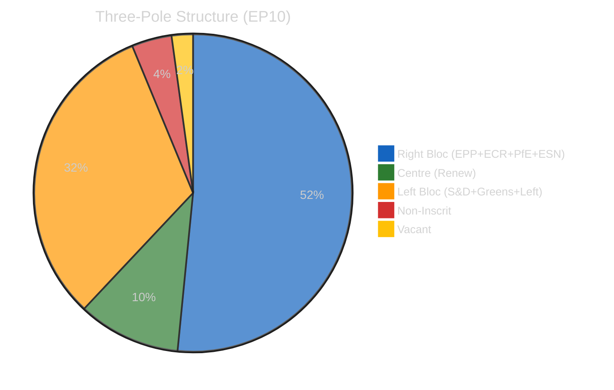
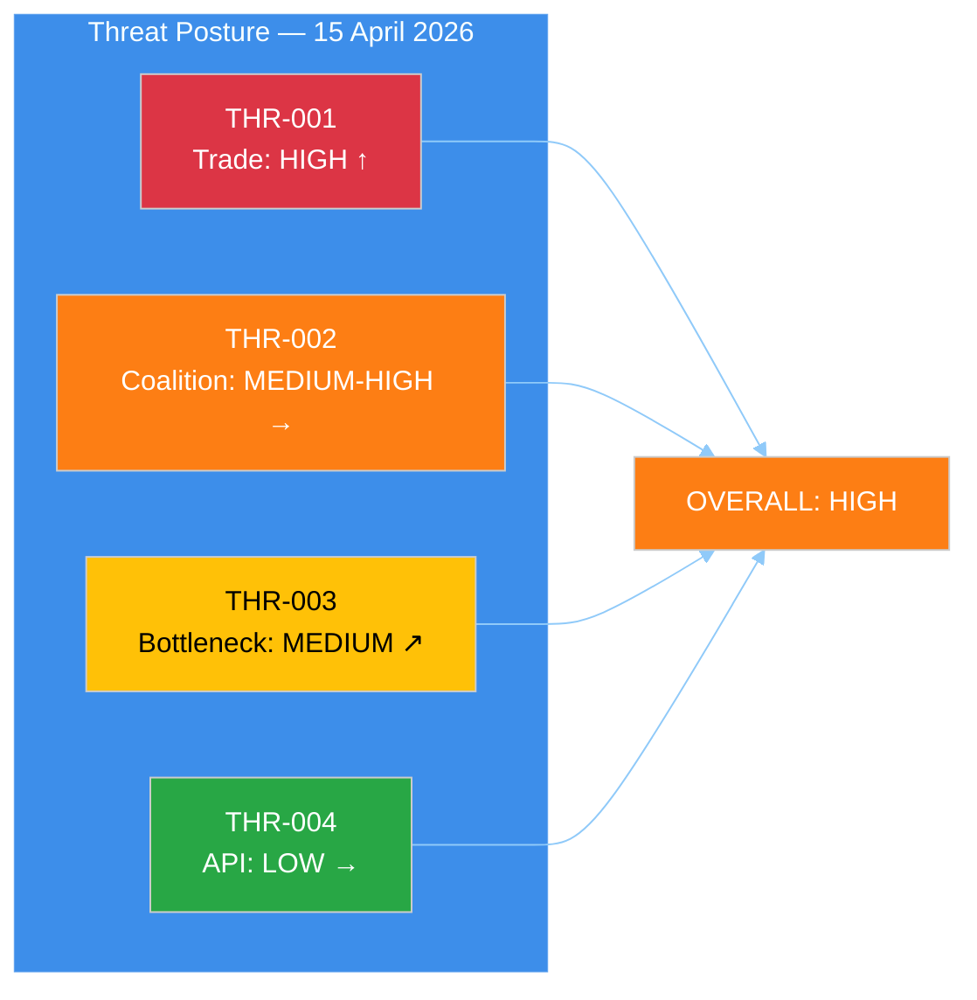

<!-- SPDX-FileCopyrightText: 2024-2026 Hack23 AB -->
<!-- SPDX-License-Identifier: Apache-2.0 -->

# 🎭 Political Threat Analysis — 15 April 2026 (Run 174)

  
  
  
  

---

articleType: breaking

---

## 📋 Threat Analysis Context

| Field | Value |
|-------|-------|
| **Analysis ID** | `THR-2026-04-15-174` |
| **Analysis Date** | 2026-04-15 07:20 UTC |
| **Frameworks Applied** | Political Threat Landscape, Actor Threat Profiling, Consequence Trees |
| **Threat Vectors Identified** | 3 active, 2 latent |
| **Overall Threat Level** | 🟠 HIGH |
| **Data Confidence** | 🟡 MEDIUM — EP API degraded (2/13 feeds) |

---

## 📊 Threat Landscape Overview

---

## 🔴 THREAT-001: Trade Policy Fragmentation (ACTIVE — HIGH)

### Threat Profile

| Attribute | Assessment |
|-----------|------------|
| **Source** | External (US trade policy) + Internal (EP coalition dynamics on trade) |
| **Vector** | TA-10-2026-0096 activation creates implementation pressure; Commission must decide tariff levels and product scope |
| **Trigger** | US tariff announcement (pre-existing) → EP countermeasure adoption (March 26) → Entry into force (TODAY) |
| **Affected Actors** | Commission (implementing), INTA committee (oversight), ECR (internal split), PfE/ESN (opposition), industry (impact) |
| **Cascading Potential** | HIGH — trade escalation could disrupt legislative pipeline as trade dominates committee agendas |
| **Confidence** | 🟢 HIGH — TA-10-2026-0096 text and procedure reference confirmed |

### Actor Threat Profiling — Trade Policy

| Actor | Posture | Capability | Intent | Risk Level |
|-------|---------|:----------:|--------|:----------:|
| **EPP** | Defensive (trade defence) | HIGH — largest group, INTA chair | Protect EU manufacturing + agriculture | 🟡 MEDIUM |
| **S&D** | Assertive (worker protection) | MEDIUM — 2nd largest, labour framing | Link trade to social standards | 🟡 MEDIUM |
| **Renew** | Constructive (rules-based order) | MEDIUM — bridge between EPP and liberals | Maintain WTO compliance | 🟢 LOW |
| **ECR** | SPLIT (ideological tension) | HIGH — 81 seats, 3rd force | Free-trade wing vs protectionist wing | 🔴 HIGH |
| **PfE** | Opposed (pro-US alignment) | MEDIUM — 86 seats | Block countermeasures, maintain US relationship | 🟠 MEDIUM-HIGH |

### Consequence Tree

---

## 🟠 THREAT-002: Three-Pole Structural Instability (ACTIVE — MEDIUM-HIGH)

### Threat Profile

| Attribute | Assessment |
|-----------|------------|
| **Source** | Internal (EP10 composition after 2024 elections) |
| **Vector** | No natural two-group majority; every major vote requires cross-bloc negotiation |
| **Composition** | Right bloc (EPP+ECR+PfE+ESN): 380 seats (52.3%) / Centre (Renew): 77 (10.7%) / Left bloc (S&D+Greens+Left): 234 (32.6%) / NI: 30 (4.1%) |
| **Critical Metric** | Fragmentation index: 4.04 effective parties — highest in EP10 to date |
| **Affected Actors** | All political groups; EP Presidency; trilogue negotiating teams |
| **Cascading Potential** | MEDIUM — delays legislation but doesn't prevent it; weakens EP position in trilogues |
| **Confidence** | 🟢 HIGH — MEP feed (737 active) confirms composition |

### Bloc Analysis

**Key Insight:** The right bloc technically holds a majority (380/720 = 52.8%) but is ideologically incoherent — EPP and PfE/ESN rarely vote together, and ECR is internally divided on trade and climate. The practical result is that no natural majority exists, and Renew's 77 seats serve as the kingmaker for any centrist coalition.

### Vulnerability Assessment

| Scenario | Groups Needed | Seats | Margin | Feasibility |
|----------|:-------------:|:-----:|:------:|:-----------:|
| Trade defence vote | EPP + S&D + Renew | 400 | +39 | 🟢 HIGH |
| Banking Union trilogue mandate | EPP + S&D + Greens | 376 | +15 | 🟡 MEDIUM |
| Climate policy extension | S&D + Greens + Renew + Left | 311 | -50 | 🔴 LOW |
| Defence spending increase | EPP + ECR + Renew | 346 | -15 | 🔴 LOW |
| Anti-corruption enforcement | All except PfE + ESN | 595 | +234 | 🟢 HIGH |

---

## 🟡 THREAT-003: Post-Recess Legislative Bottleneck (LATENT — MEDIUM)

### Threat Profile

| Attribute | Assessment |
|-----------|------------|
| **Source** | Internal (calendar constraint + record Q1 output) |
| **Vector** | 13 pending COD procedures + 3 trilogues restart simultaneously after 18-day Easter recess |
| **Trigger** | Parliament returns April 15; committees reconvene week of April 21 |
| **Affected Actors** | Committee chairs, rapporteurs, Council Presidency, Commission DGs |
| **Cascading Potential** | MEDIUM — if Banking Union delayed, financial stability implications; if anti-corruption delayed, institutional credibility cost |
| **Confidence** | 🟡 MEDIUM — procedure count from precomputed stats; specific scheduling unknown |

### Bottleneck Mapping

| Committee | Pending Files | Key Trilogue | Rapporteur Bandwidth |
|-----------|:------------:|:------------:|:--------------------:|
| ECON | 4+ | SRMR3, BRRD3, DGSD2 | 🔴 STRESSED |
| LIBE | 2+ | Anti-corruption | 🟡 MODERATE |
| INTA | 2+ | Tariff implementation | 🟡 MODERATE |
| ENVI | 2+ | Water pollutants | 🟡 MODERATE |
| IMCO | 1+ | Measuring instruments (TA-10-2026-0029) | 🟢 AVAILABLE |

---

## 🟢 THREAT-004: EP API Infrastructure Failure (LATENT — LOW)

### Threat Profile

| Attribute | Assessment |
|-----------|------------|
| **Source** | Technical (EP Open Data Portal infrastructure) |
| **Severity** | LOW — affects monitoring, not governance |
| **Duration** | 8+ days continuous degradation (April 7-15) |
| **Pattern** | Feed endpoints (/feed path) more fragile than direct endpoints; timeouts and 404s |
| **Impact** | Reduced analysis quality; reliance on precomputed stats |
| **Confidence** | 🟢 HIGH — directly observed |

---

## 📊 Threat Assessment Summary

| Threat ID | Description | Level | Trend | Active/Latent |
|-----------|-------------|:-----:|:-----:|:-------------:|
| THR-001 | Trade Policy Fragmentation | 🔴 HIGH | ↑ | Active |
| THR-002 | Three-Pole Instability | 🟠 MEDIUM-HIGH | → | Active |
| THR-003 | Post-Recess Bottleneck | 🟡 MEDIUM | ↗ | Latent |
| THR-004 | API Infrastructure | 🟢 LOW | → | Latent |

### Overall Threat Posture

---

*Threat analysis produced by EU Parliament Monitor — news-breaking Run 174. Frameworks: Political Threat Landscape + Actor Threat Profiling + Consequence Trees (per analysis/methodologies/political-threat-framework.md). Data: EP Open Data Portal (DEGRADED MODE).*
