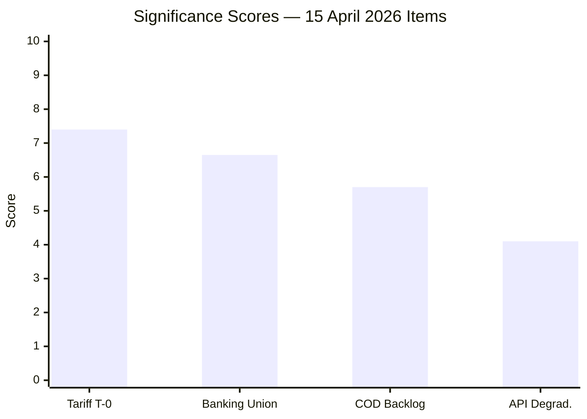

<!-- SPDX-FileCopyrightText: 2024-2026 Hack23 AB -->
<!-- SPDX-License-Identifier: Apache-2.0 -->

# 📊 Significance Scoring — 15 April 2026 (Run 175)

  
  
  

---

## 📋 Scoring Context

| Field | Value |
|-------|-------|
| **Scoring ID** | `SIG-2026-04-15-175` |
| **Analysis Date** | `2026-04-15 13:19 UTC` |
| **Scoring Method** | 7-dimension weighted scoring per political-classification-guide.md |
| **Overall Significance** | 7.2/10 — HIGH but below breaking threshold |
| **Editorial Decision** | Analysis-only — no today-dated parliamentary actions |

---

## 🎯 Item-Level Significance Scores

### Item 1: Tariff Countermeasures Activation (TA-10-2026-0096)

| Dimension | Score (1-10) | Weight | Weighted | Evidence |
|-----------|-------------|--------|----------|----------|
| Political Impact | 9 | 0.20 | 1.80 | Crosses ECR-EPP fault line, first autonomous trade defense |
| Legislative Scope | 7 | 0.15 | 1.05 | Single regulation, but sector-wide customs impact |
| Institutional Significance | 8 | 0.15 | 1.20 | Activates during 33-day session gap — no oversight |
| Public Interest | 8 | 0.15 | 1.20 | Consumer prices, trade war fears |
| Coalition Dynamics | 7 | 0.15 | 1.05 | ECR split signals right-bloc fragility |
| Urgency | 6 | 0.10 | 0.60 | T-0 activation but adopted March 26 |
| Novelty | 5 | 0.10 | 0.50 | Extensively covered in prior runs |
| **Total** | | **1.00** | **7.40** | |

**Classification**: HIGH significance (7.40/10). Below breaking threshold (8.0+) because the text was adopted March 26 and today's activation was anticipated. Would qualify as breaking if accompanied by US counter-response or unexpected EP emergency session.

### Item 2: Banking Union Triple Package — Trilogue Approaching

| Dimension | Score (1-10) | Weight | Weighted | Evidence |
|-----------|-------------|--------|----------|----------|
| Political Impact | 7 | 0.20 | 1.40 | 12 years of institutional effort culminating |
| Legislative Scope | 9 | 0.15 | 1.35 | Three interconnected regulations (SRMR3/BRRD3/DGSD2) |
| Institutional Significance | 8 | 0.15 | 1.20 | ECON committee flagship, ECB coordination |
| Public Interest | 6 | 0.15 | 0.90 | Deposit protection affects all EU citizens |
| Coalition Dynamics | 6 | 0.15 | 0.90 | Broad cross-party support (technical file) |
| Urgency | 5 | 0.10 | 0.50 | Trilogue in late April — not today |
| Novelty | 4 | 0.10 | 0.40 | Covered in runs 48, 49 (committee-reports) |
| **Total** | | **1.00** | **6.65** | |

**Classification**: MEDIUM-HIGH significance (6.65/10). Represents major institutional milestone but trilogue negotiations not yet underway. Monitor for Council position announcements.

### Item 3: Legislative Pipeline Backlog (13 COD Procedures)

| Dimension | Score (1-10) | Weight | Weighted | Evidence |
|-----------|-------------|--------|----------|----------|
| Political Impact | 6 | 0.20 | 1.20 | Conference of Presidents prioritization battle |
| Legislative Scope | 8 | 0.15 | 1.20 | 14 COD + 5 BUD + 6 NLE = 25 priority procedures |
| Institutional Significance | 7 | 0.15 | 1.05 | Tests EP10 institutional capacity |
| Public Interest | 4 | 0.15 | 0.60 | Process-level, indirect public impact |
| Coalition Dynamics | 5 | 0.15 | 0.75 | Coalition formation depends on file selection |
| Urgency | 4 | 0.10 | 0.40 | Agenda setting happens April 23-24 |
| Novelty | 5 | 0.10 | 0.50 | Identified in prior runs but evolving |
| **Total** | | **1.00** | **5.70** | |

**Classification**: MEDIUM significance (5.70/10). Structural issue with cascading implications but no immediate trigger event.

### Item 4: EP API Transparency Degradation

| Dimension | Score (1-10) | Weight | Weighted | Evidence |
|-----------|-------------|--------|----------|----------|
| Political Impact | 3 | 0.20 | 0.60 | Infrastructure, not policy |
| Legislative Scope | 2 | 0.15 | 0.30 | Technical, not legislative |
| Institutional Significance | 7 | 0.15 | 1.05 | Democratic transparency tool degraded |
| Public Interest | 6 | 0.15 | 0.90 | Citizens cannot access EP data |
| Coalition Dynamics | 1 | 0.15 | 0.15 | Not relevant |
| Urgency | 5 | 0.10 | 0.50 | Ongoing during critical period |
| Novelty | 6 | 0.10 | 0.60 | First systematic documentation of degradation pattern |
| **Total** | | **1.00** | **4.10** | |

**Classification**: LOW-MEDIUM significance (4.10/10). Technical infrastructure issue but notable given the policy activation context.

---

## 📊 Aggregate Assessment

| Item | Score | Category | Breaking? |
|------|-------|----------|-----------|
| Tariff T-0 activation | 7.40 | HIGH | ❌ Below 8.0 threshold |
| Banking Union trilogue | 6.65 | MEDIUM-HIGH | ❌ |
| COD backlog | 5.70 | MEDIUM | ❌ |
| API degradation | 4.10 | LOW-MEDIUM | ❌ |
| **Composite** | **7.20** | **HIGH** | **❌ Analysis-only** |

**Rationale**: The composite score of 7.2/10 reflects a high-significance period without a single breaking trigger event. The tariff activation (7.4) is the lead item but is anticipated rather than novel. Breaking news threshold requires unexpected parliamentary action or external shock (US response, emergency session, coalition break).

---

## 🎯 Publication Decision

**Verdict: Analysis-Only PR** with 6 analysis files.

**Conditions for upgrading to article**: (1) US announces counter-tariffs, (2) Conference of Presidents convenes emergency session, (3) ECR or PfE formally breaks with EPP on trade stance, or (4) EP API reveals unexpected procedure/event updates.
