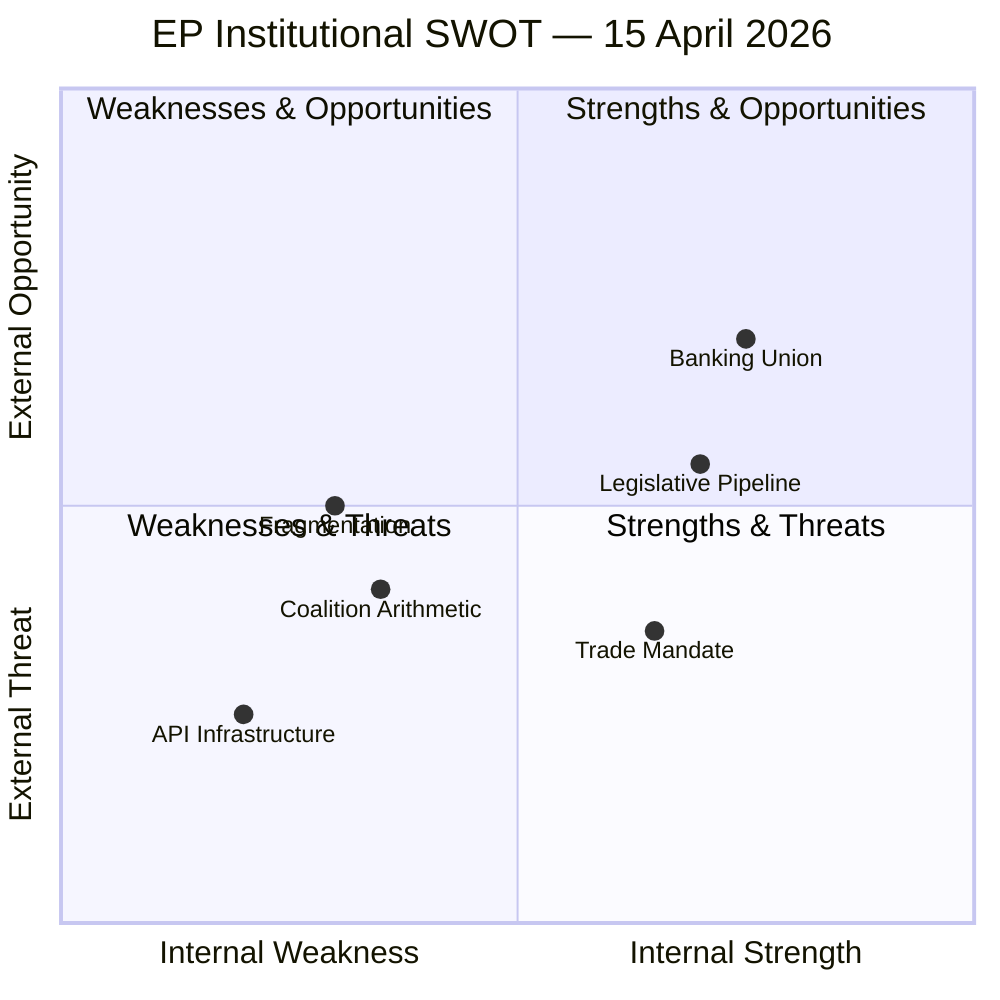

<!-- SPDX-FileCopyrightText: 2024-2026 Hack23 AB -->
<!-- SPDX-License-Identifier: Apache-2.0 -->

# 📊 SWOT Analysis — 15 April 2026 (Run 175)

  
  

---

## 📋 SWOT Context

| Field | Value |
|-------|-------|
| **Assessment ID** | `SWOT-2026-04-15-175` |
| **Subject** | European Parliament institutional position, 15 April 2026 |
| **Scope** | EP10 legislative capacity, trade policy, coalition dynamics |
| **Data Sources** | 51 adopted texts, 51 procedures, coalition dynamics, precomputed stats |
| **Confidence** | 🟡 Medium |

---

## 📈 SWOT Matrix

---

## 💪 Strengths

| # | Strength | Evidence | Impact (1-5) |
|---|----------|----------|--------------|
| S1 | **Robust legislative pipeline** | 51 procedures in 2026, 14 COD — highest codecision volume since EP7 | 4 |
| S2 | **Cross-party tariff mandate** | TA-10-2026-0096 adopted with broad support (EPP + S&D + Greens + Left + partial ECR) | 4 |
| S3 | **Banking Union momentum** | SRMR3/BRRD3/DGSD2 triple package approaching trilogue — 12 years of effort maturing | 4 |
| S4 | **Anti-corruption framework** | TA-10-2026-0094 adopted — strengthens EP's moral authority on institutional reform | 3 |
| S5 | **Statistical transparency** | Precomputed stats infrastructure provides comprehensive historical data (2004-2026) | 3 |
| S6 | **Legislative velocity** | 114 projected acts for 2026 (+46% over 2025) shows institutional capacity recovery | 4 |

## 📉 Weaknesses

| # | Weakness | Evidence | Impact (1-5) |
|---|----------|----------|--------------|
| W1 | **Grand coalition deficit** | EPP + S&D = 320 seats, 41 short of majority — structural vulnerability | 5 |
| W2 | **Record fragmentation** | Index 6.59, minimum 3-group coalition — increases negotiation complexity | 4 |
| W3 | **Session gap vulnerability** | 33-day gap (longest non-August in EP10) — no oversight during policy activation | 4 |
| W4 | **EP API infrastructure decay** | 67% feed degradation — undermines EP's own transparency commitment | 3 |
| W5 | **ECR internal division** | 22% defection on trade vote — swing group reliability compromised | 3 |
| W6 | **Post-recess capacity constraint** | 105 working days to process 51 procedures including 14 COD — scheduling bottleneck | 4 |

## 🌟 Opportunities

| # | Opportunity | Evidence | Probability |
|---|------------|----------|-------------|
| O1 | **Trade policy leadership** | EU as rule-maker in tariff response — strengthens global regulatory influence | Likely (70%) |
| O2 | **Banking Union completion** | Trilogue success would be EP's signature achievement of EP10 mid-term | Possible (55%) |
| O3 | **Centrist coalition consolidation** | External pressure (trade war) historically strengthens EPP-S&D-RE cooperation | Likely (65%) |
| O4 | **Anti-corruption institutional reform** | TA-10-2026-0094 creates framework for broader governance improvements | Possible (50%) |
| O5 | **Digital transformation acceleration** | AI Act implementation + DSA enforcement establish EU tech governance model | Likely (60%) |
| O6 | **Session return momentum** | April 27 return could channel 33 days of accumulated urgency into decisive action | Possible (45%) |

## ⚠️ Threats

| # | Threat | Evidence | Probability |
|---|--------|----------|-------------|
| T1 | **Trade war escalation** | US retaliation to TA-10-2026-0096 could trigger tit-for-tat cycle | Possible (40%) |
| T2 | **Coalition paralysis** | 3-group minimum + fragmentation index = vetoes on controversial files | Possible (35%) |
| T3 | **ECR-PfE right-bloc formation** | Combined 163 seats create powerful blocking minority | Unlikely (20%) |
| T4 | **Legislative backlog crisis** | 51 procedures in 105 days = potential triage failures and orphaned files | Possible (30%) |
| T5 | **Transparency erosion** | EP API degradation + session gap = democratic accountability deficit | Likely (60%) |
| T6 | **External geopolitical shocks** | Ukraine, Middle East, or economic crisis could divert legislative bandwidth | Possible (35%) |

---

## 🔗 SWOT Interactions

### Strength–Opportunity Strategies (Exploit)
- **S2 + O1**: Leverage broad tariff mandate to establish EU as credible trade negotiation partner
- **S3 + O2**: Use Banking Union trilogue to demonstrate EP10 institutional effectiveness
- **S6 + O6**: Channel high legislative velocity into post-recess sprint

### Weakness–Threat Strategies (Defend)
- **W1 + T2**: Grand coalition deficit + paralysis risk → prioritize consensus files in April 27 agenda
- **W3 + T5**: Session gap + transparency erosion → schedule virtual INTA hearing before April 27
- **W5 + T3**: ECR split + right-bloc risk → EPP must engage ECR Atlanticist wing early

### Strength–Threat Strategies (Confront)
- **S1 + T4**: Robust pipeline vs. backlog crisis → Conference of Presidents must prioritize ruthlessly
- **S2 + T1**: Trade mandate strength vs. escalation → EP's broad vote gives Commission strong negotiating position

### Weakness–Opportunity Strategies (Improve)
- **W4 + O5**: EP API decay vs. digital transformation → apply internal digital governance standards
- **W2 + O3**: Fragmentation vs. centrist consolidation → external pressure creates centripetal force

---

## 📊 SWOT Balance Assessment

| Dimension | Score | Assessment |
|-----------|-------|------------|
| Internal Strengths | 22/30 | STRONG — legislative pipeline and mandate provide solid foundation |
| Internal Weaknesses | 23/30 | SIGNIFICANT — structural fragmentation and session gap are material |
| External Opportunities | 21/30 | GOOD — multiple paths to institutional achievement |
| External Threats | 18/30 | ELEVATED — trade escalation and transparency deficit require attention |

**Net position**: Marginally negative (-2 balance: Weaknesses 23 vs. Strengths 22). The external opportunity set (21) slightly outweighs threats (18), but internal structural weaknesses (coalition deficit, fragmentation) limit the EP's ability to capitalize.

**Strategic recommendation**: Prioritize exploitation of the trade mandate (S2+O1) and Banking Union momentum (S3+O2) while defending against the coalition paralysis–transparency erosion combination (W1+T2, W3+T5).
