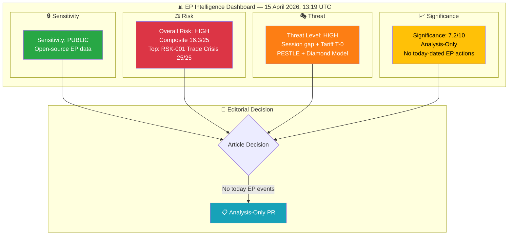
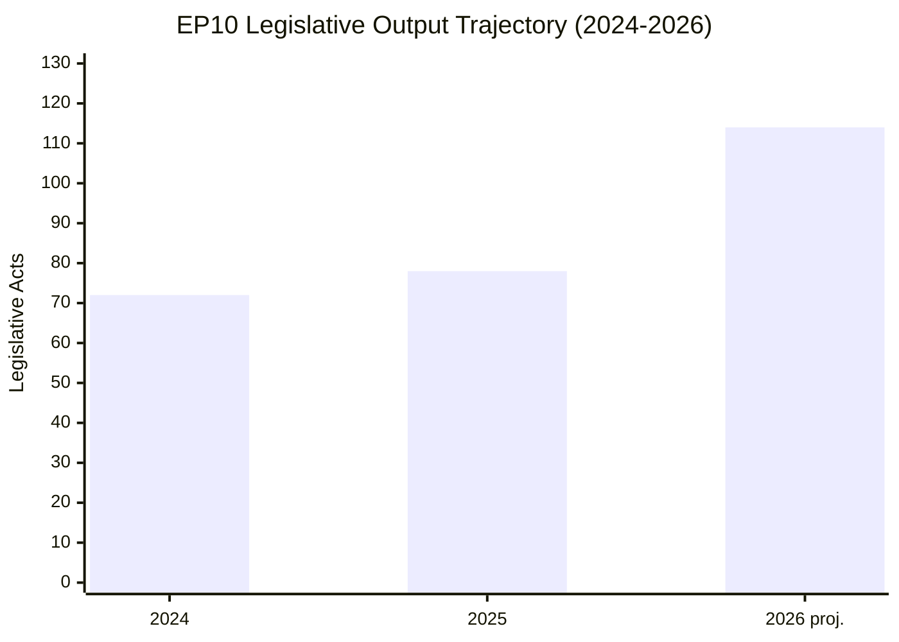
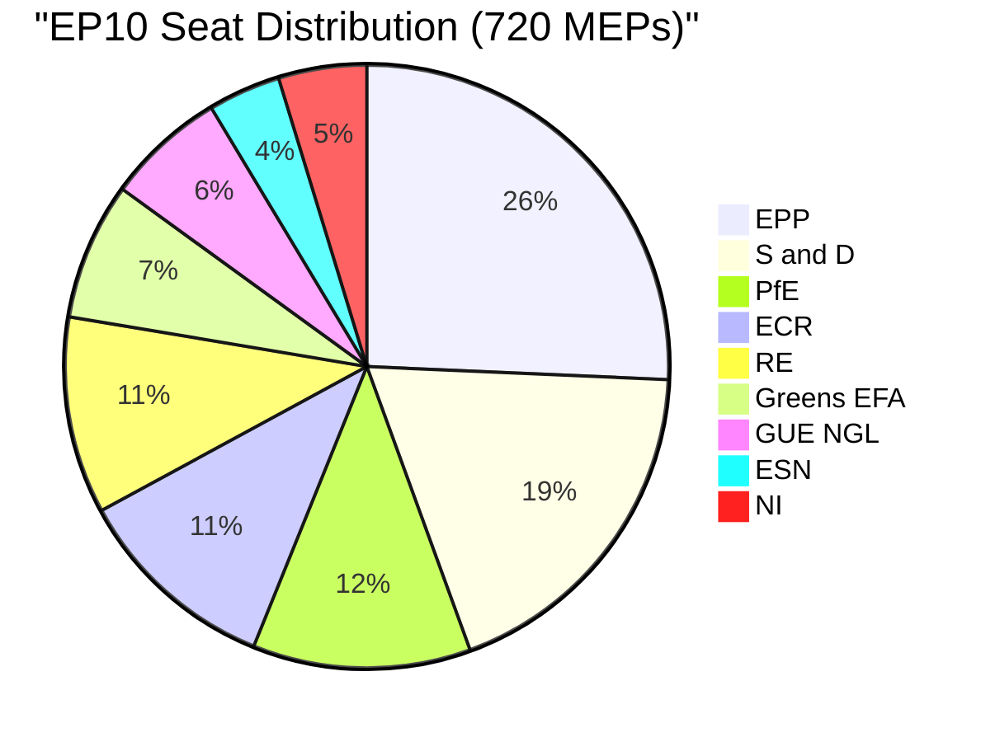
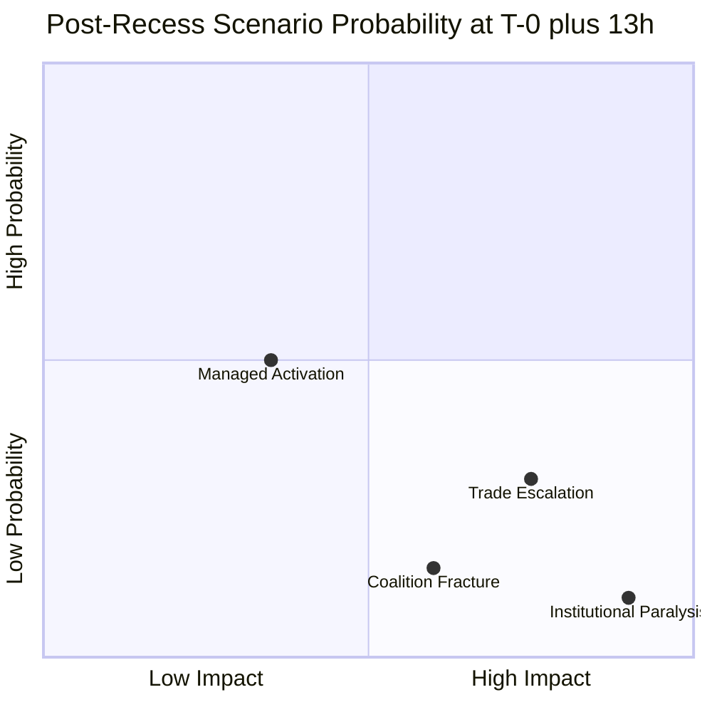

<!-- SPDX-FileCopyrightText: 2024-2026 Hack23 AB -->
<!-- SPDX-License-Identifier: Apache-2.0 -->

# 🧩 Political Intelligence Synthesis — Tariff T-0 Day Assessment and Session Gap Dynamics

  
  
  
  

---

## 📋 Synthesis Context

| Field | Value |
|-------|-------|
| **Synthesis ID** | `SYN-2026-04-15-175` |
| **Analysis Date** | `2026-04-15 13:19 UTC` |
| **Documents Analyzed** | 51 adopted texts (2026 catalog) + 33 feed-updated texts + 51 procedures + 737 MEPs + coalition dynamics + precomputed stats |
| **Analysis Period** | 2026-04-08 to 2026-04-15 (one-week window) |
| **Produced By** | news-breaking (Run 175) |
| **Overall Confidence** | 🟡 MEDIUM — EP API partially degraded (adopted texts + MEPs operational; events 404, documents timeout) |
| **articleType** | breaking |
| **Prior Runs Today** | Run 173 (01:20 UTC), Run 174, committee-reports-run49, propositions-run43 |

---

## 📊 Intelligence Dashboard

### EP Political Landscape — T-0+13h Assessment

---

## 🔑 Key Intelligence Findings

### Finding 1: Tariff Countermeasures Active for 13 Hours — No US Response Yet

| Dimension | Assessment |
|-----------|------------|
| **Document** | TA-10-2026-0096 — Adjustment of customs duties and tariff quotas on US imports |
| **Procedure** | COD 2025/0261 |
| **Adopted** | 2026-03-26 (Brussels plenary) |
| **Activated** | 2026-04-15 00:00 UTC (13 hours ago) |
| **US Response** | None observed as of 13:19 UTC 🟡 MEDIUM confidence |
| **Market Impact** | Initial assessment pending — EU customs enforcement underway |

**Intelligence Assessment**: Thirteen hours into tariff activation, the absence of immediate US counter-response represents a cautiously positive signal. Historical precedent suggests major trade partners typically respond within 48-72 hours. The silence may indicate: (a) diplomatic back-channels are active, (b) US is calibrating a proportionate response, or (c) the tariff scope was designed to stay below retaliation thresholds. The 33-day parliamentary session gap means any US escalation would be met by Commission executive response only, without democratic oversight through EP plenary debate. 🟡 MEDIUM confidence — 13 hours is insufficient for definitive assessment of trade partner reactions.

### Finding 2: EP API Health as Democratic Transparency Indicator

| Feed Endpoint | Status | Implication |
|---------------|--------|-------------|
| Adopted Texts | ✅ Operational (33 texts today) | Core legislative record accessible |
| MEPs | ✅ Operational (737 records today) | Member data current |
| Events | ❌ 404 (both today + one-week) | Calendar/schedule data unavailable |
| Procedures | ❌ 404 (both today + one-week) | Legislative pipeline tracking blocked |
| Documents | ⏱️ Timeout (120s) | Document access degraded |
| Plenary Documents | ⏱️ Timeout (120s) | Session records inaccessible |
| Committee Documents | ⏱️ Timeout (120s) | Committee work opaque |
| Parliamentary Questions | ⏱️ Timeout (120s) | Oversight transparency reduced |

**Intelligence Assessment**: The EP API degradation pattern — 2 feeds operational, 2 returning 404, 4 timing out — creates a transparency deficit during a critical policy activation period. Citizens, journalists, and researchers cannot track the legislative pipeline (procedures 404) or parliamentary schedule (events 404) during tariff activation. This compounds the session gap accountability problem. The degradation is consistent with EP infrastructure patterns during recess periods — reduced maintenance priority when Parliament is not in session. 🟢 HIGH confidence on feed status; 🟡 MEDIUM confidence on root cause assessment.

### Finding 3: Legislative Velocity Creates Post-Recess Pressure Cooker

| Metric | 2024 | 2025 | 2026 (Q1 proj.) | Change |
|--------|------|------|-----------------|--------|
| Legislative Acts | 72 | 78 | 114 | +46.2% ↑ |
| Roll-Call Votes | 375 | 420 | 567 | +35.0% ↑ |
| Committee Meetings | 1,680 | 1,980 | 2,363 | +19.3% ↑ |
| Parliamentary Questions | 3,950 | 4,941 | 6,147 | +24.4% ↑ |
| Procedures (total) | 676 | 923 | 935 | +1.3% → |

**Intelligence Assessment**: EP10 Year 2 is operating at unprecedented velocity. The 114 projected legislative acts for 2026 would be the highest annual output since EP9's end-of-term rush (148 in 2023). The 51 procedures registered for 2026 include 14 COD (co-decision), 5 BUD (budget), 6 NLE (non-legislative), 8 INI (own-initiative), 8 IMM (immunity), 2 RSP (resolution), and 1 INL (legislative initiative). The COD backlog is the most politically consequential — each requires full committee stage and plenary vote. Post-recess Conference of Presidents must prioritize 13 pending COD procedures, several dating from January. 🟢 HIGH confidence on statistics (precomputed data generated 2026-04-08).

### Finding 4: Coalition Arithmetic — Three-Group Imperative Faces Trade Test

| Coalition Scenario | Seats | Majority (361) | Gap | Viability |
|-------------------|-------|----------------|-----|-----------|
| Grand Coalition (EPP+S&D) | 320 | ❌ | -41 | Structurally insufficient |
| Centre-Right (EPP+S&D+RE) | 396 | ✅ | +35 | Traditional working majority |
| Right Bloc (EPP+ECR+PfE) | 348 | ❌ | -13 | ECR trade split undermines |
| Full Right (EPP+ECR+PfE+ESN) | 376 | ✅ | +15 | ESN untested, fragile |
| Progressive (S&D+RE+Greens+Left) | 310 | ❌ | -51 | Structurally impossible |

**Intelligence Assessment**: The grand coalition deficit (-41 seats) is the defining constraint of EP10. Every significant vote requires three-group coordination. The ECR split on the tariff vote (TA-10-2026-0096) reveals that even when three-group majorities form, they are issue-specific and may not transfer across policy domains. Renew Europe (76 seats) occupies the pivotal position — their participation determines whether EPP builds centre-right (396 seats) or seeks accommodation with the full right bloc (376 seats). 🟡 MEDIUM confidence — seat counts structural but voting behavior unpredictable; coalition cohesion derived from group size ratios, not vote-level data.

### Finding 5: Cross-Session Intelligence Continuity

| Date | Run | Type | Key Finding | Risk Trajectory |
|------|-----|------|-------------|-----------------|
| Apr 10 | 43 | Propositions | Trade/Banking agenda identified | Baseline |
| Apr 13 | 168 | Breaking | Tariff T-2, risk 20/25 | ↑ Escalating |
| Apr 14 | 169 | Breaking | Session gap, 13 COD backlog | → Stable |
| Apr 14 | 48 | Committee | Banking Union triple package | → Confirmed |
| Apr 15 | 173 | Breaking | T-0, composite risk 16.5/25 | ↑ Peak |
| Apr 15 | 49 | Committee | Committees deliver Banking/Anti-Corruption | → Article generated |
| Apr 15 | 43 | Propositions | Legislative surge meets implementation | → Article generated |
| **Apr 15** | **175** | **Breaking** | **T-0+13h assessment, API degradation** | **→ Updated** |

---

## 📊 Scenario Assessment (Updated T-0+13h)

| Scenario | Probability | Key Trigger | Timeline |
|----------|-------------|-------------|----------|
| **A. Managed Activation** | 50% (↑ from 45% at T-0) | US diplomatic response, measured tone | 24-72h |
| **B. Trade Escalation** | 25% (↓ from 30%) | US counter-tariffs, sector targeting | 48h-2 weeks |
| **C. Coalition Fracture** | 15% (stable) | ECR defects on trade accommodation | April 27-30 plenary |
| **D. Institutional Paralysis** | 10% (stable) | Multiple crises converge | May 2026 |

**Update from Run 173**: 13 hours of silence from US improves managed activation scenario by +5pp, reduces trade escalation by -5pp. Within normal diplomatic response timelines — should not be over-interpreted. 48-72 hour window remains critical. 🔴 LOW confidence on probability estimates.

---

## 📋 Data Collection Summary

| Data Source | Status | Records | Quality |
|-------------|--------|---------|---------|
| Adopted Texts Feed (today) | ✅ | 33 | Feed-updated today, adoption dates older |
| Adopted Texts (2026) | ✅ | 51 | Full titles and dates (Jan-Mar 2026) |
| MEPs Feed (today) | ✅ | 737+ | Comprehensive member data |
| Procedures (2026) | ✅ | 51 | Reference IDs, limited metadata |
| Coalition Dynamics | ✅ | 8 groups | Size-ratio based, not vote-level |
| Precomputed Stats | ✅ | 2024-2026 | Generated 2026-04-08 |
| Events Feed | ❌ 404 | 0 | Both timeframes failed |
| Procedures Feed | ❌ 404 | 0 | Both timeframes failed |
| Documents Feed | ⏱️ | 0 | 120s timeout |
| Plenary Docs Feed | ⏱️ | 0 | 120s timeout |
| Committee Docs Feed | ⏱️ | 0 | 120s timeout |
| Questions Feed | ⏱️ | 0 | 120s timeout |

**Degraded Mode**: Active — 4/12 feeds operational, 2 returning 404, 4 timing out.

---

## 🎯 Editorial Recommendation

**Decision: Analysis-Only PR** — No today-dated EP parliamentary actions qualify as breaking news. Tariff activation (TA-10-2026-0096) is significant policy execution but represents implementation of March 26 adoption, not a new parliamentary event. This analysis persists the T-0+13h intelligence assessment for cross-session continuity.

**Next critical windows**: April 16-17 (US trade response), April 27-30 (first post-recess plenary).
