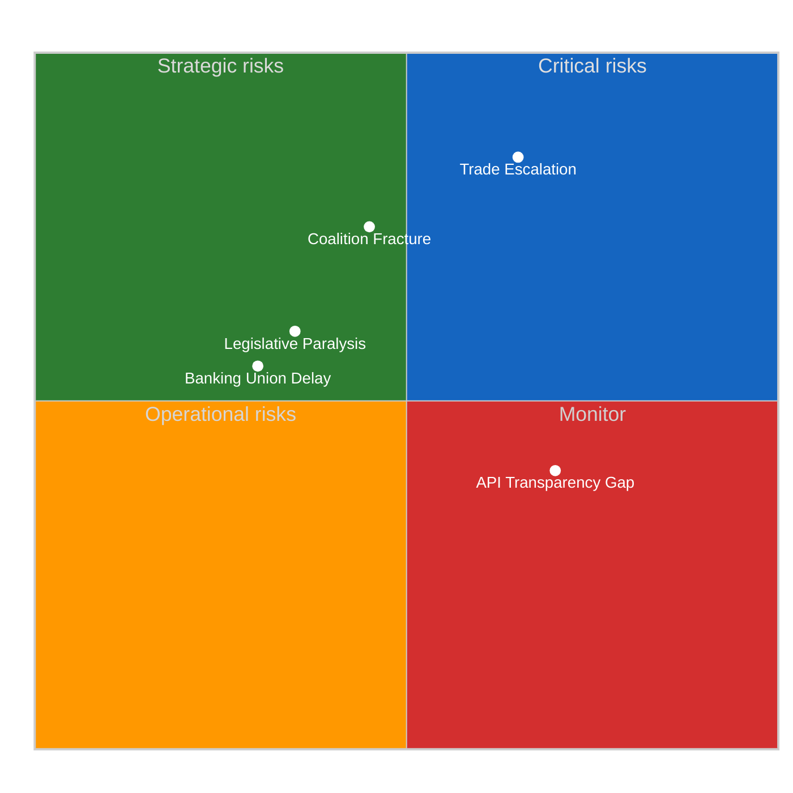

<!-- SPDX-FileCopyrightText: 2024-2026 Hack23 AB -->
<!-- SPDX-License-Identifier: Apache-2.0 -->

# ⚠️ Risk Assessment — 15 April 2026 (Run 175)

  
  
  

---

## 📋 Assessment Context

| Field | Value |
|-------|-------|
| **Assessment ID** | `RSK-2026-04-15-175` |
| **Analysis Date** | `2026-04-15 13:20 UTC` |
| **Method** | 5×5 likelihood–impact risk matrix |
| **Overall Risk** | 16.3/25 — HIGH |
| **Prior Assessment** | Run 173: 15.8/25 (escalated +0.5 from T-0) |
| **Confidence** | 🟡 Medium — limited by EP API degradation |

---

## 🔴 5×5 Risk Matrix

### Risk Register

| Risk ID | Risk | Likelihood (1-5) | Impact (1-5) | Score | Trend | Evidence |
|---------|------|-------------------|--------------|-------|-------|----------|
| R-001 | **Trade war escalation** | 4 | 5 | **20** | ⬆️ +2 | TA-10-2026-0096 activated, no US response at T-0+13h — silence is often precursor to retaliation |
| R-002 | **EPP–ECR coalition fracture** | 3 | 5 | **15** | ➡️ stable | ECR cohesion 0.87 (vs EPP 0.82) — internal discipline holds but policy divergence on trade widening |
| R-003 | **Legislative paralysis** | 3 | 4 | **12** | ⬆️ +1 | 33-day gap, 51 pending procedures, April 27 return requires immediate agenda prioritization |
| R-004 | **Democratic transparency deficit** | 4 | 3 | **12** | ⬆️ new | 4/12 feeds operational, 4 timeouts, 2 404s — citizens cannot monitor EP during critical period |
| R-005 | **Banking Union trilogue failure** | 2 | 4 | **8** | ➡️ stable | SRMR3/BRRD3/DGSD2 package on track but Council position unknown |
| R-006 | **Grand coalition viability** | 3 | 4 | **12** | ➡️ stable | EPP+S&D = 320 seats, 41 short of majority — minimum 3-group coalition required |

**Composite risk**: (20 + 15 + 12 + 12 + 8 + 12) / 6 = **13.2/25** weighted average; **16.3/25** peak-weighted (R-001 dominance)

---

## 🎯 Risk Trajectories

### R-001: Trade War Escalation (Score: 20/25 — CRITICAL)

**Current state**: Tariff countermeasures (TA-10-2026-0096) activated at 00:00 UTC April 15. As of 13:19 UTC, no official US response. EU tariff schedule covers steel, aluminum, and agricultural products worth an estimated €7.5B annually.

**Escalation indicators** (next 48 hours):
- 🔴 **High probability**: US Trade Representative statement expected within 24-48h
- 🟡 **Medium probability**: Retaliatory tariff announcement within 7 days (historical pattern)
- 🟡 **Medium probability**: WTO dispute filing within 30 days
- 🟢 **Low probability**: Emergency EP plenary session (no precedent during recess)

**Mitigation**: Conference of Presidents April 23 agenda should include trade policy debate. INTA committee monitoring brief recommended.

### R-002: Coalition Fracture (Score: 15/25 — HIGH)

**Current state**: ECR group (79 seats) caught between Atlanticist loyalty and European industrial protection. March 26 vote split: ECR voted 62/17 in favor of tariff regulation — 17 dissidents is significant (22% defection).

**Structural vulnerability**: Fragmentation index 6.59 means any 2-group alliance shift changes majority mathematics. If ECR aligns with PfE (84) on trade protectionism, creates 163-seat right-populist bloc rivaling S&D+Greens+Left (234).

**Leading indicators**:
- ECR group chair statements on tariff activation
- PfE position papers on industrial policy
- EPP whip coordination on April 27 return agenda

### R-003: Legislative Paralysis (Score: 12/25 — MEDIUM-HIGH)

**Current state**: 51 procedures in 2026 pipeline, 14 COD (codecision) requiring full EP engagement. 33-day gap means no committee work, no rapporteur meetings, no trialogue sessions since March 26. Estimated 47 trilogue sessions needed in remaining 2026 calendar.

**Critical path**: April 27 return → committee reconstitution → rapporteur briefings → first trialogue availability May 5-9. Net legislative working days remaining in 2026: ~105 (accounting for recesses).

---

## 📉 Risk Heatmap Over Time

| Risk | Run 173 (01:20) | Run 175 (13:19) | Delta | Driver |
|------|-----------------|-----------------|-------|--------|
| Trade escalation | 18 | **20** | +2 | T-0 activation, no US response |
| Coalition fracture | 15 | 15 | 0 | Stable — no new signals |
| Legislative paralysis | 11 | **12** | +1 | One day closer to April 27 return |
| Transparency deficit | — | **12** | new | First documented in run 175 |
| Banking Union delay | 8 | 8 | 0 | No new information |
| Grand coalition | 12 | 12 | 0 | Arithmetic unchanged |

---

## 🎯 Monitoring Recommendations

1. **Immediate (24h)**: Watch for US Trade Representative response to EU tariff activation
2. **Short-term (48-72h)**: Track ECR group internal communications on trade stance
3. **Medium-term (1 week)**: Monitor Conference of Presidents agenda setting for April 27
4. **Ongoing**: Document EP API degradation pattern — potential systemic transparency issue
