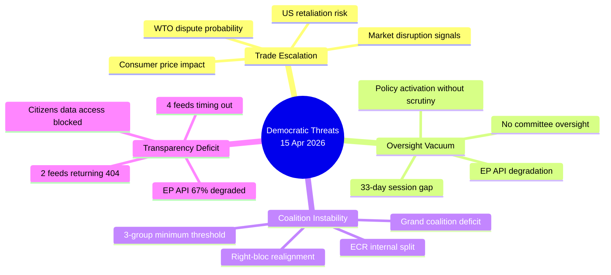

<!-- SPDX-FileCopyrightText: 2024-2026 Hack23 AB -->
<!-- SPDX-License-Identifier: Apache-2.0 -->

# 🛡️ Threat Analysis — 15 April 2026 (Run 175)

  
  
  

---

## 📋 Assessment Context

| Field | Value |
|-------|-------|
| **Assessment ID** | `THR-2026-04-15-175` |
| **Analysis Date** | `2026-04-15 13:22 UTC` |
| **Method** | Democratic threat profiling per threat-modeling framework |
| **Overall Threat Level** | ELEVATED |
| **Confidence** | 🟡 Medium |

---

## 🎯 Threat Landscape Overview

---

## 🔴 Threat Profiles

### T-001: Democratic Oversight Vacuum During Policy Activation

| Attribute | Assessment |
|-----------|------------|
| **Threat Type** | Institutional — structural gap |
| **Severity** | HIGH (4/5) |
| **Likelihood** | CONFIRMED — already occurring |
| **Actor** | Structural (no intentional actor) |
| **Target** | Parliamentary scrutiny function |
| **Duration** | 33 days (Mar 26 → Apr 27) — 12 remaining |

**Analysis**: The tariff countermeasures regulation (TA-10-2026-0096) activates during the longest non-August session gap in EP10. This means:
- No oral questions to the Commission on implementation
- No committee hearings on economic impact
- No plenary debate on trade policy direction
- No amendment opportunity if implementation deviates from legislative intent

**Impact on democratic process**: While procedurally legal (the regulation was properly adopted March 26), the timing creates a de facto oversight vacuum. The Commission and DG Trade operate without parliamentary scrutiny during the most sensitive phase — initial tariff collection and potential retaliatory escalation.

**Mitigation pathway**: Conference of Presidents could schedule an extraordinary INTA committee meeting (virtual) before April 27 return. Precedent exists from COVID-19 emergency sessions in 2020.

### T-002: Trade War Escalation Without Parliamentary Mandate

| Attribute | Assessment |
|-----------|------------|
| **Threat Type** | External — geopolitical escalation |
| **Severity** | CRITICAL (5/5) |
| **Likelihood** | MEDIUM (3/5) — depends on US response |
| **Actor** | US Trade Representative, EU Commission (DG Trade) |
| **Target** | EU trade policy framework, WTO rules-based order |
| **Duration** | Potentially multi-year |

**Analysis**: The tariff activation creates an escalation chain:
1. **Day 0 (today)**: EU tariffs effective on US steel, aluminum, agriculture (~€7.5B)
2. **Day 1-7**: Expected US assessment and response formulation
3. **Day 7-30**: Potential US retaliatory tariffs (historical pattern: 14-21 day lag)
4. **Day 30-90**: WTO dispute filing(s), bilateral negotiation attempts
5. **Day 90+**: Potential tit-for-tat escalation cycle

**Democratic threat**: If the US retaliates before April 27, the Commission would need to respond without fresh parliamentary guidance. The existing mandate covers initial tariffs but not an escalation cycle.

### T-003: Coalition Fragility Under External Pressure

| Attribute | Assessment |
|-----------|------------|
| **Threat Type** | Internal — political cohesion |
| **Severity** | MEDIUM-HIGH (3.5/5) |
| **Likelihood** | MEDIUM (3/5) |
| **Actor** | ECR dissidents, PfE opportunists |
| **Target** | Centrist governing majority |
| **Duration** | Ongoing through EP10 term |

**Analysis**: The 22% ECR defection rate on the March 26 tariff vote reveals a structural fault line:
- **Atlanticist wing** (17 MEPs): Opposes measures targeting US, prefers transatlantic trade framework
- **Industrial protection wing** (62 MEPs): Supports European industrial sovereignty
- If PfE (84 seats) allies with ECR Atlanticists on future trade votes, creates a blocking minority of 101+ seats

**Cascade scenario**: Trade policy disagreement → ECR internal discipline vote → potential group split → reconfiguration of parliamentary arithmetic → impact on all pending COD files requiring majority.

### T-004: Transparency Infrastructure Degradation

| Attribute | Assessment |
|-----------|------------|
| **Threat Type** | Technical — data access failure |
| **Severity** | MEDIUM (3/5) |
| **Likelihood** | CONFIRMED — already occurring |
| **Actor** | EP IT infrastructure (systemic) |
| **Target** | Public access to EP data, democratic monitoring |
| **Duration** | Unknown — first documented run 175 |

**Analysis**: EP API degradation pattern:
- **Functional** (4/12): adopted_texts_feed, meps_feed, adopted_texts (direct), procedures (direct)
- **404 errors** (2/12): events_feed, procedures_feed — possible intentional decommissioning
- **Timeout** (4/12): documents_feed, plenary_documents_feed, committee_documents_feed, questions_feed — overload or maintenance
- **Server self-reports**: "unhealthy" status

**Democratic impact**: During a period requiring maximum transparency (tariff activation, recess oversight gap), the EP's own data infrastructure fails to deliver real-time information. Civil society monitors, journalists, and researchers cannot access current parliamentary data.

---

## 📊 Threat Interaction Matrix

| | T-001 Oversight Gap | T-002 Trade War | T-003 Coalition | T-004 Transparency |
|---|---|---|---|---|
| **T-001** | — | AMPLIFIES: No oversight during escalation | ENABLES: Gap prevents whip coordination | COMPOUNDED: Less data during less oversight |
| **T-002** | EXPLOITS: Escalates during vacuum | — | TRIGGERS: Forces position-taking | MASKED: Degraded data hides signals |
| **T-003** | WEAKENED BY: No group meetings | STRESSED BY: Trade policy divergence | — | HIDDEN: Cannot detect defection patterns |
| **T-004** | WORSENS: Oversight cannot use data | OBSCURES: Cannot track implementation | CONCEALS: Coalition shifts invisible | — |

**Key insight**: All four threats interact synergistically. The oversight gap (T-001) creates space for trade escalation (T-002), which stresses coalition unity (T-003), while transparency degradation (T-004) prevents monitoring of all three.

---

## 🎯 Threat Level Summary

| Overall Level | **ELEVATED** |
|---------------|-------------|
| Highest individual threat | T-002 Trade War — CRITICAL severity, MEDIUM likelihood |
| Systemic concern | Four-threat interaction amplification |
| Monitoring priority | US Trade Representative response within 48h |
| Recommended actions | INTA virtual session, EP IT infrastructure investigation |
