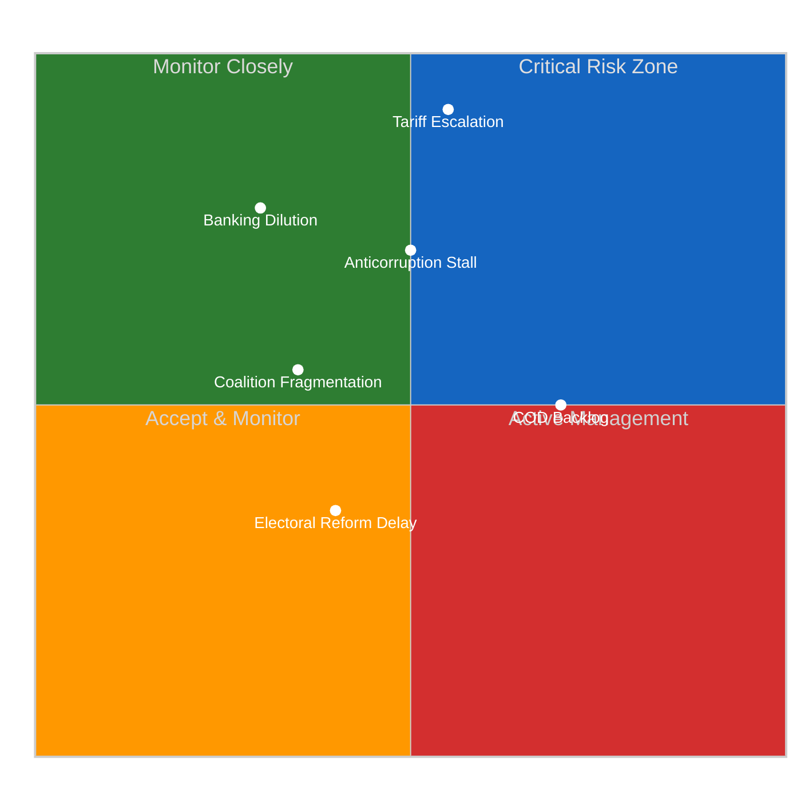

# Propositions — 2026-04-15

<!-- Aggregated analysis — do not edit; regenerate via `npm run generate-article`. -->

> **Provenance**
>
> - **Article type:** `propositions`
> - **Run date:** 2026-04-15
> - **Run id:** `56d5a875-0b05-4753-8aca-36b9af05c1e2`
> - **Gate result:** `PENDING`
> - **Analysis tree:** [analysis/daily/2026-04-15/propositions-run43](https://github.com/Hack23/euparliamentmonitor/tree/main/analysis/daily/2026-04-15/propositions-run43)
> - **Manifest:** [manifest.json](https://github.com/Hack23/euparliamentmonitor/blob/main/analysis/daily/2026-04-15/propositions-run43/manifest.json)

<h2 id="reader-intelligence-guide">Reader Intelligence Guide</h2>

Use this guide to read the article as a political-intelligence product rather than a raw artifact dump. High-value reader lenses appear first; technical provenance remains available in the audit appendices.

| Reader need | What you'll get | Source artifact |
|---|---|---|
| [Risk assessment](#section-risk) | policy, institutional, coalition, communications, and implementation risk register | `risk-scoring/risk-matrix.md` |

<h2 id="section-risk">Risk Assessment</h2>

### Risk Matrix

<a href="https://github.com/Hack23/euparliamentmonitor/blob/main/analysis/daily/2026-04-15/propositions-run43/risk-scoring/risk-matrix.md" rel="noopener">View source: <code>risk-scoring/risk-matrix.md</code></a>

### Risk Dashboard

| Category | Level | Trend | Key Driver |
|----------|:-----:|:-----:|------------|
| Geopolitical | 🔴 CRITICAL | ↑ | US tariff T-0 activation |
| Policy Implementation | 🟠 HIGH | → | Banking Union 24-month transposition |
| Institutional | 🟡 MEDIUM | → | Anti-corruption trilogue timeline |
| Coalition Stability | 🟡 MEDIUM | ↘ | Grand coalition 38-seat deficit |
| Legislative Throughput | 🟡 MEDIUM | ↑ | 13 new COD procedures backlog |
| Democratic Standards | 🟢 LOW | → | Electoral Act implementation |

### Risk Matrix Visualization

### Detailed Risk Assessments

#### R1: Trade War Escalation (CRITICAL)
- **Likelihood**: MEDIUM (0.55) — US-EU negotiations ongoing but positions hardening
- **Impact**: CRITICAL (0.92) — €700B+ trade relationship, auto/agri sectors, consumer prices
- **Velocity**: FAST — tariffs activate today (April 15), retaliation cycles measured in weeks
- **Mitigation**: Parliament adopted TA-10-2026-0096 + Mercosur safeguard TA-10-2026-0030; Commission managing escalation ladder
- **Confidence**: 🟢 HIGH

#### R2: Banking Union Council Dilution (HIGH)
- **Likelihood**: LOW (0.30) — Council has political commitment but technical objections from DE savings banks
- **Impact**: HIGH (0.78) — Would undermine Banking Union completion, EDIS progress, financial stability architecture
- **Velocity**: SLOW — 24-month transposition provides negotiation runway
- **Mitigation**: Strong EP mandate via grand coalition adoption; ECB institutional support
- **Confidence**: 🟡 MEDIUM

#### R3: Anti-Corruption Trilogue Stalling (HIGH)
- **Likelihood**: MEDIUM (0.50) — Several member states have implementation concerns
- **Impact**: HIGH (0.72) — EU democratic credibility, enlargement conditionality, rule-of-law tools
- **Velocity**: MEDIUM — Trilogue typically 6-12 months
- **Mitigation**: Strong EP position; Commission original proposal ambitious
- **Confidence**: 🟡 MEDIUM

#### R4: Legislative Backlog (MEDIUM)
- **Likelihood**: HIGH (0.70) — 13 new COD procedures in Q1 + carry-over from EP9
- **Impact**: MEDIUM (0.50) — Delay rather than failure; committee scheduling is bottleneck
- **Velocity**: SLOW — Accumulates over months
- **Mitigation**: Conference of Presidents can prioritise; parallel processing in committees
- **Confidence**: 🟢 HIGH

### Forward Scenarios

| Scenario | Probability | Description | Key Trigger |
|----------|:-----------:|-------------|-------------|
| A: Managed Transition | Likely | March adoptions proceed to implementation; new CODs processed at normal pace; tariff tensions managed | US-EU negotiation channel active |
| B: Escalation Overload | Possible | Tariff retaliation absorbs INTA/ECON bandwidth; legislative backlog grows; inter-institutional tension | US retaliatory tariffs on EU agriculture |
| C: Coalition Fracture | Unlikely | ECR breaks with EPP on trade response; grand coalition fails on key COD vote; legislative paralysis | PfE blocks key anti-corruption provision |

<h2 id="section-threat">Threat Landscape</h2>

### Political Threat Landscape

<a href="https://github.com/Hack23/euparliamentmonitor/blob/main/analysis/daily/2026-04-15/propositions-run43/threat-assessment/political-threat-landscape.md" rel="noopener">View source: <code>threat-assessment/political-threat-landscape.md</code></a>

### Threat Level: ELEVATED

Key drivers: tariff T-0 activation, inter-session gap, grand coalition deficit (-38 seats).

### Threat-Procedure Mapping

| Threat | Procedures | Severity |
|--------|-----------|:--------:|
| US tariff escalation | TA-10-2026-0096 | CRITICAL |
| Banking lobby dilution | SRMR3 TA-10-2026-0092 | HIGH |
| Anti-corruption resistance | TA-10-2026-0094 | HIGH |
| Committee overload | 13 new COD | MEDIUM |

### Trade Escalation Kill Chain
1. US tariffs announced
2. EP adopts countermeasures (Mar 26)
3. T-0 activation (Apr 15 - TODAY)
4. US response window (2-4 weeks)
5a. De-escalation OR 5b. Agricultural retaliation

Current: Stage 3. Confidence: HIGH.

### Democratic Threat Indicators
- PfE opposes anti-corruption asset declarations: MEDIUM
- Electoral Act reform stalling: LOW persistent
- Committee referral data opacity: MEDIUM institutional
- Grand coalition deficit requiring ECR: MEDIUM stability

<h2 id="section-deep-analysis">Deep Analysis</h2>

<a href="https://github.com/Hack23/euparliamentmonitor/blob/main/analysis/daily/2026-04-15/propositions-run43/existing/deep-analysis.md" rel="noopener">View source: <code>existing/deep-analysis.md</code></a>

### Executive Summary

European Parliament Q1 2026 legislative output surged 46% year-on-year to a projected 114 adopted acts. The March 26 plenary burst delivered Banking Union SRMR3, Anti-Corruption Directive, and tariff countermeasures. Today (April 15) marks T-0 for tariff activation. The pipeline transitions from adoption to implementation while 13 new COD procedures await committee referral.

### Political Group Position Matrix

| Group | Tariff | Banking | Anti-Corruption | New COD |
|-------|:------:|:-------:|:---------------:|:-------:|
| EPP (185) | Support | Support | Support | TBD |
| S&D (135) | Support | Support | Support | TBD |
| Renew (76) | Support | Support | Support | TBD |
| ECR (79) | Support | Partial | Support | TBD |
| Greens (53) | Support | Support | Support | TBD |
| PfE (84) | Partial | Partial | Oppose | TBD |
| GUE/NGL (46) | Oppose | Oppose | Support | TBD |
| ESN (28) | Oppose | Oppose | Oppose | TBD |

### Key Dossier Passage Probability

| Dossier | Stage | Probability | Timeline |
|---------|-------|:-----------:|----------|
| Tariff countermeasures | Activated T-0 | Complete | Today |
| Banking Union SRMR3 | Council phase | Likely 75% | Q4 2026 |
| Anti-Corruption | Trilogue | Possible 55% | Q2 2027 |
| New COD batch | Committee | Likely 80% | Q3-Q4 2026 |

### Coalition Dynamics

#### Pattern A: Grand Coalition + Greens (Trade and Anti-Corruption)
Composition: EPP + S&D + Renew + Greens/EFA (449 seats, 62.4%)
Applied to: Tariff countermeasures, Anti-Corruption, Mercosur safeguards

#### Pattern B: EPP + ECR + Partial PfE (Defence and Security)
Composition: EPP + ECR + partial PfE (280-320 seats)
Applied to: Defence market barriers, Drones/warfare

### ECR Fracture Pattern
Nordic delegations dissented on Banking Union deposit insurance (moral hazard).
ECR supports tariff countermeasures (manufacturing constituency pressure).
Selective engagement continues from prior sessions.

### Implementation Timeline

| Adoption | Dossier | Next Step | Expected |
|----------|---------|-----------|----------|
| Mar 26 | SRMR3 | Council negotiation | Q2-Q3 2026 |
| Mar 26 | Anti-Corruption | Trilogue launch | Q2 2026 |
| Mar 26 | Tariff Response | T-0 TODAY | Immediate |
| Mar 10 | EU Talent Pool | National transposition | 2027 |
| Jan 21 | Air Passenger Rights | Implementation | 2026-2027 |

<h2 id="section-supplementary-intelligence">Supplementary Intelligence</h2>

### Significance Scoring

<a href="https://github.com/Hack23/euparliamentmonitor/blob/main/analysis/daily/2026-04-15/propositions-run43/classification/significance-scoring.md" rel="noopener">View source: <code>classification/significance-scoring.md</code></a>

### Scoring Context

| Field | Value |
|-------|-------|
| **Scoring ID** | SIG-2026-04-15-RUN43 |
| **Analysis Date** | 2026-04-15 (T-0 Tariff Activation) |
| **Items Scored** | 51 adopted texts + 51 procedures |
| **Period Focus** | Q1 2026 Legislative Surge → Q2 Implementation |
| **Confidence** | 🟢 HIGH |

### Scored Items

| Rank | Item | Reference | Score | Urgency | Confidence |
|:---:|-------|-----------|:-----:|:-------:|:----------:|
| 1 | US Tariff Countermeasures (T-0) | TA-10-2026-0096 | 8.8 | CRITICAL | 🟢 HIGH |
| 2 | Banking Union SRMR3 | TA-10-2026-0092 | 7.8 | HIGH | 🟢 HIGH |
| 3 | Anti-Corruption Directive | TA-10-2026-0094 | 7.2 | HIGH | 🟢 HIGH |
| 4 | New COD Pipeline (13 procedures) | 2026/0008-0085(COD) | 6.8 | MEDIUM | 🟡 MEDIUM |
| 5 | EU-Mercosur Safeguard Clause | TA-10-2026-0030 | 6.4 | MEDIUM | 🟢 HIGH |
| 6 | Copyright & Generative AI | TA-10-2026-0066 | 6.0 | MEDIUM | 🟡 MEDIUM |
| 7 | Housing Crisis Resolution | TA-10-2026-0064 | 5.8 | LOW | 🟢 HIGH |
| 8 | EU Talent Pool | TA-10-2026-0058 | 5.6 | LOW | 🟢 HIGH |
| 9 | Electoral Act Reform | TA-10-2026-0006 | 5.4 | LOW | 🟡 MEDIUM |
| 10 | Defence Market Barriers | TA-10-2026-0079 | 5.2 | LOW | 🟡 MEDIUM |

### Scoring Rationale

#### 1. US Tariff Countermeasures — 8.8/10
- **Timeliness**: T-0 activation day (April 15, 2026) — maximum urgency
- **Impact breadth**: Affects EU-US trade (€700B+ annually), auto sector (DE), agriculture (FR), tech imports
- **Political significance**: Rare cross-party consensus (EPP, S&D, Renew, ECR, Greens all supported)
- **Implementation chain**: Commission now manages escalation ladder with Council; EP oversight via INTA
- **Precedent**: First use of rapid-response tariff mechanism under post-pandemic trade framework

#### 2. Banking Union SRMR3 — 7.8/10
- **Structural reform**: Completes the Banking Union architecture initiated in 2014
- **Coalition significance**: Grand coalition + Greens delivered; ECR Nordic dissent on deposit insurance
- **Implementation**: 24-month transposition timeline means real-world impact by Q1 2028
- **Institutional**: Strengthens SRB powers; new bail-in tools for mid-size banks

#### 3. Anti-Corruption Directive — 7.2/10
- **Democratic standards**: First EU-wide anti-corruption legislative standard
- **Political dynamics**: PfE opposition to asset declarations reveals democratic values fault line
- **Trilogue ahead**: EP position adopted; Council negotiations will test member state compliance appetite
- **Enlargement link**: Strengthens EU credibility on rule-of-law conditionality

#### 4. New COD Pipeline — 6.8/10
- **Volume**: 13 new COD procedures filed in Q1 2026 — above EP10 trajectory
- **Committee capacity**: Absorption capacity untested for this volume
- **Policy breadth**: Spans digital, trade, environment, social policy
- **Implementation risk**: Backlog risk if committees cannot process simultaneously

### Synthesis Summary

<a href="https://github.com/Hack23/euparliamentmonitor/blob/main/analysis/daily/2026-04-15/propositions-run43/existing/synthesis-summary.md" rel="noopener">View source: <code>existing/synthesis-summary.md</code></a>

### Intelligence Dashboard

Decision: PUBLISH as propositions article. Lead with pipeline transition from adoption to implementation on T-0 tariff day. Differentiated from breaking (T-0 news) and committee-reports (committee output) angles.

### Top Findings by Significance

| Rank | Item | Score | Urgency |
|:---:|-------|:-----:|:-------:|
| 1 | Tariff T-0 Pipeline Impact | 8.8 | CRITICAL |
| 2 | Banking Union SRMR3 Post-Adoption | 7.8 | HIGH |
| 3 | Anti-Corruption Trilogue Path | 7.2 | HIGH |
| 4 | New COD Pipeline (13 procedures) | 6.8 | MEDIUM |
| 5 | EU-Mercosur Safeguard | 6.4 | MEDIUM |

### Thematic Clusters

1. Trade and Competitiveness: TA-10-2026-0096, TA-10-2026-0030, TA-10-2026-0086, TA-10-2026-0078
2. Financial Governance: SRMR3, ECB appointments, European Semester, EGF mobilisations
3. Democratic Standards: Anti-corruption, Electoral Act, Public access, Immunity waivers
4. External Relations: CFSP report, Defence market, Drones, Enlargement, Magnitsky Act
5. Digital and Technology: Copyright/AI, Tech sovereignty, Air passenger rights
6. Social Policy: Housing, Workers rights, EU Talent Pool

### Coalition Patterns
Two distinct patterns from March 26: Grand Coalition + Greens on trade/anti-corruption; EPP + ECR + partial PfE on defence/security.

### Risk Summary
- Geopolitical: CRITICAL (tariff T-0)
- Policy Implementation: HIGH (Banking Union Council)
- Institutional: MEDIUM (anti-corruption trilogue)
- Coalition Stability: MEDIUM (grand coalition deficit)
- Legislative Throughput: MEDIUM (13 new COD)

### Outlook
Scenario A (Likely): Managed transition - adoptions proceed to implementation, CODs processed normally
Scenario B (Possible): Escalation overload - tariff retaliation absorbs INTA/ECON bandwidth
Scenario C (Unlikely): Coalition fracture on trade response

<h2 id="aggregator-tradecraft-references">Tradecraft References</h2>

This article is produced under the [Hack23 AB](https://hack23.com) intelligence tradecraft library. Every methodology and artifact template applied to this run is linked below.

### Methodologies

- [README](https://github.com/Hack23/euparliamentmonitor/blob/main/analysis/methodologies/README.md)
- [Ai Driven Analysis Guide](https://github.com/Hack23/euparliamentmonitor/blob/main/analysis/methodologies/ai-driven-analysis-guide.md)
- [Artifact Catalog](https://github.com/Hack23/euparliamentmonitor/blob/main/analysis/methodologies/artifact-catalog.md)
- [Electoral Domain Methodology](https://github.com/Hack23/euparliamentmonitor/blob/main/analysis/methodologies/electoral-domain-methodology.md)
- [Imf Indicator Mapping](https://github.com/Hack23/euparliamentmonitor/blob/main/analysis/methodologies/imf-indicator-mapping.md)
- [Osint Tradecraft Standards](https://github.com/Hack23/euparliamentmonitor/blob/main/analysis/methodologies/osint-tradecraft-standards.md)
- [Per Artifact Methodologies](https://github.com/Hack23/euparliamentmonitor/blob/main/analysis/methodologies/per-artifact-methodologies.md)
- [Per Document Methodology](https://github.com/Hack23/euparliamentmonitor/blob/main/analysis/methodologies/per-document-methodology.md)
- [Political Classification Guide](https://github.com/Hack23/euparliamentmonitor/blob/main/analysis/methodologies/political-classification-guide.md)
- [Political Risk Methodology](https://github.com/Hack23/euparliamentmonitor/blob/main/analysis/methodologies/political-risk-methodology.md)
- [Political Style Guide](https://github.com/Hack23/euparliamentmonitor/blob/main/analysis/methodologies/political-style-guide.md)
- [Political Swot Framework](https://github.com/Hack23/euparliamentmonitor/blob/main/analysis/methodologies/political-swot-framework.md)
- [Political Threat Framework](https://github.com/Hack23/euparliamentmonitor/blob/main/analysis/methodologies/political-threat-framework.md)
- [Strategic Extensions Methodology](https://github.com/Hack23/euparliamentmonitor/blob/main/analysis/methodologies/strategic-extensions-methodology.md)
- [Structural Metadata Methodology](https://github.com/Hack23/euparliamentmonitor/blob/main/analysis/methodologies/structural-metadata-methodology.md)
- [Synthesis Methodology](https://github.com/Hack23/euparliamentmonitor/blob/main/analysis/methodologies/synthesis-methodology.md)
- [Worldbank Indicator Mapping](https://github.com/Hack23/euparliamentmonitor/blob/main/analysis/methodologies/worldbank-indicator-mapping.md)

### Artifact templates

- [README](https://github.com/Hack23/euparliamentmonitor/blob/main/analysis/templates/README.md)
- [Actor Mapping](https://github.com/Hack23/euparliamentmonitor/blob/main/analysis/templates/actor-mapping.md)
- [Actor Threat Profiles](https://github.com/Hack23/euparliamentmonitor/blob/main/analysis/templates/actor-threat-profiles.md)
- [Analysis Index](https://github.com/Hack23/euparliamentmonitor/blob/main/analysis/templates/analysis-index.md)
- [Coalition Dynamics](https://github.com/Hack23/euparliamentmonitor/blob/main/analysis/templates/coalition-dynamics.md)
- [Coalition Mathematics](https://github.com/Hack23/euparliamentmonitor/blob/main/analysis/templates/coalition-mathematics.md)
- [Comparative International](https://github.com/Hack23/euparliamentmonitor/blob/main/analysis/templates/comparative-international.md)
- [Consequence Trees](https://github.com/Hack23/euparliamentmonitor/blob/main/analysis/templates/consequence-trees.md)
- [Cross Reference Map](https://github.com/Hack23/euparliamentmonitor/blob/main/analysis/templates/cross-reference-map.md)
- [Cross Run Diff](https://github.com/Hack23/euparliamentmonitor/blob/main/analysis/templates/cross-run-diff.md)
- [Cross Session Intelligence](https://github.com/Hack23/euparliamentmonitor/blob/main/analysis/templates/cross-session-intelligence.md)
- [Data Download Manifest](https://github.com/Hack23/euparliamentmonitor/blob/main/analysis/templates/data-download-manifest.md)
- [Deep Analysis](https://github.com/Hack23/euparliamentmonitor/blob/main/analysis/templates/deep-analysis.md)
- [Devils Advocate Analysis](https://github.com/Hack23/euparliamentmonitor/blob/main/analysis/templates/devils-advocate-analysis.md)
- [Economic Context](https://github.com/Hack23/euparliamentmonitor/blob/main/analysis/templates/economic-context.md)
- [Executive Brief](https://github.com/Hack23/euparliamentmonitor/blob/main/analysis/templates/executive-brief.md)
- [Forces Analysis](https://github.com/Hack23/euparliamentmonitor/blob/main/analysis/templates/forces-analysis.md)
- [Forward Indicators](https://github.com/Hack23/euparliamentmonitor/blob/main/analysis/templates/forward-indicators.md)
- [Historical Baseline](https://github.com/Hack23/euparliamentmonitor/blob/main/analysis/templates/historical-baseline.md)
- [Historical Parallels](https://github.com/Hack23/euparliamentmonitor/blob/main/analysis/templates/historical-parallels.md)
- [Imf Vintage Audit](https://github.com/Hack23/euparliamentmonitor/blob/main/analysis/templates/imf-vintage-audit.md)
- [Impact Matrix](https://github.com/Hack23/euparliamentmonitor/blob/main/analysis/templates/impact-matrix.md)
- [Implementation Feasibility](https://github.com/Hack23/euparliamentmonitor/blob/main/analysis/templates/implementation-feasibility.md)
- [Intelligence Assessment](https://github.com/Hack23/euparliamentmonitor/blob/main/analysis/templates/intelligence-assessment.md)
- [Legislative Disruption](https://github.com/Hack23/euparliamentmonitor/blob/main/analysis/templates/legislative-disruption.md)
- [Legislative Velocity Risk](https://github.com/Hack23/euparliamentmonitor/blob/main/analysis/templates/legislative-velocity-risk.md)
- [Mcp Reliability Audit](https://github.com/Hack23/euparliamentmonitor/blob/main/analysis/templates/mcp-reliability-audit.md)
- [Media Framing Analysis](https://github.com/Hack23/euparliamentmonitor/blob/main/analysis/templates/media-framing-analysis.md)
- [Methodology Reflection](https://github.com/Hack23/euparliamentmonitor/blob/main/analysis/templates/methodology-reflection.md)
- [Per File Political Intelligence](https://github.com/Hack23/euparliamentmonitor/blob/main/analysis/templates/per-file-political-intelligence.md)
- [Pestle Analysis](https://github.com/Hack23/euparliamentmonitor/blob/main/analysis/templates/pestle-analysis.md)
- [Political Capital Risk](https://github.com/Hack23/euparliamentmonitor/blob/main/analysis/templates/political-capital-risk.md)
- [Political Classification](https://github.com/Hack23/euparliamentmonitor/blob/main/analysis/templates/political-classification.md)
- [Political Threat Landscape](https://github.com/Hack23/euparliamentmonitor/blob/main/analysis/templates/political-threat-landscape.md)
- [Quantitative Swot](https://github.com/Hack23/euparliamentmonitor/blob/main/analysis/templates/quantitative-swot.md)
- [Reference Analysis Quality](https://github.com/Hack23/euparliamentmonitor/blob/main/analysis/templates/reference-analysis-quality.md)
- [Risk Assessment](https://github.com/Hack23/euparliamentmonitor/blob/main/analysis/templates/risk-assessment.md)
- [Risk Matrix](https://github.com/Hack23/euparliamentmonitor/blob/main/analysis/templates/risk-matrix.md)
- [Scenario Forecast](https://github.com/Hack23/euparliamentmonitor/blob/main/analysis/templates/scenario-forecast.md)
- [Session Baseline](https://github.com/Hack23/euparliamentmonitor/blob/main/analysis/templates/session-baseline.md)
- [Significance Classification](https://github.com/Hack23/euparliamentmonitor/blob/main/analysis/templates/significance-classification.md)
- [Significance Scoring](https://github.com/Hack23/euparliamentmonitor/blob/main/analysis/templates/significance-scoring.md)
- [Stakeholder Impact](https://github.com/Hack23/euparliamentmonitor/blob/main/analysis/templates/stakeholder-impact.md)
- [Stakeholder Map](https://github.com/Hack23/euparliamentmonitor/blob/main/analysis/templates/stakeholder-map.md)
- [Swot Analysis](https://github.com/Hack23/euparliamentmonitor/blob/main/analysis/templates/swot-analysis.md)
- [Synthesis Summary](https://github.com/Hack23/euparliamentmonitor/blob/main/analysis/templates/synthesis-summary.md)
- [Threat Analysis](https://github.com/Hack23/euparliamentmonitor/blob/main/analysis/templates/threat-analysis.md)
- [Threat Model](https://github.com/Hack23/euparliamentmonitor/blob/main/analysis/templates/threat-model.md)
- [Voter Segmentation](https://github.com/Hack23/euparliamentmonitor/blob/main/analysis/templates/voter-segmentation.md)
- [Voting Patterns](https://github.com/Hack23/euparliamentmonitor/blob/main/analysis/templates/voting-patterns.md)
- [Wildcards Blackswans](https://github.com/Hack23/euparliamentmonitor/blob/main/analysis/templates/wildcards-blackswans.md)
- [Workflow Audit](https://github.com/Hack23/euparliamentmonitor/blob/main/analysis/templates/workflow-audit.md)

<h2 id="aggregator-analysis-index">Analysis Index</h2>

Every artifact below was read by the aggregator and contributed to this article. The raw [manifest.json](https://github.com/Hack23/euparliamentmonitor/blob/main/analysis/daily/2026-04-15/propositions-run43/manifest.json) carries the full machine-readable list, including gate-result history.

| Section | Artifact | Path |
|---|---|---|
| section-risk | [risk-matrix](https://github.com/Hack23/euparliamentmonitor/blob/main/analysis/daily/2026-04-15/propositions-run43/risk-scoring/risk-matrix.md) | `risk-scoring/risk-matrix.md` |
| section-threat | [political-threat-landscape](https://github.com/Hack23/euparliamentmonitor/blob/main/analysis/daily/2026-04-15/propositions-run43/threat-assessment/political-threat-landscape.md) | `threat-assessment/political-threat-landscape.md` |
| section-deep-analysis | [deep-analysis](https://github.com/Hack23/euparliamentmonitor/blob/main/analysis/daily/2026-04-15/propositions-run43/existing/deep-analysis.md) | `existing/deep-analysis.md` |
| section-supplementary-intelligence | [significance-scoring](https://github.com/Hack23/euparliamentmonitor/blob/main/analysis/daily/2026-04-15/propositions-run43/classification/significance-scoring.md) | `classification/significance-scoring.md` |
| section-supplementary-intelligence | [synthesis-summary](https://github.com/Hack23/euparliamentmonitor/blob/main/analysis/daily/2026-04-15/propositions-run43/existing/synthesis-summary.md) | `existing/synthesis-summary.md` |

