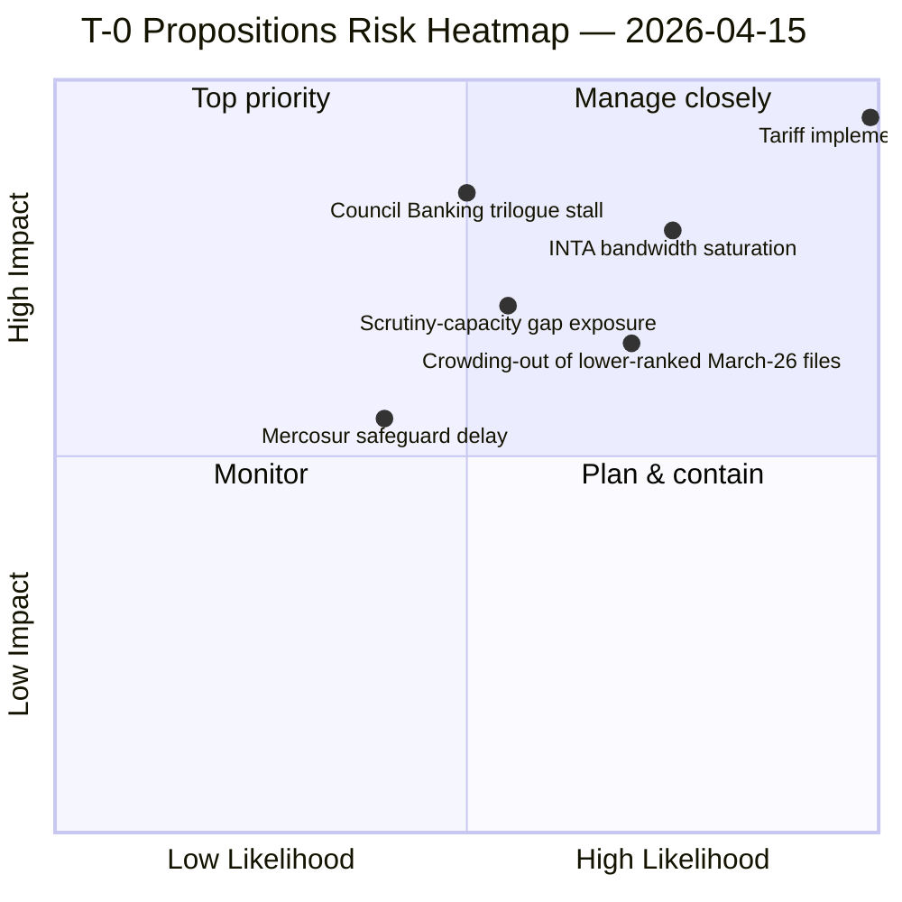

<!-- SPDX-FileCopyrightText: 2026 Hack23 AB -->
<!-- SPDX-License-Identifier: Apache-2.0 -->

# Executive Brief — Propositions: Tariff T-0 Pipeline Transition Day | 2026-04-15

**Classification:** OSINT — Public Parliamentary Record
**Confidence:** 🟢 HIGH on the T-0 transition framing; 🟡 MEDIUM on second-wave Council/Commission posture
**Run:** `analysis/daily/2026-04-15/propositions-run43/`
**Coverage:** T-0 day — TA-10-2026-0096 activates; April 15 → April 22 forward horizon
**Generated:** 2026-05-16 (retrospective brief, no new MCP calls)
**Primary sources:** EP MCP — adopted texts (51); 13 pending COD procedures; companion Run 172 + props-run42 + breaking-run175.

---

## 🎯 BLUF

**On T-0 day itself, the run reframes the propositions narrative as *pipeline transition from adoption to operational implementation*: TA-10-2026-0096 ceases to be a parliamentary file and becomes a Commission implementing-acts file — and the EP's role pivots from legislative author to scrutiny-of-implementation actor.** This pivot is the period's defining institutional moment for INTA, and the run's contribution is the **Q1 +46% YoY surge narrative** placed in operational context: the 114 acts in 2026 (vs. 78 full-year 2025) were *adoption-stage* achievements; April 15 is the day the EP discovers whether its institutional capacity extends to *implementation-stage* oversight. The March 26 plenary burst — Banking Union SRMR3, Anti-Corruption Directive, US tariff response, plus 17 other texts — converges on the same Q2 implementation window, and the run's risk reading is that **INTA bandwidth saturation on tariff implementing acts will crowd out scrutiny of the other 19 March-26 files**. The five-rank top finding from companion props-run42 is preserved (Tariff T-0 8.8 / SRMR3 7.8 / Anti-Corruption 7.2 / 13-COD 6.8 / Mercosur 6.4) and reframed: on T-0, the *gap* between the 8.8 lead and the 6.4 floor becomes operationally consequential because limited bandwidth means lower-ranked files lose plenary attention. The structural finding is that **EP10's record adoption velocity has no precedent for its corresponding scrutiny velocity** — Q1's institutional success at adoption could become Q2's institutional weakness at oversight if the gap is not closed within the first 14 days post-recess.

---

## 🧭 3 Decisions This Brief Supports

| # | Decision | Who decides | Deadline | Evidence |
|:-:|----------|-------------|:--------:|----------|
| 1 | **INTA implementing-acts scrutiny intake design** — without a pre-defined intake the Commission's acts arrive and the EP discovers it has no process | INTA chair; coordinators | **T-0 + 24h** | §BLUF; pivot to implementation-stage actor |
| 2 | **Crowding-out detection on lower-ranked March-26 files** — without a metric the bandwidth-saturation risk is invisible until trilogues stall | Conference of Presidents | rolling Q2 | §Top-5 significance gap (8.8 → 6.4) |
| 3 | **Scrutiny-capacity audit vs. adoption-capacity audit** — EP has no metric for *implementation-stage* throughput | EP Secretariat-General | by end-Q2 | §Structural finding |

---

## 📰 60-Second Read

- 🔴 **T-0 today — TA-10-2026-0096 transitions to implementing acts.** EP's role pivots adoption → scrutiny.
- 🟠 **Q1 +46% YoY surge (114 vs. 78)** — adoption velocity proven; scrutiny velocity *untested*.
- 🟢 **March 26 burst: 20+ texts** all converge on Q2 implementation window.
- 🟡 **Top-5 sig gap (8.8 → 6.4)** — bandwidth saturation crowds out lower-ranked files.
- 🔵 **INTA implementation-stage role** — first major test of EP10 oversight capacity.
- 🟣 **Banking Union SRMR3 (7.8) Council trilogue** — late-April scheduling test.
- 🩷 **Anti-Corruption (7.2) trilogue** — 27 MS transposition activates LIBE oversight Q2-Q4.
- ⚪ **Confidence HIGH** — T-0 framing is structural; bandwidth-saturation risk is operationally testable.

---

## 🔄 Pipeline-Transition Reading (run's distinguishing contribution)

| Stage | March → April 14 | **April 15 T-0** | Post-T-0 (April 16+) |
|-------|------------------|-------------------|----------------------|
| **Role of EP** | Legislative author | **Pivot moment** | Scrutiny-of-implementation actor |
| **Lead committee** | Conference of Presidents | INTA | INTA + ITRE + ECON |
| **Capacity tested** | Adoption velocity | (transition) | Scrutiny velocity |
| **Q1 proof point** | +46% YoY (114 acts) | — | Unknown |

---

## ⚠️ Risk Snapshot

---

## 🔮 Top Forward Triggers (next 14 days)

1. **April 15 (today) — Commission implementing acts published.** Format determines scrutiny mode.
2. **April 16 — INTA first post-T-0 session.** Intake-design test.
3. **April 17 — ECB rate decision** — ECON activation.
4. **April 21 — week close.** First indicator of crowding-out.
5. **Late April — SRMR3 Council trilogue.** Banking Union test of issue-conditional coalition.

---

## 🛡️ Source-Quality Assessment

- **51 adopted texts (A1):** Q1 corpus feed-confirmed.
- **13 pending CODs (A1):** procedures-feed converges with companion runs.
- **Pipeline-transition framing (A2 — run-authored):** *the* distinguishing analytical contribution.
- **+46% YoY figure (A1):** precomputed stats; the most reliable signal.
- **Net confidence:** 🟢 HIGH on the T-0 framing; 🟡 MEDIUM on bandwidth-saturation forecast (depends on Commission implementing-act format).

---

## 📎 Run Artifacts (Read-Before-Decide)

| Layer | Artifact | Why |
|-------|----------|-----|
| Article | `article.md` | Public-facing T-0 propositions narrative |
| Synthesis | `existing/synthesis-summary.md` | Top-5 + pipeline-transition framing (authoritative) |
| Risk | `risk-scoring/` | T-0 risk register |
| Threat | `threat-assessment/` | 5-framework political-threat (STRIDE rejected) |
| Classification | `classification/` | 7-dimension scoring |
| Companion | Run 172 (Q1 audit) / props-run42 (Day-before) / breaking-run175 | Pre-T-0 → T-0 → post-T-0 sequence |

---

**Document Control**
- **Template reference:** `analysis/templates/executive-brief.md`
- **Artifact path:** `analysis/daily/2026-04-15/propositions-run43/executive-brief.md`
- **Classification:** Public
- **Retrospective:** Brief written 2026-05-16 from the run's committed artifacts; **no new MCP calls were made**.
