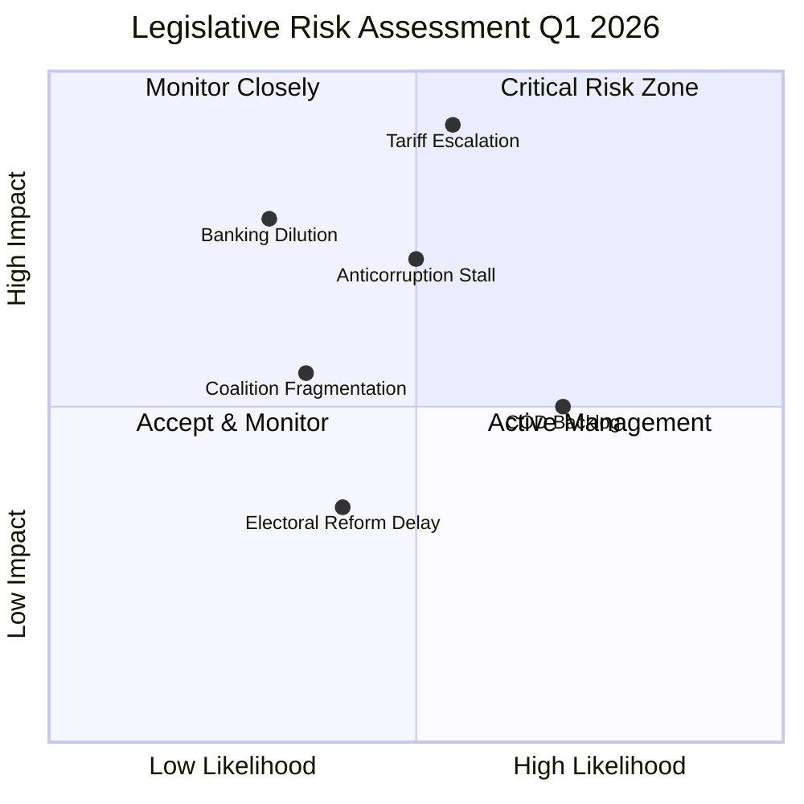

# Risk Matrix — Legislative Procedures (2026-04-15)

## Risk Dashboard

| Category | Level | Trend | Key Driver |
|----------|:-----:|:-----:|------------|
| Geopolitical | 🔴 CRITICAL | ↑ | US tariff T-0 activation |
| Policy Implementation | 🟠 HIGH | → | Banking Union 24-month transposition |
| Institutional | 🟡 MEDIUM | → | Anti-corruption trilogue timeline |
| Coalition Stability | 🟡 MEDIUM | ↘ | Grand coalition 38-seat deficit |
| Legislative Throughput | 🟡 MEDIUM | ↑ | 13 new COD procedures backlog |
| Democratic Standards | 🟢 LOW | → | Electoral Act implementation |

## Risk Matrix Visualization

## Detailed Risk Assessments

### R1: Trade War Escalation (CRITICAL)
- **Likelihood**: MEDIUM (0.55) — US-EU negotiations ongoing but positions hardening
- **Impact**: CRITICAL (0.92) — €700B+ trade relationship, auto/agri sectors, consumer prices
- **Velocity**: FAST — tariffs activate today (April 15), retaliation cycles measured in weeks
- **Mitigation**: Parliament adopted TA-10-2026-0096 + Mercosur safeguard TA-10-2026-0030; Commission managing escalation ladder
- **Confidence**: 🟢 HIGH

### R2: Banking Union Council Dilution (HIGH)
- **Likelihood**: LOW (0.30) — Council has political commitment but technical objections from DE savings banks
- **Impact**: HIGH (0.78) — Would undermine Banking Union completion, EDIS progress, financial stability architecture
- **Velocity**: SLOW — 24-month transposition provides negotiation runway
- **Mitigation**: Strong EP mandate via grand coalition adoption; ECB institutional support
- **Confidence**: 🟡 MEDIUM

### R3: Anti-Corruption Trilogue Stalling (HIGH)
- **Likelihood**: MEDIUM (0.50) — Several member states have implementation concerns
- **Impact**: HIGH (0.72) — EU democratic credibility, enlargement conditionality, rule-of-law tools
- **Velocity**: MEDIUM — Trilogue typically 6-12 months
- **Mitigation**: Strong EP position; Commission original proposal ambitious
- **Confidence**: 🟡 MEDIUM

### R4: Legislative Backlog (MEDIUM)
- **Likelihood**: HIGH (0.70) — 13 new COD procedures in Q1 + carry-over from EP9
- **Impact**: MEDIUM (0.50) — Delay rather than failure; committee scheduling is bottleneck
- **Velocity**: SLOW — Accumulates over months
- **Mitigation**: Conference of Presidents can prioritise; parallel processing in committees
- **Confidence**: 🟢 HIGH

## Forward Scenarios

| Scenario | Probability | Description | Key Trigger |
|----------|:-----------:|-------------|-------------|
| A: Managed Transition | Likely | March adoptions proceed to implementation; new CODs processed at normal pace; tariff tensions managed | US-EU negotiation channel active |
| B: Escalation Overload | Possible | Tariff retaliation absorbs INTA/ECON bandwidth; legislative backlog grows; inter-institutional tension | US retaliatory tariffs on EU agriculture |
| C: Coalition Fracture | Unlikely | ECR breaks with EPP on trade response; grand coalition fails on key COD vote; legislative paralysis | PfE blocks key anti-corruption provision |

