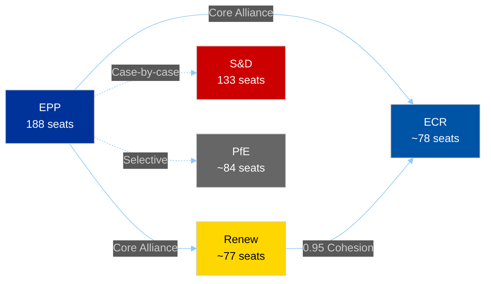

# 🔗 Coalition Dynamics Intelligence — 16 April 2026 (Run 177)

## EP10 Coalition Architecture

The 10th European Parliament operates under the most fragmented composition in EP history (fragmentation index: 4.04). The traditional grand coalition (EPP + S&D) commands only 321 seats against a 361-seat majority threshold — a deficit of 38 seats that has fundamentally altered legislative dynamics.

### Group Composition (Current)

| Group | Seats | Share | Bloc |
|-------|:-----:|:-----:|------|
| EPP | 188 | 26.1% | Centre-Right |
| S&D | 133 | 18.5% | Centre-Left |
| Renew | ~77 | 10.7% | Liberal |
| ECR | ~78 | 10.8% | Conservative |
| Greens/EFA | ~53 | 7.4% | Green-Progressive |
| The Left | ~46 | 6.4% | Left |
| ESN | 28 | 3.9% | Eurosceptic-Right |
| PfE | ~84 | 11.7% | Populist-Right |
| NI | 34 | 4.7% | Non-attached |

### Dominant Coalition Formula: EPP + Renew + ECR

The Renew-ECR axis (0.95 cohesion) combined with EPP forms the dominant legislative majority:

```
EPP (188) + Renew (~77) + ECR (~78) = ~343 seats
```

This falls marginally short of 361, requiring selective support from either S&D members or PfE members on specific files. The practical coalition arithmetic therefore operates as **EPP-Renew-ECR + selective allies**, rather than a fixed three-party bloc.



## Trade Policy Coalition Stress Test

### Scenario A: Unified Centre-Right Response (55% probability)

EPP, Renew, and ECR maintain cohesion on tariff policy, supporting the Commission's countermeasures framework while demanding enhanced parliamentary oversight. This scenario is most likely if:
- Tariff impacts are distributed relatively evenly across member states
- The Commission provides adequate briefing to group coordinators before April 27
- National delegations within Renew and ECR do not receive strong domestic pressure to defect

**Coalition arithmetic**: ~343 seats + likely PfE support on trade defence = ~427 seats (comfortable supermajority)

**Legislative outcome**: Parliament endorses tariff countermeasures with amendments requiring quarterly Commission reporting to INTA and a sunset clause on expanded countermeasure authority.

### Scenario B: Renew-ECR Partial Fracture (30% probability)

Trade policy exposes intra-group divisions, with national economic interests overriding group discipline. Specifically:
- **Renew fracture line**: FDP (Germany) opposes escalation due to automotive sector exposure; VVD (Netherlands) supports trade defence due to port/logistics exposure
- **ECR fracture line**: PiS (Poland) supports agricultural protection; FdI (Italy) hedges between industrial protection and free trade rhetoric

If 15-20% of Renew and ECR members defect on trade votes, the centre-right bloc drops to approximately 300-310 seats, requiring EPP to negotiate with S&D for a modified grand coalition approach to trade policy.

**Coalition arithmetic**: EPP (188) + loyal Renew (~60) + loyal ECR (~60) + S&D (133) = ~441 seats but with conflicting policy mandates

**Legislative outcome**: Compromise text that couples trade defence with social adjustment measures (EGF expansion, worker retraining programs), reflecting S&D influence. Slower legislative process, potential for amendment battles on sustainability and labour conditions in trade agreements.

### Scenario C: Multi-Front Fragmentation (15% probability)

Tariff escalation combines with other policy conflicts (migration, rule of law, budget) to create a general coalition crisis. No stable majority forms, and Parliament reverts to file-by-file negotiation with different majorities on each vote.

**Coalition arithmetic**: Variable — each vote produces a different majority composition

**Legislative outcome**: Legislative paralysis on tariff policy. Commission continues implementing countermeasures without clear parliamentary mandate. Democratic legitimacy erosion accelerates.

## Renew-ECR Axis: Detailed Cohesion Analysis

### Structural Factors Supporting Cohesion

1. **Economic liberalism convergence**: Both groups share a preference for market-oriented solutions and regulatory restraint, creating a natural policy overlap that has driven the 0.95 cohesion score.

2. **Institutional interest alignment**: Both groups benefit from the current three-party formula. Renew and ECR gain disproportionate influence relative to their seat share by being essential coalition partners. Defection would diminish their leverage.

3. **Leadership investment**: Group leaders have invested political capital in the Renew-ECR partnership. Abandoning it would require acknowledging a strategic failure.

### Structural Factors Threatening Cohesion

1. **National economic divergence**: Trade policy impacts are asymmetric by member state. Germany's automotive sector, France's agriculture, Italy's manufacturing, and Poland's services face different exposure levels. When tariffs bite, national interests will push against group discipline.

2. **Ideological heterogeneity**: Both groups contain ideologically diverse national delegations. Renew spans from social liberals (D66/Netherlands) to economic conservatives (FDP/Germany). ECR spans from national conservatives (PiS/Poland) to more mainstream centre-right (ODS/Czech Republic).

3. **No formal coalition agreement**: Unlike government coalitions, the Renew-ECR partnership has no formal agreement, no policy platform, and no enforcement mechanism. Cohesion is voluntary and can be withdrawn at any time.

## Grand Coalition Deficit Implications

The -38 seat grand coalition deficit is the defining structural feature of EP10. Its implications:

| Implication | Severity | Evidence |
|------------|:--------:|---------|
| Every COD file requires 3+ party negotiation | HIGH | 14 pending COD procedures |
| No "default majority" for routine legislation | HIGH | Fragmentation index 4.04 |
| Small groups (Greens, The Left) gain pivotal power | MEDIUM | Critical on specific files |
| Legislative timeline extends by 2-4 weeks per file | MEDIUM | Committee workload compression |
| Commission must pre-negotiate with more groups | MEDIUM | Inter-institutional dynamics |

## Intelligence Assessment

**Key Judgment (🟡 Medium Confidence)**: The Renew-ECR axis will survive the initial tariff crisis (April-May 2026) but will exhibit stress fractures that reduce cohesion from 0.95 to approximately 0.80-0.85 by the end of Q2 2026. The fractures will be most visible on:
- Trade-specific votes (tariff rates, exemption criteria)
- EGF budget votes (distributional politics)
- Any votes linking trade to migration or rule of law conditionality

The coalition will recover cohesion on non-trade files, maintaining the 0.90+ baseline for digital policy, institutional reform, and internal market legislation.

**Forward Indicator to Watch**: The INTA coordinator meeting (first post-recess session) will be the earliest signal of coalition health. If all three groups' INTA coordinators issue a joint statement, cohesion is holding. If they issue separate statements, fracture has begun.
