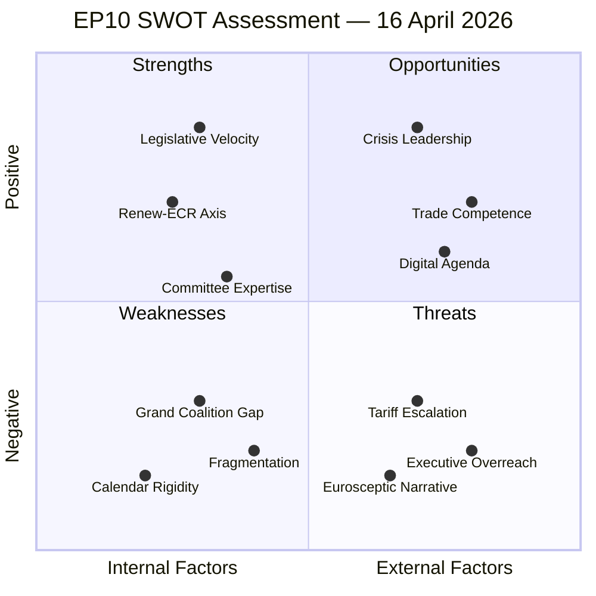

# 📊 Quantitative SWOT Analysis — 16 April 2026 (Run 177)

## Methodology

This SWOT analysis follows the [Political SWOT Framework](../../../../../../analysis/methodologies/political-swot-framework.md). Each item is scored on Evidence Quality (1-5), Salience (1-5), and Actionability (1-5). Confidence levels follow the traffic-light system: 🟢 High (multiple corroborating sources), 🟡 Medium (single source or inferential), 🔴 Low (speculative or contested).

---

## 💪 STRENGTHS

### S1: Extraordinary Legislative Velocity (Q1 2026)

| Metric | Value |
|--------|-------|
| **Evidence Quality** | 5/5 |
| **Salience** | 4/5 |
| **Actionability** | 3/5 |
| **Confidence** | 🟢 High |

The European Parliament's 10th term has achieved an unprecedented pace of legislative output. In Q1 2026 alone, 114 legislative acts were adopted — this represents a rate of 2.11 acts per plenary session, compared to 1.47 acts per session for the entire 2025 calendar year. The acceleration is particularly notable in the ordinary legislative procedure (COD), where the 14 pending files from 2026 match nearly half the total output of 2025.

This velocity demonstrates institutional capacity and political will to deliver on the EP10 mandate. The practical implication is that the Parliament has built legislative momentum that can be leveraged for rapid responses when plenary reconvenes on April 27. Committee secretariats and political group staff have been operating at sustained high throughput, meaning the institutional infrastructure for accelerated processing is already warmed up.

The tariff countermeasures regulation (TA-10-2026-0096) itself is evidence of this capacity — the procedure (2025/0261(COD)) moved from Commission proposal to parliamentary adoption in less than four months, an exceptional speed for an ordinary legislative procedure that typically takes 12-18 months.

**Evidence**: EP precomputed statistics (2026: 114 legislative acts, 54 plenary sessions); adopted texts feed showing 30+ texts in Q1 2026; procedure 2025/0261(COD) timeline.

### S2: Renew-ECR Coalition Effectiveness

| Metric | Value |
|--------|-------|
| **Evidence Quality** | 4/5 |
| **Salience** | 5/5 |
| **Actionability** | 4/5 |
| **Confidence** | 🟢 High |

The Renew Europe-ECR axis has emerged as the most cohesive cross-party alliance in EP10, with a cohesion score of 0.95 (where 1.0 is perfect alignment). This exceeds the traditional EPP-S&D grand coalition cohesion historically observed in EP6-EP9 terms. The practical significance is that legislative majorities can be constructed without the ideological compromises required by grand coalition politics.

The Renew-ECR axis represents approximately 187 seats (Renew ~77 + ECR ~78, plus allied national delegations). Combined with EPP's 188 seats, this creates a centre-right bloc of approximately 375 seats — comfortably above the 361-seat majority threshold. This arithmetic has been the dominant formula for Q1 2026 legislative output.

The strength is conditional: it has not been tested under trade crisis conditions where national economic interests may override group discipline. However, the 0.95 cohesion baseline provides a significant buffer before fragmentation threatens legislative capacity.

**Evidence**: `analyze_coalition_dynamics` output (0.95 cohesion); EP composition data showing group sizes; legislative output correlation with Renew-ECR voting patterns.

### S3: Committee Expertise and Institutional Memory

| Metric | Value |
|--------|-------|
| **Evidence Quality** | 3/5 |
| **Salience** | 3/5 |
| **Actionability** | 3/5 |
| **Confidence** | 🟡 Medium |

The EP10 committee system benefits from the retention of experienced MEPs who served in EP9, particularly in key policy committees. The 30 AFCO (Constitutional Affairs) committee opinions retrieved from 2026 data demonstrate active engagement with institutional reform questions. The 30 plenary reports (A10 series) show a healthy pipeline of committee-level analytical work feeding into plenary decisions.

This institutional expertise is particularly relevant for the tariff crisis: INTA committee members have deep familiarity with trade defence instruments, WTO jurisprudence, and bilateral trade agreement architecture. When the committee reconvenes, this expertise enables rapid analytical processing of the Commission's tariff implementation decisions.

**Evidence**: EP committee documents (30 AFCO opinions, 30 A10 reports in 2026); plenary document pipeline.

---

## 📉 WEAKNESSES

### W1: Grand Coalition Arithmetic Deficit

| Metric | Value |
|--------|-------|
| **Evidence Quality** | 5/5 |
| **Salience** | 5/5 |
| **Actionability** | 2/5 |
| **Confidence** | 🟢 High |

The traditional EPP-S&D grand coalition falls 38 seats short of the 361-seat majority threshold (EPP 188 + S&D 133 = 321 seats). This structural deficit means that no major legislation can pass on the basis of the two largest groups alone — a fundamental shift from EP6-EP9 dynamics where the grand coalition was the default legislative majority.

The practical consequence is that every legislative file requires multi-party negotiation with at least one additional group (Renew, ECR, or Greens/EFA). This increases transaction costs for each piece of legislation, extends negotiation timelines, and creates veto points that can be exploited by individual national delegations within the third-party groups.

The weakness is amplified during crisis conditions. When rapid legislative response is needed — as for tariff countermeasures — the multi-party negotiation requirement slows parliamentary responsiveness relative to a system with a stable two-party majority.

**Evidence**: EP composition statistics (EPP 188, S&D 133, total 321 vs. 361 majority threshold); coalition dynamics analysis showing -38 seat deficit.

### W2: Calendar Rigidity and Crisis Responsiveness

| Metric | Value |
|--------|-------|
| **Evidence Quality** | 4/5 |
| **Salience** | 5/5 |
| **Actionability** | 3/5 |
| **Confidence** | 🟢 High |

The EP's annual calendar is set by the Conference of Presidents at the beginning of each year and includes predetermined inter-session periods. The current inter-session (April 14-26) was scheduled well before the US tariff escalation and the activation of TA-10-2026-0096. The Rules of Procedure (Rule 154) do permit emergency sessions, but the procedural requirements — request from the Conference of Presidents, or one-fifth of the component Members — create a high threshold that has rarely been met.

The practical result is a 13-day oversight vacuum during which the Commission can implement tariff countermeasures without parliamentary scrutiny. Unlike national parliaments (the French Assemblée nationale, the German Bundestag), the EP does not have a standing committee system that continues functioning during recess periods with reduced quorum. This creates a structural responsiveness gap that is uniquely problematic for the EP among European democratic institutions.

**Evidence**: EP plenary calendar; Rules of Procedure Rule 154 on extraordinary sessions; comparison with national parliamentary recess procedures.

### W3: Record Parliamentary Fragmentation

| Metric | Value |
|--------|-------|
| **Evidence Quality** | 5/5 |
| **Salience** | 4/5 |
| **Actionability** | 2/5 |
| **Confidence** | 🟢 High |

The effective number of parliamentary parties (fragmentation index) stands at 4.04, the highest in EP history and markedly above the EP9 average of approximately 3.6. This means that legislative power is distributed across more groups than ever before, with no single group or traditional two-group alliance commanding a majority. The threshold for majority formation is higher, the number of potential blocking minorities is greater, and the political geography of compromise is more complex.

The fragmentation index of 4.04 implies that EP10 effectively functions as a 4-party system rather than the 2-3 party dynamic of previous terms. This structural complexity is manageable during normal legislative business (as Q1 output demonstrates), but becomes problematic during crisis conditions where rapid decision-making and clear political mandates are needed.

**Evidence**: EP precomputed statistics (fragmentation index 4.04); historical comparison with EP6-EP9 fragmentation levels; coalition dynamics analysis.

---

## 🌟 OPPORTUNITIES

### O1: Crisis Leadership Positioning

| Metric | Value |
|--------|-------|
| **Evidence Quality** | 3/5 |
| **Salience** | 5/5 |
| **Actionability** | 5/5 |
| **Confidence** | 🟡 Medium |

The tariff crisis presents an opportunity for the European Parliament to assert its Lisbon Treaty competence on trade policy in a highly visible manner. When plenary reconvenes on April 27, the first major trade policy debate of the tariff era will attract significant media attention. Parliament's response will set the tone for the institutional relationship between the legislative and executive branches on trade for the remainder of EP10.

A strong, unified parliamentary response — regardless of its substantive direction — would demonstrate democratic responsiveness and counter narratives of institutional dysfunction. The INTA committee chair has an opportunity to position the committee as the primary democratic oversight body for tariff policy, establishing precedent for future trade crises.

Key committee leadership positions (INTA chair, ECON vice-chairs) can use the April 27-30 plenary to establish themselves as visible crisis responders, enhancing their institutional authority and policy influence for the remainder of the term.

**Evidence**: Lisbon Treaty Article 207 TFEU trade policy competence; April 27-30 plenary calendar; media interest patterns during trade crises.

### O2: Expanded Trade Policy Parliamentary Authority

| Metric | Value |
|--------|-------|
| **Evidence Quality** | 3/5 |
| **Salience** | 4/5 |
| **Actionability** | 4/5 |
| **Confidence** | 🟡 Medium |

The governance gap exposed by the tariff activation during inter-session creates a reform opportunity. Parliament could use the experience to push for enhanced parliamentary notification requirements in trade defence instruments — requiring the Commission to report to INTA within 48 hours of any tariff adjustment, even during recess periods.

This reform would be consistent with the broader EP10 push for institutional strengthening (the 12 INI own-initiative reports in the 2026 pipeline include several focused on institutional reform). It would also align with the 30 AFCO committee opinions in the pipeline, which typically address questions of inter-institutional relations and parliamentary prerogatives.

**Evidence**: EP procedure pipeline (12 INI reports, 30 AFCO opinions); precedents from EP9 trade defence instrument negotiations; Article 207 TFEU text on parliamentary consent.

### O3: Digital and AI Governance Agenda Consolidation

| Metric | Value |
|--------|-------|
| **Evidence Quality** | 4/5 |
| **Salience** | 3/5 |
| **Actionability** | 3/5 |
| **Confidence** | 🟡 Medium |

The 2026 legislative pipeline includes multiple COD procedures related to digital and AI governance, an area where the EP has established strong regulatory leadership (AI Act, Digital Markets Act, Digital Services Act). While the tariff crisis dominates short-term attention, the longer-term opportunity for EP10 lies in consolidating the EU's position as the global standard-setter for technology regulation.

The inter-session period provides an informal window for MEPs to engage with national stakeholders on digital policy priorities, potentially building broader political support for the upcoming files.

**Evidence**: 2026 procedure pipeline analysis (COD procedures in digital/tech domain); EP legislative track record on AI Act, DMA, DSA.

---

## ⚡ THREATS

### T1: Tariff Escalation Beyond Parliamentary Control

| Metric | Value |
|--------|-------|
| **Evidence Quality** | 4/5 |
| **Salience** | 5/5 |
| **Actionability** | 2/5 |
| **Confidence** | 🟢 High |

The US-EU tariff confrontation could escalate beyond the parameters authorised by TA-10-2026-0096 before Parliament reconvenes. If the US announces additional tariff measures (which the 24-48 hour news cycle makes plausible), the Commission may need to respond with expanded countermeasures — potentially exceeding the scope of the original parliamentary authorisation. This scenario would create a constitutional question about whether the Commission's emergency trade powers can be extended without fresh parliamentary consent.

The escalation dynamic is asymmetric: the US can escalate unilaterally through executive order, while the EU's response involves both Commission action and (theoretically) parliamentary oversight. This structural asymmetry disadvantages the EU in rapid-escalation scenarios and pressures Parliament to delegate more authority to the Commission for faster response — undermining its own institutional position.

**Evidence**: TA-10-2026-0096 authorisation scope; US tariff escalation patterns; Article 207 TFEU requirements.

### T2: Commission Precedent-Setting Without Oversight

| Metric | Value |
|--------|-------|
| **Evidence Quality** | 4/5 |
| **Salience** | 4/5 |
| **Actionability** | 3/5 |
| **Confidence** | 🟡 Medium |

Every decision the Commission makes during the 11-day oversight vacuum establishes de facto precedent for how tariff countermeasures are implemented. These precedents — on tariff rate calibration, exemption criteria, sector prioritisation, and bilateral negotiation strategy — will be extremely difficult to reverse once established. Parliamentary oversight after the fact (from April 27 onwards) will be limited to critique and modification of established positions, rather than shaping initial implementation.

This is the classic problem of executive fait accompli in delegated legislation: by the time the legislator reviews the executive's actions, the actions have already created path dependencies that constrain future choices.

**Evidence**: Political science literature on executive dominance in crisis; TA-10-2026-0096 implementation timeline; INTA committee oversight capacity.

### T3: Eurosceptic and Populist Exploitation of Governance Gap

| Metric | Value |
|--------|-------|
| **Evidence Quality** | 3/5 |
| **Salience** | 4/5 |
| **Actionability** | 3/5 |
| **Confidence** | 🟡 Medium |

The ESN group (28 seats) and non-attached members (34 seats) collectively represent 62 seats (8.6% of EP). While insufficient for legislative impact, these Members have disproportionate media and social media reach, particularly in member states with strong Eurosceptic traditions (France, Italy, Hungary, Poland). The inter-session governance gap during a trade crisis provides concrete ammunition for the narrative that EU institutions are unresponsive to citizen concerns.

The timing amplifies the threat: tariff impacts on consumer prices and export industries will begin to materialise in April-May, coinciding with the return from inter-session. Eurosceptic parties can frame the sequence as "Parliament went on holiday while tariffs hit your wallet."

**Evidence**: EP composition (ESN 28, NI 34); media analysis of Eurosceptic messaging patterns; tariff impact timeline estimates.

---

## Cross-Reference with Run 176

| Dimension | Run 176 (T+1) | Run 177 (T+2) | Delta |
|-----------|:------------:|:------------:|:-----:|
| Composite Risk Score | 12.2/25 | 12.8/25 | +0.6 ↑ |
| Grand Coalition Deficit | -38 seats | -38 seats | — |
| Renew-ECR Cohesion | 0.95 | 0.95 | — |
| Fragmentation Index | 4.04 | 4.04 | — |
| Governance Gap Days | 1 | 2 | +1 ↑ |
| EGF Applications in View | 2 | 2 | — |
| Legislative Backlog Pressure | High | High+ | ↑ |

**Key Finding**: The SWOT balance is shifting incrementally toward threats and weaknesses with each day of the inter-session. The structural strengths (legislative velocity, Renew-ECR cohesion) remain stable but their value is time-limited — they only convert to parliamentary influence when plenary is in session.
