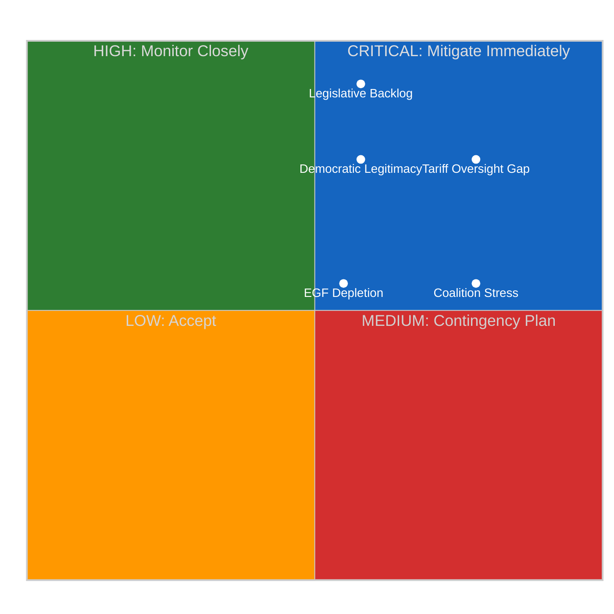
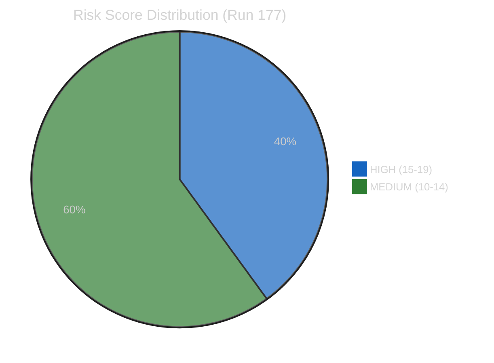

# ⚠️ Risk Matrix — 16 April 2026 (Run 177)

## Methodology

All risks scored using the **5×5 Likelihood × Impact matrix** from [Political Risk Methodology](../../../../../../analysis/methodologies/political-risk-methodology.md). Risk Score = Likelihood × Impact. Thresholds: Critical ≥20, High 15-19, Medium 10-14, Low 5-9, Negligible 1-4.

## Risk Register

## Detailed Risk Assessment

### RISK-1: Tariff Escalation Without Parliamentary Oversight

| Attribute | Value |
|-----------|-------|
| **Likelihood** | 4/5 (Likely) |
| **Impact** | 4/5 (Major) |
| **Risk Score** | **16/25 — HIGH** |
| **Trend** | ↑ Rising (T+2, worsening daily) |
| **Confidence** | 🟢 High |

**Description**: The US tariff countermeasures regime (TA-10-2026-0096, adopted 26 March 2026, activated 15 April 2026) is being implemented by the European Commission without any parliamentary oversight mechanism. The EP's INTA (International Trade) committee is not convened during the inter-session period (April 14-26), and no emergency recall procedure has been invoked. This means customs duties adjustments affecting billions of euros in transatlantic trade are proceeding with executive authority alone, contravening the spirit of the Lisbon Treaty's conferral of trade policy competence to Parliament as co-legislator.

The gap is structural: the EP calendar does not provide for emergency plenary sessions during inter-session periods unless a formal request is made by the Conference of Presidents. No such request has been publicised. The Commission's DG Trade is therefore the sole decision-maker on tariff rate adjustments, quota allocations, and retaliatory escalation timing during this critical 11-day window.

**Mitigation**: INTA coordinators could request an emergency virtual meeting under Rule 209(4) of the Rules of Procedure. The Conference of Presidents could convene an extraordinary session. Neither action has been signalled.

**Evidence**: TA-10-2026-0096 procedure 2025/0261(COD); EP plenary calendar showing inter-session April 14-26.

### RISK-2: Legislative Backlog Compounding

| Attribute | Value |
|-----------|-------|
| **Likelihood** | 5/5 (Almost Certain) |
| **Impact** | 3/5 (Moderate) |
| **Risk Score** | **15/25 — HIGH** |
| **Trend** | ↗ Worsening |
| **Confidence** | 🟢 High |

**Description**: The 2026 procedure pipeline contains 14 COD (ordinary legislative procedure) files, 12 INI (own-initiative reports), 8 IMM (immunity requests), 5 BUD (budgetary procedures), and 12 additional procedure types. The 14 COD procedures each require rapporteur appointment, shadow rapporteur designation, committee hearing scheduling, amendment deadline setting, and plenary vote scheduling — a process that typically takes 4-8 weeks per file.

The inter-session period suspends all committee activity, meaning the 13-day gap (April 14-26) adds directly to the processing timeline for every pending procedure. With the April 27-30 Strasbourg plenary already expected to prioritise tariff policy debate, the committee schedule for early May will face unprecedented compression. The 2026 Q1 output pace of 114 legislative acts (2.11 per session, compared to 1.47 in 2025) is unsustainable unless committee productivity increases proportionally.

**Mitigation**: Committee chairs could schedule extended sessions in May. The Conference of Presidents could request additional plenary sittings. Rapporteur allocations could be fast-tracked through written procedure.

**Evidence**: EP API `get_procedures` shows 51 2026 procedures including 14 COD; precomputed stats show 2.11 acts/session pace.

### RISK-3: Coalition Stress Under Trade Crisis

| Attribute | Value |
|-----------|-------|
| **Likelihood** | 3/5 (Possible) |
| **Impact** | 4/5 (Major) |
| **Risk Score** | **12/25 — MEDIUM** |
| **Trend** | → Stable (but rising potential energy) |
| **Confidence** | 🟡 Medium |

**Description**: The Renew-ECR axis (0.95 cohesion) has emerged as the strongest cross-party alliance in EP10, but it has not been tested under trade crisis conditions. Renew Europe's membership includes both strongly pro-free-trade parties (FDP/Germany, VVD/Netherlands) and more protectionist tendencies (various national parties). ECR's cohesion on trade is also uncertain — Poland's Law and Justice delegation (the largest ECR component) has different trade interests from the Italian delegation.

The critical question is whether the Renew-ECR alliance holds when tariff retaliation impacts member states asymmetrically. Germany (export-dependent, Renew component via FDP) faces different exposure than Poland (less export-dependent to US, ECR core). If the alliance fractures on trade, the legislative majority arithmetic becomes significantly more complex, requiring EPP to rebuild coalitions on a case-by-case basis.

**Mitigation**: EPP leadership could pre-negotiate trade positions with both Renew and ECR coordinators before the April 27 plenary. INTA committee could produce a cross-party compromise text during informal consultations.

**Evidence**: `analyze_coalition_dynamics` Renew-ECR 0.95 cohesion; precomputed stats show fragmentation 4.04; grand coalition deficit -38 seats.

### RISK-4: European Globalisation Fund Capacity

| Attribute | Value |
|-----------|-------|
| **Likelihood** | 3/5 (Possible) |
| **Impact** | 3/5 (Moderate) |
| **Risk Score** | **9/25 — MEDIUM** |
| **Trend** | ↗ Building |
| **Confidence** | 🟡 Medium |

**Description**: Two EGF applications have been approved in Q1 2026: EGF/2025/006 for Audi Belgium (TA-10-2026-0038) and EGF/2025/004 for Tupperware Belgium (TA-10-2026-0073). Both relate to manufacturing displacement in Belgium, suggesting a geographic concentration of industrial restructuring. The tariff activation on 15 April will likely generate additional applications as EU exporters to the US face reduced competitiveness.

The EGF's annual budget ceiling of approximately €186 million may face pressure if tariff-related displacement events multiply across member states. Automotive and agricultural sectors are most exposed. The political optics of fund exhaustion during an active trade war would undermine confidence in the EU's adjustment capacity.

**Mitigation**: The budgetary authority (EP + Council) could increase the EGF ceiling through amending budget procedures. The 5 BUD procedures already in the 2026 pipeline provide potential vehicles for supplementary funding.

**Evidence**: TA-10-2026-0038 and TA-10-2026-0073 in EP adopted texts; EGF regulation annual ceiling.

### RISK-5: Democratic Legitimacy Erosion

| Attribute | Value |
|-----------|-------|
| **Likelihood** | 4/5 (Likely) |
| **Impact** | 3/5 (Moderate) |
| **Risk Score** | **12/25 — MEDIUM** |
| **Trend** | ↑ Rising (each day adds to deficit) |
| **Confidence** | 🟡 Medium |

**Description**: The European Parliament's role as co-legislator on trade policy (Article 207 TFEU, as amended by the Lisbon Treaty) is functionally suspended during the inter-session period. While this gap is calendrically routine, it coincides with an exceptionally consequential trade policy activation. Public perception research consistently shows that institutional responsiveness is a key driver of trust in EU governance.

The combination of unprecedented legislative velocity (114 Q1 acts) followed by a 13-day absence during tariff activation creates a narrative of institutional schizophrenia — Parliament as both hyperactive legislator and absent overseer. This is exploitable by Eurosceptic parties (ESN 28 seats, NI 34 seats) who can frame the governance gap as evidence of institutional dysfunction.

**Mitigation**: Parliament's communication services could proactively explain the inter-session schedule. MEPs could use social media and national media to maintain visibility on trade policy. INTA chair could issue public statements on committee position.

## Composite Risk Assessment

| Risk Level | Count | Total Score | Avg Score |
|-----------|:-----:|:-----------:|:---------:|
| **HIGH** | 2 | 31 | 15.5 |
| **MEDIUM** | 3 | 33 | 11.0 |
| **COMPOSITE** | **5** | **64** | **12.8** |

**Overall Risk Level**: 🟡 ELEVATED (12.8/25 composite, up from 12.2 in Run 176)

**Key Finding**: Risk is accumulating rather than abating. The T+2 trajectory shows a 0.6-point increase from T+1, driven primarily by the deepening governance gap (RISK-1) and continued backlog compounding (RISK-2). If no emergency oversight mechanism is activated before April 27, the composite risk will likely reach 13.5-14.0 by T+11 (April 26, eve of plenary reconvention).
