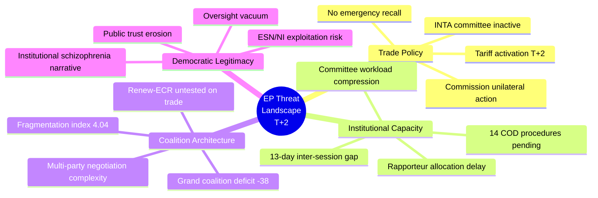
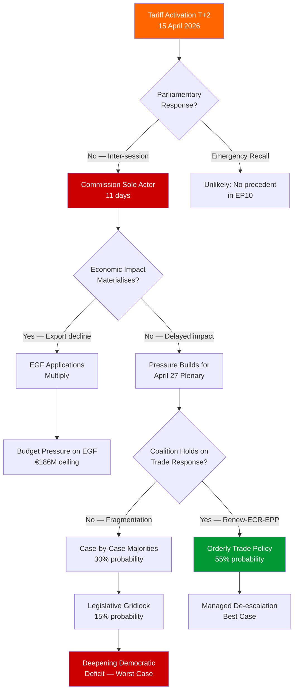

# 🛡️ Political Threat Landscape — 16 April 2026 (Run 177)

## Threat Environment Overview

The European Parliament faces a **compound threat** arising from the intersection of trade policy activation, institutional calendar constraints, and unprecedented legislative workload. This assessment evaluates threats to parliamentary effectiveness, democratic legitimacy, and coalition stability during the inter-session period.

## Threat Actor Profiling

### T1: Executive Overreach (Commission as Sole Trade Actor)

| Attribute | Assessment |
|-----------|-----------|
| **Threat Type** | Institutional imbalance |
| **Capability** | HIGH — DG Trade has full legal authority under activated tariff regime |
| **Intent** | NEUTRAL — Commission acting within legal framework, not maliciously |
| **Opportunity** | HIGH — 11-day window without parliamentary scrutiny |
| **Impact** | MAJOR — precedent for executive dominance in trade policy |
| **Confidence** | 🟢 High |

The European Commission's DG Trade directorate is managing the tariff countermeasures regime (TA-10-2026-0096) during the parliamentary inter-session with full legal authority. While this is constitutionally permissible — the tariff regulation was adopted through the ordinary legislative procedure with Parliament's consent on 26 March — the practical effect is that tariff rate adjustments, exemption decisions, and escalation timing are all executive decisions without real-time legislative input. Executive Vice-President Dombrovskis (trade portfolio holder) is the de facto sole decision-maker on bilateral trade escalation with the United States. The Commission's Directorate-General for Trade can modify quota allocations, adjust duty rates within the authorised parameters, and negotiate with US counterparts without parliamentary reporting requirements during the inter-session period. This creates a structural asymmetry where the most consequential trade decisions of the EP10 term are being made by the least democratically accountable EU institution.

### T2: Coalition Fragmentation Under Economic Pressure

| Attribute | Assessment |
|-----------|-----------|
| **Threat Type** | Political cohesion degradation |
| **Capability** | MEDIUM — economic interests diverge across member states |
| **Intent** | N/A — structural, not intentional |
| **Opportunity** | MEDIUM — manifests when plenary reconvenes and votes occur |
| **Impact** | MAJOR — legislative paralysis if no stable majority forms |
| **Confidence** | 🟡 Medium |

The Renew-ECR axis (0.95 cohesion) has been the most productive coalition vehicle in EP10, but trade policy exposes fundamental differences in economic philosophy within both groups. Renew Europe contains both free-trade absolutists (FDP delegation, VVD) and conditional free-traders who support strategic trade defence. ECR's Polish delegation (PiS) has historically supported agricultural protectionism while its Italian contingent (FdI) has more nuanced trade positions. When tariff retaliation hits different member states asymmetrically — Germany's automotive sector faces different exposure than Poland's agricultural sector — national economic interests may override group discipline.

The stress test will come at the April 27-30 plenary when Members must vote on the Commission's implementation of TA-10-2026-0096. If Renew and ECR cannot maintain cohesion, EPP must rebuild majorities on a case-by-case basis, requiring negotiation with S&D and potentially Greens/EFA — groups with fundamentally different trade policy preferences (emphasis on sustainability conditions, labour standards, and environmental compliance in trade agreements).

### T3: Eurosceptic Narrative Exploitation

| Attribute | Assessment |
|-----------|-----------|
| **Threat Type** | Information/narrative threat |
| **Capability** | LOW-MEDIUM — ESN 28 seats + NI 34 seats = 62 seats (8.6%) |
| **Intent** | HIGH — governance dysfunction is a core Eurosceptic argument |
| **Opportunity** | HIGH — inter-session gap provides concrete evidence for narrative |
| **Impact** | MODERATE — media amplification, public confidence erosion |
| **Confidence** | 🟡 Medium |

The combination of record legislative output followed by institutional absence during a trade crisis provides ammunition for Eurosceptic framing. ESN (Europe of Sovereign Nations, 28 seats) and non-attached Members (34 seats) can argue that the EU's institutional architecture prioritises procedural regularity over democratic responsiveness. The narrative — "Parliament passed 114 laws in three months then went on holiday while tariffs hit" — is reductionist but potent for social media and national media consumption.

This threat is amplified by the fact that individual MEPs from Eurosceptic parties can issue public statements during the inter-session period while the Parliament as an institution has no formal communication capacity. The asymmetry between individual MEP voice and institutional silence creates a narrative vacuum that is historically exploited by opposition forces.

## Consequence Trees

## Legislative Disruption Assessment

### Disruption to Normal Legislative Processing

The 2026 legislative pipeline faces a **compound disruption** from three simultaneous pressures:

1. **Calendar disruption**: The 13-day inter-session (April 14-26) suspends all committee activity. No hearings, no votes, no rapporteur meetings. This is standard for the parliamentary calendar but its impact is amplified by the tariff crisis timing.

2. **Agenda disruption**: The April 27-30 Strasbourg plenary will be dominated by tariff policy debate, displacing routine legislative items that would otherwise receive floor time. This cascading effect pushes COD procedure timelines by an additional 2-4 weeks beyond the calendar gap.

3. **Capacity disruption**: Committee secretariats will face compressed schedules in May as they process both the backlog and new urgency items. INTA in particular will be stretched between emergency tariff oversight and its regular trade agreement portfolio (Mercosur, CETA implementation, WTO follow-up).

**Disruption Score**: 14/20 (HIGH) — based on calendar gap (5/5), agenda displacement (4/5), capacity strain (3/5), and institutional response readiness (2/5).

## Mitigation Recommendations

1. **INTA Emergency Consultation**: The INTA chair should convene an informal video consultation with coordinators from all political groups before April 27, establishing common ground for the plenary trade debate.

2. **Written Procedure for Rapporteur Allocation**: To recover time lost during inter-session, committee chairs should use written procedure (Rule 229) to allocate rapporteurs for pending COD files.

3. **Extended Committee Sessions in May**: The Conference of Committee Chairs should request additional meeting slots for May 2026 to process the accumulated backlog.

4. **Communication Strategy**: Parliament's DG COMM should prepare a proactive communication package explaining parliamentary oversight mechanisms for the tariff response, countering Eurosceptic narratives about institutional absence.
