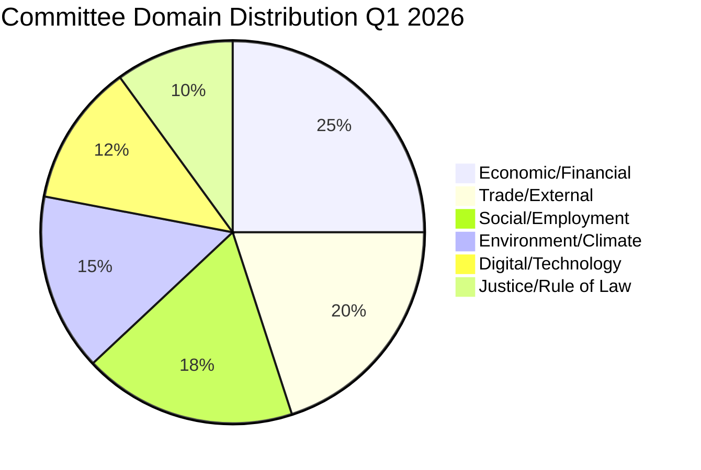

# 🏷️ Political Classification — Committee Reports (2026-04-16)

**articleType:** committee-reports
**analysisDate:** 2026-04-16
**confidence:** HIGH

## Classification Matrix

| Document | Domain | Sensitivity | Urgency | Impact |
|----------|--------|-------------|---------|--------|
| EU Talent Pool | Migration/Employment | MEDIUM | HIGH | HIGH |
| Copyright & Gen AI | Digital/IP | MEDIUM | MEDIUM | HIGH |
| Housing Crisis | Social Policy | LOW | HIGH | HIGH |
| Emission Credits | Environment/Transport | MEDIUM | HIGH | MEDIUM |
| EU-Mercosur Safeguard | Trade | HIGH | HIGH | HIGH |
| SRMR3 Banking | Economic/Financial | HIGH | CRITICAL | HIGH |
| Anti-Corruption | Justice/Rule of Law | MEDIUM | HIGH | HIGH |
| US Tariff Countermeasures | Trade/External | HIGH | CRITICAL | HIGH |

## Domain Distribution

## Political Sensitivity Assessment

- **Most politically sensitive**: US tariff countermeasures — divided Parliament, ECR defection pattern
- **Most cross-cutting**: EU Talent Pool — bridges migration and employment policy silos
- **Highest lobbying intensity**: Copyright & AI — tech vs creative industries
- **Strongest subsidiarity resistance**: Housing Crisis — national competence arguments from ECR, PfE
