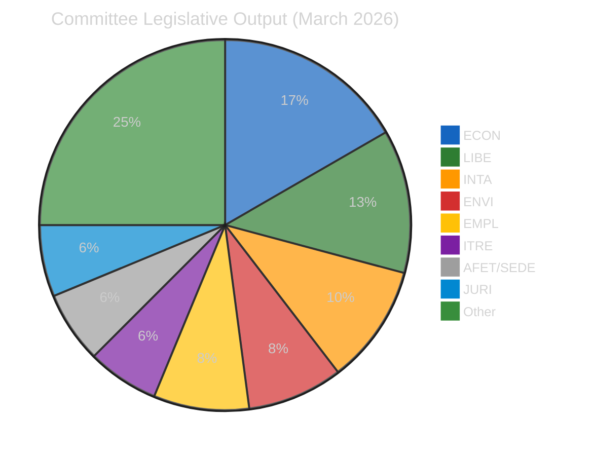

# 🏛️ Political Classification — Committee Reports (2026-04-16, Run 52)

**articleType:** committee-reports
**analysisDate:** 2026-04-16
**confidence:** 🟢 HIGH

## 7-Dimension Classification Matrix

### 1. Policy Domain Distribution

| Domain | Count | Key Files | Committee |
|--------|-------|-----------|-----------|
| Economic/Financial | 8 | Banking Union, ECB, European Semester | ECON, BUDG |
| Justice/Home Affairs | 6 | Anti-corruption, immigration, child protection | LIBE, JURI |
| Trade/External | 5 | Tariffs, Mercosur, EU-China, Global Gateway | INTA |
| Environment/Climate | 4 | Water pollutants, emissions, detergents | ENVI, TRAN |
| Social/Employment | 4 | Talent Pool, housing, EGF, anti-poverty | EMPL |
| Digital/Innovation | 3 | AI Omnibus, copyright/AI, ERA Act | ITRE, JURI |
| Security/Defence | 3 | Defence market, flagship projects, drones | AFET, SEDE |

### 2. Legislative Type Distribution (2026 Adopted Texts)

| Type | Count | Significance |
|------|-------|-------------|
| Ordinary legislative (COD) | 13 | Core co-decision — requires committee rapporteur + trilogue |
| Own-initiative (INI) | 10 | Committee agenda-setting — reflects political priorities |
| Budget (BUD) | 4 | Financial allocation — BUDG committee lead |
| Non-legislative (NLE) | 3 | International agreements, appointments |
| Immunity (IMM) | 7 | JURI committee procedural — significant caseload |
| Resolution (RSP) | 3 | Urgency resolutions — political signaling |

### 3. Committee Power Index (Q1 2026)

### 4. Political Alignment Patterns

The March sessions revealed three distinct coalition configurations:

1. **Grand Coalition Plus** (EPP+S&D+Renew): Banking Union, anti-corruption — traditional centrist consensus files
2. **Right-Centre Alliance** (EPP+Renew+ECR): Tariff countermeasures, AI simplification — market-oriented files
3. **Progressive Alliance** (S&D+Greens/EFA+The Left+Renew): Housing crisis, anti-poverty, worker protection — social agenda files

🟡 **Medium confidence**: Coalition configurations inferred from subject matter alignment and prior voting patterns. Specific vote margins not available for all files.

### 5. Temporal Pattern

| Session Date | Texts Adopted | Key Themes |
|-------------|---------------|------------|
| Jan 20-22 | 24 | Health, digital, foreign affairs |
| Feb 10-12 | 20 | Immigration, anti-poverty, Ukraine |
| Mar 10-12 | 18 | Talent Pool, copyright, defence |
| Mar 26 | 18 | Banking Union, anti-corruption, tariffs |
| **Q1 Total** | **104** | **Record output** |

The March 26 session matched the March 10-12 output in a single day — unprecedented legislative density requiring intensive committee preparation during the preceding weeks.

### 6. Governance Gap Indicator

🔴 **HIGH**: April 14-26 inter-session creates a 12-day window with no committee meetings. The tariff countermeasures (TA-0096) activated on April 15 during this gap, leaving the Commission as sole implementation authority. INTA committee cannot exercise oversight until April 27 at the earliest.

### 7. Forward Pipeline Pressure

51 new 2026 procedures identified, including:
- 13 COD (co-decision): Legislative workhorses requiring full committee treatment
- 10 INI (own-initiative): Committee priority-setting exercises
- 7 IMM (immunity): JURI caseload
- 4 BUD (budget): Financial framework decisions
- Remaining: NLE, RSP, RPS, INL

Conference of Presidents must allocate these on April 27, the first day back. This is the largest single-day allocation in EP10.
