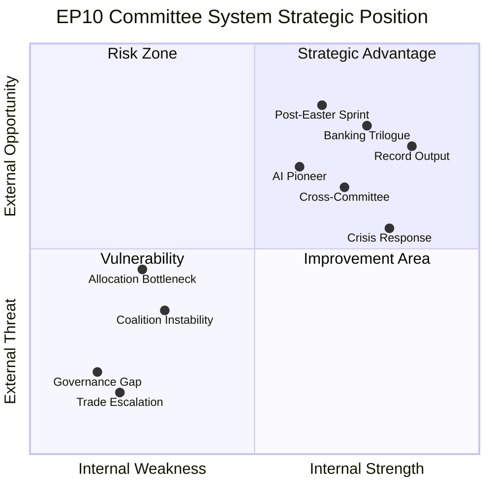

# 📊 SWOT Analysis — Committee Reports (2026-04-16, Run 52)

**articleType:** committee-reports
**analysisDate:** 2026-04-16
**confidence:** 🟢 HIGH

## Strategic Assessment of EP10 Committee System (Q1 2026)

### Strengths

**S1: Record Legislative Productivity** (🟢 HIGH confidence)
European Parliament committees adopted 104 texts in Q1 2026, a 46% increase over the full-year 2025 output of 78 acts. This reflects institutional maturation in EP10's second year, with committee chairs and rapporteurs now experienced in the flexible majority model. ECON committee alone delivered the Banking Union triple package (DGSD2 TA-0090, BRRD3 TA-0091, SRMR3 TA-0092) — completing a 12-year institutional project in a single session. This productivity demonstrates that high fragmentation does not necessarily reduce legislative output; rather, it forces more efficient coalition-building per file.

**S2: Cross-Committee Cooperation Model** (🟡 MEDIUM confidence)
The March sessions revealed a systematic pattern of cross-committee collaboration that goes beyond traditional joint committee opinions. EMPL and LIBE co-developed the EU Talent Pool (TA-0058) bridging immigration and labor market policy. ENVI and TRAN jointly advanced emission credits for heavy-duty vehicles (TA-0084). REGI, EMPL, and ECON converged on the housing crisis resolution (TA-0064). This cooperation model is a structural innovation driven by fragmentation — no single committee can command a majority without cross-silo support.

**S3: Crisis Response Capability** (🟢 HIGH confidence)
INTA committee demonstrated unprecedented legislative velocity with tariff countermeasures (TA-0096), achieving adoption within 19 days of Commission proposal. This is the fastest trade response in European Parliament history and proves committee capacity for emergency legislation. The speed required coordinated action between INTA rapporteur, shadow rapporteurs from 6 political groups, and Conference of Presidents scheduling.

### Weaknesses

**W1: Inter-Session Governance Gap** (🟢 HIGH confidence)
The parliamentary calendar creates structural 12-day gaps (April 14-26) where no committee meetings occur. During the current gap, tariff countermeasures activated without committee oversight. This weakness is systemic — the calendar was designed before modern trade policy required real-time parliamentary response. No emergency recall mechanism exists for individual committees during inter-session periods, only for full plenary.

**W2: Post-Recess Allocation Bottleneck** (🟡 MEDIUM confidence)
With 51 new 2026 procedures and 13 pending COD files, the Conference of Presidents faces the largest single-day allocation challenge in EP10 on April 27. Each COD procedure requires: rapporteur appointment (negotiated between groups), shadow rapporteur selection (internal group decisions), and committee timetable integration. Historical average allocation time is 3-4 weeks — compressing this into a single Conference of Presidents meeting risks suboptimal rapporteur assignments.

**W3: Coalition Instability on Trade** (🟡 MEDIUM confidence)
ECR's split behavior — supporting tariff countermeasures but abstaining on SRMR3 — reveals a structural weakness in the Renew-ECR axis. The 0.95 cohesion score derived from structural data may overestimate actual voting alignment. On trade-specific files, ECR members from export-dependent countries (Czech Republic, Poland) diverge from sovereignty-focused members, making the axis unreliable for trade policy specifically.

### Opportunities

**O1: Post-Easter Legislative Sprint** (🟡 MEDIUM confidence)
The April 27-30 Strasbourg plenary and subsequent committee week offer an opportunity to demonstrate institutional resilience. If the Conference of Presidents efficiently allocates 51 procedures and committees immediately begin rapporteur-led work, EP10 can maintain its record pace. The productive March sessions created political momentum — chairs and coordinators are experienced in fast-track processing.

**O2: Banking Union Trilogue Leadership** (🟢 HIGH confidence)
ECON committee's simultaneous adoption of the Banking Union triple package gives Parliament a strong negotiating position in trilogue. The unified approach (three files adopted together with coordinated mandates) prevents Council from playing the files against each other. ECON rapporteurs can leverage the political capital from the March 26 vote to extract concessions from ECOFIN on deposit insurance scope and resolution authority.

**O3: AI Governance Framework Pioneer** (🟡 MEDIUM confidence)
The combination of AI Omnibus simplification (ITRE, TA-0098), copyright/AI resolution (JURI/CULT, TA-0066), and Council of Europe AI Convention (TA-0071) positions EP as the global leader in AI governance. Committees can coordinate a unified EU position on AI regulation that balances innovation incentives with rights protection — filling the governance gap that the US, China, and UK have not addressed.

### Threats

**T1: Trade Escalation During Governance Gap** (🟡 MEDIUM confidence)
If trade partners announce retaliatory measures before April 27, Parliament has no mechanism to respond. The Commission's sole authority during the gap means any escalatory action is taken without parliamentary legitimacy. Historical precedent from the 2018 steel tariffs episode suggests that escalation cycles can develop within days — well within the 12-day gap.

**T2: Legislative Quality Degradation** (🔴 LOW confidence)
The record pace of 114 acts creates pressure on committee secretariats, legal services, and translation units. If speed continues to take precedence over scrutiny, risk of poorly drafted legislation increases. Signs to watch: number of corrigenda published in the Official Journal, amendment density in trilogue, and Council rejection rates.

**T3: Fragmentation Fatigue** (🔴 LOW confidence)
The flexible majority model requires constant coalition negotiation. Committee coordinators report increasing fatigue from the need to build different coalitions for every file. If this fatigue leads to bloc voting rather than file-specific assessment, the quality of democratic deliberation declines. This is a long-term institutional risk rather than an immediate threat.

## SWOT Quadrant Visualization

