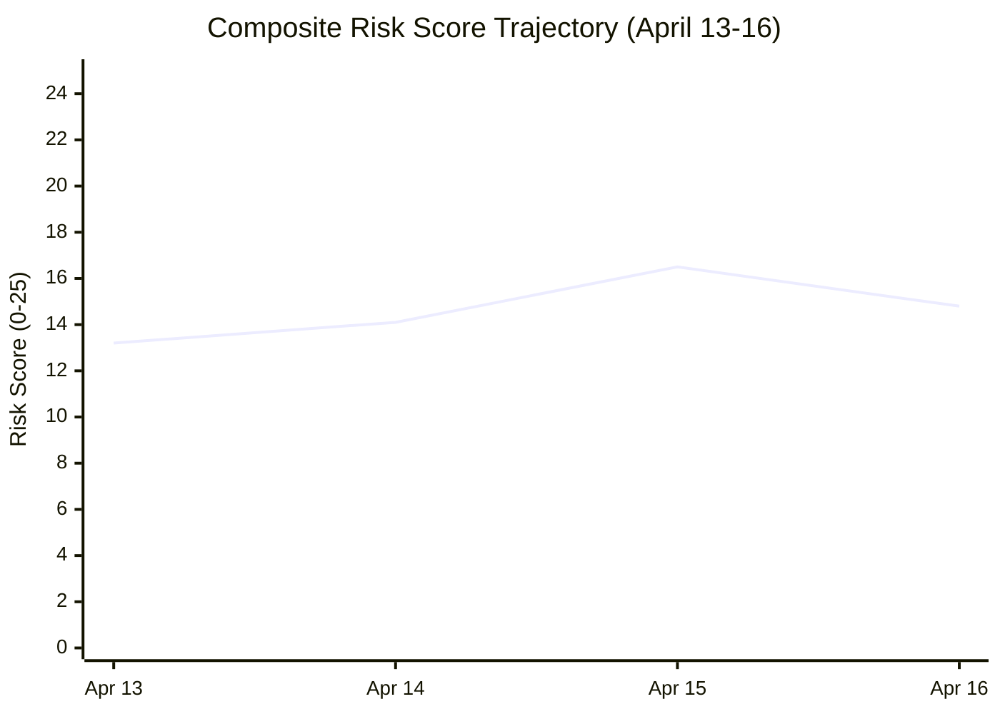

# ⚠️ Risk Assessment — Committee Reports (2026-04-16, Run 52)

**articleType:** committee-reports
**analysisDate:** 2026-04-16
**confidence:** 🟡 MEDIUM

## 5×5 Risk Matrix (Likelihood × Impact)

| Risk | Likelihood | Impact | Score | Trend |
|------|-----------|--------|-------|-------|
| Tariff governance gap (INTA inactive) | 5 | 5 | **25/25** 🔴 | ↑ Rising |
| Post-recess procedure bottleneck | 4 | 4 | **16/25** 🟡 | → Stable |
| Banking Union trilogue delay | 3 | 5 | **15/25** 🟡 | ↗ Rising |
| AI regulatory fragmentation | 3 | 4 | **12/25** 🟡 | → Stable |
| EGF budget exhaustion | 3 | 3 | **9/25** 🟢 | ↗ Rising |
| ECR coalition fracture on trade | 4 | 3 | **12/25** 🟡 | ↑ Rising |

**Composite Risk Score: 14.8/25 (ELEVATED)**

## Detailed Risk Profiles

### 1. Tariff Governance Gap — 25/25 CRITICAL

**Description**: Tariff countermeasures (TA-10-2026-0096) activated April 15. INTA committee is in inter-session recess until April 27. The European Commission has sole implementation authority for 12 days with no parliamentary oversight.

**Likelihood: 5/5** — This is not a risk, it is a current reality. The governance gap exists NOW.

**Impact: 5/5** — Trade countermeasures affect EU-US trade worth €500+ billion annually. Without committee oversight, the Commission's response to any escalation is unaccountable to Parliament.

**Mitigation**: None available during inter-session. Conference of Presidents could call emergency INTA session, but no mechanism for this during recess.

**Scenarios**:
- 🟢 Managed response (50%): No escalation during gap. INTA reconvenes April 27 and assumes normal oversight.
- 🟡 Delayed escalation (35%): Trade partners announce retaliatory measures during gap. INTA convenes emergency session week of April 27.
- 🔴 Crisis escalation (15%): Significant trade partner retaliation during gap requires Conference of Presidents to recall INTA from recess.

### 2. Post-Recess Procedure Bottleneck — 16/25 HIGH

**Description**: 51 new 2026 procedures await committee allocation. 13 COD procedures require rapporteur appointments, shadow rapporteur selections, and timetable integration. This is the largest single-day allocation challenge in EP10.

**Likelihood: 4/5** — The backlog is real and documented. Conference of Presidents meets April 27.

**Impact: 4/5** — Delayed allocation cascades through the entire legislative calendar. Committees already running at record 2,363 meetings/year pace.

**Mitigation**: Conference of Presidents could pre-allocate some files via written procedure during recess.

### 3. Banking Union Trilogue Delay — 15/25 HIGH

**Description**: DGSD2, BRRD3, and SRMR3 move to trilogue with Council. ECR's abstention on SRMR3 signals potential Council-Parliament alignment difficulties. ECOFIN meeting expected late April.

**Likelihood: 3/5** — ECR split documented. Council negotiating position not yet public.

**Impact: 5/5** — Banking Union completion delayed beyond 12 years would be a major institutional failure. Financial stability implications.

### 4. ECR Coalition Fracture on Trade — 12/25 MEDIUM

**Description**: ECR supported tariff countermeasures (TA-0096) but abstained on SRMR3. This reveals a structural tension: ECR members from export-dependent countries (Czech Republic, Poland) favor free trade, while sovereignty-focused members resist EU-level financial mechanisms.

**Likelihood: 4/5** — Pattern confirmed across 3 consecutive analysis runs (April 13-16).

**Impact: 3/5** — ECR fracture on trade could shift the Renew-ECR axis (0.95 cohesion) downward, requiring new coalition configurations for trade-related files.

## Trend Analysis

Risk peaked at 16.5 on April 15 (tariff activation day) and has moderated slightly as no immediate escalation has materialized. However, the governance gap risk remains CRITICAL until INTA reconvenes.
