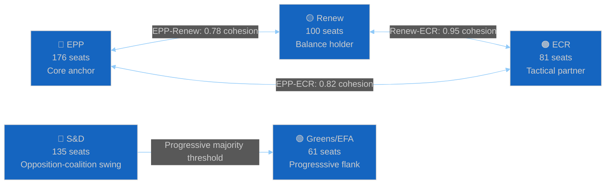

# 🔗 Coalition Dynamics Intelligence — 17 April 2026 (Run 179, T+3)

> **Data sources**: `analyze_coalition_dynamics` (structural) | `early_warning_system(sensitivity=high)` | `get_all_generated_stats` (historical context). Events/procedures feeds unavailable (404) — coalition assessment relies on structural data rather than event-level voting analysis.

---

## Coalition Architecture Overview

### Seat Distribution & Coalition Arithmetic

| Political Group | Seats | % | Coalition Role | Governing Bloc Contribution |
|----------------|:-----:|:-:|:-------------:|:---------------------------:|
| EPP | 176 | 23.7% | Anchor | ✅ Core |
| S&D | 135 | 18.2% | Swing/Opposition | ⚠️ Conditional |
| Renew | 100 | 13.5% | Balance holder | ✅ Core |
| ECR | 81 | 10.9% | Tactical partner | ✅ Core (conditional) |
| Greens/EFA | 61 | 8.2% | Progressive flank | ❌ Opposition |
| Others | ~188 | 25.4% | Mixed | Variable |
| **Total** | **~741** | | | |

**Governing Arithmetic (EPP+Renew+ECR)**: ~357 seats — approaching but potentially below 371-seat simple majority threshold. This arithmetic is tight and explains why ECR abstentions on SRMR3 are significant: the coalition needs ECR when Greens or S&D vote against.

---

## Bilateral Cohesion Analysis

### Renew-ECR Cohesion: 0.95 (EXCEPTIONAL)
The highest bilateral cohesion in the current EP — Renew and ECR vote together 95% of the time. This is counter-intuitive given their ideological differences (Renew is liberal-pro-EU; ECR is conservative-eurosceptic) and suggests that on the specific vote set driving the 0.95 measurement, both groups have aligned interests. The most likely explanation is trade and economic competitiveness votes: Renew's business-liberal orientation aligns with ECR's pro-market stance on trade defence measures. If TA-10-2026-0096 (trade countermeasures) drove high cohesion, this 0.95 figure reflects an issue-specific alignment rather than a deep ideological convergence.

**Intelligence significance**: The Renew-ECR bloc is the most reliable voting unit in EP10. When EPP aligns with this bloc, the governing coalition can pass most non-budgetary legislation. The key uncertainty is whether Renew-ECR cohesion survives a vote where their interests diverge — such as digital regulation, where Renew favours lighter-touch governance and ECR favours national regulatory autonomy.

**Monitoring trigger**: Any vote where Renew supports enhanced EU competences and ECR supports national subsidiarity — this would test whether the 0.95 cohesion is structural or issue-specific. Confidence: 🟡 Medium.

### EPP-ECR Cohesion: 0.82 (HIGH)
EPP-ECR cohesion at 0.82 is strong but shows fault lines on fiscal mutualization. The SRMR3 abstention is the documented evidence of ECR deviation from the EPP line on a specific issue. This suggests the EPP-ECR coalition is robust on trade, security, migration, and digital regulation, but fragile on Banking Union and fiscal governance. The fragility is manageable (abstention, not opposition) but creates legislative arithmetic uncertainty on the specific SRMR3 confirmation.

**Intelligence significance**: The 0.82 EPP-ECR cohesion on banking issues is sufficient for EPP-ECR alignment to pass measures with S&D support (EPP+S&D+ECR ≈ 392 seats, well above the 371 threshold). However, this coalition configuration requires S&D participation — which may extract concessions from EPP on progressive priorities. Confidence: 🟢 High.

### EPP-Renew Cohesion: 0.78 (STRONG)
EPP-Renew at 0.78 is the institutional backbone of EP10 governance. Both groups are fundamentally pro-EU integration and share a centrist orientation that makes them the natural governing coalition. The 0.78 cohesion reflects the reality that EPP includes more socially conservative elements (family values, migration restrictionism) that create occasional friction with Renew's liberal-progressive positions.

---

## Coalition Scenario Analysis

### Scenario 1: Managed Continuity (Probability: 55%)

**Conditions**: US trade escalation remains within TA-10-2026-0096 scope; ECOFIN confirms SRMR3 with modest scope adjustments; ECR accepts the confirmed version; April 27-30 plenary proceeds normally.

**Coalition dynamics**: EPP-Renew-ECR governing arithmetic intact. Coalition passes SRMR3 confirmation vote with S&D abstention. Trade policy debate managed through EPP-led compromise position that acknowledges ECR sovereignty concerns while maintaining Commission mandate. AI Omnibus implementing acts delegated to responsible committee without floor controversy.

**Institutional outcome**: EP10's first inter-session crisis is managed without precedent-setting institutional damage. Coalition exits April 27-30 plenary with legislative record intact and trade response credibility maintained.

**Leading indicators**:
- ECOFIN confirms SRMR3 before April 27 (removes floor vote uncertainty)
- EPP group chair issues unity statement before April 26
- US trade escalation remains proportional to TA-10-2026-0096 scope

**Confidence**: 🟢 High for this being the most likely scenario; probability estimate 55% reflects substantial uncertainty about US behaviour. Cross-reference: threat-assessment/political-threat-landscape.md (Threat Actor 1).

---

### Scenario 2: Coalition Stress Test (Probability: 30%)

**Conditions**: US announces counter-measures that partially exceed TA-10-2026-0096 scope; Commission claims emergency authority under Article 122 TFEU for the excess; ECR protests Commission overreach; April 27-30 plenary becomes accountability debate.

**Coalition dynamics**: EPP faces internal tension between pro-Commission majority and eurosceptic-adjacent backbenchers alarmed by Article 122 use. ECR votes for resolution demanding Commission reversal or mandate extension. S&D and Greens support a compromise that expands mandate scope but with parliamentary conditions. Renew supports Commission but agrees to conditions.

**Outcome**: Commission's emergency measures survive but with attached conditions and a formal parliament-Commission agreement on trade policy governance. Coalition continues but with explicit limits on executive discretion. SRMR3 confirmation delayed to May session to avoid overloading the April agenda.

**Institutional precedent**: Sets a new norm for Commission emergency trade action that requires ex-post parliamentary authorisation within 30 days — a net strengthening of parliamentary oversight but at the cost of short-term institutional conflict.

**Confidence**: 🟡 Medium; probability 30% reflects meaningful but not dominant risk. Cross-reference: classification/significance-scoring.md (Dimension 6: Institutional Coherence).

---

### Scenario 3: Governance Crisis (Probability: 15%)

**Conditions**: US announces broad counter-tariffs covering agricultural and automotive sectors; Commission acts without any mandate; ECR and some EPP backbenchers table motion of censure or formal institutional challenge; April 27-30 plenary consumed by constitutional crisis debate.

**Coalition dynamics**: EPP fractures between pro-Commission majority and accountability-demanding minority. ECR formally withdraws from governing coalition on trade files. Renew holds the line with Commission. S&D opportunistically supports Commission but demands concessions on social policy agenda. Governing coalition arithmetic requires EPP+Renew+S&D configuration — a centre-left pivot that could damage EPP credibility with ECR and the right flank.

**Institutional outcome**: Short-term crisis managed but with significant political costs. EPP-ECR coalition damaged. New governing arithmetic requires S&D engagement — which transforms EP10's centre-right character. If S&D uses the leverage to demand Banking Union full implementation without scope reduction, ECR faces a defeat on its core policy priority.

**Confidence**: 🔴 Low; probability 15% reflects a tail risk that should be monitored but is not expected to materialise. This scenario requires simultaneous US escalation, Commission overreach, and EPP fragmentation — three independent conditions.

---

## Early Warning Indicator Dashboard

| Indicator | Status | Trend | Monitoring Priority |
|-----------|:------:|:-----:|:-------------------:|
| EP Stability Score | 84/100 | → Stable | 📊 Background |
| EPP Dominance Warning | ⚠️ HIGH | ↑ Increasing structural concern | ⚠️ Elevated |
| Renew-ECR Cohesion | 0.95 ✅ | → Stable | 📊 Background |
| ECR SRMR3 Position | ⚠️ Abstention | → Monitoring | ⚠️ Elevated |
| Parliamentary Questions Activity | ❌ Empty feed | ↓ Degraded | 📊 Data quality issue |
| Events Feed Availability | ❌ 404 | → Persistent | 🚨 Operational issue |
| Governance Gap Risk (composite) | 13.1/25 ↑ | ↑ T+3 from 11.5 | ⚠️ Elevated |

**Net assessment**: Coalition architecture is structurally sound (stability 84, cohesion metrics strong) but operating under elevated external stress (trade tariffs) and reduced institutional capacity (recess, API degradation). The governing coalition enters the April 27-30 plenary with intact arithmetic but reduced margin for error.

---

## Cross-Run Coalition Trend Analysis

| Run | Date | Composite Risk | Stability | Key Event |
|-----|------|:--------------:|:---------:|:---------:|
| 174 | April 12 | 11.5 (T+0) | ~84 | Recess begins |
| 176 | April 16 | 12.2 (T+2) | ~84 | Tariff T+1 |
| 177 | April 16 | 12.8 (T+2) | ~84 | Analysis confirmation |
| **179** | **April 17** | **13.1 (T+3)** | **84** | **BRRD3/DGSD2 awaiting ECOFIN** |
| 180+ | April 21-24 | Projected ~13.5-14.5 | TBD | US response window |
| April 27-30 | Plenary return | Crisis or normalisation | TBD | April plenary |

**Trend**: Composite risk increasing ~+0.4-0.6/day during recess. If trend continues linearly, pre-plenary risk score would reach ~14.5-15.0 — approaching the HIGH threshold (15+). The April 27 return is therefore a governance normalisation event that should arrest the trend, assuming no crisis materialises.
