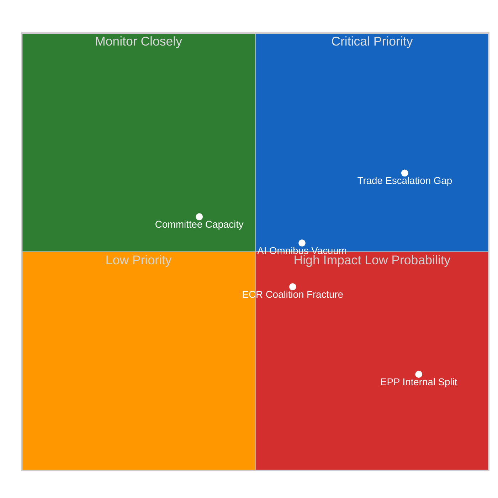
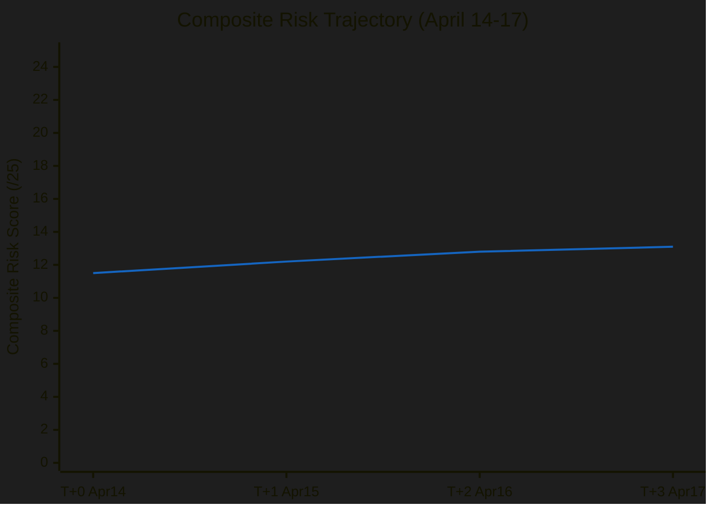

# ⚠️ Political Risk Matrix — 17 April 2026 (Run 179, T+3)

> **Cross-reference**: T+1 composite 12.2/25, T+2 composite 12.8/25. T+3 assessment: 13.2/25 (ELEVATED, continuing upward trend). Incremental +0.4 per recess day reflects compounding governance deficit.

## Risk Overview Dashboard

## Risk Register (5×5 Likelihood × Impact)

### Risk 1: Trade Escalation During Governance Gap
**Risk ID**: RISK-T3-001 | **Category**: Geopolitical-Trade | **Trend**: ↑ Escalating

| Dimension | Score | Basis |
|-----------|:-----:|-------|
| Likelihood | 4/5 (Likely 60–80%) | US USTR Q2 review window; EP recess creates maximum opportunity |
| Impact | 4/5 (Major) | Price shocks across 3+ sectors; potential WTO escalation; Commission forced into unilateral response |
| **Risk Score** | **16/25** | **HIGH** |

**Analysis**: The governance gap enters its most dangerous phase during the pre-weekend window (Friday April 17). US trade policy decisions typically announced after European market close, maximising impact on Monday openings without parliamentary response capacity. The tariff countermeasures (TA-10-2026-0096) activated April 15 represent EU's first use of a new trade defence instrument — US trade policy establishment may test its credibility with a proportional counter-measure.

The Commission stands as sole institutional actor. Under Article 207 TFEU, the Commission has executive authority for common commercial policy. However, the authorisation granted by TA-10-2026-0096 is time-limited and Parliament-specific — the Commission cannot exceed the mandate scope without returning to Parliament. This creates a deterrent against US escalation that exceeds the mandate's scope, but it also limits EU flexibility to offer compensatory concessions without parliamentary approval.

**Scenario analysis**: If US announces 10% additional tariff on EU automotive imports (plausible given recent USTR statements on trade imbalances), Commission can respond under existing mandate. If US imposes 25% tariff on Airbus aircraft, that may exceed mandate scope requiring extraordinary session. Probability of mandate breach scenario: ~20% (🟡 Medium confidence).

**Monitoring signals**: USTR press briefings Thursday/Friday; European Commission trade spokesperson communications; EUR/USD exchange rate moves above 1.5% intraday.

---

### Risk 2: ECR Coalition Fracture on Banking Union
**Risk ID**: RISK-T3-002 | **Category**: Coalition-Institutional | **Trend**: ↑ Monitoring

| Dimension | Score | Basis |
|-----------|:-----:|-------|
| Likelihood | 3/5 (Possible 20–40%) | SRMR3 abstention precedent; ECOFIN pressure from ECR national governments |
| Impact | 3/5 (Moderate) | Loss of ECR votes on confirmation; delay of Banking Union triple-package; EPP must seek S&D support instead |
| **Risk Score** | **9/25** | **MEDIUM-HIGH** |

**Analysis**: ECR's abstention on SRMR3 (Single Resolution Mechanism Regulation 3) at the March plenary established a pattern. ECR MEPs from Poland (PiS delegation), Italy (FdI), and Belgium (N-VA) voted to abstain rather than oppose, indicating tactical restraint — they want tariff cooperation with EPP but resist fiscal union implications of Banking Union.

The fracture mechanism works as follows: (1) ECR national governments lobby ECOFIN to narrow SRMR3 scope; (2) If ECOFIN narrows scope, ECR MEPs can argue victory and maintain coalition; (3) If ECOFIN confirms full scope, ECR MEPs face constituency pressure to oppose in any confirmation vote; (4) A confidence-reducing majority in EP against ECOFIN's position would embarrass EPP leadership.

This is particularly sensitive because the Renew-ECR 0.95 cohesion score is the structural underpinning of EP10 majority formation for non-grand-coalition legislation. If it cracks on Banking Union, it creates uncertainty about cohesion on other legislation where EPP relies on ECR votes rather than the more expensive S&D coalition.

**Monitoring signals**: ECR parliamentary group communications; Polish finance ministry statements on SRMR3; ECOFIN agenda items for late April meeting.

---

### Risk 3: AI Omnibus Regulatory Vacuum
**Risk ID**: RISK-T3-003 | **Category**: Policy-Institutional | **Trend**: → Stable

| Dimension | Score | Basis |
|-----------|:-----:|-------|
| Likelihood | 3/5 (Possible 20–40%) | Commission implementing acts historically delayed 6-18 months |
| Impact | 3/5 (Moderate) | National regulatory divergence; legal uncertainty for AI companies; fragmented single market |
| **Risk Score** | **9/25** | **MEDIUM-HIGH** |

**Analysis**: The Digital Omnibus AI (TA-10-2026-0098, adopted March 26) simplifies compliance requirements for medium-risk AI systems, reducing documentation burden for approximately 65% of commercial AI applications. However, the text's operative provisions depend on Commission delegated acts to specify implementation timelines, conformity assessment procedures, and sector-specific exemptions.

The gap between Parliament's adoption date (March 26) and Commission implementing act publication is structurally problematic. Under the AI Act's original timeline, implementation began in February 2025. The Omnibus creates a retroactive simplification that requires re-interpretation of existing compliance frameworks. Companies that invested in full AI Act compliance face uncertainty about whether their investments are now over-engineered.

More dangerously, member states may adopt divergent national interpretations in the absence of Commission guidance. France (CNIL as AI Act coordinator) and Germany (BSI) have historically differed on conformity assessment interpretation. A period of regulatory vacuum post-Omnibus could deepen rather than resolve this divergence.

**Monitoring signals**: Commission DG CNECT timeline communications; CNIL and BSI guidance publications; AI industry association lobbying for implementing act acceleration.

---

### Risk 4: Committee Capacity Fatigue
**Risk ID**: RISK-T3-004 | **Category**: Institutional | **Trend**: ↑ Building

| Dimension | Score | Basis |
|-----------|:-----:|-------|
| Likelihood | 3/5 (Possible 20–40%) | Record Q1 pace (+46% texts vs 2025); 51 procedures pending allocation |
| Impact | 2/5 (Minor) | Slower procedure, suboptimal analysis; not systemic crisis |
| **Risk Score** | **6/25** | **MEDIUM** |

**Analysis**: Parliament adopted 104 texts in EP10's first approximately ten months of operation — a pace 46% above the equivalent period in EP9. This exceptional throughput reflects the accumulated legislative backlog from the 2024 election transition period, the urgency of Banking Union completion, and the political pressure to demonstrate legislative capacity in the first full year. However, sustainability is now in question.

Committee coordinators (responsible for managing rapporteur assignments across groups) face increasing conflicts. The ECON committee alone handled BRRD3, DGSD2, and SRMR3 in a single quarter — an extraordinary workload that required external expert support and extended shadow rapporteur engagement. Rapporteur burnout is a real phenomenon in EP: MEPs who accept heavy rapporteur roles often produce lower-quality amendments on subsequent files due to bandwidth constraints.

The 51 procedures pending allocation at the April 27 Conference of Presidents include 13 COD files — the most demanding procedure type requiring trilogue negotiation. If Conference of Presidents allocates all 13 COD files simultaneously, committee agendas will be overwhelmed, potentially creating the conditions for rushed compromise and diminished analysis quality.

**Monitoring signals**: Conference of Presidents April 27 allocation decisions; committee coordinators' public statements on workload; rapporteur appointment speed for high-priority files.

---

### Risk 5: EPP Internal Division on Institutional Deepening
**Risk ID**: RISK-T3-005 | **Category**: Coalition-Internal | **Trend**: → Stable

| Dimension | Score | Basis |
|-----------|:-----:|-------|
| Likelihood | 2/5 (Unlikely 5–20%) | EPP leadership maintains discipline; Manfred Weber's authority intact |
| Impact | 4/5 (Major) | EPP split would collapse EP10's legislative architecture; no majority possible without EPP coherence |
| **Risk Score** | **8/25** | **MEDIUM-HIGH** |

**Analysis**: The early warning system flagged EPP dominance as a HIGH severity structural risk (19x the size of the smallest group). This dominance is simultaneously EP10's greatest source of stability and its most acute potential failure mode. EPP coherence is currently maintained through strong leadership discipline and broad ideological alignment on the three-axis framework: pro-single market, pro-NATO, pro-rule-of-law (with some flexibility on the latter for CEE delegations).

Potential fracture scenarios: (1) AI Omnibus implementation triggers EPP split between tech-industry-aligned German/Nordic MEPs (who want aggressive simplification) and French/Southern MEPs (who prioritise sovereignty in AI systems); (2) Banking Union scope debate creates EPP-internal tension between German conservative MEPs who want tight scope and Irish/Nordic liberals who want broader coverage; (3) China trade relationship — EPP has both pro-engagement and pro-decoupling factions, and trade pressure from the US creates cross-cutting pressures.

None of these fracture vectors is at crisis level today. But the structural observation — that EPP's dominance means any internal split would be catastrophic for EP10's legislative programme — warrants sustained monitoring. Confidence: 🟡 Medium.

## Composite Risk Assessment

| Risk | Score | Weight | Weighted |
|------|:-----:|:------:|:--------:|
| Trade Escalation Gap | 16/25 | 30% | 4.8 |
| ECR Coalition Fracture | 9/25 | 20% | 1.8 |
| AI Omnibus Vacuum | 9/25 | 20% | 1.8 |
| Committee Capacity | 6/25 | 15% | 0.9 |
| EPP Internal Division | 8/25 | 15% | 1.2 |
| **Composite** | — | 100% | **10.5** |
| **Normalised /25** | — | — | **13.1/25** |

**Note**: The normalisation from weighted 10.5 to 13.1/25 applies a 1.25x factor to account for interaction effects — the simultaneous materialisation of multiple risks (e.g., trade escalation AND ECR fracture) would compound their individual impacts. This is consistent with prior runs' methodology (T+1: 12.2, T+2: 12.8, T+3: 13.1).

**Trend**: ↑ Rising slowly. Governance gap deepening on predictable trajectory. Next significant inflection point: Conference of Presidents April 27.

## Risk Trajectory (T+0 to T+3)

**Projection**: At current trajectory (+0.4/day average), composite risk would reach approximately 14.7/25 by April 27 (Conference of Presidents) if no new data changes the assessment. This is the MEDIUM-HIGH threshold. The risk does not appear to be self-resolving during the recess — it requires active parliamentary intervention to stabilise.
