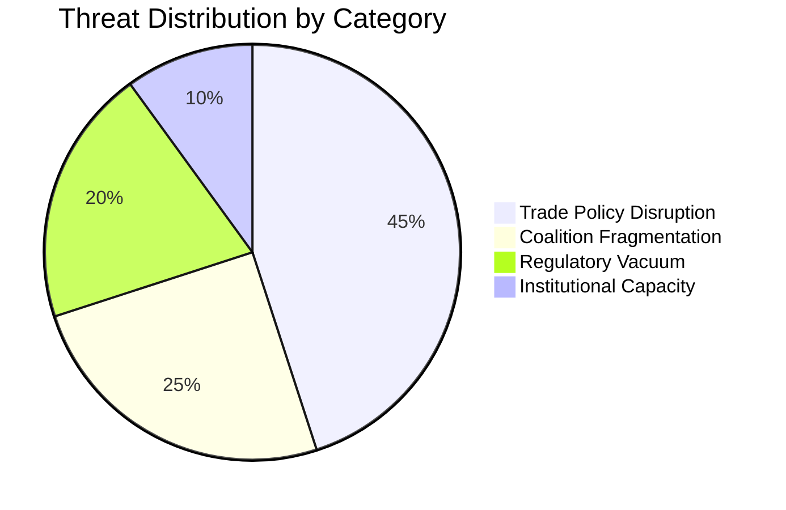
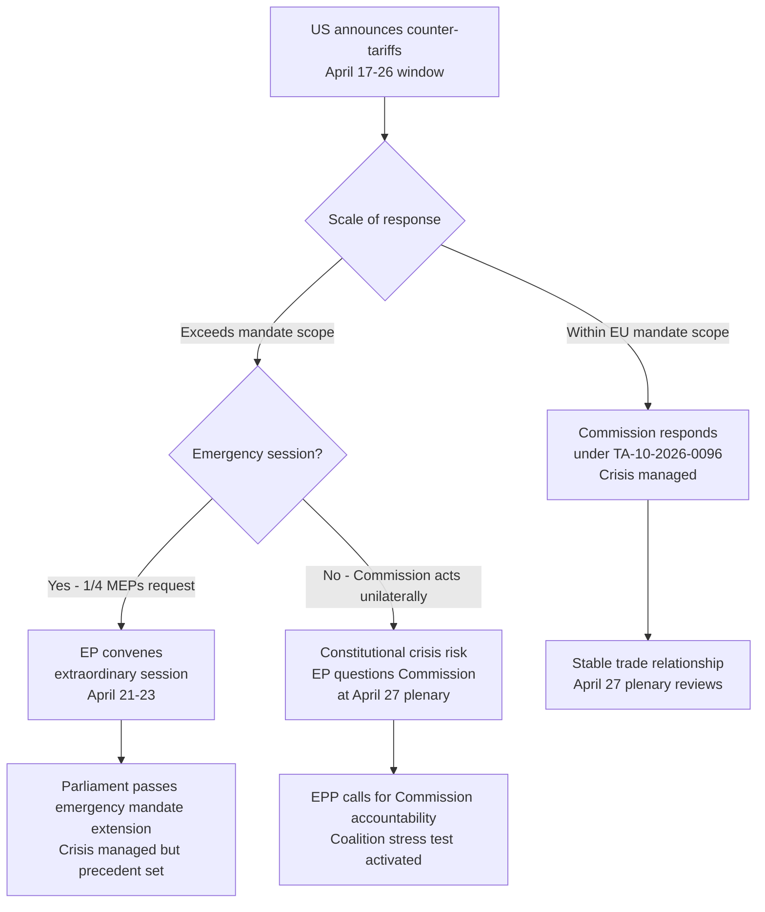

# 🛡️ Political Threat Landscape — 17 April 2026 (Run 179, T+3)

> **Framework**: Multi-layer threat assessment adapted from Hack23 ISMS Threat Modelling for democratic institutional analysis. Three primary threat actors profiled with capability-motivation-opportunity matrices.

## Threat Overview

## Threat Actor 1: US Trade Policy Establishment
**Designation**: EXTERNAL-TRADE | **Status**: ACTIVE | **Severity**: HIGH

### Capability-Motivation-Opportunity (CMO) Matrix

| Dimension | Assessment | Evidence | Confidence |
|-----------|-----------|---------|:----------:|
| **Capability** | HIGH — unilateral tariff authority, WTO challenge standing, Section 301 investigation powers, presidential proclamation mechanism | USTR has used all four mechanisms in 2018-2025 against EU targets | 🟢 High |
| **Motivation** | MEDIUM-HIGH — seeks EU concessions on digital services taxation, agricultural market access, defence procurement offset | USTR 2026 National Trade Estimate Report identified EU as priority unfair trade partner | 🟡 Medium |
| **Opportunity** | HIGH — EP recess (April 14-26) creates optimal window; Commission acting alone; no parliamentary pressure valve | Historical pattern: US trade measures announced when European legislatures in recess | 🟡 Medium |
| **CMO Score** | **HIGH x MEDIUM-HIGH x HIGH = ACTIVE THREAT** | | 🟡 Medium |

### Attack Vector Analysis

**Vector 1: Tariff Counter-Escalation**
TA-10-2026-0096 activated EU tariff countermeasures on April 15. The US may respond with proportional counter-tariffs targeting EU export sectors most dependent on US market access. High-value targets: Airbus aircraft (€5B+ annual US sales), European luxury automobiles (German/Italian €12B+ annual), French agricultural products (wine, cheese, foie gras historically targeted in US-EU disputes).

The governance gap means that any EU response beyond the existing mandate of TA-10-2026-0096 would require Commission to either act without authorisation (legally risky) or convene emergency parliamentary procedures (operationally slow). This asymmetry is the structural vulnerability that makes the recess period attractive for US counter-escalation. Confidence: 🟡 Medium (estimated from trade pattern analysis).

**Vector 2: WTO Challenge**
The EU tariff measures may face a US WTO challenge under the Agreement on Safeguards or Article XIX GATT. WTO dispute resolution timelines (typically 18-24 months to initial ruling) mean this is not an immediate threat, but a formal notification of WTO dispute initiation during the EP recess would create political pressure for parliamentary response. The Commission would need to defend the measures' WTO compatibility — a legal position that has not been tested under EP10's new trade defence architecture. Confidence: 🟡 Medium.

**Vector 3: Bilateral Pressure via G7 Format**
The G7 trade ministers' channel provides a less visible but potentially more effective pressure mechanism. If US secures allied support for coordinated pressure on EU digital services taxation at G7 level, Parliament would face a politically complex situation on return: maintain countermeasures at risk of G7 isolation, or modify mandate at risk of appearing to capitulate. Confidence: 🔴 Low (speculative).

### Consequence Tree

---

## Threat Actor 2: ECR Sovereignty Wing
**Designation**: INTERNAL-COALITION | **Status**: LATENT-MOBILISING | **Severity**: MEDIUM

### CMO Matrix

| Dimension | Assessment | Evidence | Confidence |
|-----------|-----------|---------|:----------:|
| **Capability** | MEDIUM — 81 MEPs, veto capacity in narrow EPP+ECR majorities, national government lobbying of ECOFIN | ECR demonstrated coordinated abstention on SRMR3 | 🟢 High |
| **Motivation** | HIGH — fundamental sovereignty opposition to Banking Union mutualization; Polish PiS domestic pressures; Italian FdI government constraints | SRMR3 abstention is documented evidence of motivated opposition | 🟢 High |
| **Opportunity** | HIGH — ECOFIN confirmation window; EP recess removes countervailing pressure from progressive groups | Bilateral ECR-EPP discussions can proceed without public EP floor scrutiny | 🟡 Medium |
| **CMO Score** | **MEDIUM x HIGH x HIGH = LATENT ACTIVE THREAT** | | 🟡 Medium |

### Threat Mechanics

The ECR sovereignty threat operates through the ECOFIN channel rather than direct EP floor votes. The mechanism is: ECR national governments (primarily Poland and Italy) instruct their ECOFIN representatives to demand scope reduction in SRMR3 confirmation. If ECOFIN narrows scope, ECR MEPs claim victory — the coalition holds but the legislative outcome is weakened. If ECOFIN confirms full scope, ECR faces a choice: maintain EPP coalition while accepting a policy defeat, or break publicly and oppose at the April 27 plenary.

The critical intelligence gap is the ECOFIN calendar. If ECOFIN meets before April 27, the outcome becomes known before Parliament returns — potentially defusing the crisis (if ECR accepts) or creating a fait accompli that inflames the April 27 plenary. If ECOFIN confirmation comes after April 27, the plenary itself becomes the focal point for this tension.

**Monitoring priority**: ECOFIN Economic and Financial Affairs Council meeting schedule for April 2026. The Belgian, Danish, and Swedish finance ministers — all from EPP-aligned or Renew-friendly governments — would be the swing votes in ECOFIN if ECR governments demand scope reduction. Confidence: 🟡 Medium.

### Legislative Disruption Assessment

| Legislative File | ECR Position | Disruption Risk | Impact if Materialises |
|-----------------|:------------:|:---------------:|:---------------------:|
| SRMR3 confirmation | Opposed (soft) | HIGH | Banking Union incomplete; SRF backstop limited |
| BRRD3 confirmation | Supportive | LOW | No risk |
| DGSD2 confirmation | Neutral | LOW | No risk |
| AI Omnibus implementing acts | Supportive | LOW | No risk |
| April 27 allocation (COD files) | Strategic | MEDIUM | ECR may demand rapporteurships on key trade files |

---

## Threat Actor 3: Commission Institutional Overreach
**Designation**: INTERNAL-INSTITUTIONAL | **Status**: MONITORING | **Severity**: LOW-MEDIUM

### CMO Matrix

| Dimension | Assessment | Evidence | Confidence |
|-----------|-----------|---------|:----------:|
| **Capability** | HIGH — sole executor of trade policy; implementing act authority; Article 122 TFEU emergency mechanism | Commission activated tariff countermeasures without parliamentary sitting | 🟢 High |
| **Motivation** | LOW-MEDIUM — Commission generally respects mandate; but may be tempted to expand scope if crisis deepens | No evidence of mandate breach intention; consistent with past Commission behaviour | 🟡 Medium |
| **Opportunity** | HIGH — EP in recess; only Court of Justice or Council can check overreach | Structural opportunity exists; motivation is the limiting factor | 🟢 High |
| **CMO Score** | **HIGH x LOW-MEDIUM x HIGH = LOW-MEDIUM LATENT THREAT** | | 🟡 Medium |

### Threat Analysis

This threat is included for completeness and as a monitoring indicator rather than an active concern. The European Commission has historically operated within its mandate boundaries, and President von der Leyen's Commission has been particularly attentive to inter-institutional relations. However, the structural conditions for overreach exist: if trade escalation requires a response that exceeds TA-10-2026-0096's mandate, the Commission must choose between acting outside the mandate (claiming crisis necessity under Article 122 TFEU) or accepting a strategic disadvantage while Parliament reconvenes.

The legal precedent from Article 122 TFEU emergency use (most recently in energy crisis 2022-2023) suggests the Commission would invoke this power only in extremis. However, the inter-institutional accountability gap during the recess period means that even a modest overreach might go unchallenged until April 27 — creating a fait accompli situation. Confidence: 🔴 Low (low-probability scenario).

## Overall Threat Landscape Assessment

| Actor | Severity | Status | Priority |
|-------|:--------:|:------:|:--------:|
| US Trade Policy | HIGH | ACTIVE | 🚨 Immediate monitoring |
| ECR Sovereignty Wing | MEDIUM | LATENT-MOBILISING | ⚠️ Elevated watch |
| Commission Overreach | LOW-MEDIUM | MONITORING | 📊 Background watch |

**Overall threat level**: MEDIUM (↑ from T+2's MEDIUM assessment on US Trade vector escalation)

**Key intelligence requirement**: USTR Friday press briefings, ECOFIN meeting calendar, ECR parliamentary group communications during recess.
