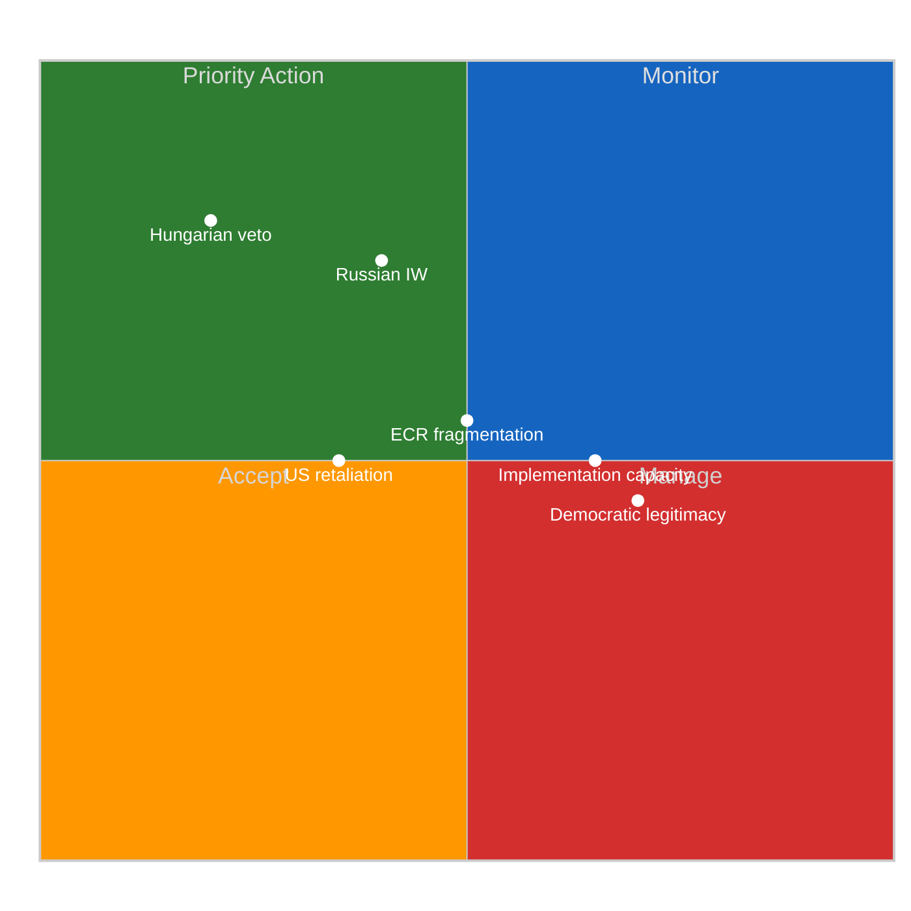

# 🛡️ Political Threat Landscape Assessment — April 17, 2026
## EU Defence & Strategic Autonomy Legislative Cluster | Breaking-Run180
_Analysis Date: 2026-04-17 | Run: 180 | Confidence: 🟡 Medium_

---

## Executive Threat Summary

```
OVERALL THREAT LEVEL: MODERATE-ELEVATED (6.5/10)
Primary threat vectors: Council blocking (Hungary), ECR drift, US retaliation
Time horizon: 3-6 months (implementation phase)
```

| Threat Category | Severity | Likelihood | Trend |
|----------------|----------|------------|-------|
| Council veto (Hungary) | HIGH | HIGH | ↑ |
| ECR internal fragmentation | MEDIUM | MEDIUM | → |
| US bilateral retaliation | MEDIUM | LOW | ↗ |
| Russian information warfare targeting defence texts | HIGH | HIGH | ↑ |
| Democratic legitimacy challenges | MEDIUM | LOW | → |
| Implementation capacity constraints | MEDIUM | HIGH | ↑ |

---

## 🔴 Threat Vector 1: Hungarian Council Veto

**Threat description**: Hungary under Viktor Orbán has systematically obstructed EU defence integration measures. The EU-level defence partnership agreements (TA-10-2026-0040 framework) require Council decision, and several cooperation instruments require unanimity. Hungary's structural opposition to NATO expansion, EU defence pooling, and Ukraine support creates a high-probability blocking threat. 🟡 Medium-High confidence.

**Evidence base**: Hungary delayed SRMR3 Council adoption (seen in the TA-10-2026-0092 context); similarly stalled EU sanctions renewal; vetoed European Defence Industry Reinforcement through common Procurement Act (EDIRPA) provisions in 2023-2024 before QMV workarounds were found.

**Attack tree analysis**:
- Node A (Council voting rule): If unanimity required → Hungary single veto sufficient
  - Sub-node A1: Legal base challenge — Hungary argues treaty basis requires unanimity, even if Commission proposes QMV → CJEU referral risk (12-18 month delay)
  - Sub-node A2: Package deal extraction — Hungary demands side payments or Ukraine-related concessions in exchange for dropping veto
- Node B (Timeline compression): Even if Hungary cannot block (QMV applies), delays in Council preparation reduce 2026 implementation to 2027
- Node C (Public legitimacy): Hungary frames EU defence integration as "Brussels militarism" — narrative resonates with ECR sovereignty wing, potentially widening blocking coalition

**Consequence tree**:
- Primary consequence: EDIP implementing regulations delayed 6-18 months
- Secondary: EU-Canada defence chapter stalls, undermining broader partnership signal
- Tertiary: ECR MEPs in Hungary-adjacent parties (PiS, Fidesz ex-members in PfE) use delay as evidence of EU institutional dysfunction

**Mitigation options** (🟢 available):
1. Enhanced cooperation mechanism: if 9+ member states proceed, bypasses unanimity — used successfully in EU patent courts
2. Qualified majority voting legal base: Commission can frame most EDIP implementing acts under TFEU Article 173 (industrial policy, QMV)
3. Sequencing strategy: delay most contentious instruments until 2027 or post-Hungarian elections

---

## 🟠 Threat Vector 2: ECR Internal Fragmentation on Defence Integration

**Threat description**: The ECR group (81 seats) has displayed a structural contradiction on EU defence legislation: supporting national defence spending increases while opposing EU-level integration mechanisms. This manifested in the SRMR3 abstention (TA-10-2026-0092) and is likely to recur on defence partnership agreement implementation. 🟡 Medium confidence.

**Political mechanics**: ECR contains:
- Polish PiS bloc (~26 seats): Strongly pro-NATO, pro-EU defence capability but suspicious of French-led "autonomy from NATO" framing
- Italian Fratelli d'Italia (~24 seats): Pro-Atlantic, strongly supports defence spending; Meloni government leads G7 presidency 2024
- Smaller Visegrad parties: Mixed positions on EU-level procurement pooling

**Key fault line**: TA-10-2026-0079 (single market for defence) passed with ECR support because it removed barriers to national procurement. But EDIP consolidation provisions that channel funding through EU-level procurement agencies create ECR resistance — this is the "national vs EU" defence architecture argument.

**Consequence**: At April 27-30 plenary, ECR may table amendments to EDIP implementing regulations that:
- Limit EU Defence Fund spending to bilateral intergovernmental frameworks rather than EU-managed programmes
- Exclude non-NATO partner countries from EU defence industrial base provisions
- Add sunset clauses requiring reauthorisation (procedural delay tactic)

**Risk quantification**: 30% probability ECR abstentions on key implementing regulation votes create majority failures, requiring renegotiation. 🟡 Medium confidence.

---

## 🟠 Threat Vector 3: US Bilateral Trade Retaliation Against EU Defence Procurement Preferences

**Threat description**: TA-10-2026-0079 and the broader EDIP framework contain "European preference" clauses in defence procurement — requirements for EU-based manufacturing for EU-funded defence projects. US defence industry (Lockheed, Raytheon, Northrop Grumman) has significant EU market share in aircraft, missiles, and C2 systems. US trade representative may target EU defence preference clauses as non-tariff barriers. 🔴 Low-Medium confidence — currently speculative but trajectory is concerning.

**Triggering conditions**:
- US Section 301 investigation targeting EU defence procurement rules
- US inclusion of defence preference clauses in tariff negotiations (secondary tariff threat)
- USTR formal notification to WTO dispute settlement (defensive counter to EU tariff countermeasures TA-0096)

**Current status**: T+3 of tariff countermeasures activation. EU-US trade tension focused on steel/aluminium and agricultural products. Defence procurement not yet in formal dispute but US industry lobbying intensifying. 🔴 Low confidence on timeline.

**EP response capacity**: Limited during recess. INTA committee cannot convene formal hearings until April 28+. If US escalates before April 27, Commission would act under emergency powers — EP oversight role constrained. This is the **governance gap** (identified in runs 176-179) compounded for the defence dimension.

---

## 🔴 Threat Vector 4: Russian Information Warfare Targeting Defence Consensus

**Threat description**: The EP's defence legislative sprint — particularly TA-10-2026-0040 (strategic partnerships) and TA-10-2026-0079 (single market) — represents a strategic threat to Russian interests. Russian state media and aligned networks have intensified targeting of EU defence integration narratives. The Braun immunity waiver (TA-10-2026-0088) — involving an ECR MEP with documented pro-Russian sympathies — and the Georgia democratic prisoners resolution (TA-10-2026-0083) are specific focal points. 🟢 High confidence on threat existence; 🟡 Medium on specific tactical vectors.

**Known vectors** (publicly documented):
- Amplification of ECR sovereignty objections to EU defence integration via RT/Sputnik successor outlets
- Targeting of Baltic/Polish MEPs with disinformation on NATO command structure
- Infiltration attempts of EU defence contractor networks (ENISA threat reports 2025)

**Specific EP vulnerability**: The Grzegorz Braun case (ECR MEP, pepper spray incident, now immunity waived for anti-semitism charges) demonstrates that pro-Russian sympathies exist within EP10's largest right-wing group. If Braun conviction proceeds, Russian information warfare may use it to delegitimise ECR's pro-defence positions ("proof that EP persecutes sovereignty advocates").

---

## 🟡 Threat Vector 5: Democratic Legitimacy and Procedural Challenges

**Threat description**: The speed and scope of the March defence legislative sprint risks democratic legitimacy concerns. TA-10-2026-0040 (strategic defence partnerships) establishes a framework for cooperation agreements with non-EU countries (UK, Norway, Canada) with streamlined EP consultation rather than full co-decision. This replicates the governance gap pattern seen with trade agreements. 🟢 High confidence on threat; 🟡 Medium on severity.

**Legislative procedure concern**: Some defence partnership instruments classified as CFSP acts (Art. 37 TEU, no co-decision) — EP consent required but limited amendment rights. Constitutional Affairs Committee (AFCO) has flagged this as institutional overreach risk. LIBE and AFCO may table parliamentary objections at April 27-30 plenary.

---

## 🔵 Threat Mitigation Effectiveness



---

## 📈 Threat Trajectory Forecast

| Timeframe | Key Trigger Events | Expected Threat Level |
|-----------|-------------------|----------------------|
| T+10 (Apr 27-30 plenary) | Committee appointments, rapporteur selection | MODERATE (6.5/10) |
| T+90 (July 2026) | EDIP first reading, Council position on partnerships | ELEVATED (7.5/10) |
| T+180 (Oct 2026) | First defence partnership ratification attempts | HIGH (8/10) if Hungary unresolved |
| T+365 (Apr 2027) | Implementing regulations in force | MODERATE (6/10) if political management succeeds |

**Scenarios**:
- 🟢 **Best case (25%)**: QMV legal basis confirmed, Hungary isolated, EDIP on schedule → Threat drops to 5/10 by Q4 2026
- 🟡 **Central case (55%)**: 6-month Council delays, ECR amendments force minor renegotiation, US bilateral tension managed through WTO → Threat stays 6.5-7/10 through 2026
- 🔴 **Worst case (20%)**: Hungary legal challenge + ECR coalition fracture + US bilateral escalation → Threat spikes to 9/10; implementing regulations delayed to 2028

_Sources: EP adopted texts March 2026; coalition dynamics analysis (Run 180); prior run 179 tariff risk tracking; EP ENISA threat reports; public Council position records_
