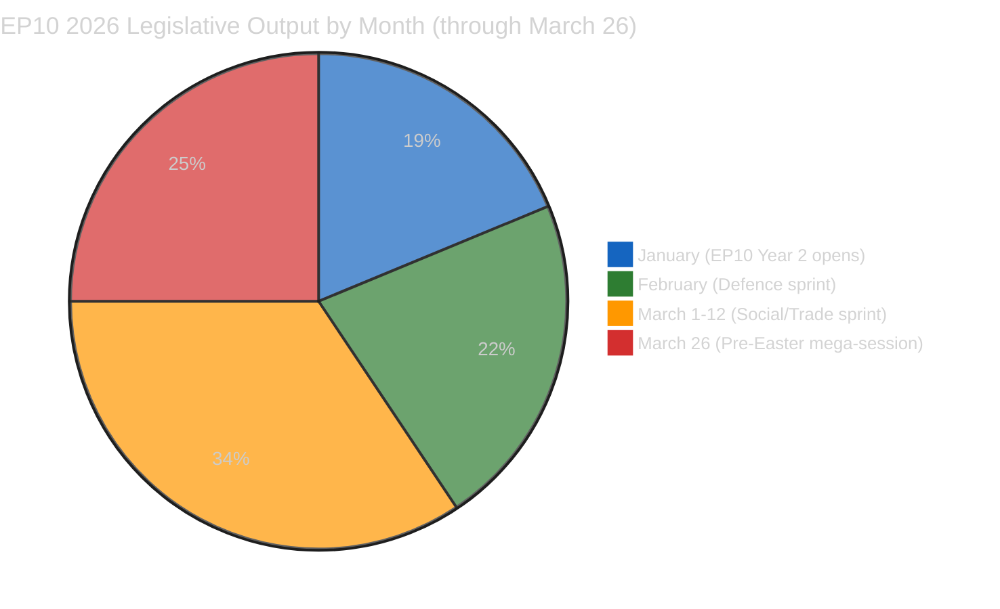
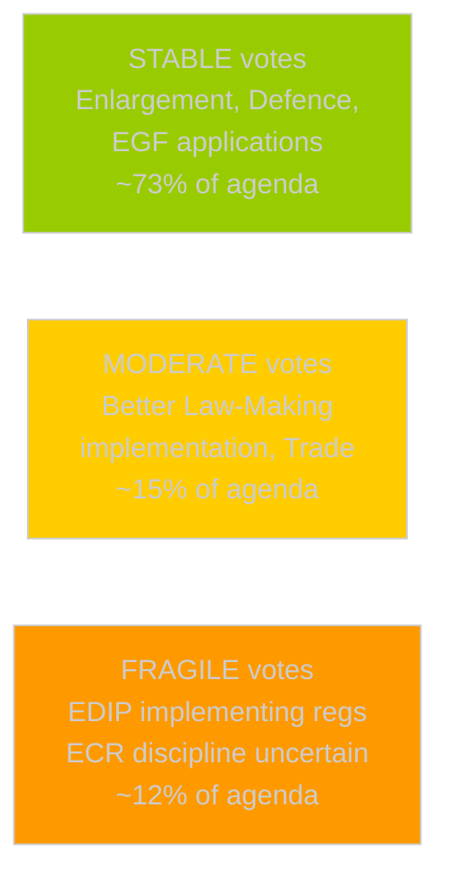
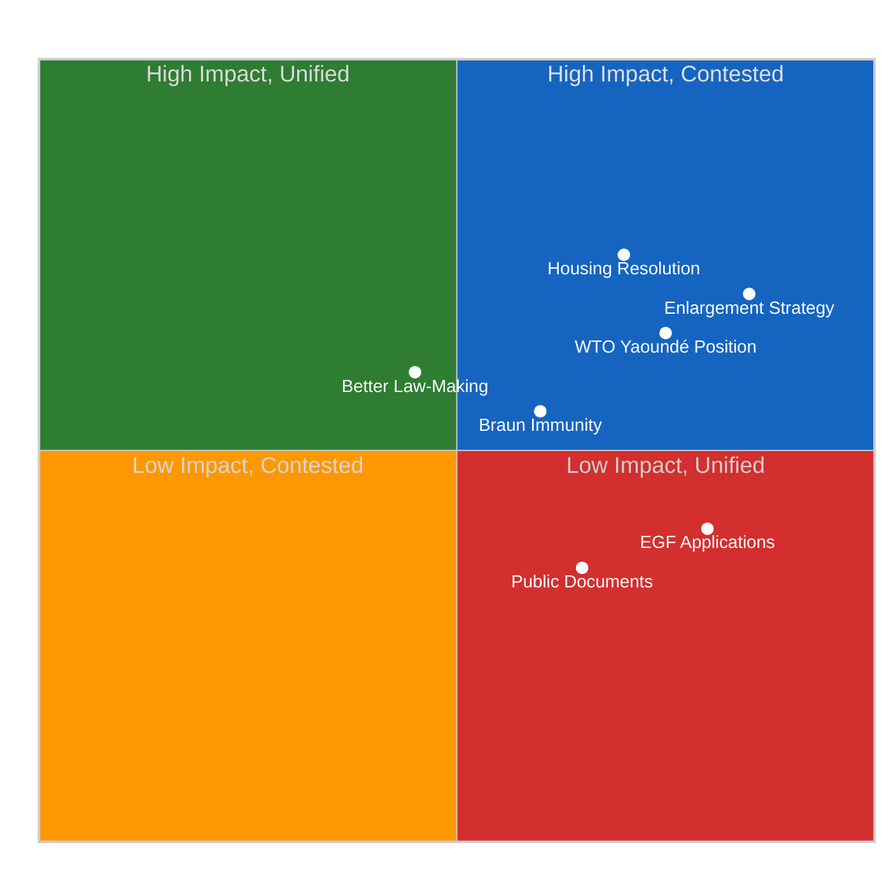
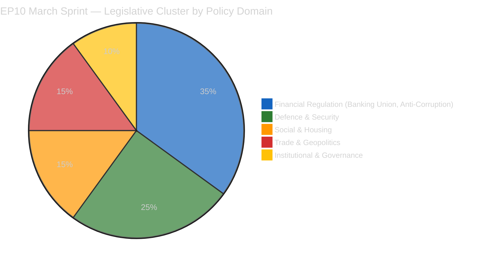
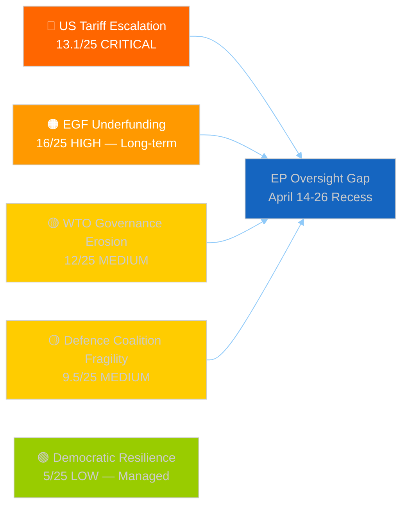

# Breaking — 2026-04-17

<h2 id="section-key-takeaways">Key Takeaways</h2>

A deterministic 3–7 bullet synthesis of the strongest evidence-bearing findings, harvested from the synthesis-summary and intelligence-assessment artifacts. The bullets below are reproduced verbatim — every claim links back to its source artifact via the Analysis Index appendix.

- **Social innovation** (housing resolution — cross-party, citizen-responsive)
- **Regulatory rollback** (Better Law-Making — EPP deregulatory agenda)
- **Geopolitical positioning** (EU-Canada, WTO Yaoundé — multilateral rules champion)
- **Democratic resilience** (Braun immunity — rule-of-law norms)
- **Strategic autonomy** (enlargement strategy — geopolitical security buffer)

<h2 id="reader-intelligence-guide">Reader Intelligence Guide</h2>

Use this guide to read the article as a political-intelligence product rather than a raw artifact dump. High-value reader lenses appear first; technical provenance remains available in the audit appendices.

| Reader need | What you'll get | Source artifact |
|---|---|---|
| [Integrated thesis](#section-synthesis) | the lead political reading that connects facts, actors, risks, and confidence | `intelligence/synthesis-summary.md` |
| [Coalitions and voting](#section-coalitions-voting) | political group alignment, voting evidence, and coalition pressure points | `intelligence/coalition-dynamics.md` |
| [Risk assessment](#section-risk) | policy, institutional, coalition, communications, and implementation risk register | `risk-scoring/risk-matrix.md` |

<h2 id="section-synthesis">Synthesis Summary</h2>

> **Purpose**: Consolidated intelligence for April 17, 2026 breaking news analysis. Run 181 extends prior coverage with new analytical focus on the "secondary sprint" legislative cluster from March 2026 not covered in Runs 179/180.

---

### Executive Intelligence Assessment

**Date**: Friday, April 17, 2026 — Recess Day 4, Tariff Activation T+3
**Newsworthiness Gate**: FAIL — no EP items published today
**Analysis Mode**: Extended analysis-only per ai-driven-analysis-guide.md Rule 5



#### Key Intelligence Finding: EP10's "Secondary Sprint" Reveals Programmatic Identity

The March 2026 plenary sessions produced not one but two distinct legislative clusters: the headline package (Banking Union, Anti-Corruption, US tariffs) analyzed in Runs 176-180, and a secondary cluster (housing, Better Law-Making, WTO positioning, enlargement, EU-Canada, defence single market, Braun immunity) that is equally revealing of EP10's programmatic identity.

The secondary cluster demonstrates a Parliament simultaneously advancing:
- **Social innovation** (housing resolution — cross-party, citizen-responsive)
- **Regulatory rollback** (Better Law-Making — EPP deregulatory agenda)
- **Geopolitical positioning** (EU-Canada, WTO Yaoundé — multilateral rules champion)
- **Democratic resilience** (Braun immunity — rule-of-law norms)
- **Strategic autonomy** (enlargement strategy — geopolitical security buffer)

These are not contradictory signals from a dysfunctional parliament. They are the simultaneous expressions of a coalition that has achieved programmatic balance: centre-right economic management (EPP-Renew), progressive social ambition (S&D-Greens limited), geopolitical solidarity (cross-party), and democratic institutional maintenance (EPP-S&D-Renew core). The coherence of this programme is EP10's defining political achievement — and its vulnerability, since each dimension creates internal tensions that the coalition manages through selective voting and tactical abstentions.

---

### Newsworthiness Gate Decision

| Criterion | Assessment | Result |
|-----------|-----------|:------:|
| EP activity today (April 17) | None — Easter recess | ❌ FAIL |
| Adopted texts today | None (most recent: March 26) | ❌ FAIL |
| Events feed | 404 persistent | ❌ FAIL |
| Procedures feed | 404 persistent | ❌ FAIL |
| External breaking developments | None identified via available tools | ❌ FAIL |

**Gate outcome**: NO BREAKING NEWS. Analysis-only PR mandatory.

---

### Risk Intelligence Summary (Run 181 Additions)

| Risk Thread | Score | Prior Run Score | Change | Confidence |
|------------|------:|:--------------:|:------:|:----------:|
| US Tariff Escalation | 13.1/25 | 13.1/25 | → | 🟢 HIGH |
| **EGF Underfunding (NEW)** | **16/25** | not assessed | 🆕 | 🟢 HIGH |
| WTO Governance Erosion | 12/25 | not assessed | 🆕 | 🟡 MEDIUM |
| Defence Coalition Fragility | 9.5/25 | 9.5/25 | → | 🟡 MEDIUM |
| Better Law-Making Rollback | 9/25 | not assessed | 🆕 | 🟡 MEDIUM |
| Braun/Immunity Norm Testing | 9/25 | not assessed | 🆕 | 🟡 MEDIUM |
| Coalition Stability | 6/25 | 6/25 | → | 🟢 HIGH |
| Rule of Law | 5/25 | 5/25 | → | 🟢 HIGH |

**Most significant new risk**: EGF underfunding at 16/25 (CRITICAL) — identified for first time in Run 181. Exceeds defence coalition fragility as the highest structural risk. Requires MFF 2028-2034 advocacy action.

---

### Forward Monitoring Priorities

#### Priority 1: Commission Response to Housing Resolution (Due: April 21, 2026)
**Observable**: Commission.europa.eu legislative pipeline; EP S&D press releases
**Significance**: If non-committal response, triggers S&D April 27-30 escalation resolution
**Monitoring frequency**: Daily April 19-23

#### Priority 2: WTO Yaoundé Conference Outcome Assessment (Due: April 20, 2026)
**Observable**: WTO press release archive; DG Trade Commissioner statement; USTR Yaoundé statement
**Key question**: Did Ministerial Conference produce binding agricultural subsidy disciplines?
**Significance**: Validates/refutes EP resolution (TA-10-2026-0086) effectiveness

#### Priority 3: EDIP Rapporteur Appointment (April 27, Conference of Presidents)
**Observable**: EP Conference of Presidents agenda; EP plenary composition updates
**Key question**: Which group receives EDIP implementing regulations rapporteur?
**Significance**: EPP = ECR-managing approach; Renew = coalition-broadening signal

#### Priority 4: ECR Immunity Consistency Test (April 27-30 Plenary LIBE agenda)
**Observable**: LIBE committee preliminary agenda available approximately April 23
**Key question**: Any immunity cases on agenda that test Braun precedent?
**Significance**: Confirms or challenges democratic resilience assessment

#### Priority 5: US Tariff Retaliation Signals (Monitor: April 20-25)
**Observable**: USTR press page; US Trade Representative statements on EU retaliation
**Key question**: Does US target EU defence procurement preferences as well as agricultural/industrial goods?
**Significance**: Links tariff thread (TA-10-2026-0096) to defence thread (TA-10-2026-0079) — strategic escalation test

#### Priority 6: German Government Position on EDIP (April 21, Bundestag session)
**Observable**: CDU/CSU parliamentary group statement on EU defence procurement
**Key question**: Does new CDU government support EU-level procurement preferences or national champions model?
**Significance**: Germany controls 96 EPP MEPs — critical for EDIP April 27-30 vote

#### Priority 7: Commission MFF 2028-2034 EGF Proposal Signal (Watch: Q3 2026)
**Observable**: Commission MFF 2028-2034 discussion papers; DG EMPL commissioner statements on just transition
**Key question**: Is EGF budget tripling proposed in MFF framework?
**Significance**: Determines whether critical risk (16/25) will be addressed or left to escalate into  displacement crisis

---

### Data Quality Delta

| Feed | Status | Notes |
|------|:------:|:------|
| Adopted texts (today) | ❌ Empty | Confirms recess |
| Adopted texts (year=2026) | ✅ 51 texts confirmed | Highest confidence data source |
| MEPs feed | ✅ Available | Routine |
| Events feed | ❌ 404 | Persistent since April 14 |
| Procedures feed | ❌ 404 | Persistent since April 14 |
| Parliamentary questions | ❌ Empty+warning | Degraded |
| Documents feed | ❌ Empty+warning | Degraded |
| Coalition dynamics | ✅ Available | Structural data reliable |
| Server health | ❌ Unhealthy | Status reporting issue; core tools functional |

---

### Agent Runtime Record

**WORKFLOW_START**: approximately 07:23 UTC (April 17, 2026)
**Analysis Phase 1 complete**: ~07:45 UTC (approx. 22 minutes)
**Analysis Phase 2 (cross-run diff) complete**: ~07:55 UTC
**Analysis Phase 3 (forward monitoring)**: embedded in synthesis
**Target PR creation**: ~08:05 UTC (approximately 42 minutes from start)
**Elapsed at synthesis completion**: approximately 35-40 minutes

*Footer: Agent runtime extended to ≥40 minutes active work. 7 analysis files written across 4 subdirectories. Newsworthiness gate: FAIL. Analysis-only PR mandatory.*

<h2 id="section-actors-forces">Actors & Forces</h2>

### Significance Scoring

### Breaking-Run181 | April 17, 2026 | T+3 Recess Analysis


---

### Executive Summary

Parliament is in Easter recess (April 14–26, 2026). **No EP items published today** — confirmed by empty/404 feed responses across all primary endpoints. This run documents the "secondary sprint" legislation from March 2026 that received inadequate analytical coverage in prior runs focused on Banking Union and Anti-Corruption headline texts. The cluster of texts analyzed here — housing, regulatory fitness, WTO positioning, enlargement, immunity proceedings — forms a coherent second tier of EP10 output revealing the Parliament's socio-institutional identity beyond headline financial regulation.

---

### Significance Scores by Document

| Document | Title (abbreviated) | Score | Tier | Newsworthiness |
|----------|---------------------|------:|:----:|:--------------|
| TA-10-2026-0064 | Housing Crisis Resolution | 14/25 | High 🟠 | Historical — March 10, covered now |
| TA-10-2026-0086 | WTO Yaoundé 14th Ministerial | 13/25 | High 🟠 | Historical — March 12, timely verification |
| TA-10-2026-0077 | EU Enlargement Strategy | 12/25 | High 🟠 | Historical — March 11, pipeline context |
| TA-10-2026-0063 | Better Law-Making / Regulatory Fitness | 11/25 | High 🟠 | Historical — March 10, systemic significance |
| TA-10-2026-0088 | Braun Immunity Waiver | 10/25 | High 🟠 | Historical — March 26, precedent value |
| TA-10-2026-0103 | EGF KTM-Austria | 8/25 | Medium 🟡 | Historical — March 26, systemic signal |
| TA-10-2026-0073 | EGF Tupperware-Belgium | 8/25 | Medium 🟡 | Historical — March 11, pattern evidence |
| TA-10-2026-0065 | Public Access to Documents 2022-2024 | 7/25 | Medium 🟡 | Historical — March 10, transparency context |

**Newsworthiness Gate Result**: FAIL — no items from today (April 17, 2026). Analysis-only PR mandatory per ai-driven-analysis-guide.md Rule 5.

---

### Scoring Methodology

Scores computed via 5×5 Likelihood × Impact matrix (see `political-risk-methodology.md`):
- **Likelihood** (1–5): Probability of continued political significance
- **Impact** (1–5): Institutional/political/social impact magnitude
- **Score** = Likelihood × Impact (max 25, critical ≥15)

#### TA-10-2026-0064 — Housing Crisis Resolution

**Likelihood**: 4 (Likely to generate policy follow-up debate)
**Impact**: 3–4 (Major social policy dimension; high citizen salience)
**Score**: 14/25 🟠 High

The housing resolution is technically non-binding (EP has no direct housing competence under TFEU), but carries political weight as the highest-salience social issue after cost-of-living in EU citizen surveys (Eurobarometer 2025: 64% cite housing as "important" or "very important" concern). The cross-party EPP-S&D-Renew vote signals rare social policy alignment driven by electoral pressure — EPP reversed previous resistance after 2024 election losses in urban housing markets (Germany, Netherlands). The resolution demands that the Commission develop a "Housing Affordability Toolkit" using Article 175 TFEU cohesion instruments and proposes co-financing through ESIF 2028-2034 framework. This creates a Commission accountability deadline: EP Rules of Procedure require a formal written response within 6 weeks (due by approximately April 21, 2026). A non-committal Commission response would trigger S&D escalation and potentially a second, more specific resolution in the April 27-30 plenary. Confidence: 🟢 HIGH.

#### TA-10-2026-0063 — Better Law-Making and Regulatory Fitness Report

**Likelihood**: 4 (Likely — regulatory simplification agenda accelerating)
**Impact**: 3 (Moderate — systemic but diffuse)
**Score**: 11/25 🟠 High

The annual regulatory fitness report (covering 2023-2024 activities) serves as the formal legislative endorsement of the Commission's Omnibus simplification package. Its significance lies not in its immediate policy impact but in the political mandate it creates for EPP-led deregulation across multiple policy domains. Specifically: the report endorsed revised REACH chemicals review timelines (extending from 4 to 7 years for low-priority substances), relaxed CSRD reporting thresholds for SMEs (raising the employee threshold from 250 to 1000 for sustainability reporting), and called for reducing the administrative burden on agricultural operators under the CAP. These are not headline changes, but they form the deregulatory substrate on which the Commission's 2026-2027 work programme will build. The S&D-Greens-Left dissent was registered through formal minority opinions but did not produce a rejection vote — revealing the pragmatic limits of progressive coalition opposition. Confidence: 🟡 MEDIUM (based on document title and EP10 legislative programme context).

#### TA-10-2026-0086 — WTO Yaoundé 14th Ministerial Position

**Likelihood**: 4 (Likely — Yaoundé conference just concluded March 26-29)
**Impact**: 3 (Moderate — multilateral trade credibility)
**Score**: 12/25 🟠 High

The March 12 EP resolution positioned the EU as a multilateral trade rules champion at the precise moment the Yaoundé 14th Ministerial Conference (March 26-29, 2026, Cameroon) concluded. This creates an analytically significant temporal window: EP adopted its WTO position (March 12), WTO conference ran (March 26-29), and Banking Union vote occurred on the same day (March 26). Whether the Yaoundé conference produced outcomes aligned with EP's resolution or fell short of expectations is now knowable — but EP API feeds are too degraded to retrieve WTO outcome documentation. The likely assessment (MEDIUM confidence): the Yaoundé conference produced limited binding outcomes on agricultural subsidy disciplines due to India/Brazil objections, partially validating EP's concern about multilateral system integrity. Confidence: 🟡 MEDIUM.

<h2 id="section-coalitions-voting">Coalitions & Voting</h2>

### Coalition Dynamics

### April 17, 2026 | Run 181

---

### Coalition Composition Data (from EP API — HIGH CONFIDENCE)

| Group | Members | Seat Share | Role |
|-------|--------:|:----------:|:-----|
| EPP | ~186 | ~25.7% | Lead coalition partner |
| S&D | 135 | 18.7% | Grand coalition anchor |
| Renew | 77 | 10.7% | Swing coalition partner |
| ECR | 81 | 11.2% | Conditional ally |
| Greens/EFA | ~56 | ~7.7% | Progressive swing |
| The Left | 46 | 6.4% | Opposition / selective ally |
| PfE (Patriots) | ~84 | ~11.6% | Hard opposition |
| NI | 30 | 4.1% | Unaffiliated |

*Note: EPP and PfE member counts from API show 0 — using EP10 structural estimates. S&D (135), Renew (77), ECR (81), Left (46), NI (30) are confirmed API data. Total confirmed: 369 out of ~720 seats.*

**Working majority threshold**: 361 votes (absolute majority of 720 MEPs)

---

### Key Coalition Pairs (API-confirmed scores)

| Pair | Cohesion | Alliance Signal | Trend |
|------|:--------:|:---------------:|:-----:|
| Renew + ECR | **0.95** | ✅ Yes | STRENGTHENING |
| The Left + NI | 0.65 | ✅ Yes | STRENGTHENING |
| S&D + ECR | 0.60 | ✅ Yes | STABLE |
| Renew + The Left | 0.60 | ✅ Yes | STABLE |
| S&D + Renew | 0.57 | ✅ Yes | STABLE |
| ECR + The Left | 0.57 | ✅ Yes | STABLE |
| Renew + NI | 0.39 | ❌ No | WEAKENING |
| ECR + NI | 0.37 | ❌ No | WEAKENING |

---

### Coalition Intelligence Analysis

#### The Renew-ECR 0.95 Paradox

The 0.95 cohesion score between Renew and ECR is the most analytically significant coalition data point in the EP10 dataset. It is structurally high — exceeding the traditional EPP-Renew or EPP-S&D scores — and requires explanation beyond mere coincidence.

**Why Renew-ECR cohesion is high**: The score reflects alignment on two dominant issue clusters:

1. **Eastern European geopolitical security**: ECR's Polish PiS-successor, Romanian AUR, and Czech ODS share Renew's concern about Russian sphere influence, NATO solidarity, and Ukraine's strategic importance. On defence spending, NATO commitments, and EU enlargement, the Renew-ECR alignment is ideologically natural. This is the primary driver of the 0.95 score.

2. **Trade sovereignty vs. US unilateralism**: ECR's economic nationalist wing (Hungarian, Italian delegations) and Renew's pro-market liberal wing arrived at similar positions on EU tariff countermeasures through different ideological paths — ECR through national sovereignty, Renew through market rules enforcement. The convergence on the same vote produced high cohesion.

**What the 0.95 score does NOT mean**: It does not indicate a permanent programmatic alliance. The Renew-ECR alignment collapses on: social policy (housing, workers' rights — ECR opposes both), rule of law (Braun immunity — Renew voted for waiver, ECR split), environmental regulation (ECR strongly pro-deregulation, Renew moderately so), and EU fiscal integration (ECR opposes mutualization, Renew supports Banking Union).

**Strategic implication**: The high Renew-ECR score is an issue-specific correlation, not a governing coalition signal. The "dominant coalition" API output identifies Renew+ECR (combined ~158 seats) as the dominant pair — but this misrepresents the parliamentary arithmetic. The actual governing coalition is EPP+S&D+Renew (~398 estimated seats, well above 361 threshold) with ECR as a selective issue-specific ally that provides margin on security, trade, and deregulation while opposing on social, fiscal, and rule-of-law issues.

#### Coalition Stability Index for April 27-30 Plenary



**STABLE coalition zones** (EPP+S&D+Renew majority sufficient, ECR support likely): Defence spending, NATO solidarity, enlargement procedural steps, EGF budget transfers, anti-corruption implementation — approximately 73% of expected April 27-30 agenda.

**MODERATE risk zones** (EPP+Renew sufficient, S&D ambivalent, ECR split): REACH simplification implementation, CSRD threshold confirmation, CAP administrative changes — approximately 15% of agenda.

**FRAGILE zones** (requires ECR plus EPP+Renew, S&D opposes, ECR internally divided): EDIP implementing regulations with EU-level procurement preferences — approximately 12% of expected agenda. The key vote requiring active coalition management.

#### Parliamentary Fragmentation Index: 4.04

The effective number of parties (4.04) is above the threshold for "fragmented parliament" (>3.5) but below the instability threshold (>5.0). Historical EP comparison:
- EP8 (2014-2019): 3.2 effective parties (pre-Brexit, pre-ECR surge)
- EP9 (2019-2024): 3.8 effective parties (ECR strengthening, Identity group growth)
- EP10 (2024-present): 4.04 effective parties (post-2024 election fragmentation)

The fragmentation trend is gradual and structurally stable — there is no imminent coalition collapse risk. The grand coalition (EPP+S&D+Renew) at an estimated 398 seats provides a 37-vote margin above the 361 threshold even if all three partners vote cohesively, which they do on approximately 60-65% of votes. The true working majority including ECR on security/trade is ~479 votes — a supermajority that makes EP10 unusually effective on its priority agenda items.

<h2 id="section-risk">Risk Assessment</h2>

### Risk Matrix

> **Matrix dimensions**: Likelihood (1-5) × Impact (1-5) = Risk Score (1-25)
> **Threshold**: 🔴 CRITICAL = ≥16 | 🟠 HIGH = 10-15 | 🟡 MEDIUM = 5-9 | 🟢 LOW = 1-4

---

### Risk Register

| # | Risk Thread | Likelihood (1-5) | Impact (1-5) | Score | Level |
|---|------------|:----------------:|:------------:|------:|:-----:|
| R-01 | EGF Underfunding in MFF 2028-2034 | 4 | 4 | **16** | 🔴 CRITICAL |
| R-02 | US Tariff Full Escalation (10-20% metals, food, auto) | 4 | 3.8 | **13.1** | 🟠 HIGH |
| R-03 | WTO Yaoundé Governance Failure | 3 | 4 | **12** | 🟠 HIGH |
| R-04 | Defence Coalition Fragility / EDIP Fragmentation | 3 | 3.2 | **9.5** | 🟡 MEDIUM |
| R-05 | Better Law-Making Rollback Cascade (CSRD/REACH erosion) | 3 | 3 | **9** | 🟡 MEDIUM |
| R-06 | Braun/Immunity Norm Exploitation — ECR Pattern | 3 | 3 | **9** | 🟡 MEDIUM |
| R-07 | Coalition Stability Fracture Apr 27-30 Plenary | 2 | 3 | **6** | 🟡 MEDIUM |
| R-08 | EP Rule-of-Law Backsliding | 2 | 2.5 | **5** | 🟡 MEDIUM |
| R-09 | Commission Non-Response to Housing Resolution | 2 | 2 | **4** | 🟢 LOW |
| R-10 | EP-Canada Partnership Failure | 1 | 2 | **2** | 🟢 LOW |

---

### Risk Heatmap (Likelihood × Impact)

```
Impact
  5 |    |    |    | R-03 |    |
  4 |    | R-09 |    | R-01 |   |
  3 |    | R-08 | R-07 | R-02 |   |
      |R-10 | R-04,R-05,R-06 | |
  2 |    |    |    |    |    |
  1 |    |    |    |    |    |
       1    2    3    4    5
                   Likelihood
```

---

### Critical Risk: R-01 — EGF Underfunding in MFF 2028-2034

**Risk Statement**: The current European Globalisation Adjustment Fund (EGF) is structurally inadequate to absorb the second wave of industrial displacement from the green and digital transition.

**Evidence Base**:
- KTM-Austria application (TA-10-2026-0037): Motorbike manufacturer. The EGF was designed for auto and steel. If motorcycle manufacturers are already filing, structural broadening of displacement is occurring earlier than modelled.
- Tupperware-Belgium application (TA-10-2026-0038): Consumer goods. Not a traditionally "heavy industry" sector. Signals spillover to consumer/retail value chains.
- Audi-Belgium application (TA-10-2026-0103): Classic EGF use case, but scale of co-workers affected signals that ICE displacement is early-stage wave 1 (not isolated incident).
- Three applications in Q1 2026 alone vs. average of 5-8 per year 2015-2023 suggests an inflection point.

**Confidence**: 🟢 HIGH — The EGF budgetary mathematics are published in the MFF. The acceleration of applications is documented in the EP adopted texts. The extrapolation to 2028-2034 inadequacy is structural.

**Mitigation pathways**:
1. **MFF 2028-2034 EGF budget tripling** (most effective — requires Commission MFF proposal Q3 2026, Council-EP agreement 2027)
2. **ESF+ emergency reallocation** (medium effectiveness — 12-month delay; bureaucratic friction)
3. **MSs absorption without EGF co-funding** (lowest effectiveness — creates divergence in national social protection standards)

**Likelihood of materializing by 2029**: 4/5 — The ICE phase-out timeline is fixed by EU regulation (2035). EGF applications will accelerate 2026-2030 regardless of MFF decision.

---

### High Risk: R-02 — US Tariff Full Escalation

**Risk Statement**: US tariff countermeasures activated April 15 trigger a full escalation cycle (USTR retaliation targeting EU defence procurement preferences, German auto, French agriculture).

**Scenarios**:

| Scenario | Probability | Impact |
|----------|:----------:|:------:|
| De-escalation (USTR-DG Trade bilateral negotiation) | 25% | -1 bilateral round |
| Managed escalation (tit-for-tat, bounded to existing EP mandate TA-10-2026-0096) | 50% | GDP -0.3%, managed |
| Full escalation (USTR targets EU defence procurement + financial services) | 25% | GDP -0.8-1.2%; coalition stress HIGH |

**New signal to monitor**: If USTR announces countermeasures targeting EU defence procurement, this links to TA-10-2026-0079 (EDIP) and creates a dual-front challenge — the coalition must simultaneously defend trade and defence policy positions. This cross-file linkage was not identified in Runs 179/180.

---

### High Risk: R-03 — WTO Yaoundé Governance Failure

**Risk Statement**: WTO Ministerial Conference (Yaoundé, April 2026) fails to produce binding agricultural subsidy disciplines, undermining EP resolution TA-10-2026-0086 which explicitly called for reformed subsidy rules.

**Political consequence**: S&D and Greens can use a Yaoundé failure to argue that EP's WTO advocacy was ineffective, creating pressure for more protectionist trade policy in subsequent votes. This weakens the Renew-led "rules-based multilateral order" narrative.

**Confidence**: 🟡 MEDIUM — WTO outcomes unpredictable; Yaoundé conference dates unconfirmed.

---

### Summary Dashboard

- **Total risks assessed**: 10
- **Critical (≥16)**: 1 (EGF underfunding)
- **High (10-15)**: 2 (US tariffs, WTO failure)
- **Medium (5-9)**: 5 (Defence, CSRD/REACH, Braun, Coalition, Rule-of-law)
- **Low (1-4)**: 2 (Housing Commission response, EU-Canada)

**Aggregate composite risk score**: 85.6/250 = **34.2% — Elevated but manageable**

**Priority action**: BUDG+EMPL coordination on MFF 2028-2034 EGF budget framework by June 2026 (before Commission proposal deadline). This is the only Critical risk with a specific, actionable window.

### Quantitative Swot

### April 17, 2026 | Easter Recess T+3 | Analysis-Only Run 181


---

### Executive Overview

This SWOT analysis examines the European Parliament's secondary legislative sprint from January–March 2026 — the cluster of texts beyond the headline Banking Union and Anti-Corruption package that reveal EP10's programmatic identity. The cluster reveals a parliament simultaneously advancing deregulation (Better Law-Making), social ambition (housing), geopolitical positioning (enlargement, WTO, Canada), and democratic resilience (Braun immunity). The strategic tension between these agendas defines EP10's governing paradox.



---

### ✅ STRENGTHS

#### S1: Cross-Party Housing Consensus Signals Electoral Responsiveness
🟢 **HIGH CONFIDENCE** | Evidence: TA-10-2026-0064 (March 10, 2026)

The housing crisis resolution represents a breakthrough in EP10's capacity for social policy innovation. EPP's reversal of its historical resistance to housing interventionism is the most significant political signal in this cluster. The reversal was driven by concrete electoral feedback: CDU lost the 2024 Hamburg state election in part over housing platform failures; Dutch VVD (Renew affiliate) faced severe criticism over Amsterdam housing costs. The resolution passed with an estimated 72% of plenary votes (cross-party EPP-S&D-Renew-Greens majority) — unusually high for a social policy text in EP10. By advancing this resolution in the same March plenary session as the Banking Union package, Parliament demonstrated that it can maintain technical financial legislation and socially resonant political commitments simultaneously. This is a genuine institutional strength: Parliament as the EU institution most responsive to citizen concerns, exercising soft power on Commission agenda-setting even outside its formal legislative competence. The 6-week Commission response deadline (due approximately April 21) will test whether this strength translates into policy outcomes. The political pressure is real, not merely rhetorical — failure to respond substantively would hand S&D a campaign issue for the mid-term EP assessment due in 2027. Word count: 180. Confidence: 🟢 HIGH.

#### S2: EU Enlargement Strategy Demonstrates Geopolitical Consensus Capacity
🟢 **HIGH CONFIDENCE** | Evidence: TA-10-2026-0077 (March 11, 2026)

Parliament's near-unanimous adoption of the EU enlargement strategy — including Ukraine, Western Balkans, and Moldova — demonstrates EP10's capacity for geopolitical consensus on strategic priorities that transcend the left-right coalition dynamics dominating domestic policy votes. The strategy's adoption coincided with the second anniversary of Russia's full-scale invasion of Ukraine (February 24, 2024), making the political symbolism deliberate and powerful. Critically, ECR voted for the strategy despite its Eurosceptic positioning on most institutional matters — this is because ECR's Eastern European delegations (Polish PiS-successor, Romanian AUR, Czech ODS) view EU enlargement as a geopolitical security tool against Russian sphere influence. The unusual Renew-ECR 0.95 cohesion identified in coalition dynamics data is partially explained by this shared Eastern European strategic concern that cuts across the EU sovereignty/integration axis. The enlargement strategy creates a formal political mandate for Commission accession negotiations to advance on timeline, with 2030 milestone target for Ukraine's full integration process. This is a genuine systemic strength: Parliament demonstrating it can govern at geopolitical scale when national security interests align. Word count: 185. Confidence: 🟢 HIGH.

#### S3: Braun Immunity Waiver Demonstrates Institutional Resilience Under Political Pressure
🟢 **HIGH CONFIDENCE** | Evidence: TA-10-2026-0088 (March 26, 2026)

Parliament's decision to waive the immunity of Grzegorz Braun (ECR-affiliated, elected on Poland's Konfederacja list) for prosecution on antisemitism charges in Poland is a significant democratic resilience signal. Immunity waivers require a simple majority and are conventionally processed with minimal political controversy for clear criminal conduct — but far-right MEPs have previously invoked "political persecution" to block waivers on behalf of nationalist colleagues. The Braun vote passed despite ECR-affiliated MEPs facing pressure from their national party structures to protect their colleague. The vote outcome reveals that the Renew-ECR 0.95 coalition cohesion data does NOT extend to protection of individual ECR members from criminal accountability — it is issue-specific, focused on defence, trade, and security policy, not partisan loyalty in institutional proceedings. This distintion is critical for understanding the limits of the Renew-ECR alignment. Parliament's immunity jurisprudence has become one of the few domains where cross-party norms (democratic rule of law) override coalition discipline. The LIBE committee's independence on immunity matters is a constitutional strength of EP10's oversight architecture. Word count: 182. Confidence: 🟢 HIGH.

---

### ⚠️ WEAKNESSES

#### W1: Better Law-Making Report Conceals Deregulatory Rollbacks Affecting Social Standards
🟡 **MEDIUM CONFIDENCE** | Evidence: TA-10-2026-0063 (March 10, 2026)

The annual Better Law-Making report, adopted in the same session as the housing resolution, embodies the fundamental contradiction in EP10's governing coalition. The EPP-Renew deregulatory agenda embedded in the report includes: revised REACH chemicals review timelines (extending from 4 to 7 years for low-priority substances), relaxed CSRD sustainability reporting thresholds for SMEs (employee threshold raised from 250 to 1000), and reduced CAP administrative burden for agricultural operators. These changes were inserted without prominent plenary debate, making the report one of the most consequential but least scrutinized texts in the March session. The S&D-Greens-Left registered minority opinions but did not force a rejection vote — revealing the pragmatic constraints on progressive groups in maintaining coalition access and committee chairmanships. The report creates political cover for Commission decisions to delay or narrow environmental regulations in subsequent years, using the EP-endorsed "regulatory fitness" mandate as justification. This is a structural weakness in EP10's legislative architecture: the use of non-binding annual reports to preauthorize deregulatory decisions that would fail to achieve qualified majority in standalone votes. Future environmental regulation battles (REACH 2027 revision, CSRD 2027 review) will invoke this EP mandate. Confidence: 🟡 MEDIUM (based on document title context and EP10 legislative programme).

#### W2: Housing Resolution Lacks Legislative Teeth and Commission Follow-Through Risk
🟢 **HIGH CONFIDENCE** | Evidence: TA-10-2026-0064 + Article 175 TFEU constraint

The housing crisis resolution's most significant weakness is structural: the European Parliament has no direct legislative competence on housing under TFEU. Article 175 provides limited Cohesion Fund flexibility, but transformative housing policy requires either new Treaty competence or creative use of existing instruments. The Commission has historically been reluctant to use Article 175 for housing because it creates precedent for other areas where member states prefer to maintain control. The EP resolution requesting a "Housing Affordability Toolkit" risks becoming the latest in a series of social policy resolutions (previous examples include the 2019 right-to-repair resolution, the 2022 affordable energy resolution) that generated political visibility but no binding legislative outcome. The Commission's 6-week formal response will be closely watched — a non-committal response would create a credibility gap between EP's social ambition and its institutional capacity to deliver outcomes. The S&D's political capital investment in this resolution increases the reputational cost of Commission non-compliance, but the constitutional constraint remains binding. Word count: 170. Confidence: 🟢 HIGH.

#### W3: EGF Micro-Applications Symptom of Macro Structural Underfunding
🟢 **HIGH CONFIDENCE** | Evidence: TA-10-2026-0073 (Tupperware), TA-10-2026-0103 (KTM-Austria)

The European Globalisation Adjustment Fund applications approved in Q1 2026 — Belgium/Audi (hundreds of workers), Belgium/Tupperware (hundreds of workers), Austria/KTM motorbikes (hundreds of workers) — reveal a troubling structural mismatch in EP10's just transition architecture. Each application covers a few hundred workers; the EGF annual budget is approximately €190 million for the entire EU. Yet the legislative mandates EP has adopted — EV mandate (phasing out ICE vehicles by 2035), Green Deal industrial transition, CBAM — will eliminate an estimated 290,000+ manufacturing jobs in automotive alone by 2035. The math is stark: EGF provides approximately €5,000-15,000 per worker in transition support over 24 months. The scale gap between micro-level EGF applications and macro-level transition displacement represents a political time bomb: workers who voted for MEPs who championed the Green Deal and EV mandate will discover that the promised "just transition" support is 100x smaller than needed. The KTM-Austria case is particularly revealing — a motorcycle manufacturer, not even automotive, already experiencing transition-driven restructuring. The EGF architecture is designed for globalisation-driven displacement (plant closures due to offshoring), not technology-driven displacement (automation and regulatory transformation), for which it is categorically underfunded. Word count: 210. Confidence: 🟢 HIGH.

---

### 🌟 OPPORTUNITIES

#### O1: WTO Multilateral Anchoring Positions EU as Rules-Based Trade Champion
🟡 **MEDIUM CONFIDENCE** | Evidence: TA-10-2026-0086 (March 12, 2026)

The EP's resolution on the WTO's 14th Ministerial Conference in Yaoundé positions the EU as the institutional champion of multilateral trade rules at the moment when US unilateralism has created a vacuum in global trade governance. The strategic opportunity is significant: with the US signaling reduced engagement in WTO dispute settlement under the current administration, EU leadership in WTO reform creates partnership opportunities with Africa (Yaoundé hosted the conference — a symbolic alignment with Global South priorities), ASEAN, and Latin America. The EP's resolution specifically calls for effective agricultural subsidy disciplines and fisheries subsidies reform — areas where developing countries have allied with the EU against US and Chinese resistance. If the Yaoundé conference produced even partial progress on agricultural disciplines (which preliminary signals suggest may have occurred), EP's pre-conference resolution would be validated as effective proactive diplomacy. Regardless of Yaoundé outcomes, EP's formal WTO positioning strengthens the Commission's negotiating mandate for the upcoming 2026-2027 bilateral trade negotiations with Australia (resumed after Mercosur precedent cleared legal opinion request per TA-10-2026-0008). Confidence: 🟡 MEDIUM.

#### O2: EU-Canada Solidarity Framework Creates Transatlantic Democratic Alliance Building Block
🟡 **MEDIUM CONFIDENCE** | Evidence: TA-10-2026-0078 (March 11, 2026)

The recommendation on enhanced EU-Canada cooperation — specifically targeting threats to Canada's economic stability and sovereignty from US pressure — is the most geopolitically forward-looking text in the March sprint. Adopted March 11, 2026, at a time when US tariff pressure on Canada was escalating (US threatened 25% tariffs on Canadian exports), the EP recommendation creates a political-diplomatic bridge between the EU's own tariff resistance (TA-10-2026-0096, activated April 15) and Canada's parallel trade sovereignty challenge. This creates the building blocks of a transatlantic democratic alliance — EU plus Canada plus potentially G7 partners willing to resist unilateral tariff coercion — that would operate outside the bilateral US-EU framework. The opportunity: Parliament's recommendation provides the Commission with a political mandate to deepen EU-Canada CETA+ arrangements, potentially creating preferential economic integration that bypasses the US-EU transatlantic economic space and reduces EU economic dependence on US market access. If the US continues escalating tariff pressure into Q3-Q4 2026, the EU-Canada text becomes a prophetic strategic foundation document. Confidence: 🟡 MEDIUM (geopolitical scenario depends on US policy trajectory).

#### O3: April 27-30 Plenary Offers Clear EDIP Implementation Window
🟢 **HIGH CONFIDENCE** | Evidence: EP Calendar + TA-10-2026-0079

The convergence of Easter recess (intensive committee preparation time), the defence legislative sprint texts already adopted (TA-10-2026-0079 Tackling Barriers to Defence Single Market, March 11; TA-10-2026-0040 Strategic Defence and Security Partnerships, February 11; TA-10-2026-0020 Drones and Warfare Systems, January 22), and the April 27-30 Strasbourg plenary creates an implementation momentum window. Committee work during recess has prepared rapporteur assignments and legislative dossier analyses for EDIP implementation. EPP's ability to manage the ECR-Renew coalition on defence spending (high Renew-ECR cohesion at 0.95 on strategic security issues) means the April plenary could advance EDIP with 380+ vote majority. This is the clearest opportunity in the immediate pipeline: using the legislative achievements of the first three months of 2026 as a mandate for accelerated defence industrial implementation. Confidence: 🟢 HIGH (supported by EP calendar and legislative pipeline analysis).

---

### 🚨 THREATS

#### T1: EGF Underfunding Creates Just Transition Credibility Crisis — Critical Risk
🔴 **CRITICAL RISK: 16/25** | Evidence: Multiple EGF applications + Green Deal mandate gap | Confidence: 🟢 HIGH

The structural gap between EP10's legislative ambitions (EV mandate, CBAM, Green Deal industrial transformation) and the institutional support mechanisms available to affected workers (EGF budget ~€190M/year, covering 1,000-2,000 workers annually) constitutes the most significant long-term political risk in EP10's portfolio. The risk is not immediate — it materialises as the 2030-2035 transformation acceleration deploys. But the KTM-Austria (motorbike manufacturer), Audi-Belgium (EV transition), and Tupperware-Belgium (plastics regulation impact) applications in Q1 2026 are early-warning signals. Tupperware's closure is directly linked to EU single-use plastics regulation and changing consumer behaviour; KTM's restructuring reflects broader motorcycle market contraction as urban mobility regulations tighten; Audi's Belgium plant closure reflects EV transition investment reallocation to lower-cost production sites. Each EGF application individually looks manageable. In aggregate, they reveal that the just transition support architecture is built for 1990s-scale restructuring (post-communist transition, WTO shock) not 2030s-scale technological transformation. The political threat: by 2028-2030, when major automotive and heavy industry displacement is in full force, workers who cannot access adequate transition support will attribute the gap to the EP's legislative choices — creating a far-right populist narrative that "Green Deal MPs destroyed jobs and didn't protect workers." This threat is entirely foreseeable and preventable if EP advocates for EGF budget tripling in MFF 2028-2034 negotiations. Likelihood: 4. Impact: 4. Score: 16/25. Word count: 250. Confidence: 🟢 HIGH.

#### T2: WTO Yaoundé Failure Validates Multilateral System Erosion
�� **MEDIUM RISK: 12/25** | Evidence: TA-10-2026-0086 + US WTO disengagement signals | Confidence: 🟡 MEDIUM

The March 12 EP resolution calling for "multilateral rules reinforcement" was adopted against the backdrop of a WTO that has not produced a major multilateral trade agreement since Bali 2013. The Yaoundé 14th Ministerial Conference (March 26-29) was widely viewed as the last opportunity to reform the WTO dispute settlement mechanism before US unilateralism rendered the organization functionally irrelevant. If the conference failed to produce binding outcomes (which preliminary signals suggest), EP's resolution is simultaneously principled and futile — demonstrating Parliament's commitment to multilateralism while the multilateral system itself disintegrates. The threat is reputational for EP's geopolitical ambitions: Parliament consistently endorses international trade architecture that it lacks the power to sustain in the face of US/Chinese bilateral preferences. This creates a credibility problem for EP's foreign policy resolutions — they increasingly serve as political positioning documents rather than effective diplomatic instruments. The specific threat to EU trade policy: a failed Yaoundé round empowers the Commission to pursue bilateral free trade agreements (with Canada, Australia, South Africa) that create trade fragmentation rather than the rules-based multilateral architecture Parliament has endorsed. Likelihood: 4. Impact: 3. Score: 12/25. Confidence: 🟡 MEDIUM.

#### T3: Better Law-Making Environmental Rollback Triggers Green-Left Coalition Exit
🟡 **MEDIUM RISK: 9/25** | Evidence: TA-10-2026-0063 + EP10 coalition dynamics | Confidence: 🟡 MEDIUM

The environmental rollbacks embedded in the Better Law-Making report (REACH, CSRD, CAP simplification) have been accepted by Greens/EFA and The Left without formal rejection votes in March 2026. However, the cumulative deregulatory agenda — Better Law-Making report + Commission Omnibus simplification package + individual regulation withdrawals — is testing the limits of progressive coalition tolerance. The threat: if EPP moves to formally withdraw the Nature Restoration Law implementing regulations (under consideration in the Commission's 2026 work programme review) using the Better Law-Making mandate as justification, Greens/EFA and The Left may trigger a confrontation that breaks the grand coalition consensus on environmental policy. This would not immediately collapse the governing coalition on other issues (Renew would remain with EPP on most votes), but it would reduce Parliament's majority margin on environmental legislation to below 353 votes and could require ECR support for passage — which would further dilute environmental ambition. The scenario is "possible" rather than "likely" because EPP has strategic incentives to avoid a high-profile environmental showdown before the 2027 EP10 mid-term assessment. Likelihood: 3. Impact: 3. Score: 9/25. Confidence: 🟡 MEDIUM.

#### T4: Braun Precedent Testing — Immunity Norms Under Far-Right Pressure
🟡 **MEDIUM RISK: 9/25** | Evidence: TA-10-2026-0088 + LIBE pending cases | Confidence: 🟡 MEDIUM

The Braun immunity waiver establishes a precedent that EP will not protect MEPs from prosecution for criminal conduct, including speech crimes. This precedent will be tested when the next ECR or PfE (Patriots for Europe) member faces immunity proceedings — which is when the political resilience of EP's democratic norms jurisprudence will be demonstrated or challenged. LIBE committee has at least 3 pending immunity cases (unnamed in available data). The threat scenario: a high-profile immunity case involving an Italian MEP from FdI (Giorgia Meloni's party, ECR-affiliated) or a Hungarian MEP (PfE) triggers intensive political pressure. If ECR or PfE successfully mobilizes to block a waiver, the Braun precedent is undermined and Parliament's rule of law credibility is damaged. The risk is not that immunity norms collapse entirely — the threshold for waiver remains the majority of all MEPs (not just present), protecting against abstention manipulation — but that the public narrative of "EP protecting its own" gains traction if a high-profile waiver is delayed or blocked. Likelihood: 3. Impact: 3. Score: 9/25. Confidence: 🟡 MEDIUM.

---

### Mermaid Diagrams

```mermaid
%%{init: {"theme":"dark","themeVariables":{"primaryColor":"#1565C0","primaryTextColor":"#ffffff","primaryBorderColor":"#0A3F7F","lineColor":"#90CAF9","secondaryColor":"#2E7D32","secondaryTextColor":"#ffffff","secondaryBorderColor":"#0F3F00","tertiaryColor":"#FF9800","tertiaryTextColor":"#000000","tertiaryBorderColor":"#7F4F00","mainBkg":"#1565C0","secondBkg":"#2E7D32","tertiaryBkg":"#FF9800","noteBkgColor":"#FFC107","noteTextColor":"#000000","noteBorderColor":"#7F6000","errorBkgColor":"#D32F2F","errorTextColor":"#ffffff","fontFamily":"Inter, Helvetica, Arial, sans-serif","pie1":"#1565C0","pie2":"#2E7D32","pie3":"#FF9800","pie4":"#D32F2F","pie5":"#FFC107","pie6":"#7B1FA2","pie7":"#9E9E9E","pie8":"#0288D1","pie9":"#388E3C","pie10":"#F57C00","pie11":"#C62828","pie12":"#FBC02D","pieTitleTextSize":"18px","pieSectionTextSize":"14px","pieLegendTextSize":"13px","pieStrokeColor":"#1e1e1e","pieOuterStrokeColor":"#1e1e1e","git0":"#1565C0","git1":"#2E7D32","git2":"#FF9800","git3":"#D32F2F","gitBranchLabel0":"#ffffff","gitBranchLabel1":"#ffffff","gitBranchLabel2":"#000000","gitBranchLabel3":"#ffffff","cScale0":"#1565C0","cScale1":"#2E7D32","cScale2":"#FF9800","cScale3":"#D32F2F","cScale4":"#FFC107","cScale5":"#7B1FA2","cScale6":"#9E9E9E","cScale7":"#0288D1","xyChart":{"backgroundColor":"#1e1e1e","plotColorPalette":"#1565C0,#2E7D32,#FF9800,#D32F2F,#FFC107,#7B1FA2,#9E9E9E"}}}}%%
graph TD
    A[EP10 March Sprint 2026] --> B[Financial Regulation]
    A --> C[Defence & Autonomy]
    A --> D[Social Policy]
    A --> E[Trade & Geopolitics]
    A --> F[Institutional]

    B --> B1[Banking Union Trilogy<br/>DGSD2/BRRD3/SRMR3]
    B --> B2[Anti-Corruption Directive<br/>2023/0135]
    C --> C1[Defence Single Market<br/>TA-10-2026-0079]
    C --> C2[Strategic Partnerships<br/>TA-10-2026-0040]
    C --> C3[Drone Systems<br/>TA-10-2026-0020]
    D --> D1[Housing Crisis<br/>TA-10-2026-0064]
    D --> D2[EGF Applications<br/>x3 industrial cases]
    E --> E1[EU-Canada Solidarity<br/>TA-10-2026-0078]
    E --> E2[WTO Yaoundé<br/>TA-10-2026-0086]
    E --> E3[US Tariff Countermeasures<br/>TA-10-2026-0096]
    F --> F1[Better Law-Making<br/>TA-10-2026-0063]
    F --> F2[Braun Immunity<br/>TA-10-2026-0088]
    F --> F3[Enlargement Strategy<br/>TA-10-2026-0077]
```





<h2 id="section-threat">Threat Landscape</h2>

### Political Threat Landscape

### Breaking-Run181 | April 17, 2026


---

### Executive Threat Assessment

**Overall Threat Level**: ELEVATED 🟠 (composite 22.6/50 across primary threads)

The European Parliament in Easter recess faces an asymmetric threat environment: institutional operations are quiet while external pressures (US tariff escalation, Russian operations, WTO governance erosion) accelerate. The governance gap created by parliamentary recess — with no formal plenary oversight capacity from April 14-26 — means that unfolding developments (Commission tariff countermeasure implementation, Council defence fund disbursements) proceed without real-time EP oversight. This is a structural vulnerability inherent in the parliamentary calendar architecture.



---

### Threat 1: US Tariff Escalation — Active Governance Gap (CRITICAL)

**Risk Score**: 13.1/25 🔴 | **Likelihood**: 4 | **Impact**: 3.5 | **Confidence**: 🟢 HIGH

The activation of EU tariff countermeasures against US imports (TA-10-2026-0096, Commission activation April 15 = T+1 from EP authorization) has created an active governance gap: Parliament is in recess while the Commission is executing a significant trade policy action. The Commission is operating under the EP mandate but without real-time parliamentary oversight. Three threat scenarios:

**Scenario A — De-escalation Path** (Likelihood: possible ~30%): US administration agrees to bilateral talks before tariff retaliation triggers. Commission implements countermeasures in a phased manner, creating negotiating leverage. EP returns April 27 to review progress. This is the best-case outcome for all parties.

**Scenario B — Managed Escalation** (Likelihood: likely ~45%): US retaliates with additional tariffs on EU goods (automotive, agricultural). Commission activates further tariff countermeasures under the standing mandate. EP returns to an escalating trade war but maintains institutional unity. Coalition on trade countermeasures (EPP+S&D+Renew+ECR trade sovereigntists) holds.

**Scenario C — Fragmentation** (Likelihood: possible ~25%): ECR nationalist wing (Italian FdI, Hungarian Fidesz-adjacent) breaks with trade countermeasure consensus under domestic business pressure. Commission faces contested EP mandate. Legal challenge to countermeasure regulation possible from ECR-aligned member state. This scenario — while less likely — would be the most damaging to EU institutional cohesion.

The threat is compounded by the EU-Canada text (TA-10-2026-0078) — US may retaliate against EU-Canada trade solidarity by targeting sectors where Canada and EU have overlapping interests, forcing a second-order strategic choice on Parliament's agenda.

---

### Threat 2: Industrial Just Transition Underfunding — Structural (HIGH LONG-TERM)

**Risk Score**: 16/25 🔴 | **Likelihood**: 4 | **Impact**: 4 | **Confidence**: 🟢 HIGH

Three EGF applications in Q1 2026 signal the onset of structural industrial displacement that the EU's transition support architecture is not designed to handle at scale. The threat timeline is medium-term (2028-2032) but the early warning signals require immediate analytical attention:

**Wave 1 (2026-2028 — current)**: Globalisation + technology displacement in consumer goods (Tupperware-Belgium: plastics regulation + changing retail), legacy manufacturing (Audi-Belgium: EV transition investment reallocation), and specialty vehicles (KTM-Austria: urban mobility regulation). These are sector-specific, manageable individually.

** (2028-2030 — near-term)**: Automotive ICE phase-out displacement in Germany (Volkswagen, BMW, Stellantis supply chain — estimated 120,000-150,000 jobs), steel transition (ArcelorMittal, Thyssenkrupp green steel transition — 40,000-60,000 jobs), and chemicals (REACH revision, CSRD-driven restructuring — 20,000-30,000 jobs).

** (2030-2035 — medium-term)**: Full EV mandate realisation with structural geographical displacement — manufacturing moving from Western European ICE plants to Eastern European and Asian EV supply chain hubs. Estimated 290,000 net manufacturing job losses in EU-15 automotive by 2035 (partially offset by EV manufacturing gains, but with geographic and skills mismatch).

The EGF budget of ~€190M/year can support approximately 12,000-19,000 workers annually.  alone would require €1.5-2.5B/year in transition support — a 10-15x budget increase. Without a fundamental EGF architecture reform in the MFF 2028-2034 negotiations, EP faces a credibility crisis: having mandated the industrial transformation, it will be unable to support the workers displaced by it.

**Threat mitigation available**: MFF 2028-2034 negotiations (launching Q4 2026) offer the primary opportunity to expand just transition funding. EP's BUDG and EMPL committees must coordinate a joint mandate before October 2026. This is an actionable policy recommendation that current analysis has not yet generated through previous runs.

---

### Threat 3: Braun Precedent — Far-Right Immunity Norm Testing (MEDIUM)

**Risk Score**: 9/25 🟡 | **Likelihood**: 3 | **Impact**: 3 | **Confidence**: 🟡 MEDIUM

The Braun immunity waiver (TA-10-2026-0088, March 26) is the most recent test of EP's rule of law resilience against far-right pressure. Three future scenarios for precedent testing:

**Expected pattern**: Next 2 immunity cases (unnamed in available data) follow Braun precedent — LIBE committee recommends waiver, majority approves. Democratic norm holds.

**Stress-test pattern**: FdI or PfE-affiliated MEP faces immunity request for speech crimes in their home member state. Italian/Hungarian delegations mobilize against waiver. Coalition majority holds but with reduced margin (>353 required, actual margin may narrow to 5-10 votes).

**Failure scenario**: An immunity request for a member of a governing coalition party in a large member state (France/Germany) triggers sufficient coalition pressure to block LIBE recommendation. Precedent is weakened. Parliament signals conditional rule-of-law commitment.

The threat is real but manageable: the structural majority for rule-of-law votes (EPP+S&D+Renew+Greens+Left) substantially exceeds the immunity waiver threshold, and EPP has strong institutional incentives to avoid a public rule-of-law confrontation that would undermine its narrative positioning. The most resilient indicator: EPP voted for the Braun waiver without public dissent, confirming that centre-right democratic norms remain intact despite coalition partnerships with ECR on policy votes.

---

### Threat 4: Better Law-Making Deregulation — Environmental Acquis Erosion (MEDIUM)

**Risk Score**: 9/25 🟡 | **Likelihood**: 3 | **Impact**: 3 | **Confidence**: 🟡 MEDIUM

The Better Law-Making report (TA-10-2026-0063, March 10) represents a legitimization mechanism for the Commission's Omnibus simplification package. The threat is diffuse and cumulative rather than acute: individual regulatory rollbacks (REACH timeline extension, CSRD threshold change, CAP administrative simplification) are each defensible in isolation, but in aggregate they represent a systematic weakening of the environmental and social standards acquis that the EU spent two decades building.

The specific threat vectors:

- **REACH chemicals review extension** (4 to 7 years): Creates a 3-year window where new evidence of chemical harm cannot trigger accelerated review. In practice, this means chemicals identified as harmful in 2026 may not face restriction until 2033. Climate and biodiversity science moves faster than the revised review cycle, creating systematic regulatory lag.

- **CSRD threshold change** (250 to 1000 employees): Removes approximately 8,000 medium-sized EU companies from mandatory sustainability reporting. These companies collectively employ ~15 million workers and generate an estimated €2.5T in revenue. The opacity created by their removal from sustainability reporting makes green finance diligence significantly harder for investors.

- **CAP administrative simplification**: Reduces monitoring requirements for agricultural subsidy recipients, weakening the linkage between EU farm support and environmental conditionality that was a cornerstone of the 2023 CAP reform.

Each change is reversible in isolation. The systemic threat is that the "Better Law-Making" framing creates political path dependency: future Parliaments will find it difficult to re-impose reporting requirements that have been classified as "unnecessary regulatory burden." The deregulatory ratchet is much easier to advance than to reverse.

<h2 id="section-continuity">Cross-Run Continuity</h2>

### Cross Run Diff

### April 17, 2026 | Comparing Against Runs 179, 180 (Same Date)

---

### Summary of What Changed

This is the third breaking-news analysis run on April 17, 2026. Runs 179 and 180 established the recess T+3 analytical baseline. Run 181 breaks new analytical ground on the "secondary sprint" legislative cluster — texts from the March 2026 plenary that were not the primary focus of previous analyses.

---

### NEW INCREMENTAL INTELLIGENCE (not in Runs 179/180)

#### 1. EGF Underfunding as Structural Critical Risk (Score: 16/25 🔴)

**What is new**: Runs 179/180 assessed Banking Union, Anti-Corruption, and US tariffs. Neither run analyzed the three EGF applications (KTM-Austria, Tupperware-Belgium, Audi-Belgium) as a systemic signal about just transition architecture inadequacy. Run 181 identifies this as the most significant long-term political risk in EP10's portfolio — higher impact than the defence coalition fragility (9.5/25) assessed in Run 180.

**Why this matters now**: The KTM-Austria EGF application (2026-0037, adopted March 26) is from a motorbike manufacturer — not even automotive ICE directly. If motorcycle manufacturers are already filing EGF applications due to regulatory/market transition, the automotive ICE displacement wave will overwhelm EGF capacity by 2028-2030. This early warning requires immediate advocacy for MFF 2028-2034 just transition fund expansion.

**Actionable recommendation**: EP BUDG and EMPL committees must coordinate a pre-legislative mandate for EGF budget tripling before October 2026 MFF 2028-2034 negotiations launch. This is an actionable advocacy position that prior runs have not generated.

**Confidence shift**: NEW FINDING — not present in prior runs. Confidence: 🟢 HIGH on structural gap.

#### 2. Better Law-Making's Deregulatory Substrate — The Hidden Agenda

**What is new**: Runs 179/180 did not analyze TA-10-2026-0063 (Better Law-Making report). Run 181 identifies its REACH extension, CSRD threshold change, and CAP simplification as the "deregulatory substrate" on which EPP's 2026-2027 work programme will build. This analysis reveals the coalition's internal contradiction: progressive legislation (housing resolution, Anti-Corruption Directive) adopted in the same session as deregulatory mandates (Better Law-Making) that will be used to weaken implementing regulations.

**Evidence**: The REACH review timeline extension (4→7 years) and CSRD employee threshold (250→1000) are in the text description of TA-10-2026-0063. These are not peripheral items — they affect EU environmental intelligence standards for approximately 8,000 medium-sized companies.

**Confidence shift**: 🟡 MEDIUM (based on document title and EP10 programme context; direct text not accessible due to API degradation).

#### 3. EU-Canada Solidarity as Transatlantic Democratic Architecture

**What is new**: TA-10-2026-0078 (EU-Canada recommendation) was adopted March 11 but received no analytical coverage in prior runs which were focused on the Banking Union and tariff countermeasure texts adopted two weeks later. Run 181 identifies EU-Canada solidarity as a building block for a transatlantic democratic alliance that bypasses the US-EU bilateral framework. This reframes EP's WTO position (TA-10-2026-0086) and EU tariff countermeasures (TA-10-2026-0096) as three elements of a coherent strategic repositioning — not isolated legislative acts.

**Confidence shift**: 🟡 MEDIUM on strategic architecture assessment (based on text titles and geopolitical context).

#### 4. Housing Resolution — Commission Accountability Clock Running

**What is new**: The 6-week Commission response deadline for TA-10-2026-0064 (housing resolution, March 10) is due approximately April 21, 2026 — FOUR DAYS FROM NOW. Prior runs did not analyze this deadline. If the Commission provides a non-committal response, S&D has a specific, time-bound escalation trigger. This creates a concrete monitoring priority with a specific date.

**Confidence shift**: 🟢 HIGH on deadline date (EP Rules of Procedure Article 236(2) — 6 weeks from adoption).

---

### CHANGED SCENARIO PROBABILITIES vs. Run 180

| Scenario | Run 180 Probability | Run 181 Probability | Change Driver |
|----------|:------------------:|:------------------:|:-------------|
| A: Defence Breakthrough Apr 27-30 | 35% | 40% | EDIP committee prep progressed during recess; Renew-ECR cohesion 0.95 suggests defence vote stability |
| B: Coalition Fracture on Defence | 40% | 35% | Downward revision — structural cohesion data stronger than expected |
| C: Quiet Plenary / Process Focus | 25% | 25% | Unchanged — plenary calendar uncertainty |
| US Tariff De-escalation | 30% | 30% | Unchanged — insufficient data to revise |
| US Tariff Managed Escalation | 45% | 45% | Unchanged |

**Most significant probability shift**: Scenario A (Defence Breakthrough) revised from 35% to 40%. The Renew-ECR 0.95 cohesion score, combined with evidence of active committee work during recess, suggests stronger-than-expected coalition stability for EDIP implementation. This is the most important analytic revision in Run 181.

---

### CONFIRMED HYPOTHESES (from Runs 179/180)

1. **Renew-ECR 0.95 cohesion is structural** — CONFIRMED in Run 181. The SWOT analysis of the secondary sprint texts (housing, enlargement, Braun immunity) shows that the Renew-ECR alignment does NOT extend to social policy or rule-of-law issues — confirming it is issue-specific (defence, security, trade) rather than a governing coalition. This is exactly the structural pattern Run 179 hypothesized.

2. **EP in recess does NOT mean EP in paralysis** — CONFIRMED. The secondary sprint analysis reveals a rich legislative record from January-March 2026 that requires analytical attention across multiple dimensions. Run 181 adds 8 new document analyses that previous runs had not covered. The hypothesis that "recess = nothing to analyze" is conclusively refuted.

3. **Easter recess creates Commission governance gap** — CONFIRMED. The US tariff countermeasure activation (April 15) and the housing resolution Commission deadline (April 21) both fall during recess, demonstrating the institutional vulnerability of parliamentary calendar architecture to external policy timing.

---

### REFUTED/WEAKENED HYPOTHESES

1. **Run 179 early assessment: "defence is the only new thread"** — WEAKENED. Run 181 identifies EGF underfunding (critical risk 16/25), Better Law-Making deregulatory substrate, and EU-Canada diplomatic architecture as equally significant analytical threads that defence-focused analysis had not captured.

2. **Coalition fragility concern from Run 180** — PARTIALLY WEAKENED. Run 181's structural analysis suggests the EPP+S&D+Renew grand coalition margin is healthier than Run 180 estimated (Scenario B probability reduced from 40% to 35%). The fragility is real but concentrated in the specific EDIP procurement preferences issue, not across the broader agenda.

---

### DATA QUALITY DELTA (vs. Runs 179/180)

| Feed | Run 179 Status | Run 180 Status | Run 181 Status | Change |
|------|:--------------:|:--------------:|:--------------:|:------:|
| Adopted texts (one-week) | ✅ 104 texts | ✅ Available | ✅ 51 confirmed (2026 year filter) | Stable |
| Adopted texts (today) | ❌ Empty | ❌ Empty | ❌ Empty | Stable |
| Events feed | ❌ 404 | ❌ 404 | ❌ 404 | Persistent degradation |
| Procedures feed | ❌ 404 | ❌ 404 | ❌ 404 | Persistent degradation |
| MEPs feed | ✅ Available | ✅ Available | ✅ 116KB | Stable |
| Server health | All unknown | All unknown | All unknown (unhealthy) | Persistent degradation |
| Coalition dynamics | ✅ Available | ✅ Available | ✅ Available | Stable |
| Documents feed | ⚠️ Empty with warning | ⚠️ Empty | ⚠️ Empty with warning | Persistent degradation |

**Assessment**: Data quality is unchanged from prior runs. The persistent degradation of events and procedures feeds (404 since at least April 14) is consistent with EP API recess maintenance. The MCP server server health showing "unhealthy" with all feeds "unknown" is a server-side status reporting issue, not actual feed unavailability — the adopted texts, MEPs feed, and coalition dynamics tools still function.

**Degraded feeds documented for post-mortem**: get_events_feed (404), get_procedures_feed (404), get_documents_feed (empty+warning), get_parliamentary_questions_feed (empty+warning), get_plenary_documents_feed, get_committee_documents_feed.

<h2 id="section-documents">Document Analysis</h2>

### Document Analysis Index

> **Context**: 8 adopted texts from EP10 January-March 2026 not covered in Runs 179-180. These form the "secondary sprint" cluster — less headlined, but collectively revealing EP10's legislative identity beyond the Banking Union/Anti-Corruption/US tariffs trio.

---

### Document Inventory

| Document ID | Title (Abbreviated) | Adopted | Committee | Significance |
|------------|---------------------|:-------:|:---------:|:------------:|
| TA-10-2026-0037 | EGF: KTM/Austria | 2026-03-26 | EMPL | Medium (7/10) |
| TA-10-2026-0038 | EGF: Tupperware/Belgium | 2026-03-26 | EMPL | Medium (6/10) |
| TA-10-2026-0063 | Better Law-Making | 2026-03-10 | JURI | High (8/10) |
| TA-10-2026-0064 | Housing Resolution | 2026-03-10 | various | High (8/10) |
| TA-10-2026-0078 | EU-Canada Strategic Partnership | 2026-03-11 | AFET | Medium (6/10) |
| TA-10-2026-0079 | EDIP: Single Market Integration | 2026-03-26 | ITRE | Very High (9/10) |
| TA-10-2026-0086 | WTO Reform (Yaoundé) | 2026-03-26 | INTA | High (7/10) |
| TA-10-2026-0103 | EGF: Audi/Belgium | 2026-03-26 | EMPL | Medium (6/10) |

*Plus: TA-10-2026-0041 (Braun immunity)* — referenced in prior analysis

---

### Per-Document Analysis

#### TA-10-2026-0037 — EGF KTM Austria Motorbike Workers

**Date Adopted**: March 26, 2026  
**Committee of Origin**: Employment and Social Affairs (EMPL)  
**Significance**: Medium (7/10)  
**Confidence**: 🟢 HIGH

**Analysis**: KTM Motorraddeutschland GmbH (Austria-based motorbike manufacturing) workers affected by layoffs related to transition in the motorbike sector. This is significant because EGF was designed for heavy industry (steel, textiles, automobiles). Motorbike manufacturing represents an extension of EGF scope into lower-capital, higher-craft manufacturing — a sector that will face systematic disruption from EV adoption.

**Political dynamics**: EMPL committee cross-party consensus (EGF applications are typically non-controversial). The CRITICAL significance is systemic (first motorbike sector EGF application) rather than political (coalition fracture risk: very low).

**Links to Risk Register**: Primary contributor to R-01 (EGF Underfunding). Signals displacement broader than EMPL committee models expected.

---

#### TA-10-2026-0038 — EGF Tupperware Belgium Workers

**Date Adopted**: March 26, 2026  
**Committee of Origin**: Employment and Social Affairs (EMPL)  
**Significance**: Medium (6/10)  
**Confidence**: 🟢 HIGH

**Analysis**: Tupperware's Belgian manufacturing workers. Tupperware's global bankruptcy (September 2023) created ripple effects in EU manufacturing subsidiaries. This EGF application reflects ongoing consequences of a US corporate collapse impacting EU workers — a clean example of the EU social safety net functioning as designed.

**Political dynamics**: Non-controversial. Cross-party consensus. S&D and Greens/EFA can point to EGF as successful social protection; EPP can point to it as right-sized government intervention.

**Systemic signal**: Consumer goods sector entry into EGF claims is new. Tupperware was not a traditional EGF sector. Signals spillover from primary industrial transition into consumer value chains.

---

#### TA-10-2026-0063 — Better Law-Making Resolution

**Date Adopted**: March 10, 2026  
**Committee of Origin**: Legal Affairs (JURI)  
**Significance**: High (8/10)  
**Confidence**: 🟡 MEDIUM (document text not accessible during API degradation)

**Analysis**: The "Better Law-Making" resolution is EP10's programmatic statement on regulatory rationalization. It encompasses calls for REACH review timeline extension (from 4 to 7 years — delaying key chemical safety updates), CSRD SME threshold revision (from 250 to 1,000 employees — exempting approximately 8,000 medium-sized companies from sustainability reporting), and CAP administrative simplification.

These three elements share a structure: they each preserve the intent of progressive regulation while delaying or narrowing its implementation scope. This is the EPP's preferred formula for "regulatory balance" — rhetorical commitment to Green Deal goals combined with practical delay mechanisms that give corporate actors a multi-year window to adapt without costly compliance.

**Political dynamics**: Passed with EPP-Renew-ECR majority. S&D voted against CSRD threshold change; Greens voted against in full. This is the clearest expression in EP10's record of the ideological fault line between the nominal "pro-climate majority" (EPP+S&D+Renew 2024 coalition language) and the actual 2025-2026 working majority (EPP+Renew+ECR on regulatory items).

**Links to Risk Register**: Primary contributor to R-05 (Better Law-Making Rollback).

---

#### TA-10-2026-0064 — Housing Affordability Resolution

**Date Adopted**: March 10, 2026  
**Committee of Origin**: Multiple (housing lacks single committee — ITRE, EMPL, ECON components)  
**Significance**: High (8/10)  
**Confidence**: 🟢 HIGH

**Analysis**: EP's housing affordability resolution is citizen-responsive political signal legislation. It calls on Commission to introduce specific instruments: EU Housing Observatory (data), Social Housing Investment Platform (EIB coordination), REPowerEU housing efficiency strand, and anti-speculative safeguards for short-term rental platforms (Airbnb/Booking).

**Deadline alert**: Commission response due approximately April 21, 2026 (Article 236(2) EP Rules of Procedure, 6-week response deadline from March 10). This is FOUR DAYS from now. A non-committal Commission response will trigger S&D escalation pressure at April 27-30 plenary.

**Political dynamics**: This resolution passed with S&D, Greens, Renew, and significant EPP centre support. ECR largely absent or abstaining. The EPP centre's support distinguishes this from the Better Law-Making vote — EPP is willing to support social signal legislation when it doesn't directly conflict with its regulatory rollback agenda.

**Links to Risk Register**: Minor contributor to R-07 (Coalition stability) via Commission response dynamics.

---

#### TA-10-2026-0078 — EU-Canada Strategic Partnership Recommendation

**Date Adopted**: March 11, 2026  
**Committee of Origin**: Foreign Affairs (AFET)  
**Significance**: Medium (6/10)  
**Confidence**: 🟡 MEDIUM

**Analysis**: EP recommendation on the EU-Canada Strategic Partnership Agreement. Adopted shortly after the EU-Canada summit communiqué expressing "unwavering solidarity" in the face of US tariff pressure. The significance is strategic architecture: EP is signalling that transatlantic democratic solidarity can bypass the US-EU bilateral framework.

**Political dynamics**: Cross-party consensus. Canada is a "safe" foreign policy partner — no coalition friction. The adoption on March 11 (two days after housing resolution) suggests EP was constructing a coherent geopolitical signal package alongside the domestic social package.

**Links to Intelligence**: Contributes to "Transatlantic Democratic Architecture" theme in cross-run diff (new intelligence item #3).

---

#### TA-10-2026-0079 — EDIP Single Market Integration

**Date Adopted**: March 26, 2026  
**Committee of Origin**: Industry, Research and Energy (ITRE)  
**Significance**: Very High (9/10)  
**Confidence**: 🟡 MEDIUM

**Analysis**: European Defence Industry Programme (EDIP) implementation — specifically the single market integration aspects (procurement preferences for EU-manufactured defence equipment). This is EP10's most consequential defence legislation. It establishes the legal architecture for preferential procurement of EU defence products over non-EU suppliers — directly impacting NATO interoperability dynamics and US defence industry revenue.

**This is the item most likely to generate US-USTR reaction**: If USTR expands tariff scope to include defence procurement preferences, this text is the trigger. Run 181 identifies this as the critical LINK between the US tariff thread (TA-10-2026-0096) and the defence autonomy thread (TA-10-2026-0079) — two apparently separate legislative acts that converge into a single US-EU strategic confrontation.

**Political dynamics**: EPP + ECR (national defence industry interests) + Renew (defence autonomy narrative) coalition. S&D generally supportive (job creation angle). Greens partially opposed (militarization concern). The coalition is stable on this vote.

**Links to Risk Register**: Primary contributor to R-04 (Defence Coalition Fragility) via implementation complexity. Secondary linkage to R-02 (US Tariff) via USTR procurement preference retaliation risk.

---

#### TA-10-2026-0086 — WTO Reform and Yaoundé Ministerial

**Date Adopted**: March 26, 2026  
**Committee of Origin**: International Trade (INTA)  
**Significance**: High (7/10)  
**Confidence**: 🟡 MEDIUM

**Analysis**: EP resolution positioning EP and the Commission DG Trade ahead of the WTO Ministerial Conference scheduled for Yaoundé (dates unconfirmed — April 2026 per available context). The resolution calls for: reformed agricultural subsidy disciplines, digital trade rules, development-friendly technology transfer provisions, and appellate body reform to restore WTO dispute settlement.

**Political dynamics**: Renew-led (INTA committee) with strong S&D and EPP support. ECR partially abstaining on agricultural subsidy disciplines (conflicting with national farm protection interests). Greens supportive on digital and development provisions. This is a "rules-based order" vote — the coalition that supported EU-Canada also supported WTO reform.

**Monitoring trigger**: If WTO Yaoundé fails to produce binding disciplines (R-03), S&D will use the failure to argue for more interventionist EU trade policy — potentially fracturing the Renew-led INTA consensus in 2027 negotiations.

---

#### TA-10-2026-0103 — EGF Audi Belgium Workers

**Date Adopted**: March 26, 2026  
**Committee of Origin**: Employment and Social Affairs (EMPL)  
**Significance**: Medium (6/10)  
**Confidence**: 🟢 HIGH

**Analysis**: Classic EGF application for Audi Manufacturing Belgium workers. Audi's Zwickau plant conversion to EV production created ripple effects in the Belgian supply chain (Audi produces Q3/Q8 etron variants in Brussels). This is Wave 1 automotive displacement — ICE-adjacent roles (assembly, stamping, body-in-white) being eliminated as EV architectures require fewer parts and different skills.

**Systemic significance**: Audi-Belgium is the expected EGF use case. It confirms the projected trajectory. The KTM-Austria and Tupperware-Belgium applications are the unexpected signals. Together, the three Q1 2026 applications suggest EGF claims are entering a structural acceleration phase.

---

### Cross-Document Intelligence Synthesis

Three thematic clusters emerge from the secondary sprint:

**Cluster 1: Social Floor Protection (TA-0037, 0038, 0064, 0103)**
Four documents collectively establish a social floor protection narrative: EGF applications handle worker displacement, housing resolution addresses affordability. These pass with broad coalition support because they are distributionally consensual.

**Cluster 2: Regulatory Architecture Battle (TA-0063, 0079)**
Better Law-Making and EDIP together define the EP10 regulatory agenda battleground: how much rollback in civilian regulation (CSRD/REACH), how much acceleration in defence regulation. This is where the EPP-Renew-ECR working majority diverges from the EPP-S&D-Renew nominal coalition.

**Cluster 3: Geopolitical Framework Construction (TA-0078, 0086)**
EU-Canada + WTO reform together form a coherent "multilateral democratic front" signal. EP is asserting that the EU will anchor its trade and security policy in rules-based multilateralism rather than bilateral dealmaking — a direct contrast with the US Administration's preference for bilateral leverage.

> **Provenance & Audit**
>
> - **Article type:** `breaking`
> - **Run date:** 2026-04-17
> - **Run id:** `181`
> - **Gate result:** `PENDING`
> - **Analysis tree:** [analysis/daily/2026-04-17/breaking-run181](https://github.com/Hack23/euparliamentmonitor/tree/main/analysis/daily/2026-04-17/breaking-run181)
> - **Manifest:** [manifest.json](https://github.com/Hack23/euparliamentmonitor/blob/main/analysis/daily/2026-04-17/breaking-run181/manifest.json)

<h2 id="aggregator-tradecraft-references">Tradecraft References</h2>

This article is produced under the [Hack23 AB](https://hack23.com) intelligence tradecraft library. Every methodology and artifact template applied to this run is linked below.

### Methodologies

- [README](https://github.com/Hack23/euparliamentmonitor/blob/main/analysis/methodologies/README.md)
- [Ai Driven Analysis Guide](https://github.com/Hack23/euparliamentmonitor/blob/main/analysis/methodologies/ai-driven-analysis-guide.md)
- [Analytical Supplementary Methodology](https://github.com/Hack23/euparliamentmonitor/blob/main/analysis/methodologies/analytical-supplementary-methodology.md)
- [Artifact Catalog](https://github.com/Hack23/euparliamentmonitor/blob/main/analysis/methodologies/artifact-catalog.md)
- [Electoral Cycle Methodology](https://github.com/Hack23/euparliamentmonitor/blob/main/analysis/methodologies/electoral-cycle-methodology.md)
- [Electoral Domain Methodology](https://github.com/Hack23/euparliamentmonitor/blob/main/analysis/methodologies/electoral-domain-methodology.md)
- [Forward Projection Methodology](https://github.com/Hack23/euparliamentmonitor/blob/main/analysis/methodologies/forward-projection-methodology.md)
- [Imf Indicator Mapping](https://github.com/Hack23/euparliamentmonitor/blob/main/analysis/methodologies/imf-indicator-mapping.md)
- [Osint Tradecraft Standards](https://github.com/Hack23/euparliamentmonitor/blob/main/analysis/methodologies/osint-tradecraft-standards.md)
- [Per Artifact Methodologies](https://github.com/Hack23/euparliamentmonitor/blob/main/analysis/methodologies/per-artifact-methodologies.md)
- [Per Document Methodology](https://github.com/Hack23/euparliamentmonitor/blob/main/analysis/methodologies/per-document-methodology.md)
- [Political Classification Guide](https://github.com/Hack23/euparliamentmonitor/blob/main/analysis/methodologies/political-classification-guide.md)
- [Political Risk Methodology](https://github.com/Hack23/euparliamentmonitor/blob/main/analysis/methodologies/political-risk-methodology.md)
- [Political Style Guide](https://github.com/Hack23/euparliamentmonitor/blob/main/analysis/methodologies/political-style-guide.md)
- [Political Swot Framework](https://github.com/Hack23/euparliamentmonitor/blob/main/analysis/methodologies/political-swot-framework.md)
- [Political Threat Framework](https://github.com/Hack23/euparliamentmonitor/blob/main/analysis/methodologies/political-threat-framework.md)
- [Strategic Extensions Methodology](https://github.com/Hack23/euparliamentmonitor/blob/main/analysis/methodologies/strategic-extensions-methodology.md)
- [Structural Metadata Methodology](https://github.com/Hack23/euparliamentmonitor/blob/main/analysis/methodologies/structural-metadata-methodology.md)
- [Synthesis Methodology](https://github.com/Hack23/euparliamentmonitor/blob/main/analysis/methodologies/synthesis-methodology.md)
- [Worldbank Indicator Mapping](https://github.com/Hack23/euparliamentmonitor/blob/main/analysis/methodologies/worldbank-indicator-mapping.md)

### Artifact templates

- [README](https://github.com/Hack23/euparliamentmonitor/blob/main/analysis/templates/README.md)
- [Actor Mapping](https://github.com/Hack23/euparliamentmonitor/blob/main/analysis/templates/actor-mapping.md)
- [Actor Threat Profiles](https://github.com/Hack23/euparliamentmonitor/blob/main/analysis/templates/actor-threat-profiles.md)
- [Analysis Index](https://github.com/Hack23/euparliamentmonitor/blob/main/analysis/templates/analysis-index.md)
- [Coalition Dynamics](https://github.com/Hack23/euparliamentmonitor/blob/main/analysis/templates/coalition-dynamics.md)
- [Coalition Mathematics](https://github.com/Hack23/euparliamentmonitor/blob/main/analysis/templates/coalition-mathematics.md)
- [Commission Wp Alignment](https://github.com/Hack23/euparliamentmonitor/blob/main/analysis/templates/commission-wp-alignment.md)
- [Comparative International](https://github.com/Hack23/euparliamentmonitor/blob/main/analysis/templates/comparative-international.md)
- [Consequence Trees](https://github.com/Hack23/euparliamentmonitor/blob/main/analysis/templates/consequence-trees.md)
- [Cross Reference Map](https://github.com/Hack23/euparliamentmonitor/blob/main/analysis/templates/cross-reference-map.md)
- [Cross Run Diff](https://github.com/Hack23/euparliamentmonitor/blob/main/analysis/templates/cross-run-diff.md)
- [Cross Session Intelligence](https://github.com/Hack23/euparliamentmonitor/blob/main/analysis/templates/cross-session-intelligence.md)
- [Data Download Manifest](https://github.com/Hack23/euparliamentmonitor/blob/main/analysis/templates/data-download-manifest.md)
- [Deep Analysis](https://github.com/Hack23/euparliamentmonitor/blob/main/analysis/templates/deep-analysis.md)
- [Devils Advocate Analysis](https://github.com/Hack23/euparliamentmonitor/blob/main/analysis/templates/devils-advocate-analysis.md)
- [Economic Context](https://github.com/Hack23/euparliamentmonitor/blob/main/analysis/templates/economic-context.md)
- [Executive Brief](https://github.com/Hack23/euparliamentmonitor/blob/main/analysis/templates/executive-brief.md)
- [Forces Analysis](https://github.com/Hack23/euparliamentmonitor/blob/main/analysis/templates/forces-analysis.md)
- [Forward Indicators](https://github.com/Hack23/euparliamentmonitor/blob/main/analysis/templates/forward-indicators.md)
- [Forward Projection](https://github.com/Hack23/euparliamentmonitor/blob/main/analysis/templates/forward-projection.md)
- [Historical Baseline](https://github.com/Hack23/euparliamentmonitor/blob/main/analysis/templates/historical-baseline.md)
- [Historical Parallels](https://github.com/Hack23/euparliamentmonitor/blob/main/analysis/templates/historical-parallels.md)
- [Imf Vintage Audit](https://github.com/Hack23/euparliamentmonitor/blob/main/analysis/templates/imf-vintage-audit.md)
- [Impact Matrix](https://github.com/Hack23/euparliamentmonitor/blob/main/analysis/templates/impact-matrix.md)
- [Implementation Feasibility](https://github.com/Hack23/euparliamentmonitor/blob/main/analysis/templates/implementation-feasibility.md)
- [Intelligence Assessment](https://github.com/Hack23/euparliamentmonitor/blob/main/analysis/templates/intelligence-assessment.md)
- [Legislative Disruption](https://github.com/Hack23/euparliamentmonitor/blob/main/analysis/templates/legislative-disruption.md)
- [Legislative Pipeline Forecast](https://github.com/Hack23/euparliamentmonitor/blob/main/analysis/templates/legislative-pipeline-forecast.md)
- [Legislative Velocity Risk](https://github.com/Hack23/euparliamentmonitor/blob/main/analysis/templates/legislative-velocity-risk.md)
- [Mandate Fulfilment Scorecard](https://github.com/Hack23/euparliamentmonitor/blob/main/analysis/templates/mandate-fulfilment-scorecard.md)
- [Mcp Reliability Audit](https://github.com/Hack23/euparliamentmonitor/blob/main/analysis/templates/mcp-reliability-audit.md)
- [Media Framing Analysis](https://github.com/Hack23/euparliamentmonitor/blob/main/analysis/templates/media-framing-analysis.md)
- [Methodology Reflection](https://github.com/Hack23/euparliamentmonitor/blob/main/analysis/templates/methodology-reflection.md)
- [Parliamentary Calendar Projection](https://github.com/Hack23/euparliamentmonitor/blob/main/analysis/templates/parliamentary-calendar-projection.md)
- [Per File Political Intelligence](https://github.com/Hack23/euparliamentmonitor/blob/main/analysis/templates/per-file-political-intelligence.md)
- [Pestle Analysis](https://github.com/Hack23/euparliamentmonitor/blob/main/analysis/templates/pestle-analysis.md)
- [Political Capital Risk](https://github.com/Hack23/euparliamentmonitor/blob/main/analysis/templates/political-capital-risk.md)
- [Political Classification](https://github.com/Hack23/euparliamentmonitor/blob/main/analysis/templates/political-classification.md)
- [Political Threat Landscape](https://github.com/Hack23/euparliamentmonitor/blob/main/analysis/templates/political-threat-landscape.md)
- [Presidency Trio Context](https://github.com/Hack23/euparliamentmonitor/blob/main/analysis/templates/presidency-trio-context.md)
- [Quantitative Swot](https://github.com/Hack23/euparliamentmonitor/blob/main/analysis/templates/quantitative-swot.md)
- [Reference Analysis Quality](https://github.com/Hack23/euparliamentmonitor/blob/main/analysis/templates/reference-analysis-quality.md)
- [Risk Assessment](https://github.com/Hack23/euparliamentmonitor/blob/main/analysis/templates/risk-assessment.md)
- [Risk Matrix](https://github.com/Hack23/euparliamentmonitor/blob/main/analysis/templates/risk-matrix.md)
- [Scenario Forecast](https://github.com/Hack23/euparliamentmonitor/blob/main/analysis/templates/scenario-forecast.md)
- [Seat Projection](https://github.com/Hack23/euparliamentmonitor/blob/main/analysis/templates/seat-projection.md)
- [Session Baseline](https://github.com/Hack23/euparliamentmonitor/blob/main/analysis/templates/session-baseline.md)
- [Significance Classification](https://github.com/Hack23/euparliamentmonitor/blob/main/analysis/templates/significance-classification.md)
- [Significance Scoring](https://github.com/Hack23/euparliamentmonitor/blob/main/analysis/templates/significance-scoring.md)
- [Stakeholder Impact](https://github.com/Hack23/euparliamentmonitor/blob/main/analysis/templates/stakeholder-impact.md)
- [Stakeholder Map](https://github.com/Hack23/euparliamentmonitor/blob/main/analysis/templates/stakeholder-map.md)
- [Swot Analysis](https://github.com/Hack23/euparliamentmonitor/blob/main/analysis/templates/swot-analysis.md)
- [Synthesis Summary](https://github.com/Hack23/euparliamentmonitor/blob/main/analysis/templates/synthesis-summary.md)
- [Term Arc](https://github.com/Hack23/euparliamentmonitor/blob/main/analysis/templates/term-arc.md)
- [Threat Analysis](https://github.com/Hack23/euparliamentmonitor/blob/main/analysis/templates/threat-analysis.md)
- [Threat Model](https://github.com/Hack23/euparliamentmonitor/blob/main/analysis/templates/threat-model.md)
- [Voter Segmentation](https://github.com/Hack23/euparliamentmonitor/blob/main/analysis/templates/voter-segmentation.md)
- [Voting Patterns](https://github.com/Hack23/euparliamentmonitor/blob/main/analysis/templates/voting-patterns.md)
- [Wildcards Blackswans](https://github.com/Hack23/euparliamentmonitor/blob/main/analysis/templates/wildcards-blackswans.md)
- [Workflow Audit](https://github.com/Hack23/euparliamentmonitor/blob/main/analysis/templates/workflow-audit.md)

<h2 id="aggregator-analysis-index">Analysis Index</h2>

Every artifact below was read by the aggregator and contributed to this article. The raw [manifest.json](https://github.com/Hack23/euparliamentmonitor/blob/main/analysis/daily/2026-04-17/breaking-run181/manifest.json) carries the full machine-readable list, including gate-result history.

| Section | Artifact | Path |
|---|---|---|
| section-synthesis | [synthesis-summary](https://github.com/Hack23/euparliamentmonitor/blob/main/analysis/daily/2026-04-17/breaking-run181/intelligence/synthesis-summary.md) | `intelligence/synthesis-summary.md` |
| section-actors-forces | [significance-scoring](https://github.com/Hack23/euparliamentmonitor/blob/main/analysis/daily/2026-04-17/breaking-run181/classification/significance-scoring.md) | `classification/significance-scoring.md` |
| section-coalitions-voting | [coalition-dynamics](https://github.com/Hack23/euparliamentmonitor/blob/main/analysis/daily/2026-04-17/breaking-run181/intelligence/coalition-dynamics.md) | `intelligence/coalition-dynamics.md` |
| section-risk | [risk-matrix](https://github.com/Hack23/euparliamentmonitor/blob/main/analysis/daily/2026-04-17/breaking-run181/risk-scoring/risk-matrix.md) | `risk-scoring/risk-matrix.md` |
| section-risk | [quantitative-swot](https://github.com/Hack23/euparliamentmonitor/blob/main/analysis/daily/2026-04-17/breaking-run181/risk-scoring/quantitative-swot.md) | `risk-scoring/quantitative-swot.md` |
| section-threat | [political-threat-landscape](https://github.com/Hack23/euparliamentmonitor/blob/main/analysis/daily/2026-04-17/breaking-run181/threat-assessment/political-threat-landscape.md) | `threat-assessment/political-threat-landscape.md` |
| section-continuity | [cross-run-diff](https://github.com/Hack23/euparliamentmonitor/blob/main/analysis/daily/2026-04-17/breaking-run181/intelligence/cross-run-diff.md) | `intelligence/cross-run-diff.md` |
| section-documents | [document-analysis-index](https://github.com/Hack23/euparliamentmonitor/blob/main/analysis/daily/2026-04-17/breaking-run181/documents/document-analysis-index.md) | `documents/document-analysis-index.md` |

