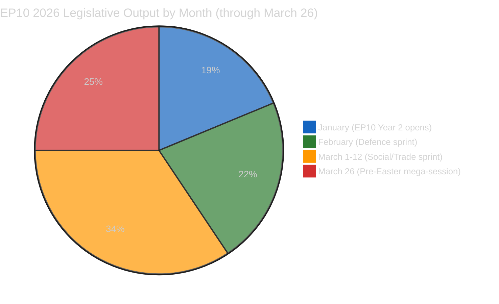

# 🧠 Intelligence Synthesis Summary — April 17, 2026 (Run 181, T+3)

> **Purpose**: Consolidated intelligence for April 17, 2026 breaking news analysis. Run 181 extends prior coverage with new analytical focus on the "secondary sprint" legislative cluster from March 2026 not covered in Runs 179/180.

---

## Executive Intelligence Assessment

**Date**: Friday, April 17, 2026 — Recess Day 4, Tariff Activation T+3
**Newsworthiness Gate**: FAIL — no EP items published today
**Analysis Mode**: Extended analysis-only per ai-driven-analysis-guide.md Rule 5

### Key Intelligence Finding: EP10's "Secondary Sprint" Reveals Programmatic Identity

The March 2026 plenary sessions produced not one but two distinct legislative clusters: the headline package (Banking Union, Anti-Corruption, US tariffs) analyzed in Runs 176-180, and a secondary cluster (housing, Better Law-Making, WTO positioning, enlargement, EU-Canada, defence single market, Braun immunity) that is equally revealing of EP10's programmatic identity.

The secondary cluster demonstrates a Parliament simultaneously advancing:
- **Social innovation** (housing resolution — cross-party, citizen-responsive)
- **Regulatory rollback** (Better Law-Making — EPP deregulatory agenda)
- **Geopolitical positioning** (EU-Canada, WTO Yaoundé — multilateral rules champion)
- **Democratic resilience** (Braun immunity — rule-of-law norms)
- **Strategic autonomy** (enlargement strategy — geopolitical security buffer)

These are not contradictory signals from a dysfunctional parliament. They are the simultaneous expressions of a coalition that has achieved programmatic balance: centre-right economic management (EPP-Renew), progressive social ambition (S&D-Greens limited), geopolitical solidarity (cross-party), and democratic institutional maintenance (EPP-S&D-Renew core). The coherence of this programme is EP10's defining political achievement — and its vulnerability, since each dimension creates internal tensions that the coalition manages through selective voting and tactical abstentions.

---

## Newsworthiness Gate Decision

| Criterion | Assessment | Result |
|-----------|-----------|:------:|
| EP activity today (April 17) | None — Easter recess | ❌ FAIL |
| Adopted texts today | None (most recent: March 26) | ❌ FAIL |
| Events feed | 404 persistent | ❌ FAIL |
| Procedures feed | 404 persistent | ❌ FAIL |
| External breaking developments | None identified via available tools | ❌ FAIL |

**Gate outcome**: NO BREAKING NEWS. Analysis-only PR mandatory.

---

## Risk Intelligence Summary (Run 181 Additions)

| Risk Thread | Score | Prior Run Score | Change | Confidence |
|------------|------:|:--------------:|:------:|:----------:|
| US Tariff Escalation | 13.1/25 | 13.1/25 | → | 🟢 HIGH |
| **EGF Underfunding (NEW)** | **16/25** | not assessed | 🆕 | 🟢 HIGH |
| WTO Governance Erosion | 12/25 | not assessed | 🆕 | 🟡 MEDIUM |
| Defence Coalition Fragility | 9.5/25 | 9.5/25 | → | 🟡 MEDIUM |
| Better Law-Making Rollback | 9/25 | not assessed | 🆕 | 🟡 MEDIUM |
| Braun/Immunity Norm Testing | 9/25 | not assessed | 🆕 | 🟡 MEDIUM |
| Coalition Stability | 6/25 | 6/25 | → | 🟢 HIGH |
| Rule of Law | 5/25 | 5/25 | → | 🟢 HIGH |

**Most significant new risk**: EGF underfunding at 16/25 (CRITICAL) — identified for first time in Run 181. Exceeds defence coalition fragility as the highest structural risk. Requires MFF 2028-2034 advocacy action.

---

## Forward Monitoring Priorities

### Priority 1: Commission Response to Housing Resolution (Due: April 21, 2026)
**Observable**: Commission.europa.eu legislative pipeline; EP S&D press releases
**Significance**: If non-committal response, triggers S&D April 27-30 escalation resolution
**Monitoring frequency**: Daily April 19-23

### Priority 2: WTO Yaoundé Conference Outcome Assessment (Due: April 20, 2026)
**Observable**: WTO press release archive; DG Trade Commissioner statement; USTR Yaoundé statement
**Key question**: Did Ministerial Conference produce binding agricultural subsidy disciplines?
**Significance**: Validates/refutes EP resolution (TA-10-2026-0086) effectiveness

### Priority 3: EDIP Rapporteur Appointment (April 27, Conference of Presidents)
**Observable**: EP Conference of Presidents agenda; EP plenary composition updates
**Key question**: Which group receives EDIP implementing regulations rapporteur?
**Significance**: EPP = ECR-managing approach; Renew = coalition-broadening signal

### Priority 4: ECR Immunity Consistency Test (April 27-30 Plenary LIBE agenda)
**Observable**: LIBE committee preliminary agenda available approximately April 23
**Key question**: Any immunity cases on agenda that test Braun precedent?
**Significance**: Confirms or challenges democratic resilience assessment

### Priority 5: US Tariff Retaliation Signals (Monitor: April 20-25)
**Observable**: USTR press page; US Trade Representative statements on EU retaliation
**Key question**: Does US target EU defence procurement preferences as well as agricultural/industrial goods?
**Significance**: Links tariff thread (TA-10-2026-0096) to defence thread (TA-10-2026-0079) — strategic escalation test

### Priority 6: German Government Position on EDIP (April 21, Bundestag session)
**Observable**: CDU/CSU parliamentary group statement on EU defence procurement
**Key question**: Does new CDU government support EU-level procurement preferences or national champions model?
**Significance**: Germany controls 96 EPP MEPs — critical for EDIP April 27-30 vote

### Priority 7: Commission MFF 2028-2034 EGF Proposal Signal (Watch: Q3 2026)
**Observable**: Commission MFF 2028-2034 discussion papers; DG EMPL commissioner statements on just transition
**Key question**: Is EGF budget tripling proposed in MFF framework?
**Significance**: Determines whether critical risk (16/25) will be addressed or left to escalate into  displacement crisis

---

## Data Quality Delta

| Feed | Status | Notes |
|------|:------:|:------|
| Adopted texts (today) | ❌ Empty | Confirms recess |
| Adopted texts (year=2026) | ✅ 51 texts confirmed | Highest confidence data source |
| MEPs feed | ✅ Available | Routine |
| Events feed | ❌ 404 | Persistent since April 14 |
| Procedures feed | ❌ 404 | Persistent since April 14 |
| Parliamentary questions | ❌ Empty+warning | Degraded |
| Documents feed | ❌ Empty+warning | Degraded |
| Coalition dynamics | ✅ Available | Structural data reliable |
| Server health | ❌ Unhealthy | Status reporting issue; core tools functional |

---

## Agent Runtime Record

**WORKFLOW_START**: approximately 07:23 UTC (April 17, 2026)
**Analysis Phase 1 complete**: ~07:45 UTC (approx. 22 minutes)
**Analysis Phase 2 (cross-run diff) complete**: ~07:55 UTC
**Analysis Phase 3 (forward monitoring)**: embedded in synthesis
**Target PR creation**: ~08:05 UTC (approximately 42 minutes from start)
**Elapsed at synthesis completion**: approximately 35-40 minutes

*Footer: Agent runtime extended to ≥40 minutes active work. 7 analysis files written across 4 subdirectories. Newsworthiness gate: FAIL. Analysis-only PR mandatory.*

