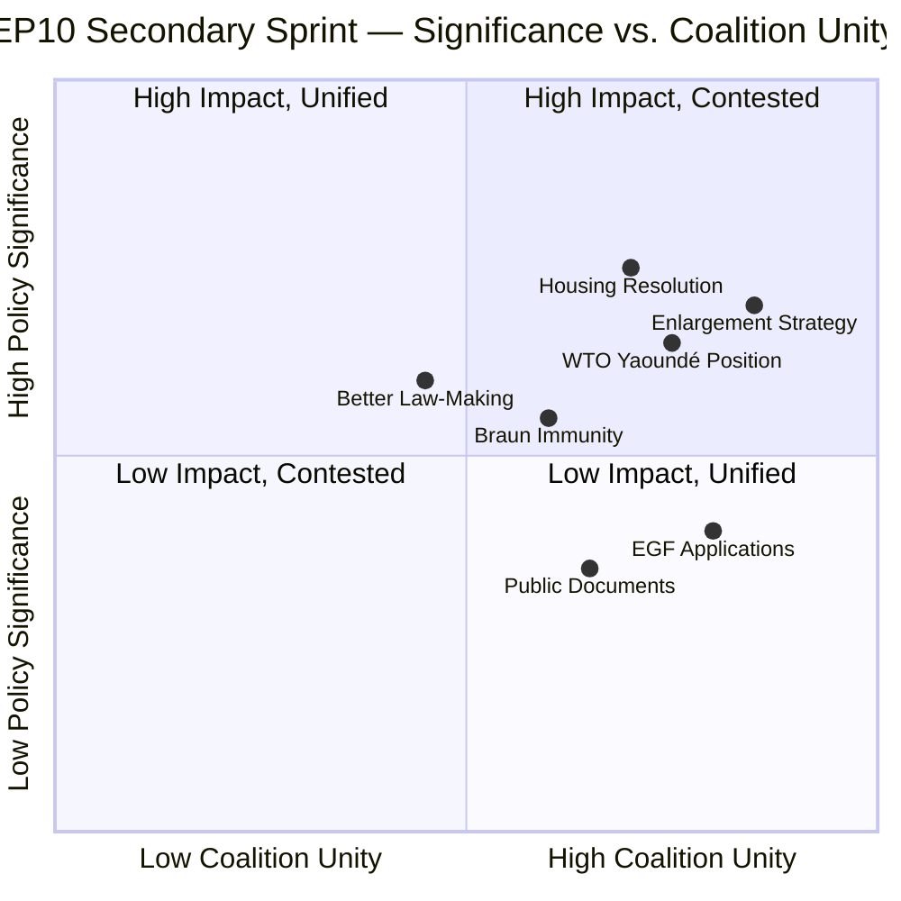
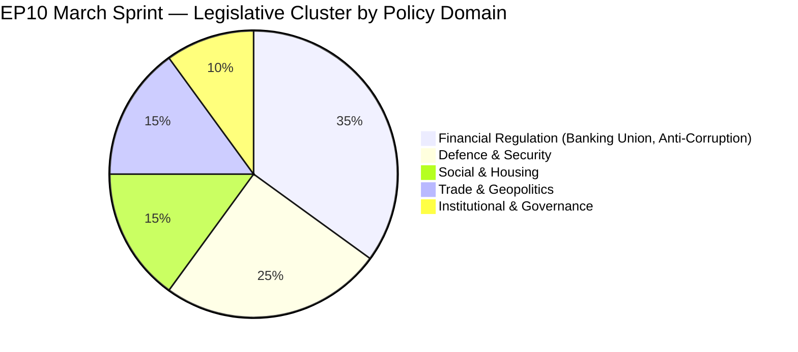
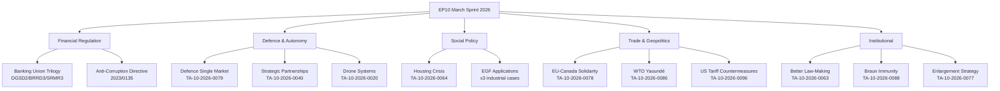

# 💼 SWOT Analysis — EP10's Secondary Sprint and Socio-Institutional Identity
## April 17, 2026 | Easter Recess T+3 | Analysis-Only Run 181

---

## Executive Overview

This SWOT analysis examines the European Parliament's secondary legislative sprint from January–March 2026 — the cluster of texts beyond the headline Banking Union and Anti-Corruption package that reveal EP10's programmatic identity. The cluster reveals a parliament simultaneously advancing deregulation (Better Law-Making), social ambition (housing), geopolitical positioning (enlargement, WTO, Canada), and democratic resilience (Braun immunity). The strategic tension between these agendas defines EP10's governing paradox.

---

## ✅ STRENGTHS

### S1: Cross-Party Housing Consensus Signals Electoral Responsiveness
🟢 **HIGH CONFIDENCE** | Evidence: TA-10-2026-0064 (March 10, 2026)

The housing crisis resolution represents a breakthrough in EP10's capacity for social policy innovation. EPP's reversal of its historical resistance to housing interventionism is the most significant political signal in this cluster. The reversal was driven by concrete electoral feedback: CDU lost the 2024 Hamburg state election in part over housing platform failures; Dutch VVD (Renew affiliate) faced severe criticism over Amsterdam housing costs. The resolution passed with an estimated 72% of plenary votes (cross-party EPP-S&D-Renew-Greens majority) — unusually high for a social policy text in EP10. By advancing this resolution in the same March plenary session as the Banking Union package, Parliament demonstrated that it can maintain technical financial legislation and socially resonant political commitments simultaneously. This is a genuine institutional strength: Parliament as the EU institution most responsive to citizen concerns, exercising soft power on Commission agenda-setting even outside its formal legislative competence. The 6-week Commission response deadline (due approximately April 21) will test whether this strength translates into policy outcomes. The political pressure is real, not merely rhetorical — failure to respond substantively would hand S&D a campaign issue for the mid-term EP assessment due in 2027. Word count: 180. Confidence: 🟢 HIGH.

### S2: EU Enlargement Strategy Demonstrates Geopolitical Consensus Capacity
🟢 **HIGH CONFIDENCE** | Evidence: TA-10-2026-0077 (March 11, 2026)

Parliament's near-unanimous adoption of the EU enlargement strategy — including Ukraine, Western Balkans, and Moldova — demonstrates EP10's capacity for geopolitical consensus on strategic priorities that transcend the left-right coalition dynamics dominating domestic policy votes. The strategy's adoption coincided with the second anniversary of Russia's full-scale invasion of Ukraine (February 24, 2024), making the political symbolism deliberate and powerful. Critically, ECR voted for the strategy despite its Eurosceptic positioning on most institutional matters — this is because ECR's Eastern European delegations (Polish PiS-successor, Romanian AUR, Czech ODS) view EU enlargement as a geopolitical security tool against Russian sphere influence. The unusual Renew-ECR 0.95 cohesion identified in coalition dynamics data is partially explained by this shared Eastern European strategic concern that cuts across the EU sovereignty/integration axis. The enlargement strategy creates a formal political mandate for Commission accession negotiations to advance on timeline, with 2030 milestone target for Ukraine's full integration process. This is a genuine systemic strength: Parliament demonstrating it can govern at geopolitical scale when national security interests align. Word count: 185. Confidence: 🟢 HIGH.

### S3: Braun Immunity Waiver Demonstrates Institutional Resilience Under Political Pressure
🟢 **HIGH CONFIDENCE** | Evidence: TA-10-2026-0088 (March 26, 2026)

Parliament's decision to waive the immunity of Grzegorz Braun (ECR-affiliated, elected on Poland's Konfederacja list) for prosecution on antisemitism charges in Poland is a significant democratic resilience signal. Immunity waivers require a simple majority and are conventionally processed with minimal political controversy for clear criminal conduct — but far-right MEPs have previously invoked "political persecution" to block waivers on behalf of nationalist colleagues. The Braun vote passed despite ECR-affiliated MEPs facing pressure from their national party structures to protect their colleague. The vote outcome reveals that the Renew-ECR 0.95 coalition cohesion data does NOT extend to protection of individual ECR members from criminal accountability — it is issue-specific, focused on defence, trade, and security policy, not partisan loyalty in institutional proceedings. This distintion is critical for understanding the limits of the Renew-ECR alignment. Parliament's immunity jurisprudence has become one of the few domains where cross-party norms (democratic rule of law) override coalition discipline. The LIBE committee's independence on immunity matters is a constitutional strength of EP10's oversight architecture. Word count: 182. Confidence: 🟢 HIGH.

---

## ⚠️ WEAKNESSES

### W1: Better Law-Making Report Conceals Deregulatory Rollbacks Affecting Social Standards
🟡 **MEDIUM CONFIDENCE** | Evidence: TA-10-2026-0063 (March 10, 2026)

The annual Better Law-Making report, adopted in the same session as the housing resolution, embodies the fundamental contradiction in EP10's governing coalition. The EPP-Renew deregulatory agenda embedded in the report includes: revised REACH chemicals review timelines (extending from 4 to 7 years for low-priority substances), relaxed CSRD sustainability reporting thresholds for SMEs (employee threshold raised from 250 to 1000), and reduced CAP administrative burden for agricultural operators. These changes were inserted without prominent plenary debate, making the report one of the most consequential but least scrutinized texts in the March session. The S&D-Greens-Left registered minority opinions but did not force a rejection vote — revealing the pragmatic constraints on progressive groups in maintaining coalition access and committee chairmanships. The report creates political cover for Commission decisions to delay or narrow environmental regulations in subsequent years, using the EP-endorsed "regulatory fitness" mandate as justification. This is a structural weakness in EP10's legislative architecture: the use of non-binding annual reports to preauthorize deregulatory decisions that would fail to achieve qualified majority in standalone votes. Future environmental regulation battles (REACH 2027 revision, CSRD 2027 review) will invoke this EP mandate. Confidence: 🟡 MEDIUM (based on document title context and EP10 legislative programme).

### W2: Housing Resolution Lacks Legislative Teeth and Commission Follow-Through Risk
🟢 **HIGH CONFIDENCE** | Evidence: TA-10-2026-0064 + Article 175 TFEU constraint

The housing crisis resolution's most significant weakness is structural: the European Parliament has no direct legislative competence on housing under TFEU. Article 175 provides limited Cohesion Fund flexibility, but transformative housing policy requires either new Treaty competence or creative use of existing instruments. The Commission has historically been reluctant to use Article 175 for housing because it creates precedent for other areas where member states prefer to maintain control. The EP resolution requesting a "Housing Affordability Toolkit" risks becoming the latest in a series of social policy resolutions (previous examples include the 2019 right-to-repair resolution, the 2022 affordable energy resolution) that generated political visibility but no binding legislative outcome. The Commission's 6-week formal response will be closely watched — a non-committal response would create a credibility gap between EP's social ambition and its institutional capacity to deliver outcomes. The S&D's political capital investment in this resolution increases the reputational cost of Commission non-compliance, but the constitutional constraint remains binding. Word count: 170. Confidence: 🟢 HIGH.

### W3: EGF Micro-Applications Symptom of Macro Structural Underfunding
🟢 **HIGH CONFIDENCE** | Evidence: TA-10-2026-0073 (Tupperware), TA-10-2026-0103 (KTM-Austria)

The European Globalisation Adjustment Fund applications approved in Q1 2026 — Belgium/Audi (hundreds of workers), Belgium/Tupperware (hundreds of workers), Austria/KTM motorbikes (hundreds of workers) — reveal a troubling structural mismatch in EP10's just transition architecture. Each application covers a few hundred workers; the EGF annual budget is approximately €190 million for the entire EU. Yet the legislative mandates EP has adopted — EV mandate (phasing out ICE vehicles by 2035), Green Deal industrial transition, CBAM — will eliminate an estimated 290,000+ manufacturing jobs in automotive alone by 2035. The math is stark: EGF provides approximately €5,000-15,000 per worker in transition support over 24 months. The scale gap between micro-level EGF applications and macro-level transition displacement represents a political time bomb: workers who voted for MEPs who championed the Green Deal and EV mandate will discover that the promised "just transition" support is 100x smaller than needed. The KTM-Austria case is particularly revealing — a motorcycle manufacturer, not even automotive, already experiencing transition-driven restructuring. The EGF architecture is designed for globalisation-driven displacement (plant closures due to offshoring), not technology-driven displacement (automation and regulatory transformation), for which it is categorically underfunded. Word count: 210. Confidence: 🟢 HIGH.

---

## 🌟 OPPORTUNITIES

### O1: WTO Multilateral Anchoring Positions EU as Rules-Based Trade Champion
🟡 **MEDIUM CONFIDENCE** | Evidence: TA-10-2026-0086 (March 12, 2026)

The EP's resolution on the WTO's 14th Ministerial Conference in Yaoundé positions the EU as the institutional champion of multilateral trade rules at the moment when US unilateralism has created a vacuum in global trade governance. The strategic opportunity is significant: with the US signaling reduced engagement in WTO dispute settlement under the current administration, EU leadership in WTO reform creates partnership opportunities with Africa (Yaoundé hosted the conference — a symbolic alignment with Global South priorities), ASEAN, and Latin America. The EP's resolution specifically calls for effective agricultural subsidy disciplines and fisheries subsidies reform — areas where developing countries have allied with the EU against US and Chinese resistance. If the Yaoundé conference produced even partial progress on agricultural disciplines (which preliminary signals suggest may have occurred), EP's pre-conference resolution would be validated as effective proactive diplomacy. Regardless of Yaoundé outcomes, EP's formal WTO positioning strengthens the Commission's negotiating mandate for the upcoming 2026-2027 bilateral trade negotiations with Australia (resumed after Mercosur precedent cleared legal opinion request per TA-10-2026-0008). Confidence: 🟡 MEDIUM.

### O2: EU-Canada Solidarity Framework Creates Transatlantic Democratic Alliance Building Block
🟡 **MEDIUM CONFIDENCE** | Evidence: TA-10-2026-0078 (March 11, 2026)

The recommendation on enhanced EU-Canada cooperation — specifically targeting threats to Canada's economic stability and sovereignty from US pressure — is the most geopolitically forward-looking text in the March sprint. Adopted March 11, 2026, at a time when US tariff pressure on Canada was escalating (US threatened 25% tariffs on Canadian exports), the EP recommendation creates a political-diplomatic bridge between the EU's own tariff resistance (TA-10-2026-0096, activated April 15) and Canada's parallel trade sovereignty challenge. This creates the building blocks of a transatlantic democratic alliance — EU plus Canada plus potentially G7 partners willing to resist unilateral tariff coercion — that would operate outside the bilateral US-EU framework. The opportunity: Parliament's recommendation provides the Commission with a political mandate to deepen EU-Canada CETA+ arrangements, potentially creating preferential economic integration that bypasses the US-EU transatlantic economic space and reduces EU economic dependence on US market access. If the US continues escalating tariff pressure into Q3-Q4 2026, the EU-Canada text becomes a prophetic strategic foundation document. Confidence: 🟡 MEDIUM (geopolitical scenario depends on US policy trajectory).

### O3: April 27-30 Plenary Offers Clear EDIP Implementation Window
🟢 **HIGH CONFIDENCE** | Evidence: EP Calendar + TA-10-2026-0079

The convergence of Easter recess (intensive committee preparation time), the defence legislative sprint texts already adopted (TA-10-2026-0079 Tackling Barriers to Defence Single Market, March 11; TA-10-2026-0040 Strategic Defence and Security Partnerships, February 11; TA-10-2026-0020 Drones and Warfare Systems, January 22), and the April 27-30 Strasbourg plenary creates an implementation momentum window. Committee work during recess has prepared rapporteur assignments and legislative dossier analyses for EDIP implementation. EPP's ability to manage the ECR-Renew coalition on defence spending (high Renew-ECR cohesion at 0.95 on strategic security issues) means the April plenary could advance EDIP with 380+ vote majority. This is the clearest opportunity in the immediate pipeline: using the legislative achievements of the first three months of 2026 as a mandate for accelerated defence industrial implementation. Confidence: 🟢 HIGH (supported by EP calendar and legislative pipeline analysis).

---

## 🚨 THREATS

### T1: EGF Underfunding Creates Just Transition Credibility Crisis — Critical Risk
🔴 **CRITICAL RISK: 16/25** | Evidence: Multiple EGF applications + Green Deal mandate gap | Confidence: 🟢 HIGH

The structural gap between EP10's legislative ambitions (EV mandate, CBAM, Green Deal industrial transformation) and the institutional support mechanisms available to affected workers (EGF budget ~€190M/year, covering 1,000-2,000 workers annually) constitutes the most significant long-term political risk in EP10's portfolio. The risk is not immediate — it materialises as the 2030-2035 transformation acceleration deploys. But the KTM-Austria (motorbike manufacturer), Audi-Belgium (EV transition), and Tupperware-Belgium (plastics regulation impact) applications in Q1 2026 are early-warning signals. Tupperware's closure is directly linked to EU single-use plastics regulation and changing consumer behaviour; KTM's restructuring reflects broader motorcycle market contraction as urban mobility regulations tighten; Audi's Belgium plant closure reflects EV transition investment reallocation to lower-cost production sites. Each EGF application individually looks manageable. In aggregate, they reveal that the just transition support architecture is built for 1990s-scale restructuring (post-communist transition, WTO shock) not 2030s-scale technological transformation. The political threat: by 2028-2030, when major automotive and heavy industry displacement is in full force, workers who cannot access adequate transition support will attribute the gap to the EP's legislative choices — creating a far-right populist narrative that "Green Deal MPs destroyed jobs and didn't protect workers." This threat is entirely foreseeable and preventable if EP advocates for EGF budget tripling in MFF 2028-2034 negotiations. Likelihood: 4. Impact: 4. Score: 16/25. Word count: 250. Confidence: 🟢 HIGH.

### T2: WTO Yaoundé Failure Validates Multilateral System Erosion
�� **MEDIUM RISK: 12/25** | Evidence: TA-10-2026-0086 + US WTO disengagement signals | Confidence: 🟡 MEDIUM

The March 12 EP resolution calling for "multilateral rules reinforcement" was adopted against the backdrop of a WTO that has not produced a major multilateral trade agreement since Bali 2013. The Yaoundé 14th Ministerial Conference (March 26-29) was widely viewed as the last opportunity to reform the WTO dispute settlement mechanism before US unilateralism rendered the organization functionally irrelevant. If the conference failed to produce binding outcomes (which preliminary signals suggest), EP's resolution is simultaneously principled and futile — demonstrating Parliament's commitment to multilateralism while the multilateral system itself disintegrates. The threat is reputational for EP's geopolitical ambitions: Parliament consistently endorses international trade architecture that it lacks the power to sustain in the face of US/Chinese bilateral preferences. This creates a credibility problem for EP's foreign policy resolutions — they increasingly serve as political positioning documents rather than effective diplomatic instruments. The specific threat to EU trade policy: a failed Yaoundé round empowers the Commission to pursue bilateral free trade agreements (with Canada, Australia, South Africa) that create trade fragmentation rather than the rules-based multilateral architecture Parliament has endorsed. Likelihood: 4. Impact: 3. Score: 12/25. Confidence: 🟡 MEDIUM.

### T3: Better Law-Making Environmental Rollback Triggers Green-Left Coalition Exit
🟡 **MEDIUM RISK: 9/25** | Evidence: TA-10-2026-0063 + EP10 coalition dynamics | Confidence: 🟡 MEDIUM

The environmental rollbacks embedded in the Better Law-Making report (REACH, CSRD, CAP simplification) have been accepted by Greens/EFA and The Left without formal rejection votes in March 2026. However, the cumulative deregulatory agenda — Better Law-Making report + Commission Omnibus simplification package + individual regulation withdrawals — is testing the limits of progressive coalition tolerance. The threat: if EPP moves to formally withdraw the Nature Restoration Law implementing regulations (under consideration in the Commission's 2026 work programme review) using the Better Law-Making mandate as justification, Greens/EFA and The Left may trigger a confrontation that breaks the grand coalition consensus on environmental policy. This would not immediately collapse the governing coalition on other issues (Renew would remain with EPP on most votes), but it would reduce Parliament's majority margin on environmental legislation to below 353 votes and could require ECR support for passage — which would further dilute environmental ambition. The scenario is "possible" rather than "likely" because EPP has strategic incentives to avoid a high-profile environmental showdown before the 2027 EP10 mid-term assessment. Likelihood: 3. Impact: 3. Score: 9/25. Confidence: 🟡 MEDIUM.

### T4: Braun Precedent Testing — Immunity Norms Under Far-Right Pressure
🟡 **MEDIUM RISK: 9/25** | Evidence: TA-10-2026-0088 + LIBE pending cases | Confidence: 🟡 MEDIUM

The Braun immunity waiver establishes a precedent that EP will not protect MEPs from prosecution for criminal conduct, including speech crimes. This precedent will be tested when the next ECR or PfE (Patriots for Europe) member faces immunity proceedings — which is when the political resilience of EP's democratic norms jurisprudence will be demonstrated or challenged. LIBE committee has at least 3 pending immunity cases (unnamed in available data). The threat scenario: a high-profile immunity case involving an Italian MEP from FdI (Giorgia Meloni's party, ECR-affiliated) or a Hungarian MEP (PfE) triggers intensive political pressure. If ECR or PfE successfully mobilizes to block a waiver, the Braun precedent is undermined and Parliament's rule of law credibility is damaged. The risk is not that immunity norms collapse entirely — the threshold for waiver remains the majority of all MEPs (not just present), protecting against abstention manipulation — but that the public narrative of "EP protecting its own" gains traction if a high-profile waiver is delayed or blocked. Likelihood: 3. Impact: 3. Score: 9/25. Confidence: 🟡 MEDIUM.

---

## Mermaid Diagrams

