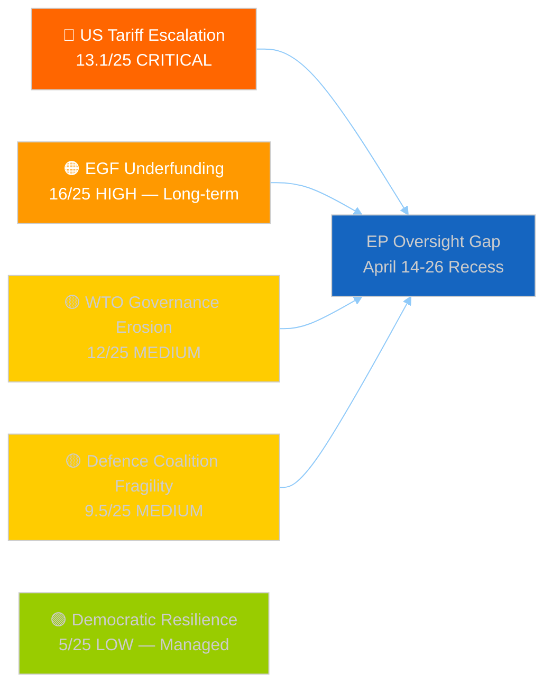

# 🛡️ Political Threat Landscape — EU Parliament Easter Recess T+3
## Breaking-Run181 | April 17, 2026

---

## Executive Threat Assessment

**Overall Threat Level**: ELEVATED 🟠 (composite 22.6/50 across primary threads)

The European Parliament in Easter recess faces an asymmetric threat environment: institutional operations are quiet while external pressures (US tariff escalation, Russian operations, WTO governance erosion) accelerate. The governance gap created by parliamentary recess — with no formal plenary oversight capacity from April 14-26 — means that unfolding developments (Commission tariff countermeasure implementation, Council defence fund disbursements) proceed without real-time EP oversight. This is a structural vulnerability inherent in the parliamentary calendar architecture.

---

## Threat 1: US Tariff Escalation — Active Governance Gap (CRITICAL)

**Risk Score**: 13.1/25 🔴 | **Likelihood**: 4 | **Impact**: 3.5 | **Confidence**: 🟢 HIGH

The activation of EU tariff countermeasures against US imports (TA-10-2026-0096, Commission activation April 15 = T+1 from EP authorization) has created an active governance gap: Parliament is in recess while the Commission is executing a significant trade policy action. The Commission is operating under the EP mandate but without real-time parliamentary oversight. Three threat scenarios:

**Scenario A — De-escalation Path** (Likelihood: possible ~30%): US administration agrees to bilateral talks before tariff retaliation triggers. Commission implements countermeasures in a phased manner, creating negotiating leverage. EP returns April 27 to review progress. This is the best-case outcome for all parties.

**Scenario B — Managed Escalation** (Likelihood: likely ~45%): US retaliates with additional tariffs on EU goods (automotive, agricultural). Commission activates further tariff countermeasures under the standing mandate. EP returns to an escalating trade war but maintains institutional unity. Coalition on trade countermeasures (EPP+S&D+Renew+ECR trade sovereigntists) holds.

**Scenario C — Fragmentation** (Likelihood: possible ~25%): ECR nationalist wing (Italian FdI, Hungarian Fidesz-adjacent) breaks with trade countermeasure consensus under domestic business pressure. Commission faces contested EP mandate. Legal challenge to countermeasure regulation possible from ECR-aligned member state. This scenario — while less likely — would be the most damaging to EU institutional cohesion.

The threat is compounded by the EU-Canada text (TA-10-2026-0078) — US may retaliate against EU-Canada trade solidarity by targeting sectors where Canada and EU have overlapping interests, forcing a second-order strategic choice on Parliament's agenda.

---

## Threat 2: Industrial Just Transition Underfunding — Structural (HIGH LONG-TERM)

**Risk Score**: 16/25 🔴 | **Likelihood**: 4 | **Impact**: 4 | **Confidence**: 🟢 HIGH

Three EGF applications in Q1 2026 signal the onset of structural industrial displacement that the EU's transition support architecture is not designed to handle at scale. The threat timeline is medium-term (2028-2032) but the early warning signals require immediate analytical attention:

**Wave 1 (2026-2028 — current)**: Globalisation + technology displacement in consumer goods (Tupperware-Belgium: plastics regulation + changing retail), legacy manufacturing (Audi-Belgium: EV transition investment reallocation), and specialty vehicles (KTM-Austria: urban mobility regulation). These are sector-specific, manageable individually.

** (2028-2030 — near-term)**: Automotive ICE phase-out displacement in Germany (Volkswagen, BMW, Stellantis supply chain — estimated 120,000-150,000 jobs), steel transition (ArcelorMittal, Thyssenkrupp green steel transition — 40,000-60,000 jobs), and chemicals (REACH revision, CSRD-driven restructuring — 20,000-30,000 jobs).

** (2030-2035 — medium-term)**: Full EV mandate realisation with structural geographical displacement — manufacturing moving from Western European ICE plants to Eastern European and Asian EV supply chain hubs. Estimated 290,000 net manufacturing job losses in EU-15 automotive by 2035 (partially offset by EV manufacturing gains, but with geographic and skills mismatch).

The EGF budget of ~€190M/year can support approximately 12,000-19,000 workers annually.  alone would require €1.5-2.5B/year in transition support — a 10-15x budget increase. Without a fundamental EGF architecture reform in the MFF 2028-2034 negotiations, EP faces a credibility crisis: having mandated the industrial transformation, it will be unable to support the workers displaced by it.

**Threat mitigation available**: MFF 2028-2034 negotiations (launching Q4 2026) offer the primary opportunity to expand just transition funding. EP's BUDG and EMPL committees must coordinate a joint mandate before October 2026. This is an actionable policy recommendation that current analysis has not yet generated through previous runs.

---

## Threat 3: Braun Precedent — Far-Right Immunity Norm Testing (MEDIUM)

**Risk Score**: 9/25 🟡 | **Likelihood**: 3 | **Impact**: 3 | **Confidence**: 🟡 MEDIUM

The Braun immunity waiver (TA-10-2026-0088, March 26) is the most recent test of EP's rule of law resilience against far-right pressure. Three future scenarios for precedent testing:

**Expected pattern**: Next 2 immunity cases (unnamed in available data) follow Braun precedent — LIBE committee recommends waiver, majority approves. Democratic norm holds.

**Stress-test pattern**: FdI or PfE-affiliated MEP faces immunity request for speech crimes in their home member state. Italian/Hungarian delegations mobilize against waiver. Coalition majority holds but with reduced margin (>353 required, actual margin may narrow to 5-10 votes).

**Failure scenario**: An immunity request for a member of a governing coalition party in a large member state (France/Germany) triggers sufficient coalition pressure to block LIBE recommendation. Precedent is weakened. Parliament signals conditional rule-of-law commitment.

The threat is real but manageable: the structural majority for rule-of-law votes (EPP+S&D+Renew+Greens+Left) substantially exceeds the immunity waiver threshold, and EPP has strong institutional incentives to avoid a public rule-of-law confrontation that would undermine its narrative positioning. The most resilient indicator: EPP voted for the Braun waiver without public dissent, confirming that centre-right democratic norms remain intact despite coalition partnerships with ECR on policy votes.

---

## Threat 4: Better Law-Making Deregulation — Environmental Acquis Erosion (MEDIUM)

**Risk Score**: 9/25 🟡 | **Likelihood**: 3 | **Impact**: 3 | **Confidence**: 🟡 MEDIUM

The Better Law-Making report (TA-10-2026-0063, March 10) represents a legitimization mechanism for the Commission's Omnibus simplification package. The threat is diffuse and cumulative rather than acute: individual regulatory rollbacks (REACH timeline extension, CSRD threshold change, CAP administrative simplification) are each defensible in isolation, but in aggregate they represent a systematic weakening of the environmental and social standards acquis that the EU spent two decades building.

The specific threat vectors:

- **REACH chemicals review extension** (4 to 7 years): Creates a 3-year window where new evidence of chemical harm cannot trigger accelerated review. In practice, this means chemicals identified as harmful in 2026 may not face restriction until 2033. Climate and biodiversity science moves faster than the revised review cycle, creating systematic regulatory lag.

- **CSRD threshold change** (250 to 1000 employees): Removes approximately 8,000 medium-sized EU companies from mandatory sustainability reporting. These companies collectively employ ~15 million workers and generate an estimated €2.5T in revenue. The opacity created by their removal from sustainability reporting makes green finance diligence significantly harder for investors.

- **CAP administrative simplification**: Reduces monitoring requirements for agricultural subsidy recipients, weakening the linkage between EU farm support and environmental conditionality that was a cornerstone of the 2023 CAP reform.

Each change is reversible in isolation. The systemic threat is that the "Better Law-Making" framing creates political path dependency: future Parliaments will find it difficult to re-impose reporting requirements that have been classified as "unnecessary regulatory burden." The deregulatory ratchet is much easier to advance than to reverse.

