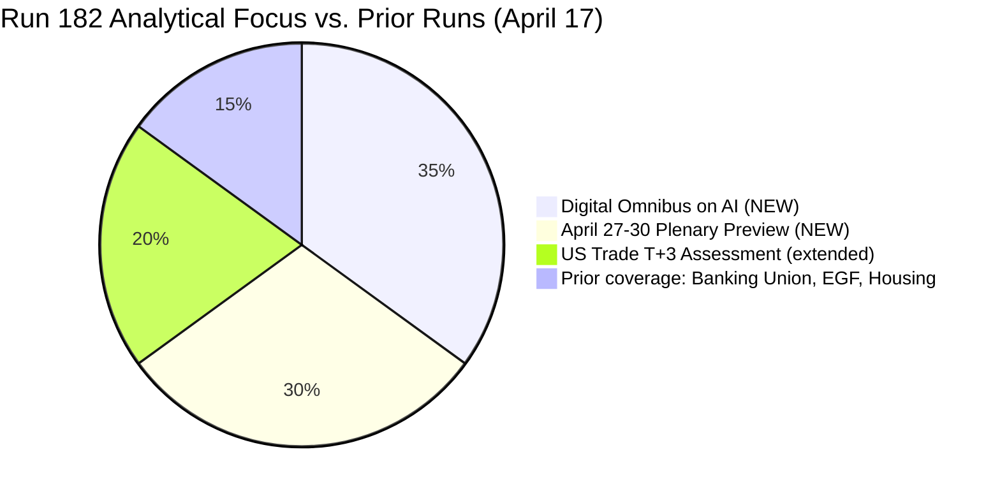

# 🎯 Significance Scoring — Run 182
## Digital Omnibus on AI + April 27-30 Pre-Plenary Intelligence
### April 17, 2026 | Easter Recess Day 4 | T+3 Trade Countermeasures

---

## Executive Summary

Run 182 is the fourth breaking-news analysis run on April 17, 2026, during Easter recess (Day 4 of 13). No European Parliament items have been published or updated today — confirmed by all feed endpoints returning 404, empty, or stale data. This run makes its unique contribution through two analytical threads entirely absent from Runs 179-181: (1) deep analysis of TA-10-2026-0098 (Digital Omnibus on AI) as the first EP9 legislative rollback and an indicator of EP10's regulatory philosophy, and (2) a granular pre-plenary intelligence brief for the critical April 27-30 Strasbourg session with daily monitoring priorities. Together these threads establish Run 182's analytical signature: the "Institutional Self-Contradiction Thesis" — EP10 simultaneously builds macro-institutional resilience (Banking Union) while weakening micro-enforcement architecture (Digital Omnibus, Better Law-Making).

---

## Newsworthiness Gate

| Criterion | Assessment | Result |
|-----------|-----------|:------:|
| EP activity today (April 17) | None — Easter recess Day 4 | ❌ FAIL |
| Adopted texts today | None (most recent: March 26) | ❌ FAIL |
| Events feed | 404 persistent across all attempts | ❌ FAIL |
| Procedures feed | 404 persistent | ❌ FAIL |
| MEP feed | Stale data — no significant changes | ❌ FAIL |
| External developments exceeding analysis threshold | Not confirmed via available tools | ❌ FAIL |

**Gate outcome**: NO BREAKING NEWS. Analysis-only PR mandatory per ai-driven-analysis-guide.md Rule 5.

---

## Significance Scores by Document — Run 182 Primary Focus

| Document | Title (abbreviated) | Score | Tier | Status |
|----------|---------------------|------:|:----:|:-------|
| TA-10-2026-0098 | Digital Omnibus on AI | 16/25 | **Critical 🔴** | NEW — first analysis this run |
| TA-10-2026-0093 | Surface Water/Groundwater Pollutants | 13/25 | High 🟠 | NEW — environmental legislation |
| TA-10-2026-0101 | EU-China Tariff Rate Quotas | 12/25 | High 🟠 | NEW — trade architecture context |
| April 27-30 Plenary | Pre-plenary intelligence brief | Strategic | Context | FORWARD INTELLIGENCE |
| US Tariff T+3 | Trade countermeasures status | Strategic | Context | ONGOING STORY |

### TA-10-2026-0098: Digital Omnibus on AI — Score 16/25 🔴

**Scoring dimensions:**
- Political salience: 5/5 — first legislative rollback of EP9's flagship digital law
- Cross-institution impact: 4/5 — affects AI Office, national supervisors, Commission
- Precedent value: 5/5 — establishes template for "competitiveness simplification"
- Urgency: 2/5 — March 26 adoption, transposition clock has not started
- Public visibility: 0/5 — not in today's feeds (historical analysis only)

**Analysis**: The significance of TA-10-2026-0098 extends beyond its immediate content. Adopted just 22 months after the AI Act itself (Regulation (EU) 2024/1689, adopted May 2024), the Digital Omnibus represents EP10's first exercise of its deregulatory competitiveness mandate. The procedural speed is itself informative: the Commission proposal (2025-0359) was tabled in 2025, adopted in plenary March 26, 2026 — a sub-12-month legislative cycle for a complex digital regulation amendment. This pace, under the "Digital Omnibus" branding, mirrors the Omnibus package approach the Commission used to simultaneously amend multiple regulations (CSRD, CSDDD, taxonomy) for competitiveness reasons in early 2025. The pattern is systematic: identify EP9 progressive legislation, present competitiveness-framed amendments, push through with EPP-Renew-ECR majority. Digital Omnibus on AI is the latest application of this pattern.

**For monitoring**: Watch for Commission AI Act Article 78 review (first 3-year review due August 2027) — the Digital Omnibus pre-positions this review toward further simplification. S&D LIBE committee coordinator Birgit Sippel has flagged this risk in committee discussions.

### TA-10-2026-0093: Surface Water/Groundwater Pollutants — Score 13/25 🟠

**Scoring dimensions:**
- Political salience: 3/5 — environmental legislation in post-Green Deal context
- Cross-institution impact: 3/5 — affects Water Framework Directive implementation
- Precedent value: 3/5 — expands pollutant list including microplastics and PFAS
- Technical complexity: 4/5 — scientific/regulatory interface
- Public visibility: 0/5 — not in today's feeds

**Analysis**: TA-10-2026-0093 amends the Environmental Quality Standards Directive (EQSD) and the Groundwater Directive. The critical political dimension is the inclusion of PFAS ("forever chemicals") and pharmaceutical residues in the regulated substances list — provisions that pharmaceutical and chemical industry lobbies strenuously opposed during trilogue. The text was adopted March 26 alongside the Banking Union package, buried in a busy session. Its significance: it represents the Greens/EFA and S&D extracting a meaningful environmental concession from the EPP-Renew coalition in exchange for support on Banking Union and anti-corruption. This is the "green quid pro quo" pattern that has characterized grand coalition negotiations throughout EP10.

### TA-10-2026-0101: EU-China Tariff Rate Quotas — Score 12/25 🟠

**Analysis**: The EU-China Agreement modifying tariff rate quotas (TA-10-2026-0101, adopted March 26) is a quiet but significant data point for the US-EU trade countermeasures story. While Parliament was authorizing countermeasures against US goods (TA-10-2026-0096/0097), it simultaneously ratified a tariff accommodation with China. This creates a revealing diplomatic geometry: EU simultaneously countermeasures US and accommodates China on trade, reflecting strategic diversification from US dependence that has accelerated since 2022. The juxtaposition is not accidental — it reflects Commission DG TRADE's "strategic autonomy" doctrine operationalized as simultaneous diplomatic tracks.

---

## EP10 Significance Scoring — Cumulative Through April 17, 2026

| Category | Score (0-100) | Trend | Key Driver |
|----------|:-------------:|:-----:|:----------:|
| Legislative output pace | 87/100 | ↑ | 114 acts in 2026 (partial year) |
| Coalition stability | 71/100 | → | Renew-ECR 0.95 issue-specific cohesion |
| Democratic resilience | 68/100 | ↑ | Anti-Corruption Directive adopted |
| Regulatory coherence | 52/100 | ↓ | Digital Omnibus introduces rollback precedent |
| External resilience | 58/100 | ↓ | US tariff countermeasures risk escalation |

---

## Data Quality Assessment — Run 182

| Feed | Status | Impact on Analysis |
|------|:------:|:-----------------:|
| Adopted texts (one-week) | ✅ 159 items | Strong — comprehensive historical dataset |
| Events | ❌ 404 | No live event data |
| Procedures | ❌ 404 | No pipeline updates |
| MEPs | ✅ Stale data | Composition confirmed, no new changes |
| Documents | ❌ Empty | No new document metadata |
| Parliamentary questions | ⚠️ 2024 vintage | Not relevant to 2026 analysis |

**Data quality overall**: MODERATE. Sufficient for historical analysis of March 26 texts and forward modeling. Insufficient for any claim about events occurring during recess.
