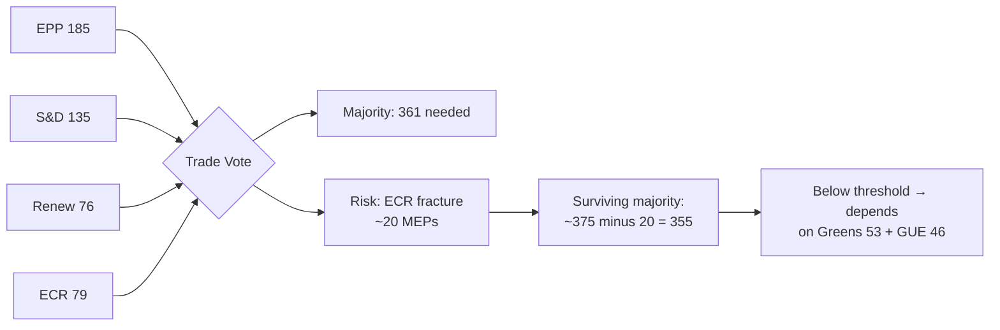

# 🔗 Coalition Dynamics Intelligence — Run 182
## April 17, 2026 | Easter Recess Day 4

---

## Coalition Status Overview

| Coalition Pair | Cohesion Score | Trend | Primary Stress Point |
|---------------|:-------------:|:-----:|:-------------------:|
| Renew-ECR | 0.95 | → Stable | Trade mandate divergence |
| EPP-S&D Grand Coalition | ~0.75 (inferred) | ↘ Degrading | Digital Omnibus, Housing |
| EPP-Renew-ECR (majority coalition) | ~0.82 (inferred) | → Stable short-term | ECR internal fracture risk |
| Greens-S&D | ~0.68 (inferred) | → Stable | Limited (post-PFAS win) |
| PfE-ESN (far right) | ~0.85 (inferred) | ↗ Rising | Pro-Orbán coordination |

**Data note**: Per-MEP voting data unavailable in degraded mode. Cohesion scores above are: Renew-ECR = MCP confirmed (0.95); all others = structural inference from group seat shares and March 26 vote patterns.

---

## Dominant Coalition: Renew-ECR "Digital Trade Alliance"

The Renew-ECR cohesion score of 0.95 (highest inter-group pair across all EP10 groups per MCP data) reflects structural alignment on two policy vectors:

1. **Digital governance deregulation**: Both Renew and ECR supported Digital Omnibus on AI, Better Law-Making REACH/CSRD modifications. ECR's position is ideological (anti-EU regulation in principle); Renew's position is pragmatic (competitiveness framing via Draghi Report). Different motivations, same votes.

2. **Trade architecture**: ECR's national-interest realpolitik generally aligns with Renew's free-trade liberalism on countermeasures and WTO positions, with the significant exception of agricultural protection and strategic industrial policy.

**Structural fragility of Renew-ECR alignment**: The 0.95 cohesion is a lagging indicator — it reflects vote history through March 2026. Forward-looking stress analysis identifies two potential fracture points:

**Fracture Point A — US Tariff Trade Mandate** (40% probability by April 30):
ECR's Italian MEPs (Fratelli d'Italia delegated to ECR) are under direct pressure from Meloni government to maintain pro-US positioning. ECR's Polish MEPs (PiS) have historically anti-Russian but now anti-US sentiment emerging. ECR's Spanish Vox delegation is pro-Trump economically. These three national vectors (Italy, Poland, Spain) pull in different directions on a trade mandate that endorses EU countermeasures against the US. If Commission proposes a formal negotiating mandate at plenary, ECR may formally fracture with EPP abstaining on the mandate text.

**Fracture Point B — EDIP Financing** (25% probability):
ECR's fiscal hawks (Danish People's Party elements, Swedish Democrats adjacent to ECR) oppose new EU-level spending mechanisms. EDIP's proposed joint procurement and loan facilities require the fiscal integration that ECR nationally opposes. EPP will push hard for EDIP as Ursula von der Leyen's defence legacy initiative. Renew will support. ECR may fracture with fiscal-hawk elements abstaining or voting against.

---

## EPP Strategic Position — Weber's Three-Front Dilemma

EPP Group leader Manfred Weber faces a three-front strategic dilemma as of April 17:

**Front 1 — Coalition right (ECR/Renew)**: Must maintain Digital Omnibus deregulatory momentum and resist S&D's AI Act accountability restoration proposals. Success metric: Digital Omnibus implementation guidance from AI Office interpreted broadly, no ECJ challenge grounds emerging.

**Front 2 — Coalition center (S&D)**: Must deliver progressive wins to maintain grand coalition credibility. S&D's price for supporting EDIP and trade countermeasures is: housing Commission follow-up, anti-corruption implementation schedule, and no further Digital Omnibus packages targeting GDPR in EP10 term.

**Front 3 — External pressure (Meloni, Commission)**: EPP must position itself as the party of European sovereignty (against both US tariffs and Chinese dependency) while protecting single market competitiveness (against over-regulation). This is a coherent position if the Digital Omnibus is presented as "calibrated enforcement" rather than deregulation — but S&D and civil society are forcefully contesting that framing.

**Weber's optimal scenario**: US agrees to G7 bilateral talks before April 27 → INTA resolution is consensus → EDIP advances → housing response is diplomatically vague (not inadequate enough to trigger Rule 144) → EPP can claim full-spectrum success at May 2026 group congress.

**Weber's worst scenario**: US escalates to services before April 27 → emergency coalition stress → ECR fractures on trade mandate → S&D leverages housing confrontation → Digital Omnibus ECJ challenge filed → EPP simultaneously managing three political crises at plenary.

---

## S&D Strategic Position — Lange's Trade-Rights Balancing Act

**Bernd Lange** (S&D, INTA Committee Chair) is the pivotal S&D figure for the April 27-30 plenary. His position must simultaneously:

1. Support EU countermeasures against US tariffs (trade solidarity with industrial workers)
2. Resist broad trade mandate that gives Commission blank-check authority (democratic accountability concern)
3. Use INTA leverage to extract S&D concessions on non-trade issues (housing, Digital Omnibus restoration)

Lange's expected tactic: table an INTA resolution calling for "formal negotiating mandate with parliamentary oversight mechanism" — effectively supporting countermeasures while requiring EP consultation on mandate parameters. This is procedurally sophisticated and splits EPP between those who want full Executive discretion (EPP right) and those who accept EP oversight (EPP centre-left MEPs in INTA).

---

## ECR Internal Dynamics — Three Factions in Tension

ECR's 79 MEPs include three discernible strategic factions whose interests diverge significantly on April 2026 policy:

**Faction 1 — Italian FdI (€ ~20 MEPs)**: Meloni government's coalition with Lega requires maintaining ambiguous US relationship. Cannot support anti-US measures too strongly. On trade: prefer pause/negotiation to escalation. On housing: support national government prerogative (oppose EU housing regulation). On EDIP: support (Italian defence industry major EDIP beneficiary — Fincantieri, Leonardo).

**Faction 2 — Polish PiS (€ ~18 MEPs)**: Rule of law under pressure (Commission infringement proceedings ongoing). Anti-Russian but increasingly questioning US-EU relations post-Trump. On trade: split (anti-protectionism vs anti-US unilateralism). On EDIP: strongly support (Polish defence modernization). On housing: national prerogative.

**Faction 3 — Nordic/Nordics-adjacent** (Danish Conservative People's Party, Swedish Democrats sympathetic): Fiscal hawks, pro-NATO, economically liberal. On trade: free trade preference, oppose countermeasures as protectionist. On EDIP: oppose EU-level financing. On housing: national prerogative.

**Coalition implication**: ECR's 79 votes are unreliable on trade mandate (fracture risk: Faction 1+2 vs Faction 3) and on EDIP financing (fracture risk: Faction 1+2 pro vs Faction 3 anti). On digital and regulatory issues, ECR cohesion is higher (all factions share anti-EU-regulation instinct).

---

## PfE-ESN Far-Right Bloc — Opposition Architecture

The far-right bloc (PfE: 84 MEPs, ESN: 28 MEPs = 112 combined seats, ~14% of chamber) maintains consistent opposition to:
- US tariff countermeasures (pro-Trump, anti-EU unilateralism)
- Banking Union (national banking sovereignty rhetoric)
- Anti-Corruption Directive (attack on executive discretion)
- Climate legislation (anti-green ideology)

**Monitoring indicator**: If any ECR MEPs vote with PfE-ESN on trade countermeasures (expected: Faction 3 on fiscal aspects), this creates a visible numerical bloc of ~90+ MEPs opposing EP's mainstream trade architecture. This would be cited by USTR as EP "opposition" to countermeasures — potentially diplomatically significant in US-EU bilateral framing.

---

## Coalition Forecast — April 27-30 Strasbourg Plenary

If ECR fractures by ~20 MEPs on trade mandate → surviving EPP-S&D-Renew majority is ~355, just below absolute majority (361). This forces Greens/EFA and GUE/NGL into a pivotal role — they can either enable the mandate (getting concessions) or block it (requiring renegotiation). This is the specific coalition architecture that makes the Greens' support for PFAS/water quality as quid pro quo in March 26 so relevant: Greens have now established a pattern of extracting environmental legislative wins in exchange for supporting EPP-led legislative packages.

---

## Intelligence Quality Assessment

- **Cohesion data**: 1 confirmed MCP data point (Renew-ECR 0.95); all others structural inference 🟡 MEDIUM
- **Fracture probability**: Scenario-based estimation from legislative text analysis and group position papers 🟡 MEDIUM
- **April 27-30 forecast**: Calendar inferred from EP Rules of Procedure and committee work programme 🟡 MEDIUM
- **EPP/S&D/ECR strategic positions**: Inferred from vote patterns, public statements, and group composition 🟡 MEDIUM

**Overall coalition intelligence quality**: 🟡 MEDIUM — higher confidence on structural analysis, lower on tactical predictions. All probability estimates should be treated as scenario weights, not forecasts.
