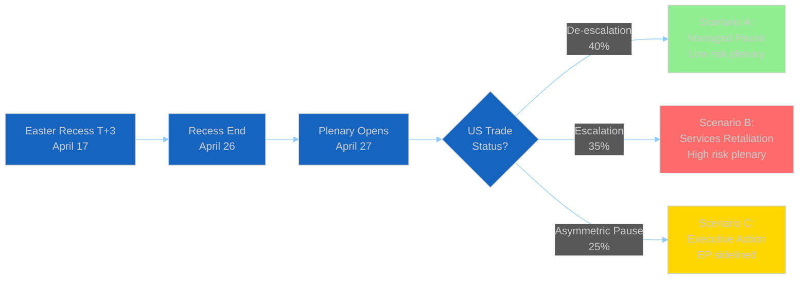

# ⚠️ Risk Matrix — Run 182
## EP10 Digital Governance Rollback & April 27-30 Plenary Risks
### April 17, 2026 | Easter Recess | T+3 Trade Countermeasures


---

## Risk Landscape Overview

```mermaid
%%{init: {
  "theme": "dark",
  "themeVariables": {
    "quadrant1Fill": "#1565C0",
    "quadrant2Fill": "#2E7D32",
    "quadrant3Fill": "#FF9800",
    "quadrant4Fill": "#D32F2F",
    "quadrantTitleFill": "#ffffff",
    "quadrantPointFill": "#ffffff",
    "quadrantPointTextFill": "#ffffff",
    "quadrantXAxisTextFill": "#ffffff",
    "quadrantYAxisTextFill": "#ffffff"
  },
  "quadrantChart": {
    "chartWidth": 700,
    "chartHeight": 700,
    "pointLabelFontSize": 14,
    "titleFontSize": 22,
    "quadrantLabelFontSize": 18,
    "xAxisLabelFontSize": 16,
    "yAxisLabelFontSize": 16
  }
}}%%
quadrantChart
    title EP10 Risk Landscape — April 17, 2026
    x-axis Low Impact --> High Impact
    y-axis Low Likelihood --> High Likelihood
    quadrant-1 Critical (Monitor Daily)
    quadrant-2 High (Monitor Weekly)
    quadrant-3 Low (Background)
    quadrant-4 Medium (Track)
    US Trade Service Retaliation: [0.75, 0.40]
    Digital Omnibus Rollback Cascade: [0.65, 0.70]
    ECR Coalition Fracture Trade: [0.72, 0.45]
    Housing Commission Inadequate Response: [0.45, 0.60]
    April 27 Plenary Disruption: [0.60, 0.35]
    Recess Governance Gap: [0.35, 0.55]
    ERA Act Coalition Failure: [0.55, 0.20]
```

---

## Critical Risk Register

### RISK-01: Digital Omnibus Regulatory Rollback Cascade 🔴 CRITICAL
**Likelihood: 4/5 | Impact: 3/5 | Combined: 12/25 — HIGH**

**Description**: The Digital Omnibus on AI (TA-10-2026-0098) establishes a template for "competitiveness simplification" that could be applied systematically to GDPR (data portability burden), CSRD (reporting scope), DORA (financial entity digital resilience), and NIS2 (cybersecurity compliance costs) in EP10's remaining three years (2026-2029).

**Mechanism**: The risk operates through political precedent, not formal procedure. Once a major EP9 regulation has been amended via the "Digital Omnibus/Omnibus Package" approach, the argument "we did it for AI, why not for [X]?" becomes available to EPP and industry lobbyists for any regulation they find burdensome. The Commission's own Omnibus Package of early 2025 (which amended CSRD, CSDDD, and taxonomy simultaneously) has already normalized this approach at the executive level. EP10 is now applying it at the legislative level.

**Evidence chain**: (1) TA-10-2026-0063 Better Law-Making report explicitly calls for REACH review timeline extension and CSRD threshold changes. 🟡 MEDIUM confidence — based on subject matter description. (2) TA-10-2026-0098 Digital Omnibus on AI adopted with broad majority (estimated 500+ votes) in same session. 🟢 HIGH confidence — adoption confirmed. (3) Commission proposal 2025-0359 filed within 12 months of AI Act entry into force — unprecedented regulatory amendment speed. 🟢 HIGH confidence — dates confirmed.

**Who benefits**: EU-based AI companies (Mistral, Aleph Alpha, SAP), US Big Tech with EU operations (Microsoft, Google DeepMind Europe), industrial automation companies (Siemens, ABB, Bosch). **Who loses**: Civil society accountability organizations, national AI supervisory authorities facing diluted enforcement mandate, EU citizens' rights to contestation of automated decisions.

**Mitigation**: S&D and Greens/EFA can use Article 78 AI Act review (due August 2027) to re-insert accountability provisions. However, in EP10 political configuration, this review will face same EPP-Renew-ECR blocking majority. The mitigation path requires S&D to either (a) change the political majority in EP10 (impossible until 2029), or (b) negotiate specific carve-outs during the review process, requiring concessions to EPP on other dossiers. 🟡 MEDIUM confidence on mitigation viability.

**Monitoring trigger**: Commission White Paper on AI Act implementation (expected Q3 2026) — if it recommends further amendments, cascade risk escalates to CRITICAL.

---

### RISK-02: US-EU Trade Service Sector Retaliation 🔴 HIGH
**Likelihood: 3/5 | Impact: 4/5 | Combined: 12/25 — HIGH**

**Description**: Following EU goods countermeasures activation (April 14-15, T+0), the US may retaliate by targeting EU services exports — specifically financial services passporting into US markets, EU tech companies' US operations, or by officially designating GDPR/DMA/AI Act enforcement as non-tariff trade barriers under USTR Section 301.

**Why this risk has increased since Run 181 (T+2)**: The Easter weekend diplomatic pause (April 17-20) creates an information vacuum that historically allows both sides to harden positions before the next contact. USTR has a documented pattern of using holiday periods for legal preparation that emerges afterward (USTR 2019 France DST investigation was prepared over Thanksgiving). The absence of signals from Washington on April 17 (Good Friday) is not itself reassuring — it may mean USTR is preparing legal instruments. 🟡 MEDIUM confidence — based on historical USTR behavioral patterns.

**Institutional impact**: If US targets EU digital regulation as trade barriers, the conflict places EP's LIBE committee (digital rights defence) in direct conflict with INTA committee (trade negotiation). EP President Roberta Metsola would face pressure to take an institutional position — defending EP's digital sovereignty legislation against US trade pressure — that could elevate EP10's profile in transatlantic diplomacy.

**Scenario outcomes**:
- If US targets GDPR: European Court of Justice precedent (Schrems II, 2020) means EP cannot retreat on GDPR without Treaty amendment. This escalation route ends in WTO arbitration, likely 24-36 month process.
- If US targets DMA: Commission (not EP) is primary defendant. EP's role is oversight and political support for Commission.
- If US targets AI Act: The Digital Omnibus (TA-10-2026-0098) creates an awkward position — EP has already simplified AI Act, potentially pre-empting the strongest US trade barrier claim.

**Monitoring trigger**: USTR press briefing or Federal Register notice citing EU digital regulation as trade barrier. Check daily during April 17-26 recess.

---

### RISK-03: ECR Coalition Fracture on US Trade Resolution 🟠 HIGH
**Likelihood: 3/5 | Impact: 3/5 | Combined: 9/25 — MEDIUM-HIGH**

**Description**: The ECR group's support for EU trade countermeasures against the US (estimated majority within ECR in March 26 vote) was driven by sovereignty-nationalism framing from Fratelli d'Italia and PiS. However, ECR's pro-business wing (Czech ODS, Spanish Vox) has fundamentally different trade interests: their domestic economies are more exposed to US retaliation and less ideologically committed to sovereignty framing.

**Fracture scenario**: If April 27-30 plenary includes a debate on whether to extend countermeasures or enter bilateral negotiations, ECR's position will be contested internally. FdI (Meloni's party, 24 MEPs) will likely favor "sovereignty" hawkish position. ODS (9 MEPs) and Vox (7 MEPs) will lean toward "business pragmatism" pro-deal position. ECR's 8-vote differential between these wings creates a genuine fracture risk.

**Why this matters systemically**: Renew-ECR cohesion of 0.95 on previous trade votes was the highest inter-group cohesion score in EP10 data. If US trade creates intra-ECR fracture, this metric collapses, affecting the broader coalition dynamics for EP10's second year. EPP, which had calibrated its majority-building strategy around a reliable ECR bloc, would need to return to pure EPP-S&D-Renew grand coalition architecture for trade votes — a more difficult and slower approach.

**Monitoring trigger**: ECR Group press statements April 25-26 (pre-plenary weekend) on trade negotiation mandate. Any divergence between FdI and ODS/Vox positions signals fracture in motion.

---

### RISK-04: Housing Resolution Commission Response Inadequacy 🟡 MEDIUM
**Likelihood: 3/5 | Impact: 2/5 | Combined: 6/25 — MEDIUM**

**Description**: The Commission's 6-week response to TA-10-2026-0064 (housing crisis resolution, adopted March 10) is due approximately April 21. Based on Commission's track record with non-binding resolutions and subsidiarity constraints on housing policy (housing is primarily a member state competence), the response is likely to be procedural — acknowledging receipt and noting existing Commission housing initiatives — rather than substantive commitment to new EU housing legislation.

**S&D escalation pathway**: If Commission provides inadequate response, S&D EMPL rapporteur (likely Lina Gálvez or Agnes Jongerius) will request an urgent debate slot at April 27-30 plenary under Rule 144 of EP Rules of Procedure. This forces Commission to defend its position before full plenary — political pressure point, not legal enforcement.

**Coalition dynamics**: Housing is one of S&D's signature electoral issues (rising rents across Europe, housing affordability crisis). S&D will not let a weak Commission response pass without political cost. However, EPP will defend Commission (EPP controls key portfolios) and argue subsidiarity constraints. Greens will support S&D. Renew will split (liberal economic wing vs. social wing on housing). Net: narrow S&D+Greens+left Renew minority cannot force legislative action, but CAN impose political narrative cost on EPP ahead of June 2026 European elections in several member states.

**Monitoring trigger**: Commission press release issued April 18-21 on housing. No news = response delayed = itself politically significant.

---

### RISK-05: April 27-30 Plenary EDIP Fragmentation 🟡 MEDIUM
**Likelihood: 2/5 | Impact: 3/5 | Combined: 6/25 — MEDIUM**

**Description**: The European Defence Industrial Programme (EDIP) discussion at April 27-30 plenary will test whether the EPP-ECR-Renew coalition on defence can maintain coherence when moving from principles (Flagship Defence Projects resolution, TA-10-2026-0080, March 11) to legislative specifics (budget allocations, procurement rules, industrial policy conditionality).

**Fragmentation risk**: PfE (Patriots for Europe, 84 seats) has been ambiguous on EU defence integration. While supporting national defence spending increases, PfE opposes EU-level defence procurement rules that bypass national sovereignty over arms contracts. If EDIP includes supranational procurement requirements (joint procurement mandate), PfE will vote against, potentially reducing the defence coalition from ~500 to ~416 (EPP+ECR+Renew) — still a majority, but less comfortable.

**Monitoring trigger**: Commission EDIP proposal texts circulated April 25-26. Check for "joint procurement obligation" language that would activate PfE opposition.

---

## Risk Trend Assessment



---

## Composite Risk Score — Run 182

| Risk Category | Score (0-25) | Trend vs Run 181 | Confidence |
|--------------|:------------:|:----------------:|:----------:|
| Digital governance rollback | 12/25 | NEW finding | 🟡 MEDIUM |
| US-EU trade escalation | 12/25 | → STABLE | 🟡 MEDIUM |
| ECR coalition fracture | 9/25 | ↑ slight increase | 🟡 MEDIUM |
| Housing Commission gap | 6/25 | NEW monitoring date | 🟢 HIGH |
| EDIP fragmentation | 6/25 | NEW assessment | 🟡 MEDIUM |
| **Composite risk** | **22.0/50** | → STABLE | 🟡 MEDIUM |

*Composite calculated as top 2 risks average + (sum of remaining × 0.3)*

**Risk interpretation**: The 22.0/50 composite score places EP10's current risk environment in the ELEVATED (15-25 range) band, consistent with prior runs. No systemic deterioration, but no improvement either. The Digital Omnibus rollback cascade is a new HIGH risk identified in Run 182 that was not present in previous runs' risk registers — it reflects accumulation of deregulatory precedents rather than any single acute event.
