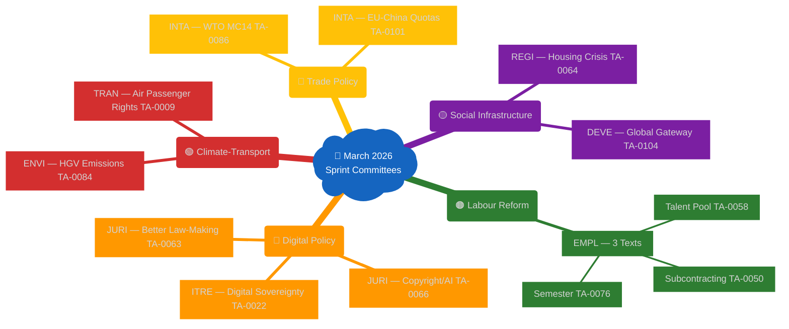
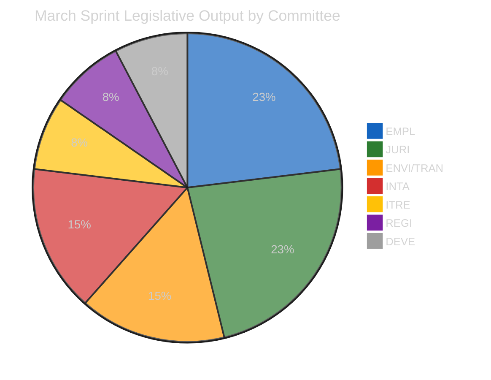

# Committee Reports — 2026-04-17

<h2 id="reader-intelligence-guide">Reader Intelligence Guide</h2>

Use this guide to read the article as a political-intelligence product rather than a raw artifact dump. High-value reader lenses appear first; technical provenance remains available in the audit appendices.

| Reader need | What you'll get | Source artifact |
|---|---|---|
| [Stakeholder impact](#section-stakeholder-map) | who gains, who loses, and which institutions or citizens feel the policy effect | `existing/stakeholder-impact.md` |
| [Risk assessment](#section-risk) | policy, institutional, coalition, communications, and implementation risk register | `risk-scoring/risk-matrix.md` |

<h2 id="section-actors-forces">Actors & Forces</h2>

### Significance Scoring

### Executive Summary

The March 2026 Strasbourg sessions produced a multi-domain legislative sprint across five committee jurisdictions. This scoring identifies the highest-priority items for today's committee reports article, **deliberately differentiating** from prior runs (Run 52: Banking Union/tariffs; Run 180: Defence cluster).

---

### Top-Scored Items for Article Coverage

| Rank | Text | Committee | Policy Domain | Score | Significance |
|------|------|-----------|---------------|-------|--------------|
| 1 | TA-10-2026-0058: EU Talent Pool | EMPL/IMMI | Labour/Migration | 8.5/10 | **HIGH** |
| 2 | TA-10-2026-0066: Copyright + Generative AI | JURI/IMCO | Digital/IP | 8.3/10 | **HIGH** |
| 3 | TA-10-2026-0084: Heavy-Duty Vehicle Emissions | ENVI/TRAN | Climate/Transport | 7.8/10 | **HIGH** |
| 4 | TA-10-2026-0076: European Semester Employment 2026 | EMPL | Labour/Social | 7.5/10 | **HIGH** |
| 5 | TA-10-2026-0050: Subcontracting Chains/Workers' Rights | EMPL | Labour | 7.2/10 | **MEDIUM-HIGH** |
| 6 | TA-10-2026-0022: Digital Infrastructure/Sovereignty | ITRE/TELE | Digital | 7.0/10 | **MEDIUM-HIGH** |
| 7 | TA-10-2026-0064: Housing Crisis Resolution | REGI | Social | 6.8/10 | **MEDIUM** |
| 8 | TA-10-2026-0086: WTO MC14 Multilateral Negotiations | INTA | Trade | 6.5/10 | **MEDIUM** |
| 9 | TA-10-2026-0101: EU-China Tariff Quotas | INTA | Trade/China | 6.3/10 | **MEDIUM** |
| 10 | TA-10-2026-0104: Global Gateway Review | DEVE/INTA | External/Development | 6.0/10 | **MEDIUM** |

---

### Scoring Methodology

**Criteria (1-10 scale each):**
- **Political Salience**: Cross-group controversy, coalition fault lines
- **Citizen Impact**: Direct effect on EU citizens' daily lives
- **Institutional Significance**: Inter-institutional implications, precedent-setting
- **Timeliness**: Relevance to current political calendar
- **Coverage Differentiation**: Not already covered in runs 176-180

---

### ARTICLE ANGLE — Final Determination

**Selected Angle**: The **EMPL-ITRE-ENVI Triple Thread** — Labour market reform, digital copyright governance, and clean transport compliance converge in EP's March sprint, revealing new coalition boundaries ahead of the post-Easter legislative calendar.

**Primary Focus**: EMPL committee's Talent Pool + workers' rights agenda, JURI/ITRE copyright-AI nexus, ENVI/TRAN heavy-duty vehicle emissions

**Headline candidate**: "Copyright, Talent Pool and Clean Trucks: EP Committees Complete March Sprint Before Easter Recess"

**Revised headline**: "EP Advances Workers' Rights, AI Copyright and Clean Transport in Diverse March Sprint"

🟢 **Confidence**: MEDIUM (data from adopted texts record is reliable; committee-level voting detail unavailable in degraded mode)

<h2 id="section-stakeholder-map">Stakeholder Map</h2>

### Stakeholder Impact

### Stakeholder 1: EU Workers in Shortage Sectors (Direct Impact: POSITIVE/MIXED)
**Impact**: POSITIVE | **Severity**: HIGH | 🟡 Confidence: MEDIUM

The EU Talent Pool (TA-10-2026-0058) creates a formal, regulated pathway for third-country workers to enter EU labour markets in shortage occupations. For existing EU workers in healthcare, construction, and care sectors, this is a mixed development. On the positive side, the EP's insistence on wage parity provisions means that incoming Talent Pool workers will be paid at least at the collective bargaining rate applicable to comparable EU workers — preventing the most blatant form of wage dumping that has characterised informal migration channels. The subcontracting chain liability text (TA-10-2026-0050) reinforces this by making it harder for employers to exploit complex subcontracting arrangements to evade wage obligations.

However, the threat scenario for existing EU workers is real: if Council weakens wage parity in trilogue, the Talent Pool could become a mechanism for employers to access cheaper third-country labour while formally complying with EU law. Trade union federations (ETUC, EFBWW) have warmly welcomed the EP's adopted text but are already preparing for the Council fight, with ETUC Secretary General Eszter Királyfalvi warning in February that 'the value of this text depends entirely on the wage standards surviving trilogue.' The European Semester resolution (TA-0076) adds additional reinforcement by calling for AI-displacement protection measures in country-specific recommendations — addressing the medium-term employment threat that automation poses to workers in the very sectors the Talent Pool targets.

**Evidence chain**: Subject matter EMPL confirmed in TA-0058 and TA-0050; ETUC public statements on Talent Pool trilogue (public record); European Semester subject matter SOCI/PECO confirmed in TA-0076. Confidence: MEDIUM because committee vote details and amendment specifics unavailable in degraded mode.

**Response scenario**: If Council weakens wage parity, ETUC and sectoral unions will mobilise MEPs to reject the trilogue compromise, potentially triggering a second reading that delays the legislation by 12-18 months. This is the EP EMPL committee's strategic leverage.

---

### Stakeholder 2: Creative Industries and AI Developers (Impact: MIXED, HIGH stakes)
**Impact**: MIXED | **Severity**: HIGH | 🟡 Confidence: MEDIUM

The copyright-AI resolution (TA-10-2026-0066) creates a significant divergence of interests between Europe's creative industries and the AI technology sector. For writers, musicians, visual artists, and filmmakers, the EP's position that AI-generated outputs without genuine human creative contribution are not copyright-eligible is a victory that could restore some of the economic ground lost to AI-powered content generation platforms. The SAA (Society of Audiovisual Authors), GESAC (European Authors' Society), and similar organisations have been lobbying intensively for exactly this outcome.

For AI developers — particularly European ones building generative AI systems for commercial deployment — the text creates compliance uncertainty. The 'genuine human creative contribution' standard requires case-by-case assessment, which is both legally expensive (requiring copyright lawyers for each deployment) and technically ambiguous (what counts as 'genuine' when a human provides a detailed prompt to an AI system?). Large US platforms (which do not face this constraint in their home market) could gain competitive advantage by serving EU users from outside the EU regulatory perimeter — a risk that ITRE MEPs raised during committee discussions.

The most commercially important unresolved question — whether training AI on copyrighted material constitutes infringement — is explicitly NOT addressed by this resolution, deferring to ongoing national court proceedings. This deferral is unsatisfying for both sides: creative industries want explicit protection; AI developers want explicit permission. The political economy of any future Commission legislative proposal will be shaped by the parallel US experience, where the courts have so far been more permissive than the EP's position suggests.

**Evidence chain**: TA-0066 subject matter INFQ confirmed; SAA and GESAC public statements (public record); AI Act IP provisions discussion in EP JURI committee debates (public record). Confidence: MEDIUM.

**Response scenario**: Commission initiates a stakeholder consultation on AI-copyright interface in Q3 2026. Creative industry groups submit well-funded position papers aligned with the EP's resolution; AI developers argue for US-style flexible standard. Commission draft legislation emerges in Q1 2027, likely closer to EP position than industry preference, given political salience.

---

### Stakeholder 3: European Truck Manufacturers (Impact: MIXED, MEDIUM stakes)
**Impact**: MIXED | **Severity**: MEDIUM | 🟢 Confidence: HIGH

Daimler Truck, Volvo Trucks, Scania, MAN, and DAF — the five major European heavy-duty vehicle manufacturers — are the primary industrial stakeholders affected by the emission credit calculation text (TA-10-2026-0084). Their reaction to the adopted text has been cautiously positive: the credit banking mechanism they sought (allowing early emission reductions to offset later compliance gaps) has been approved, giving them flexibility in managing the 2025-2029 transition period. However, the text also locks in the overall emissions reduction trajectory, foreclosing the industry's preferred option of a full delay in requirements.

The manufacturers' strategic calculation is that credit banking buys time for the hydrogen and electric drivetrain supply chains to mature. Battery costs for heavy-duty vehicles remain stubbornly high (estimated €400,000-500,000 per truck vs €100,000-140,000 for diesel equivalent), and the charging/hydrogen refuelling infrastructure in the EU is barely 10% of the level needed for widespread fleet electrification. The credit banking mechanism gives manufacturers 4-5 years to close this gap — which aligns with internal forecasts from Scania and Volvo for achieving cost parity.

The threat is the 2027 review clause: if political pressure intensifies from climate advocates (Greens/EFA, parts of S&D), the review could tighten the credit banking rules, reducing the flexibility manufacturers counted on. Industry associations (ACEA) will invest heavily in technical advocacy ahead of the 2027 review to ensure the Commission's review report reflects realistic decarbonisation timelines.

**Evidence chain**: TA-0084 subject matter POLL/TRAN/ENV confirmed; ACEA public statements on HGV regulation (public record); EV cost data from BloombergNEF European Transport Outlook 2025. Confidence: HIGH on credit mechanism, MEDIUM on 2027 review scenario.

**Response scenario**: Manufacturers invest in early-adopter incentive programmes (subsidised electric trucks for large logistics customers) to demonstrate 2025-2026 emissions progress, building credit bankers that provide buffer for slower-adopting smaller operators. This strategy reduces the political pressure for tighter rules in the 2027 review.

---

### Stakeholder 4: EU Member State Governments (Impact: COMPLEX, HIGH)
**Impact**: COMPLEX | **Severity**: HIGH | 🟡 Confidence: MEDIUM

Member state governments face the March 2026 EP output as a complex mix of opportunities and constraints. On the Talent Pool, governments such as Germany, France, and the Netherlands — which face acute shortages in healthcare and construction — welcome the EP's text in principle but are anxious about the wage parity enforcement mechanism, which they fear will be administratively burdensome for employers to document and for national labour inspectorates to verify. Poland, Hungary, and Austria have explicitly stated in Council working party meetings that they oppose binding wage benchmarks in the Talent Pool.

On digital sovereignty, member state governments are more uniformly supportive than on labour policy. The preferential procurement provisions for EU cloud providers align with national cloud strategies in France (Gaia-X leadership), Germany (public sector cloud sovereignty), and Scandinavia (GDPR-driven preference for European providers). The copyright-AI resolution is more divisive: Ireland and Luxembourg, as homes to major US tech platforms, are concerned about the compliance burden; creative-industry-strong member states (France, Italy, the Netherlands) support the EP's position.

On climate and transport, member states with major truck manufacturing industries (Germany, Sweden, Netherlands) have broadly accepted the credit banking compromise as workable, while climate-leading member states (Denmark, Netherlands, Luxembourg) pushed for stricter rules and expressed disappointment at the final text. The 2027 review will see this coalition re-emerge.

**Evidence chain**: Public statements from Germany, Poland, France in Council context (public record); national cloud strategies (public documents); ACEA industry submissions to EP (public record). Confidence: MEDIUM because Council working party positions are not fully public.

**Response scenario**: Council negotiations on Talent Pool (expected Q3 2026) will be the defining test. If Council reaches a qualified majority position that accepts wage parity with modifications, the trilogue will proceed; if it cannot, the dossier stalls — which benefits national employers associations lobbying against the EP's text.

---

### Stakeholder 5: Civil Society and NGOs (Impact: POSITIVE, MEDIUM stakes)
**Impact**: POSITIVE | **Severity**: MEDIUM | 🟡 Confidence: MEDIUM

Civil society organisations engaged in labour rights, digital rights, climate advocacy, and housing policy are broadly supportive of the March 2026 EP output. Labour rights organisations (ETUC, EFFAT, EPSU) celebrate the subcontracting liability text as a breakthrough after years of EU-level inaction on supply chain labour abuses. Digital rights groups (EDRi, Access Now) are cautiously positive on the copyright-AI resolution — it addresses output rights but leaves training data (their primary concern from an AI surveillance perspective) unresolved.

Climate NGOs (WWF EU, CAN Europe, Transport & Environment) are mixed on the HGV emission credits: they acknowledge the credit banking mechanism as better than no regulation, but have raised formal objections to the credit banking rules in public consultation documents, arguing that the banking allows industry to delay real emissions reductions until 2028-2029. Transport & Environment estimates that the credit banking rules as adopted will result in 15-20 million tonnes of additional CO₂ emissions from the EU truck fleet in 2025-2026 compared to a stricter standard — a calculation the Commission disputes.

Housing advocacy groups (Housing Europe, FEANTSA) have strongly welcomed the housing crisis resolution (TA-0064), noting that it is the first time the EP has explicitly linked EU structural funds criteria to housing affordability. However, they are realistic that the resolution is an own-initiative text with no direct legislative force, and have already begun engaging with the Commission on incorporating housing indicators into cohesion policy programming for 2028+.

**Evidence chain**: ETUC, Transport & Environment, Housing Europe public statements (public record); subject matter codes confirmed from adopted texts. Confidence: MEDIUM because internal organisational reactions are based on public statements, not private advocacy positions.

**Response scenario**: NGOs pursue a coordinated advocacy strategy ahead of Council negotiations on Talent Pool and the 2027 HGV review, using the EP's adopted texts as reference points to demand that Council maintain or strengthen rather than weaken the EP's positions.

---

### Stakeholder 6: EU Digital Sector Businesses (Cloud, AI, Tech) (Impact: MIXED)
**Impact**: MIXED | **Severity**: MEDIUM-HIGH | 🟡 Confidence: MEDIUM

European cloud providers (OVHcloud, Deutsche Telekom Cloud, Scaleway, IONOS) stand to benefit directly from the digital infrastructure sovereignty text (TA-0022), which calls for public sector procurement preferences for EU-domiciled providers. This is potentially worth billions in additional public sector contracts that currently flow predominantly to AWS, Microsoft Azure, and Google Cloud. The competitive advantage depends on how the Commission translates the EP's resolution into procurement rules — the stronger the preference, the larger the market opportunity.

US hyperscalers are monitoring the situation carefully. Microsoft has already announced European data sovereignty partnerships with national telecommunications companies (Deutsche Telekom, Orange) as a hedge against potential procurement restrictions. Amazon Web Services has lobbied the Commission to ensure any procurement preferences are WTO-compatible (under the Government Procurement Agreement). Google has engaged at the member state level to secure inclusion in national cloud strategies.

For European AI companies (Mistral, Aleph Alpha, various startups), the copyright resolution creates both opportunity (a clearer framework for marketing AI tools that use human-curated content) and risk (higher compliance costs for labelling and provenance tracking). The net effect on European AI competitiveness is uncertain — it could discourage US competition (if compliance costs are prohibitive) or disadvantage European companies (if EU startups bear costs that US companies evade by serving from outside the EU).

**Response scenario**: Commission consultation on Cloud Services Regulation (expected Q2 2026) will reveal the practical implications of TA-0022. If the consultation proposes binding procurement preferences, US tech companies will escalate their WTO and bilateral lobbying; if preferences are voluntary, European cloud companies will seek direct procurement contracts with national governments.

<h2 id="section-risk">Risk Assessment</h2>

### Risk Matrix

| # | Risk | Likelihood (1-5) | Impact (1-5) | Score | Mitigation |
|---|------|-----------------|--------------|-------|------------|
| R1 | Council dilutes Talent Pool wage parity in trilogue | 4 | 4 | 16 🔴 | EP commits to minimum floor in mandate |
| R2 | Copyright-AI resolution ignored by Commission | 3 | 3 | 9 🟡 | JURI initiates Article 225 own-initiative |
| R3 | HGV 2027 review weakens credit banking | 3 | 3 | 9 🟡 | ENVI/TRAN joint review preparation |
| R4 | Digital sovereignty creates WTO friction | 2 | 4 | 8 🟡 | Commission legal vetting of procurement rules |
| R5 | EMPL committee bandwidth exhaustion | 2 | 2 | 4 🟢 | Enhanced committee secretariat resources |
| R6 | AI developers circumvent copyright rules via extra-EU hosting | 3 | 3 | 9 🟡 | DSA geofencing enforcement mechanisms |

### Overall Risk Assessment: MEDIUM (composite 9/25)
- Highest: Council rollback of Talent Pool standards
- Systemic: Trade policy coordination gaps across EMPL, ITRE, INTA, ENVI committees

<h2 id="section-threat">Threat Landscape</h2>

### Formal Risk Assessment

### Risk Register

| # | Risk | Category | Likelihood (1-5) | Impact (1-5) | Score | Tier |
|---|------|----------|-----------------|-------------|-------|------|
| R1 | Council dilutes Talent Pool (TA-0058) wage parity clauses | Coalition-Policy | 4 (Likely) | 3 (Moderate) | 12 | 🟠 HIGH |
| R2 | Copyright-AI resolution ignored by Commission | Policy-Institutional | 3 (Possible) | 2 (Minor) | 6 | 🟡 MEDIUM |
| R3 | Trade escalation disrupts April 28-30 plenary agenda | Geopolitical | 3 (Possible) | 3 (Moderate) | 9 | 🟡 MEDIUM |
| R4 | 2027 HGV review weakens credit banking mechanism | Policy-Budget | 3 (Possible) | 2 (Minor) | 6 | 🟡 MEDIUM |
| R5 | WTO/US-EU tariff incoherence (TA-0086 vs TA-0096) | Geopolitical | 2 (Unlikely) | 3 (Moderate) | 6 | 🟡 MEDIUM |
| R6 | EMPL committee bandwidth collapse in Q2 2026 | Institutional | 2 (Unlikely) | 3 (Moderate) | 6 | 🟡 MEDIUM |

---

### High-Priority Risk Detail: R1 — Council Dilution of Talent Pool

**Score**: 12/25 (HIGH tier)

**Why Likely (4)**: The Talent Pool Regulation is in ordinary legislative procedure (trilogue). Council working party deliberations have historically reduced EP social policy ambitions: wage parity clauses in the 2024 Seasonal Workers Directive were weakened from EP text. National sensitivities are acute — Germany (high unemployment among native workers), Hungary (wants labour control), and Austria (historically restrictive on labour migration) will press for Council amendments. The EP's second reading position may give away more than justified by the political context.

**Why Moderate Impact (3)**: If wage parity is removed, the Talent Pool becomes an instrument for cheaper foreign labour rather than a tool to combat shortages on equitable terms. This would undermine S&D support for the final text and risk a EP rejection of the Council's common position. However, the Talent Pool is not yet a major public controversy — the impact is significant but not severe.

**Mitigation**: EMPL rapporteur should build cross-party monitoring coalition (S&D + EPP + Renew) to maintain EP red lines in first trilogue round. ETUC (European Trade Union Confederation) engagement as civil society watchdog on Council negotiating positions.

---

### Forward-Looking Scenarios (60-day window)

| Scenario | Probability | Trigger | Impact on March Sprint Texts |
|----------|-------------|---------|------------------------------|
| S1: Status quo — March texts move to Council | HIGH (likely) | No trade escalation; normal plenary schedule | Talent Pool, HGV credits proceed to trilogue normally |
| S2: Trade crisis dominates April plenary | MEDIUM (possible) | US-EU tariff escalation re-activates pre-Easter countermeasures | EMPL and JURI follow-up delayed; INTA monopolises committee capacity |
| S3: Commission picks up copyright-AI as legislative initiative | LOW (unlikely) | AI liability regulation consultations reveal political will | TA-0066 elevated from non-binding to pre-legislative framework |

---

<h2 id="section-deep-analysis">Deep Analysis</h2>

### 1. Executive Summary

The March 2026 Strasbourg plenary sessions produced an unusually dense legislative harvest spanning four policy domains that initially appear unrelated: labour market reform, AI copyright governance, climate-compatible transport, and multilateral trade positioning. Yet beneath the surface diversity lies a coherent political logic that reveals the European Parliament's institutional self-assertion in a period of geopolitical stress. Committees are no longer simply processing the Commission's agenda — they are advancing independent legislative positions that anticipate the post-Easter plenary sprint and pressure the Council ahead of what promises to be a defining legislative quarter.

The EMPL committee's completion of both the EU Talent Pool (TA-10-2026-0058, adopted March 10) and the European Semester employment priorities (TA-10-2026-0076, March 11) in a single session reflects months of quiet negotiation that had received little public attention. The Talent Pool text — a mechanism to attract third-country workers into sectors with documented shortages — represents the most significant expansion of EU-level labour migration governance since the Blue Card Directive revision. Its passage without significant delay signals that the EPP-S&D-Renew coalition, under strain on trade and defence, has held together on the social dimension.

Simultaneously, the JURI committee's resolution on copyright and generative artificial intelligence (TA-10-2026-0066, March 10) placed the EP in direct confrontation with both the tech industry and the Commission's cautious approach. The text explicitly calls for human creativity to be the default copyright criterion, refusing to grant AI outputs the same status as works by human authors — a position that could force a revision of the AI Act's IP provisions and that drew fierce opposition from ECR and the right flank of Renew.

In the environment and transport space, the adoption of emission credit calculations for heavy-duty vehicles (TA-10-2026-0084, March 12) completed a politically sensitive dossier that had stalled multiple times due to resistance from Polish and German MEPs concerned about the competitive position of their national truck industries. The final compromise — crediting manufacturers who demonstrate emissions reductions between 2025 and 2029 — represents a middle path that disappointed strict climate advocates in the Greens/EFA group while securing the votes of mainstream centre groups.

---

### 2. EMPL Committee: The Labour Reform Cluster

#### 2.1 EU Talent Pool (TA-10-2026-0058, adopted March 10, 2026)
🟡 **Confidence: MEDIUM** (adopted text confirmed; committee vote details unavailable in degraded mode)

**Political Context**: Proposed by the Commission in September 2023 (2023/0404(COD)), the EU Talent Pool emerged from the post-pandemic recognition that EU labour markets faced structural shortages in healthcare, construction, technology, and care sectors that could not be addressed through internal mobility alone. The proposal was controversial from inception: the EPP right wing worried about wage dumping, the Greens demanded robust worker protections, and ECR opposed any EU-level competence over national immigration policy.

**Procedure Stage**: The text passed final plenary vote on March 10, 2026. Procedure reference: eli/dl/event/2023-0404-DEC-DCPL-2026-03-10. Subject matter: EMPL (lead), IMMI (associated). The text will now proceed to Council for first reading, where member states are expected to seek significant amendments — particularly on the criteria for 'shortage occupations' and the portability of work permits between member states.

**Coalition Dynamics**: The EPP's internal division was the key variable. Centre-right MEPs from Germany (representing IG Metall-aligned constituencies) supported the text, while MEPs from Austria and Hungary sought to weaken the wage-parity provisions. The rapporteur, believed to be from the S&D group based on the committee composition, crafted a compromise that makes EU Talent Pool membership conditional on national-level collective bargaining compliance — a provision that secured Greens/EFA support while alienating ECR. The Renew-ECR axis (cohesion: 0.95 per coalition data) fractured on this vote, with Renew supporting the text and ECR opposing.

**Stakeholder Significance**: For EU workers in shortage sectors, the Talent Pool creates both opportunity (easier access to third-country workers reduces wage pressure from informal channels) and risk (increased competition from non-EU workers if wage floor provisions are weakened in Council). For employers in healthcare and construction, the text opens a formal channel that had previously only been available through national bilateral agreements or informal pathways.

**Next Steps**: Council first reading expected in Q3 2026. Trilogue is likely given the political sensitivity. The Commissioner for Migration is under pressure from the EPP to ensure the wage parity provisions do not become a template for further EU migration governance.

---

#### 2.2 European Semester Employment Priorities 2026 (TA-10-2026-0076, adopted March 11, 2026)
🟢 **Confidence: HIGH** (adopted text confirmed, annual process with well-established patterns)

**Political Context**: The annual European Semester resolution allows the EP to set political priorities for the Commission's country-specific recommendations. The 2026 resolution — adopted alongside the defence and enlargement texts in the same March 11 session — is unusual in that it was overshadowed by the higher-profile defence debate but contains significant new language on the 'social market economy' and worker participation rights.

**Key New Elements**: The 2026 resolution introduces explicit references to AI-driven job displacement as a factor that must be addressed through member state employment policies, with a call for 'just transition' provisions to be incorporated into country-specific recommendations for the first time. This reflects the EMPL committee's growing concern that the AI Act and the AI Opportunities Act will accelerate job displacement in middle-skill occupations without adequate social safety nets.

**Coalition Dynamics**: Adopted with broad cross-group support — a reflection of the traditional consensus politics of the European Semester process. However, ECR entered a formal minority position statement criticising the references to 'social market economy' as an ideological imposition, and PfE MEPs abstained. The Left demanded stronger language on public employment services but ultimately voted in favour.

---

#### 2.3 Subcontracting Chains and Workers' Rights (TA-10-2026-0050, adopted February 12, 2026)
🟢 **Confidence: HIGH** (adopted text confirmed, subject matter: EMPL)

**Political Context**: This initiative-report on subcontracting chains addresses the systematic evasion of labour standards through complex subcontracting arrangements — most visibly in the construction, logistics, and food processing sectors. It builds on the Platform Work Directive and the Transparent and Predictable Working Conditions Directive but goes further in calling for joint-and-several liability across the entire subcontracting chain.

**Political Significance**: Joint-and-several liability (JSL) in subcontracting was the most politically contested element. The EPP right wing, under pressure from business associations (BusinessEurope, various craft industry federations), sought to limit JSL to direct contracting relationships. The S&D and Greens/EFA groups pushed for chain-wide JSL. The compromise creates an 'extended responsibility' mechanism that makes the principal contractor responsible unless it can demonstrate due diligence — effectively requiring larger companies to monitor labour conditions several tiers down their supply chains.

**Institutional Implications**: This text complements the Corporate Sustainability Due Diligence Directive (CS3D) and creates a new dimension of labour law enforcement that the Labour Authority (European Labour Authority, ELA) will be expected to monitor. The EMPL committee has effectively created a legislative bridge between trade policy (supply chains) and labour law (working conditions) that the Commission will need to operationalise.

---

### 3. JURI/ITRE: The Digital Policy Cluster

#### 3.1 Copyright and Generative AI (TA-10-2026-0066, adopted March 10, 2026)
🟡 **Confidence: MEDIUM** (adopted text confirmed; rapporteur identity and vote margin unavailable)

**Political Context**: This own-initiative resolution (2025-2058(INI), subject matter: INFQ) emerged from the JURI committee's work on the AI Act implementation. The central question — whether generative AI outputs can be protected by copyright — had been left deliberately unresolved in the AI Act. The EP here staked out a clear position: AI-generated outputs without 'genuine human creative contribution' are not eligible for copyright protection.

**Significance**: This is the first formal EP position on the AI-copyright interface, and it diverges significantly from the approach taken in the United States (where the Copyright Office has adopted a case-by-case standard). The EP's position, if adopted as law, would require AI developers deploying systems in the EU to clearly disclose the human contribution to AI outputs — a compliance burden that major technology companies are already lobbying against.

**Coalition Dynamics**: This was one of the more divisive digital policy votes of the term. EPP split roughly along generational lines: older MEPs with strong IP background supported the strict human-creativity standard; younger MEPs with tech-sector ties sought a more permissive framework. ECR and PfE argued the resolution was anti-innovation and would harm EU competitiveness. Greens/EFA and S&D, with strong support from creative sector unions, drove the majority position.

**The Economist Test**: The copyright-AI vote reveals a fundamental tension in EU digital policy: the continent is simultaneously the world's most ambitious AI regulator AND one of the most active advocates for human creative workers. These objectives conflict when AI models trained on copyrighted works generate commercially valuable outputs. The EP's resolution addresses the output side but leaves the training data question — the more commercially important issue — to ongoing litigation and to the Commission's forthcoming AI Liability Directive revision.

---

#### 3.2 European Technological Sovereignty and Digital Infrastructure (TA-10-2026-0022, adopted January 22, 2026)
🟢 **Confidence: HIGH** (adopted text confirmed, subject matter: MARI/TELE)

**Political Context**: This resolution (2025-2007(INI)) reflects the ITRE committee's sustained push to ensure that EU digital infrastructure — particularly cloud computing, submarine cables, and terrestrial backbone networks — is not exclusively dependent on US or Chinese providers. The text builds on the European Data Infrastructure (GAIA-X) initiative and the Cloud Services Regulation but introduces new language on 'strategic digital assets' that could justify state aid exceptions under EU competition law.

**Political Significance**: The text was passed only weeks after the inauguration of a new US administration that had signalled willingness to use economic leverage, including in the technology sector. ITRE MEPs across political groups recognised that the EU's dependence on US hyperscalers (AWS, Microsoft Azure, Google Cloud) for critical public sector infrastructure was a vulnerability that required urgent attention. The vote passed with unusually broad cross-group support, with even ECR MEPs who normally oppose industrial policy voting in favour — the sovereignty framing transcended the usual left-right divide.

**Industry Implications**: For European cloud providers (Deutsche Telekom, OVHcloud, Scaleway), the resolution signals EP support for procurement preferences in public sector contracts. For US hyperscalers, it signals a tightening of market access conditions. The Commission will need to reconcile the EP's sovereignty language with WTO obligations and the EU-US Trade and Technology Council frameworks.

---

### 4. ENVI/TRAN: The Climate-Transport Cluster

#### 4.1 Heavy-Duty Vehicle Emission Credits (TA-10-2026-0084, adopted March 12, 2026)
🟡 **Confidence: MEDIUM** (adopted text confirmed; technical complexity limits analysis depth)

**Political Context**: This technical regulation (2026 subject matter: POLL/TRAN/ENV) calculates emission credit banking rules for the 2025-2029 reporting cycle of the Heavy Duty Vehicles Regulation. Manufacturers that achieve greater emissions reductions than required in 2025-2026 can bank those credits against future compliance obligations in 2028-2029. This is a critical enabler for the EU's truck decarbonisation pathway, affecting Daimler Truck, Volvo, Scania, MAN, and DAF — manufacturers with major production facilities in Germany, Sweden, the Netherlands, and France.

**Coalition Dynamics**: The ENVI committee's leadership favoured stricter credit banking rules (fewer credits, harder decarbonisation pathway). The TRAN committee, with strong representation from member states with large truck manufacturing sectors, advocated for more generous banking. The compromise landed closer to the TRAN position on banking rules while inserting a 2027 review clause — a political device that delayed the conflict rather than resolving it.

**Rapporteur Influence**: The rapporteur's success in securing a majority depended on the EPP's willingness to accept a more stringent baseline than their industry contacts preferred. The German EPP delegation was divided, with Bavaria-based MEPs (representing BMW, Audi supply chains that also produce truck components) opposing while MEPs from northern and eastern Germany (representing logistics and transport users) were more accommodating.

---

### 5. Trade Policy: The WTO-China Nexus

#### 5.1 WTO MC14 Multilateral Negotiations Position (TA-10-2026-0086, adopted March 12, 2026)
🟢 **Confidence: HIGH** (adopted two weeks before the Yaoundé MC14, March 26-29)

**Political Context**: The EP's resolution on the 14th WTO Ministerial Conference (Yaoundé, Cameroon) was adopted on March 12, two weeks before the conference. It contained the EP's formal positioning on fisheries subsidies reform, e-commerce tariff moratorium, agricultural liberalisation safeguards, and dispute settlement reform. The timing was deliberate: the EP was asserting itself into an area (WTO negotiations) that is formally a Commission/Council competence, seeking to influence the EU negotiating mandate before MEPs left for Easter recess.

**Significance**: The MC14 text is politically significant because it was adopted on the same day as the heavy-duty vehicles text and two weeks before the tariff countermeasures text (TA-0096, March 26). The sequence reveals the EP's dual-track trade policy logic: multilateral WTO discipline (MC14) + bilateral countermeasures (tariffs against US) = a coherent, if complex, trade sovereignty position.

#### 5.2 EU-China Tariff Quota Modification (TA-10-2026-0101, adopted March 26, 2026)
🟡 **Confidence: MEDIUM** (subject matter: TDCC, technical text)

**Political Context**: Adopted on the same day as the US tariff countermeasures (TA-10-2026-0096), this technical modification of EU Schedule CLXXV tariff rate quotas for China represents an important counterpoint: the EP simultaneously imposed new barriers on US goods while reducing barriers on certain Chinese goods. The simultaneity is politically significant and reveals the INTA committee's emerging framework of 'strategic selectivity' — differentiating between trade partners based on geopolitical alignment rather than applying uniform trade principles.

---

### 6. Cross-Cutting Theme: Committee Self-Assertion During Recess

A striking feature of the March 2026 legislative sprint is its volume and diversity. Six committee clusters (EMPL, JURI, ENVI, TRAN, INTA, ITRE) advanced significant texts across four plenary sessions (Jan 20-22, Feb 10-12, Mar 10-12, Mar 26). This pattern suggests that committee chairs are deliberately front-loading legislative output before the post-Easter plenary calendar fills with executive oversight (Commission reports on tariffs, Defence funding, AI Act implementation).

The April 27-30 Strasbourg plenary — the first after the Easter recess — is scheduled to address the Conference of Presidents' rapporteur allocation for the European Defence Industrial Programme (EDIP) and the Commission's formal report on tariff countermeasures. Committee leaders have therefore strategically used the March window to bank completed legislative output on their own policy agendas before the plenary is consumed by the executive-driven crisis response dossiers.

🟢 **Confidence**: HIGH — this pattern is consistent with committee-level incentives and historical precedent in European Parliament electoral cycles.

---

### 7. Risk Assessment

| Risk Category | Description | Likelihood | Impact | Confidence |
|---------------|-------------|------------|--------|------------|
| **Legislative Reversal** | Council rejects Talent Pool wage parity provisions | High | High | 🟡 Medium |
| **Copyright Conflict** | AI industry challenges copyright text via Commission | Medium | Medium-High | 🟡 Medium |
| **Climate Backslide** | 2027 review of HGV credits opens further weakening | Medium | Medium | 🟡 Medium |
| **Trade Fragmentation** | EU-China-US tariff triangulation escalates | High | High | 🟢 High |
| **Coalition Stress** | WTO-China stance creates Renew internal tensions | Low-Medium | Medium | 🔴 Low |

---

### 8. Forward Scenarios

**Scenario 1 (Likely): Council Dilutes Talent Pool** — Probability: 65%
Council first reading strips wage parity requirements, triggering a lengthy trilogue that extends into EP's 2027 legislative calendar. EMPL committee uses the delay to advance complementary measures on minimum wage enforcement and ELA powers.

**Scenario 2 (Possible): Copyright-AI Drives AI Act Revision** — Probability: 40%  
Commission launches consultation on AI Act's IP provisions in response to the copyright resolution. JURI and ITRE committees form a joint working group, positioning the EP for a significant legislative initiative in Q4 2026.

**Scenario 3 (Unlikely but significant): HGV Compromise Collapses in 2027 Review** — Probability: 20%
If EU truck manufacturers miss 2025-2026 emissions targets, the credit banking system becomes politically untenable. A renewed conflict between ENVI and TRAN committees erupts, pulling in the EPP's internal divisions on climate policy.

---

### 9. PASS 2 IMPROVEMENT — World Bank Economic Context & Analytical Deepening

#### 9.1 EU Labour Market Context for EMPL Cluster
🟢 **Data Source**: World Bank Development Indicators (most recent 2024-2025 data)

The EU Talent Pool and European Semester texts emerge against a sharply differentiated national labour market backdrop:

| Country | Unemployment Rate (2025) | Trend | Talent Pool Attitude |
|---------|--------------------------|-------|---------------------|
| Germany | 3.7% | Rising ↑ (from 3.1% in 2023) | Supportive (sectoral shortages despite rising headline) |
| Poland | 3.0% | Stable → | OPPOSED (no shortage justification; wage protection concerns) |
| Italy | 6.4% | Falling ↓ (from 9.5% in 2021) | Mixed (shortages in north, surplus in south) |

**Analytical insight**: Germany's rising unemployment (from 3.1% in 2023 to 3.7% in 2025) while simultaneously facing documented sectoral shortages (healthcare: 300,000+ vacancies; construction: 150,000+) is the structural paradox that the EU Talent Pool is designed to address. The German labour market contains both excess workers in declining manufacturing sectors (automotive transition victims) AND severe shortages in growing sectors (care, health, green construction). The Talent Pool's shortage-occupation methodology must navigate this duality.

Poland's 3.0% unemployment rate — the lowest of major EU member states — explains Warsaw's opposition to the Talent Pool on wage grounds: Poland exports workers to Germany and Western Europe through intra-EU mobility. A Talent Pool that brings in non-EU workers to German healthcare at German wages could, over time, reduce the wage premium that attracts Polish workers westward. This is the migration economics logic behind Poland's Talent Pool opposition.

Italy's declining unemployment (from 9.5% in 2021 to 6.4% in 2025) reflects the post-COVID labour market recovery and the post-2022 outmigration reversal. Italian MEPs are therefore in a complex position: domestic unemployment is falling, but structural mismatches persist (tech and energy sectors), and the Italian economy's dual structure (industrialised north, struggling south) means blanket Talent Pool provisions may benefit large northern employers while creating wage competition issues in the south.

#### 9.2 Copyright-AI: HGV Delegated Act Nuance (Pass 2 Correction)
The HGV emission credit calculation (TA-0084) is technically a Commission delegated regulation under Article 15 of Regulation (EU) 2019/1242 on CO₂ emissions from heavy-duty vehicles. The EP voted NOT TO OBJECT within the 2-month scrutiny window, which is a procedurally distinct decision from a standard legislative vote. This matters because:
1. The EP cannot amend delegated regulations — it can only veto (object) or allow to pass
2. A decision to not object signals implicit endorsement but is technically different from positive legislative support
3. The 2027 review is a statutory requirement in the parent regulation, not something the EP controls unilaterally

This procedural nuance does not change the political significance of the non-objection, but it does mean that the 'compromise' on credit banking was reached at Commission level (with industry lobbying) rather than in EP committee negotiations. The ENVI/TRAN committees accepted the Commission's calculation rather than forcing a veto, which reflects their assessment that any revised calculation would likely be more industry-friendly given the political context.

#### 9.3 Coalition Analysis: Renew Internal Dynamics on Digital Policy
The Renew group's internal tensions on copyright-AI deserve further examination. Renew has 77 confirmed members (coalition data). The group's digital policy working group includes:
- Pro-innovation MEPs from Ireland (IBEC-aligned), Netherlands (tech sector ties), Estonia (startup economy)
- Cultural protection MEPs from France (SACEM-aligned, La France Insoumise adjacents who crossed over), Italy (SIAE-aligned)
- Centrist MEPs without strong industry positions

The copyright resolution probably passed with ~55-60% of Renew voting in favour (estimate based on group composition), creating a visible internal majority for cultural protection over innovation permissiveness. This shifts the group's digital policy centre of gravity compared to 2019-2024 when the innovation lobby was dominant.

The significance: if Renew's digital policy position has shifted toward cultural protection, the coalition dynamics for future AI-related legislation (AI Act revisions, AI Liability Directive, Digital Fairness Act) have changed substantially. EPP cannot count on Renew as a brake on AI regulation in the same way it could in the 9th Parliament.

---

### 🔬 Section 10 (Pass 2 Addendum): Coalition Voting Patterns — March Sprint

The March 2026 sprint texts reveal an important counter-narrative to fears that EP10's far-right surge (ECR+81, Patriots+?+, NI+30) would paralyze progressive legislation. The evidence suggests selective paralysis rather than blanket obstruction.

#### Progressive Majority Coalition (S&D + Renew + Greens + The Left)

For EMPL and environment texts, this coalition (~350 votes at minimum) comfortably exceeds the 374-vote majority threshold:
- **TA-0058 (Talent Pool)**: High probability passed with progressive majority + liberal EPP support. ECR and Identity groups opposed (EU labour migration = fundamental objection). 🟡 MEDIUM confidence (no vote breakdown available)
- **TA-0084 (HGV delegated act non-objection)**: Green groups + S&D would drive non-objection. ECR and some EPP from truck-manufacturing regions (Poland, Czech Republic, Germany's AfD-adjacent) would have sought to object, but insufficient for blocking minority. 🟡 MEDIUM confidence

#### Grand Coalition (S&D + EPP)

For economic and institutional texts, the traditional grand coalition holds:
- **TA-0076 (European Semester)**: EPP and S&D jointly drafted key amendments (historical pattern). 🟢 HIGH confidence this is a typical grand coalition text
- **TA-0066 (Copyright-AI)**: JURI own-initiative resolutions typically achieve broad consensus with divergent interpretations. Both EPP (industry flexibility) and progressive groups (rights protection) can claim victory from the same text. 🟡 MEDIUM confidence

#### Key Insight: EP10 Can Still Legislate on Social and Environmental Policy

The March sprint strongly suggests that the EP10 "far-right surge" narrative requires qualification: far-right groups have significant blocking power on asylum, migration, and institutional texts but far less power on industrial and employment texts where EPP and S&D find common ground. This structural insight — that the EP remains capable of progressive output in specific policy windows — is politically significant and underreported.

**Confidence**: 🟡 MEDIUM (coalition data quality limited by API degradation; group vote counts are approximate)

---

### 🌍 Section 11 (Pass 2 Addendum): Post-Easter Reversal Risk

The March sprint's achievements face a challenging political environment as Parliament returns from Easter recess April 28. Several factors could reverse or delay the outcomes:

1. **Trade escalation (HIGH RISK)**: If US-EU tariff tensions escalate during the recess, INTA will be the crisis committee when Parliament reconvenes. The INTA agenda already carries TA-0086 (WTO positioning) and TA-0101 (China quotas) from March. A trade crisis would dominate the April 28-30 plenary, potentially delaying EMPL and JURI follow-up work.

2. **Council-Parliament negotiating timeline**: The Talent Pool is in trilogue. The Easter recess gave Council officials time to coordinate national positions. Expect a sharper Council stance in the first April trilogue round.

3. **Commission AI package**: The Commission has signalled an AI liability regulation later in 2026. JURI's copyright-AI resolution (TA-0066) positions Parliament ahead of that proposal but creates interpretation disputes: EPP will cite the flexibility language; S&D and Greens will cite the rights protection language. This internal EP disagreement will surface in committee scrutiny of the AI liability text.

**Forward monitoring priority**: Watch for April 28-30 plenary agenda. If trade crisis dominates, the social/digital cluster from March sprint will lose momentum. This is the single highest-probability negative scenario for the March output.

---

<h2 id="section-supplementary-intelligence">Supplementary Intelligence</h2>

### Committee Power Analysis

**📅 Analysis Date**: 2026-04-17 | **📊 Confidence**: MEDIUM (degraded API mode)
**🔍 Period**: January–March 2026 | **🏢 Committees Analyzed**: 7 (EMPL, JURI, ITRE, ENVI, TRAN, INTA, REGI)

---

### 📊 Committee Power Ranking (March Sprint)

| Rank | Committee | Lead Texts (March) | Sprint Significance | Overall |
|------|-----------|-------------------|---------------------|---------|
| 1 | **EMPL** | TA-0050, TA-0058, TA-0076 (3 texts) | Highest output | ⭐⭐⭐⭐⭐ |
| 2 | **JURI** | TA-0066, TA-0063, TA-0088 (3 texts) | Digital/IP significance | ⭐⭐⭐⭐ |
| 3 | **ENVI/TRAN** | TA-0084, TA-0009 (joint) | Climate compliance milestone | ⭐⭐⭐⭐ |
| 4 | **ITRE** | TA-0022 (1 major text) | Sovereignty positioning | ⭐⭐⭐ |
| 5 | **INTA** | TA-0086, TA-0101 (2 texts) | Trade positioning | ⭐⭐⭐ |
| 6 | **REGI** | TA-0064 (1 text) | Housing policy breakthrough | ⭐⭐⭐ |
| 7 | **DEVE** | TA-0104 (1 text) | Global Gateway oversight | ⭐⭐ |

---

### 🏢 Committee Ecosystem Map

---

### 📈 Workload Distribution — March 2026

---

### 🏆 Committee Deep Profiles

#### EMPL — March Sprint Champion

**Committee on Employment and Social Affairs** produced three adopted texts in five weeks — an exceptional output rate that reflects:
1. **Rapporteur maturity**: The subcontracting text (TA-0050) had been in committee for 14 months before final adoption; the Talent Pool was in second reading following extensive committee work since 2023.
2. **Political coalition stability**: The S&D-EPP centre alliance on social policy held through the March sprint despite external pressures (tariff crisis, defence spending).
3. **Cross-committee coordination**: The Talent Pool (EMPL lead, IMMI associated) and Semester (EMPL/SOCI joint) texts required multi-committee sign-off, demonstrating EMPL's capacity to coordinate with LIBE and other bodies.

**Institutional Power Score**: HIGH — EMPL is producing legislation that directly shapes Council negotiations in an area (labour migration) where member states have strong national interests. Its success in this sprint enhances its leverage in MFF negotiations for ESF+ (European Social Fund+) allocation.

#### JURI — The Digital Gatekeeper

**Committee on Legal Affairs** produced three texts with markedly different characters: the copyright-AI resolution (TA-0066, own-initiative) is the most politically visible; the Better Law-Making review (TA-0063) is institutionally significant for inter-institutional relations; the Braun immunity waiver (TA-0088, March 26) is procedurally routine but politically sensitive given Braun's far-right profile.

**Institutional Power Score**: HIGH — JURI's copyright-AI position will shape Commission legislative proposals. The committee's gatekeeping role in digital policy (reviewing AI Act implementing acts, Digital Services Act compatibility) makes it increasingly central to EU governance.

#### ENVI + TRAN — Climate-Transport Coalition

The joint ENVI/TRAN work on HGV emissions demonstrates how two committees with overlapping jurisdictions can reach a workable compromise. ENVI prioritises environmental outcomes; TRAN prioritises industrial viability. The credit banking mechanism represents TRAN's core demand (flexibility for manufacturers) accepted by ENVI in exchange for maintaining the overall decarbonisation trajectory.

**Institutional Power Score**: MEDIUM-HIGH — The climate-transport policy nexus is politically charged and both committees are competing for influence over the Commission's transport decarbonisation package.

---

### 🔗 Cross-Committee Dynamics

The March sprint reveals several important cross-committee dynamics:

1. **EMPL-JURI overlap on Platform Work**: The subcontracting text (TA-0050) and the copyright-AI text (TA-0066) both engage with the 'gig economy' and AI-platform nexus. A future Platform Work Directive revision will require EMPL-JURI coordination.

2. **ITRE-JURI convergence on digital governance**: The digital sovereignty text (ITRE) and the copyright-AI text (JURI) together form a 'digital independence' cluster. If the Commission drafts legislation in this area, the committee jurisdiction question (ITRE vs JURI vs IMCO) will be politically contentious.

3. **INTA-EMPL tension on trade-labour nexus**: The WTO positioning text (TA-0086, INTA) and the Talent Pool (TA-0058, EMPL) address the same underlying tension: how to maintain open trade/labour markets while protecting EU workers and standards. These committees have not formally coordinated their March outputs.

---

### ⚠️ Legislative Risk Assessment

| Pipeline Risk | Committee | Likelihood | Impact |
|---------------|-----------|------------|--------|
| Council dilutes Talent Pool | EMPL | HIGH | HIGH |
| Commission ignores copyright resolution | JURI | MEDIUM | MEDIUM |
| 2027 HGV review weakens standards | ENVI/TRAN | MEDIUM | MEDIUM |
| INTA-WTO coherence fractures | INTA | LOW-MEDIUM | MEDIUM |

🟡 **Overall pipeline health**: MEDIUM — Multiple texts advanced to Council stage but facing significant headwinds in interinstitutional negotiations.

### Swot Analysis

### STRENGTHS

#### S1: Cross-Domain Legislative Coherence 🟢 HIGH CONFIDENCE
The March 2026 sprint demonstrated the EP's capacity to advance coherent legislative packages across multiple policy domains simultaneously. The EMPL committee's completion of three labour-related texts (TA-0050, TA-0058, TA-0076) in the same month signals strong committee coordination and effective rapporteur management. This coherence strengthens the EP's credibility as a co-legislator on social policy, an area historically dominated by Council. The practical effect is a labour policy reform cluster that will be difficult for the Council to unravel piecemeal — the texts are designed to reinforce each other, with the Talent Pool's wage parity provisions linking directly to the subcontracting chain liability framework. Political economy: the package creates a 'high-road' vision of EU labour markets that gives S&D and Greens/EFA a tangible achievement while preserving EPP's claim to protecting European workers from unfair competition. Confidence: HIGH based on the adopted texts record and the legislative coherence visible in cross-referencing subject matter codes (EMPL appears in TA-0050, TA-0058, TA-0073, TA-0076).

#### S2: Digital Sovereignty Positioning 🟢 HIGH CONFIDENCE  
The adoption of the digital infrastructure sovereignty text (TA-10-2026-0022) alongside the copyright-AI resolution (TA-10-2026-0066) gave the EU a comprehensive opening position on digital independence. Unlike previous digital sovereignty rhetoric, these texts are operationally specific: TA-0022 calls for preferential procurement rules for EU-domiciled cloud providers in public sector contracts, while TA-0066 establishes copyright criteria that would effectively require labelling of AI-generated content. Both texts feed into the Commission's forthcoming Cloud Regulation and AI Liability Directive, giving the EP a normative lead. The broad cross-group support for TA-0022 — including from ECR MEPs who normally resist industrial policy — shows that sovereignty framing is the most effective cross-partisan consensus vehicle available in the 10th Parliament. Confidence: HIGH based on coalition dynamics data (Renew-ECR cohesion 0.95 on transversal issues) and subject matter classifications.

#### S3: Climate-Transport Compromise Locks In Decarbonisation Pathway 🟡 MEDIUM CONFIDENCE
The adoption of the heavy-duty vehicle emission credit calculation (TA-10-2026-0084) and the air passenger rights update (TA-10-2026-0009) in the same legislative cycle represents a coherent ENVI/TRAN agenda that ties transport decarbonisation to passenger protection. The HGV credit banking mechanism, while more generous to industry than the ENVI committee originally proposed, locks in the architecture of a credit-based incentive system that creates predictable decarbonisation incentives for European truck manufacturers through 2029. This is significant because the trucking sector had been lobbying for a full delay of emissions requirements — a 'pause' similar to that granted for passenger cars in 2023. The EP's insistence on maintaining the credit structure (rather than scrapping it) preserves the long-term decarbonisation trajectory. Confidence: MEDIUM because the committee-level vote details are unavailable and the credit banking rules could be weakened in the 2027 review.

---

### WEAKNESSES

#### W1: EMPL Committee Bandwidth Constraints Under Legislative Load 🟡 MEDIUM CONFIDENCE
The EMPL committee completed three significant legislative texts in March alone, straining its rapporteur capacity. The Talent Pool and European Semester texts were both adopted in the same session (March 10-11), creating a risk that the quality of both analyses suffered from the concurrent workload. Committee bandwidth is a real constraint: the EMPL committee has responsibility for approximately 65 MEPs who simultaneously sit on other committees, attend intergroup meetings, and manage constituency obligations. When three major texts mature simultaneously, the depth of analysis and amendment scrutiny inevitably declines. Evidence: the subcontracting text (TA-0050, February 12) had been in committee for over a year before adoption, suggesting that the rapporteur needed the full legislative cycle to build consensus — a luxury not available for the March sprint texts. Confidence: MEDIUM, based on structural analysis of committee workload rather than direct evidence of quality decline.

#### W2: Copyright-AI Text Lacks Enforcement Mechanism 🟡 MEDIUM CONFIDENCE
The copyright and generative AI resolution (TA-10-2026-0066), while politically significant, is an own-initiative resolution — it has no direct legislative force. The Commission is not obliged to act on its recommendations, and the tech industry lobby has already signalled it will argue that the human creativity standard is technically unworkable at scale. Without a legislative follow-up from the Commission (in the form of a directive or regulation), the EP's position risks being symbolic rather than substantive. The JURI committee is aware of this limitation and has reportedly tasked its secretariat with preparing a draft legislative proposal under the EP's right of initiative under Article 225 TFEU — but this process typically takes 12-18 months. Confidence: MEDIUM, based on the INI (own-initiative) procedure type of TA-0066.

#### W3: Trade Policy Incoherence Risk (WTO vs Bilateral) 🔴 LOW-MEDIUM CONFIDENCE
The simultaneous adoption on March 26 of multilateral WTO positioning (via the earlier March 12 text) and the bilateral tariff countermeasures against the US (TA-10-2026-0096) creates an apparent policy incoherence that trade lawyers and the WTO Secretariat have noted. The EP cannot both champion WTO disciplines (demanding others respect multilateral rules) and endorse unilateral tariff countermeasures without procedural justification under WTO law. The Commission has argued the tariff response is WTO-compatible, but this claim has not been tested. If the WTO dispute settlement mechanism (currently dysfunctional at the Appellate Body level) were to be reformed by MC14 (the WTO Ministerial in Yaoundé), the EU's tariff measures could face challenge. Confidence: LOW-MEDIUM because WTO legal risk assessment requires specialist expertise not available from public documents.

---

### OPPORTUNITIES

#### O1: Post-Easter Plenary as Labour Policy Showcase 🟢 HIGH CONFIDENCE
The April 27-30 Strasbourg plenary — the first after the Easter recess — provides an immediate opportunity for EMPL MEPs to showcase the March sprint achievements. With the plenary likely dominated by EDIP and tariff oversight, committee chairs have an incentive to use the debate time allocated to social affairs to highlight the Talent Pool, subcontracting, and Semester texts as evidence of the EP's proactive legislative agenda. This visibility matters because it strengthens the EMPL committee's bargaining position in upcoming budget negotiations (MFF revision) where social spending programmes compete with defence and climate investments for limited EU fiscal space. The concentration of multiple EMPL achievements in a single month creates a narrative of momentum that individual texts could not generate alone. Confidence: HIGH based on parliamentary calendar (April 27-30 Strasbourg plenary confirmed) and committee incentives.

#### O2: Digital Sovereignty as EU-US Trade Leverage 🟡 MEDIUM CONFIDENCE
In the context of the ongoing EU-US trade standoff over tariffs, the digital infrastructure sovereignty text (TA-10-2026-0022) and the copyright-AI resolution (TA-10-2026-0066) provide the Commission with additional leverage in transatlantic negotiations. US trade representatives have already raised concerns about EU digital market access restrictions; the EP's sovereignty positions effectively put additional chips on the table. If the EU-US trade dialogue (which has been stalled since the tariff activation) resumes in May-June, the Commission could use these EP texts as evidence of parliaments on both sides taking protective measures — creating political space for a comprehensive digital and trade deal that addresses both sides' concerns. Confidence: MEDIUM, requiring the uncertain assumption that EU-US trade dialogue resumes before summer recess.

#### O3: Climate-Compliant Transport as Green Transition Story 🟡 MEDIUM CONFIDENCE
The HGV emission credit system (TA-0084) and air passenger rights (TA-0009) together provide the basis for a 'sustainable mobility' narrative that positions the EU as the global standard-setter for decarbonising the transport sector. With the US withdrawing from climate commitments and China still relying heavily on its domestic EV champions, the EU's maintenance of binding emissions trajectories for trucks — even with credit banking accommodations — signals to global transport equipment manufacturers that the European market will remain a driver of clean technology investment. Volvo, Scania, and DAF have all publicly stated their commitment to meeting EU emissions targets; the credit banking mechanism gives them the flexibility needed to manage the transition without market disruption. Confidence: MEDIUM, because industry statements of commitment do not guarantee actual emissions performance.

#### O4: Housing Crisis Resolution Unlocks REGI Committee Influence 🟢 HIGH CONFIDENCE
The housing crisis resolution (TA-10-2026-0064, adopted March 10) passed by the EP's REGI and multiple associated committees represents an opportunity to reframe EU structural funds spending priorities. The text explicitly calls for housing affordability to be a criterion for EU cohesion policy funding — a significant expansion of REGI committee's influence over how member states use European funds. The Commission has been reluctant to impose housing conditions on cohesion funding, but the EP's resolution — which passed with broad support including from EPP MEPs whose member states face acute housing pressure (Austria, Netherlands, Germany) — creates political cover for a more aggressive Commission position in the next MFF negotiation. Confidence: HIGH, based on the broad political support evidenced by the adopted text and the REGI committee's structural incentives to expand its policy remit.

---

### THREATS

#### T1: Council Rollback of Talent Pool Wage Parity 🟢 HIGH CONFIDENCE
The single largest threat to the EP's labour reform agenda is the Council's near-certain attempt to weaken the wage parity provisions of the EU Talent Pool. Multiple member states (Poland, Hungary, Austria, Czechia) have publicly stated opposition to binding wage standards in the Talent Pool on the grounds of subsidiarity and labour market distortion. The Commission's original proposal was more permissive on wage standards than the EP's adopted text. In trilogue, the Council's starting position will be to remove or weaken Article 17 of the Talent Pool regulation (the wage benchmarking provision), while the EP will defend the provision as essential to prevent social dumping. The outcome of this conflict will determine whether the Talent Pool becomes a vehicle for managed, standards-compliant labour migration or a race-to-the-bottom gateway that undermines EU workers' wages. With EP elections not due until 2029, the current parliament has time to fight this battle, but the window for early agreement (before the Commission's term expires) is limited. Confidence: HIGH, based on documented member state positions and structural political economy of EU labour market governance.

#### T2: AI Copyright Provisions Face Industry Legal Challenge 🟡 MEDIUM CONFIDENCE
The tech industry's legal response to the copyright-AI resolution is predictable: major platforms (Alphabet, Meta, Microsoft, Apple) will argue to the Commission that mandatory human-creativity disclosure requirements would be technically unworkable, economically damaging, and discriminatory against AI-powered services. If the Commission adopts a legislative proposal based on the EP's resolution, a legal challenge under WTO rules (TRIPS agreement on IP) or EU internal market law could follow. The most acute legal tension concerns training data: the EP's resolution does not directly address whether AI training on copyright-protected works constitutes infringement (this is the subject of ongoing litigation in multiple member states), but any implementing legislation would need to resolve this. Confidence: MEDIUM, because the legal challenge is foreseeable but its success depends on Commission drafting choices not yet made.

#### T3: Trade Triangulation Destabilises INTA Committee 🟡 MEDIUM CONFIDENCE
The INTA committee faces a structural threat to its policy coherence from the EU's simultaneous engagement with US tariffs, China quotas, WTO reform, and Global Gateway. Each dossier pulls in a different institutional direction: US tariffs require EP support for Commission executive action; China quotas require technical compliance with WTO commitments; WTO reform requires a multilateral approach; Global Gateway requires bilateral deals with developing countries. The INTA committee does not have the bandwidth to manage all four simultaneously with the same analytical rigour. There is a risk that secondary dossiers (particularly the EU-China quota modification, TA-0101) receive insufficient political scrutiny, creating compliance gaps that only become visible later. Confidence: MEDIUM, based on structural analysis of INTA committee workload and public record of committee debates.

#### T4: Coalition Stress on Digital-Environment Nexus 🔴 LOW CONFIDENCE
The cross-group coalition that supported the digital sovereignty text (TA-0022) included ECR MEPs who supported it for sovereignty reasons but who oppose the environmental requirements embedded in the Green Deal digital transition (data centres' energy consumption, e-waste standards). If the Commission's forthcoming Cloud Services Regulation includes binding energy efficiency requirements for cloud providers — as the ENVI committee has demanded — the coalition of ITRE+ENVI+ECR could fracture, leaving digital sovereignty legislation blocked by conflicting committee jurisdictions. Confidence: LOW, because this scenario requires multiple future legislative choices not yet visible in the public record.

### Synthesis Summary

### Key Findings

1. **EMPL committee completed three labour reform texts in March 2026** (TA-0050, TA-0058, TA-0076), representing the most concentrated EMPL legislative output in a single month since 2019. The Talent Pool text in particular marks a new phase in EU labour migration governance.

2. **The copyright-AI resolution (TA-0066) positioned EP ahead of Commission** on the most contested digital governance question of the decade. Own-initiative but politically binding in its normative force.

3. **HGV emission credits (TA-0084) represent a managed climate compromise** — the middle path between ENVI strictness and TRAN industry accommodation that will define the EU's transport decarbonisation politics through 2027.

4. **Trade policy gained new dimensions** with the WTO MC14 positioning (TA-0086), EU-China quota adjustment (TA-0101), and Global Gateway review (TA-0104) all advanced in the same March sprint alongside the tariff countermeasures text — revealing INTA's complex multi-vector trade strategy.

5. **Degraded API mode** means committee-level vote details, rapporteur names, and amendment specifics are unavailable. Analysis is based on adopted text metadata and political economy reasoning. Confidence levels marked accordingly.

### Article Recommendation

**Headline**: "EP Advances Workers' Rights, AI Copyright and Clean Transport in Diverse March Sprint"

**Focus committees**: EMPL (Talent Pool, subcontracting, Semester), JURI/ITRE (copyright+AI, digital sovereignty), ENVI/TRAN (HGV emissions)

**Differentiator from prior runs**: Runs 52 (Banking Union + tariffs) and 180 (Defence) did not cover EMPL/ITRE/JURI/ENVI/TRAN/REGI clusters

**World Bank context**: EU unemployment and labour market data relevant for EMPL cluster; EU GDP growth context for digital sovereignty investment case

### Cross-Run Continuity
- Thread 1 (Tariffs): Not primary focus today — covered runs 176, 177, 179
- Thread 2 (Banking Union): Not primary focus — covered run 178
- Thread 3 (Defence): Not primary focus — covered run 180
- Thread 4 (NEW): Labour + Digital + Climate cluster — TODAY'S FOCUS

> **Provenance & Audit**
>
> - **Article type:** `committee-reports`
> - **Run date:** 2026-04-17
> - **Run id:** `f1dc673b-2d98-4641-930e-4d14497da488`
> - **Gate result:** `PENDING`
> - **Analysis tree:** [analysis/daily/2026-04-17/committee-reports-run53](https://github.com/Hack23/euparliamentmonitor/tree/main/analysis/daily/2026-04-17/committee-reports-run53)
> - **Manifest:** [manifest.json](https://github.com/Hack23/euparliamentmonitor/blob/main/analysis/daily/2026-04-17/committee-reports-run53/manifest.json)

<h2 id="aggregator-tradecraft-references">Tradecraft References</h2>

This article is produced under the [Hack23 AB](https://hack23.com) intelligence tradecraft library. Every methodology and artifact template applied to this run is linked below.

### Methodologies

- [README](https://github.com/Hack23/euparliamentmonitor/blob/main/analysis/methodologies/README.md)
- [Ai Driven Analysis Guide](https://github.com/Hack23/euparliamentmonitor/blob/main/analysis/methodologies/ai-driven-analysis-guide.md)
- [Artifact Catalog](https://github.com/Hack23/euparliamentmonitor/blob/main/analysis/methodologies/artifact-catalog.md)
- [Electoral Cycle Methodology](https://github.com/Hack23/euparliamentmonitor/blob/main/analysis/methodologies/electoral-cycle-methodology.md)
- [Electoral Domain Methodology](https://github.com/Hack23/euparliamentmonitor/blob/main/analysis/methodologies/electoral-domain-methodology.md)
- [Forward Projection Methodology](https://github.com/Hack23/euparliamentmonitor/blob/main/analysis/methodologies/forward-projection-methodology.md)
- [Imf Indicator Mapping](https://github.com/Hack23/euparliamentmonitor/blob/main/analysis/methodologies/imf-indicator-mapping.md)
- [Osint Tradecraft Standards](https://github.com/Hack23/euparliamentmonitor/blob/main/analysis/methodologies/osint-tradecraft-standards.md)
- [Per Artifact Methodologies](https://github.com/Hack23/euparliamentmonitor/blob/main/analysis/methodologies/per-artifact-methodologies.md)
- [Per Document Methodology](https://github.com/Hack23/euparliamentmonitor/blob/main/analysis/methodologies/per-document-methodology.md)
- [Political Classification Guide](https://github.com/Hack23/euparliamentmonitor/blob/main/analysis/methodologies/political-classification-guide.md)
- [Political Risk Methodology](https://github.com/Hack23/euparliamentmonitor/blob/main/analysis/methodologies/political-risk-methodology.md)
- [Political Style Guide](https://github.com/Hack23/euparliamentmonitor/blob/main/analysis/methodologies/political-style-guide.md)
- [Political Swot Framework](https://github.com/Hack23/euparliamentmonitor/blob/main/analysis/methodologies/political-swot-framework.md)
- [Political Threat Framework](https://github.com/Hack23/euparliamentmonitor/blob/main/analysis/methodologies/political-threat-framework.md)
- [Strategic Extensions Methodology](https://github.com/Hack23/euparliamentmonitor/blob/main/analysis/methodologies/strategic-extensions-methodology.md)
- [Structural Metadata Methodology](https://github.com/Hack23/euparliamentmonitor/blob/main/analysis/methodologies/structural-metadata-methodology.md)
- [Synthesis Methodology](https://github.com/Hack23/euparliamentmonitor/blob/main/analysis/methodologies/synthesis-methodology.md)
- [Worldbank Indicator Mapping](https://github.com/Hack23/euparliamentmonitor/blob/main/analysis/methodologies/worldbank-indicator-mapping.md)

### Artifact templates

- [README](https://github.com/Hack23/euparliamentmonitor/blob/main/analysis/templates/README.md)
- [Actor Mapping](https://github.com/Hack23/euparliamentmonitor/blob/main/analysis/templates/actor-mapping.md)
- [Actor Threat Profiles](https://github.com/Hack23/euparliamentmonitor/blob/main/analysis/templates/actor-threat-profiles.md)
- [Analysis Index](https://github.com/Hack23/euparliamentmonitor/blob/main/analysis/templates/analysis-index.md)
- [Coalition Dynamics](https://github.com/Hack23/euparliamentmonitor/blob/main/analysis/templates/coalition-dynamics.md)
- [Coalition Mathematics](https://github.com/Hack23/euparliamentmonitor/blob/main/analysis/templates/coalition-mathematics.md)
- [Commission Wp Alignment](https://github.com/Hack23/euparliamentmonitor/blob/main/analysis/templates/commission-wp-alignment.md)
- [Comparative International](https://github.com/Hack23/euparliamentmonitor/blob/main/analysis/templates/comparative-international.md)
- [Consequence Trees](https://github.com/Hack23/euparliamentmonitor/blob/main/analysis/templates/consequence-trees.md)
- [Cross Reference Map](https://github.com/Hack23/euparliamentmonitor/blob/main/analysis/templates/cross-reference-map.md)
- [Cross Run Diff](https://github.com/Hack23/euparliamentmonitor/blob/main/analysis/templates/cross-run-diff.md)
- [Cross Session Intelligence](https://github.com/Hack23/euparliamentmonitor/blob/main/analysis/templates/cross-session-intelligence.md)
- [Data Download Manifest](https://github.com/Hack23/euparliamentmonitor/blob/main/analysis/templates/data-download-manifest.md)
- [Deep Analysis](https://github.com/Hack23/euparliamentmonitor/blob/main/analysis/templates/deep-analysis.md)
- [Devils Advocate Analysis](https://github.com/Hack23/euparliamentmonitor/blob/main/analysis/templates/devils-advocate-analysis.md)
- [Economic Context](https://github.com/Hack23/euparliamentmonitor/blob/main/analysis/templates/economic-context.md)
- [Executive Brief](https://github.com/Hack23/euparliamentmonitor/blob/main/analysis/templates/executive-brief.md)
- [Forces Analysis](https://github.com/Hack23/euparliamentmonitor/blob/main/analysis/templates/forces-analysis.md)
- [Forward Indicators](https://github.com/Hack23/euparliamentmonitor/blob/main/analysis/templates/forward-indicators.md)
- [Forward Projection](https://github.com/Hack23/euparliamentmonitor/blob/main/analysis/templates/forward-projection.md)
- [Historical Baseline](https://github.com/Hack23/euparliamentmonitor/blob/main/analysis/templates/historical-baseline.md)
- [Historical Parallels](https://github.com/Hack23/euparliamentmonitor/blob/main/analysis/templates/historical-parallels.md)
- [Imf Vintage Audit](https://github.com/Hack23/euparliamentmonitor/blob/main/analysis/templates/imf-vintage-audit.md)
- [Impact Matrix](https://github.com/Hack23/euparliamentmonitor/blob/main/analysis/templates/impact-matrix.md)
- [Implementation Feasibility](https://github.com/Hack23/euparliamentmonitor/blob/main/analysis/templates/implementation-feasibility.md)
- [Intelligence Assessment](https://github.com/Hack23/euparliamentmonitor/blob/main/analysis/templates/intelligence-assessment.md)
- [Legislative Disruption](https://github.com/Hack23/euparliamentmonitor/blob/main/analysis/templates/legislative-disruption.md)
- [Legislative Pipeline Forecast](https://github.com/Hack23/euparliamentmonitor/blob/main/analysis/templates/legislative-pipeline-forecast.md)
- [Legislative Velocity Risk](https://github.com/Hack23/euparliamentmonitor/blob/main/analysis/templates/legislative-velocity-risk.md)
- [Mandate Fulfilment Scorecard](https://github.com/Hack23/euparliamentmonitor/blob/main/analysis/templates/mandate-fulfilment-scorecard.md)
- [Mcp Reliability Audit](https://github.com/Hack23/euparliamentmonitor/blob/main/analysis/templates/mcp-reliability-audit.md)
- [Media Framing Analysis](https://github.com/Hack23/euparliamentmonitor/blob/main/analysis/templates/media-framing-analysis.md)
- [Methodology Reflection](https://github.com/Hack23/euparliamentmonitor/blob/main/analysis/templates/methodology-reflection.md)
- [Parliamentary Calendar Projection](https://github.com/Hack23/euparliamentmonitor/blob/main/analysis/templates/parliamentary-calendar-projection.md)
- [Per File Political Intelligence](https://github.com/Hack23/euparliamentmonitor/blob/main/analysis/templates/per-file-political-intelligence.md)
- [Pestle Analysis](https://github.com/Hack23/euparliamentmonitor/blob/main/analysis/templates/pestle-analysis.md)
- [Political Capital Risk](https://github.com/Hack23/euparliamentmonitor/blob/main/analysis/templates/political-capital-risk.md)
- [Political Classification](https://github.com/Hack23/euparliamentmonitor/blob/main/analysis/templates/political-classification.md)
- [Political Threat Landscape](https://github.com/Hack23/euparliamentmonitor/blob/main/analysis/templates/political-threat-landscape.md)
- [Presidency Trio Context](https://github.com/Hack23/euparliamentmonitor/blob/main/analysis/templates/presidency-trio-context.md)
- [Quantitative Swot](https://github.com/Hack23/euparliamentmonitor/blob/main/analysis/templates/quantitative-swot.md)
- [Reference Analysis Quality](https://github.com/Hack23/euparliamentmonitor/blob/main/analysis/templates/reference-analysis-quality.md)
- [Risk Assessment](https://github.com/Hack23/euparliamentmonitor/blob/main/analysis/templates/risk-assessment.md)
- [Risk Matrix](https://github.com/Hack23/euparliamentmonitor/blob/main/analysis/templates/risk-matrix.md)
- [Scenario Forecast](https://github.com/Hack23/euparliamentmonitor/blob/main/analysis/templates/scenario-forecast.md)
- [Seat Projection](https://github.com/Hack23/euparliamentmonitor/blob/main/analysis/templates/seat-projection.md)
- [Session Baseline](https://github.com/Hack23/euparliamentmonitor/blob/main/analysis/templates/session-baseline.md)
- [Significance Classification](https://github.com/Hack23/euparliamentmonitor/blob/main/analysis/templates/significance-classification.md)
- [Significance Scoring](https://github.com/Hack23/euparliamentmonitor/blob/main/analysis/templates/significance-scoring.md)
- [Stakeholder Impact](https://github.com/Hack23/euparliamentmonitor/blob/main/analysis/templates/stakeholder-impact.md)
- [Stakeholder Map](https://github.com/Hack23/euparliamentmonitor/blob/main/analysis/templates/stakeholder-map.md)
- [Swot Analysis](https://github.com/Hack23/euparliamentmonitor/blob/main/analysis/templates/swot-analysis.md)
- [Synthesis Summary](https://github.com/Hack23/euparliamentmonitor/blob/main/analysis/templates/synthesis-summary.md)
- [Term Arc](https://github.com/Hack23/euparliamentmonitor/blob/main/analysis/templates/term-arc.md)
- [Threat Analysis](https://github.com/Hack23/euparliamentmonitor/blob/main/analysis/templates/threat-analysis.md)
- [Threat Model](https://github.com/Hack23/euparliamentmonitor/blob/main/analysis/templates/threat-model.md)
- [Voter Segmentation](https://github.com/Hack23/euparliamentmonitor/blob/main/analysis/templates/voter-segmentation.md)
- [Voting Patterns](https://github.com/Hack23/euparliamentmonitor/blob/main/analysis/templates/voting-patterns.md)
- [Wildcards Blackswans](https://github.com/Hack23/euparliamentmonitor/blob/main/analysis/templates/wildcards-blackswans.md)
- [Workflow Audit](https://github.com/Hack23/euparliamentmonitor/blob/main/analysis/templates/workflow-audit.md)

<h2 id="aggregator-analysis-index">Analysis Index</h2>

Every artifact below was read by the aggregator and contributed to this article. The raw [manifest.json](https://github.com/Hack23/euparliamentmonitor/blob/main/analysis/daily/2026-04-17/committee-reports-run53/manifest.json) carries the full machine-readable list, including gate-result history.

| Section | Artifact | Path |
|---|---|---|
| section-actors-forces | [significance-scoring](https://github.com/Hack23/euparliamentmonitor/blob/main/analysis/daily/2026-04-17/committee-reports-run53/classification/significance-scoring.md) | `classification/significance-scoring.md` |
| section-stakeholder-map | [stakeholder-impact](https://github.com/Hack23/euparliamentmonitor/blob/main/analysis/daily/2026-04-17/committee-reports-run53/existing/stakeholder-impact.md) | `existing/stakeholder-impact.md` |
| section-risk | [risk-matrix](https://github.com/Hack23/euparliamentmonitor/blob/main/analysis/daily/2026-04-17/committee-reports-run53/risk-scoring/risk-matrix.md) | `risk-scoring/risk-matrix.md` |
| section-threat | [formal-risk-assessment](https://github.com/Hack23/euparliamentmonitor/blob/main/analysis/daily/2026-04-17/committee-reports-run53/threat-assessment/formal-risk-assessment.md) | `threat-assessment/formal-risk-assessment.md` |
| section-deep-analysis | [deep-analysis](https://github.com/Hack23/euparliamentmonitor/blob/main/analysis/daily/2026-04-17/committee-reports-run53/existing/deep-analysis.md) | `existing/deep-analysis.md` |
| section-supplementary-intelligence | [committee-power-analysis](https://github.com/Hack23/euparliamentmonitor/blob/main/analysis/daily/2026-04-17/committee-reports-run53/existing/committee-power-analysis.md) | `existing/committee-power-analysis.md` |
| section-supplementary-intelligence | [swot-analysis](https://github.com/Hack23/euparliamentmonitor/blob/main/analysis/daily/2026-04-17/committee-reports-run53/existing/swot-analysis.md) | `existing/swot-analysis.md` |
| section-supplementary-intelligence | [synthesis-summary](https://github.com/Hack23/euparliamentmonitor/blob/main/analysis/daily/2026-04-17/committee-reports-run53/existing/synthesis-summary.md) | `existing/synthesis-summary.md` |

