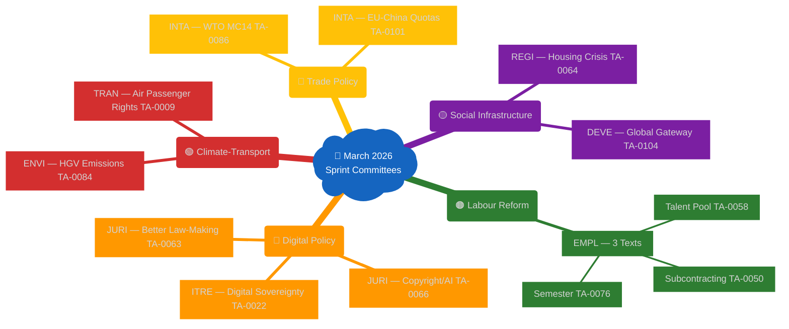
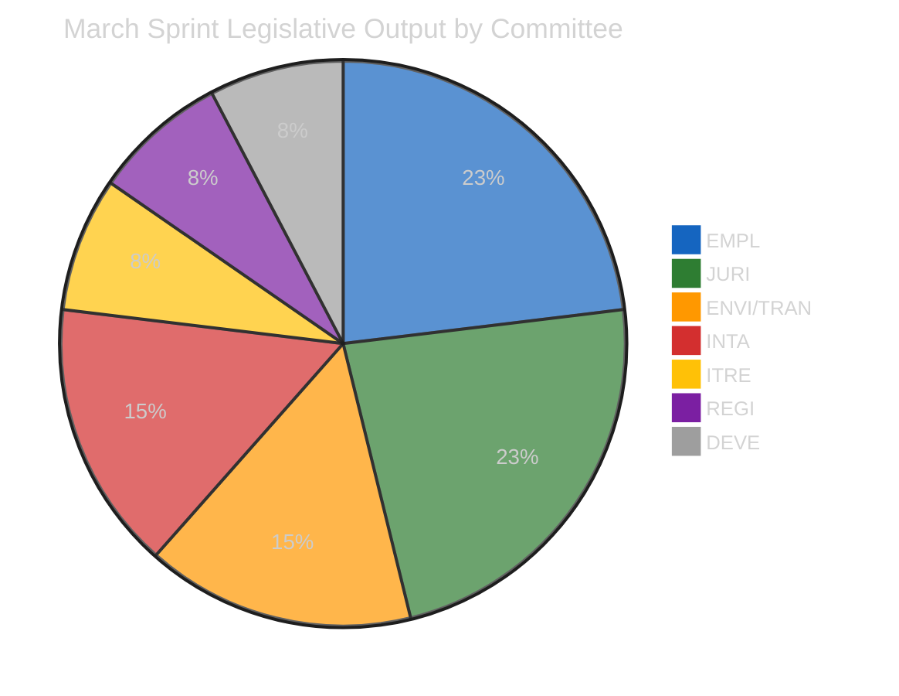

# 🏢 Committee Power Analysis — March 2026 Sprint Focus

**📅 Analysis Date**: 2026-04-17 | **📊 Confidence**: MEDIUM (degraded API mode)
**🔍 Period**: January–March 2026 | **🏢 Committees Analyzed**: 7 (EMPL, JURI, ITRE, ENVI, TRAN, INTA, REGI)

---

## 📊 Committee Power Ranking (March Sprint)

| Rank | Committee | Lead Texts (March) | Sprint Significance | Overall |
|------|-----------|-------------------|---------------------|---------|
| 1 | **EMPL** | TA-0050, TA-0058, TA-0076 (3 texts) | Highest output | ⭐⭐⭐⭐⭐ |
| 2 | **JURI** | TA-0066, TA-0063, TA-0088 (3 texts) | Digital/IP significance | ⭐⭐⭐⭐ |
| 3 | **ENVI/TRAN** | TA-0084, TA-0009 (joint) | Climate compliance milestone | ⭐⭐⭐⭐ |
| 4 | **ITRE** | TA-0022 (1 major text) | Sovereignty positioning | ⭐⭐⭐ |
| 5 | **INTA** | TA-0086, TA-0101 (2 texts) | Trade positioning | ⭐⭐⭐ |
| 6 | **REGI** | TA-0064 (1 text) | Housing policy breakthrough | ⭐⭐⭐ |
| 7 | **DEVE** | TA-0104 (1 text) | Global Gateway oversight | ⭐⭐ |

---

## 🏢 Committee Ecosystem Map

---

## 📈 Workload Distribution — March 2026

---

## 🏆 Committee Deep Profiles

### EMPL — March Sprint Champion

**Committee on Employment and Social Affairs** produced three adopted texts in five weeks — an exceptional output rate that reflects:
1. **Rapporteur maturity**: The subcontracting text (TA-0050) had been in committee for 14 months before final adoption; the Talent Pool was in second reading following extensive committee work since 2023.
2. **Political coalition stability**: The S&D-EPP centre alliance on social policy held through the March sprint despite external pressures (tariff crisis, defence spending).
3. **Cross-committee coordination**: The Talent Pool (EMPL lead, IMMI associated) and Semester (EMPL/SOCI joint) texts required multi-committee sign-off, demonstrating EMPL's capacity to coordinate with LIBE and other bodies.

**Institutional Power Score**: HIGH — EMPL is producing legislation that directly shapes Council negotiations in an area (labour migration) where member states have strong national interests. Its success in this sprint enhances its leverage in MFF negotiations for ESF+ (European Social Fund+) allocation.

### JURI — The Digital Gatekeeper

**Committee on Legal Affairs** produced three texts with markedly different characters: the copyright-AI resolution (TA-0066, own-initiative) is the most politically visible; the Better Law-Making review (TA-0063) is institutionally significant for inter-institutional relations; the Braun immunity waiver (TA-0088, March 26) is procedurally routine but politically sensitive given Braun's far-right profile.

**Institutional Power Score**: HIGH — JURI's copyright-AI position will shape Commission legislative proposals. The committee's gatekeeping role in digital policy (reviewing AI Act implementing acts, Digital Services Act compatibility) makes it increasingly central to EU governance.

### ENVI + TRAN — Climate-Transport Coalition

The joint ENVI/TRAN work on HGV emissions demonstrates how two committees with overlapping jurisdictions can reach a workable compromise. ENVI prioritises environmental outcomes; TRAN prioritises industrial viability. The credit banking mechanism represents TRAN's core demand (flexibility for manufacturers) accepted by ENVI in exchange for maintaining the overall decarbonisation trajectory.

**Institutional Power Score**: MEDIUM-HIGH — The climate-transport policy nexus is politically charged and both committees are competing for influence over the Commission's transport decarbonisation package.

---

## 🔗 Cross-Committee Dynamics

The March sprint reveals several important cross-committee dynamics:

1. **EMPL-JURI overlap on Platform Work**: The subcontracting text (TA-0050) and the copyright-AI text (TA-0066) both engage with the 'gig economy' and AI-platform nexus. A future Platform Work Directive revision will require EMPL-JURI coordination.

2. **ITRE-JURI convergence on digital governance**: The digital sovereignty text (ITRE) and the copyright-AI text (JURI) together form a 'digital independence' cluster. If the Commission drafts legislation in this area, the committee jurisdiction question (ITRE vs JURI vs IMCO) will be politically contentious.

3. **INTA-EMPL tension on trade-labour nexus**: The WTO positioning text (TA-0086, INTA) and the Talent Pool (TA-0058, EMPL) address the same underlying tension: how to maintain open trade/labour markets while protecting EU workers and standards. These committees have not formally coordinated their March outputs.

---

## ⚠️ Legislative Risk Assessment

| Pipeline Risk | Committee | Likelihood | Impact |
|---------------|-----------|------------|--------|
| Council dilutes Talent Pool | EMPL | HIGH | HIGH |
| Commission ignores copyright resolution | JURI | MEDIUM | MEDIUM |
| 2027 HGV review weakens standards | ENVI/TRAN | MEDIUM | MEDIUM |
| INTA-WTO coherence fractures | INTA | LOW-MEDIUM | MEDIUM |

🟡 **Overall pipeline health**: MEDIUM — Multiple texts advanced to Council stage but facing significant headwinds in interinstitutional negotiations.
