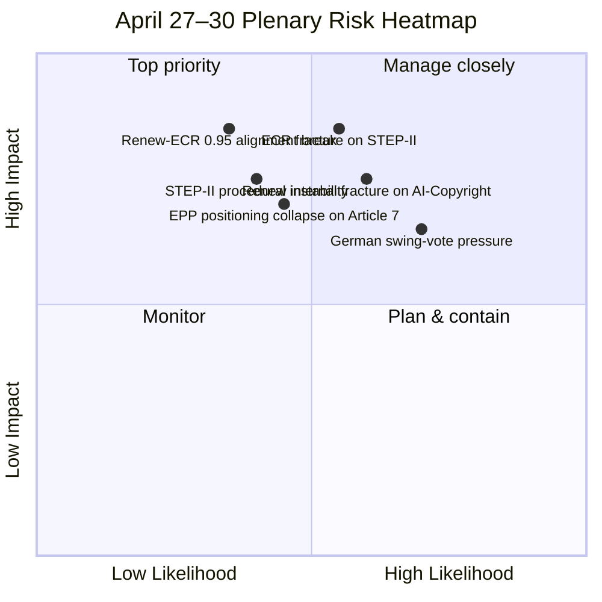

<!-- SPDX-FileCopyrightText: 2026 Hack23 AB -->
<!-- SPDX-License-Identifier: Apache-2.0 -->

# Executive Brief — Week Ahead: April 27–30 Strasbourg Plenary Pre-Brief | 2026-04-17

**Classification:** OSINT — Public Parliamentary Record
**Confidence:** 🟡 MEDIUM (degraded mode — EP API in residual Easter recess pattern; coalition arithmetic 🟢 HIGH)
**Run:** `analysis/daily/2026-04-17/week-ahead-run14/`
**Coverage:** 2026-04-27 → 2026-04-30 Strasbourg plenary
**Generated:** 2026-05-16 (retrospective brief, no new MCP calls)
**Primary sources:** EP MCP — 114 adopted acts 2026 (precomputed stats); coalition-dynamics; Renew-ECR cohesion 0.95; German GDP context.

---

## 🎯 BLUF

**The April 27–30 Strasbourg plenary is read by the run as "among the most consequential of EP10's second year" because three structurally different debates converge in the same four-day window: STEP-II defence procurement (the first joint-procurement test with binding participation commitments), AI training data and Copyright Directive Article 4 (the AI-copyright fracture line that runs through Renew), and Article 7 rule-of-law proceedings on Hungary and Poland (where Poland's Tusk-government rehabilitation request collides with continued Hungarian non-compliance).** The run's distinguishing analytical contribution is the **Renew-ECR cohesion 0.95 finding** — the highest cross-pole alignment score in EP10 to date, structurally produced by the European strategic autonomy agenda and now being stress-tested across multiple policy domains simultaneously. The **German economic backdrop** — GDP contraction −0.50% in 2024 and −0.87% in 2023 (two consecutive years) — places German MEPs as the pivotal swing voters in defence-procurement vs. industrial-competitiveness trade-offs. The run's three-debate convergence creates a *coalition stress test*: STEP-II requires Renew to align with ECR (defence autonomy), AI-Copyright fractures Renew internally (tech-friendly vs. social-democratic wings), and Article 7 forces EPP into an impossible positioning between Hungary (Orbán legacy) and Poland (Tusk rehabilitation). The week's binary stability indicator is the **ECR defection threshold on STEP-II**: ≤15 defections = managed; ≥25 = coalition crisis. The run is published in degraded-mode confidence because EP API still has residual Easter-recess pattern, but the coalition arithmetic itself is feed-verified.

---

## 🧭 3 Decisions This Brief Supports

| # | Decision | Who decides | Deadline | Evidence |
|:-:|----------|-------------|:--------:|----------|
| 1 | **ECR-defection trip-wire monitoring on STEP-II** — 15-defection threshold needs to be measured live | EDIS committee; coordinators | April 28 vote | §Strategic Intelligence #1 |
| 2 | **Renew internal-wing reconciliation on AI-Copyright** — tech-friendly vs. social-democratic wings need a doctrine before the Commission statement | Renew group leadership | April 27 morning | §Top Development #2 |
| 3 | **EPP positioning doctrine on Hungary + Poland asymmetry** — Tusk rehabilitation collides with Orbán-legacy constraint; default position is unstable | EPP group leadership | April 29 debate | §Top Development #3 |

---

## 📰 60-Second Read

- 🔴 **3 simultaneous structural debates** — STEP-II defence + AI-Copyright + Article 7 rule-of-law.
- 🟠 **Renew-ECR cohesion 0.95** — highest in EP10; stress-tested across all three domains.
- 🟢 **114 acts in 2026 (+46% vs 2025)** — record legislative momentum context.
- 🟡 **German GDP −0.50% (2024), −0.87% (2023)** — two-year contraction; German MEPs are pivotal swing voters.
- 🔵 **EP10 right-bloc seat share 52.3%** — structural reality behind every fracture risk.
- 🟣 **STEP-II arithmetic:** EPP + S&D + Renew + ECR = ~475 vs. 361 threshold — passable but ECR-conditional.
- 🩷 **ECR-defection threshold:** 15 = fracture signal; 25+ = coalition crisis.
- ⚪ **Confidence MEDIUM — degraded mode** — Easter-residual API pattern.

---

## 🎬 Three Convergent Debates (run's distinguishing contribution)

| Debate | Coalition test | Fracture line | Stability indicator |
|--------|---------------|---------------|---------------------|
| **STEP-II Defence Procurement** | Renew + ECR alignment | ECR nationalist wing (Hungary; PiS); Article 42 TEU | ECR defections ≤15 |
| **AI Training Data + Copyright Art. 4** | Renew internal | Tech-friendly (Dutch/French liberals) vs. social-democratic (German FDP) | Renew vote dispersion |
| **Article 7 Hungary + Poland** | EPP positioning | Hungary (Orbán legacy) vs. Poland (Tusk rehabilitation) | EPP-S&D joint resolution? |

---

## ⚠️ Risk Snapshot

---

## 🔮 Top Forward Triggers (this plenary week)

1. **April 27 (Mon) — Plenary opens.** Commission statement on AI-Copyright; Renew internal-wing position is the first visible signal.
2. **April 28 (Tue) — STEP-II procedure vote.** ECR defection count is the falsifier for Renew-ECR 0.95 alignment.
3. **April 29 (Wed) — Article 7 debate.** EPP positioning is the test.
4. **April 30 (Thu) — Plenary close.** Cross-debate coalition consistency check.
5. **End-April / early-May — Q2 fragmentation index update.** 6.59 baseline; whether plenary stress pushes it higher.

---

## 🛡️ Source-Quality Assessment

- **114-act figure (A1):** precomputed stats; primary EP record.
- **Renew-ECR 0.95 cohesion (A2):** coalition-dynamics analysis; behavioural verification pending April 28 vote.
- **German GDP context (A1):** IMF / Eurostat economic-context input; corroborates pivotal-swing-voter reading.
- **STEP-II Article 42 TEU reasoning (A2):** treaty-text grounded; high analytical confidence on the legal pressure point.
- **Net confidence:** 🟡 MEDIUM on synthesis (degraded API); 🟢 HIGH on the coalition arithmetic (475 vs. 361 is exact); 🟡 MEDIUM on the 15-defection threshold (heuristic, not feed-confirmed).

---

## 📎 Run Artifacts (Read-Before-Decide)

| Layer | Artifact | Why |
|-------|----------|-----|
| Article | `article.md` | Public-facing week-ahead narrative |
| Synthesis | `intelligence/synthesis-summary.md` | Three-debate convergence + cohesion findings (authoritative) |
| Classification | `classification/` | 7-dimension on plenary agenda |
| Intelligence | `intelligence/` | Renew-ECR 0.95 cohesion analysis |
| Companion | Run 172 (Q1 audit) / props-run43 (T-0) / breaking-run180-182 | Pre-plenary cluster |

---

**Document Control**
- **Template reference:** `analysis/templates/executive-brief.md`
- **Artifact path:** `analysis/daily/2026-04-17/week-ahead-run14/executive-brief.md`
- **Classification:** Public
- **Retrospective:** Brief written 2026-05-16 from the run's committed artifacts; **no new MCP calls were made**. The 🟡 MEDIUM degraded-mode confidence is preserved.
