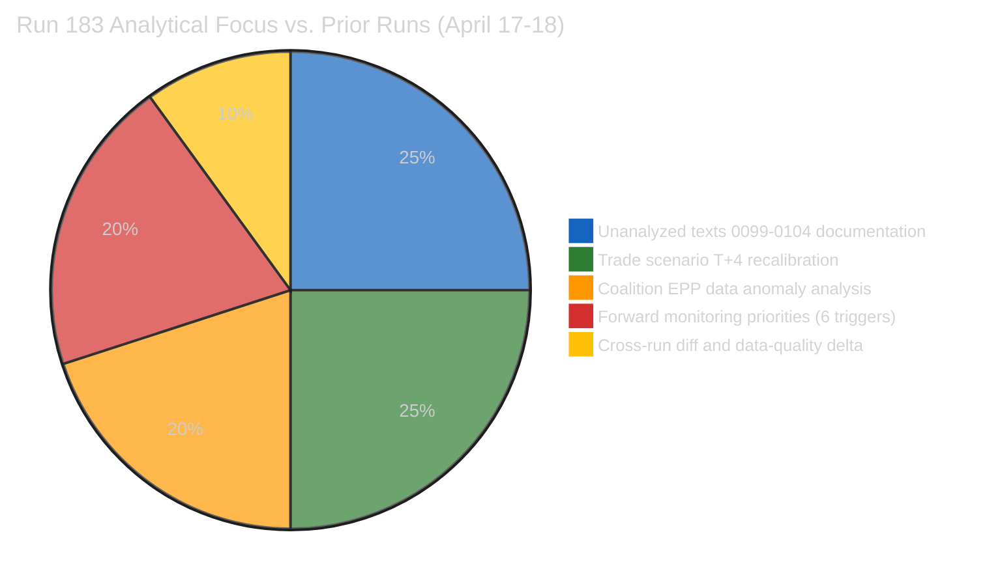
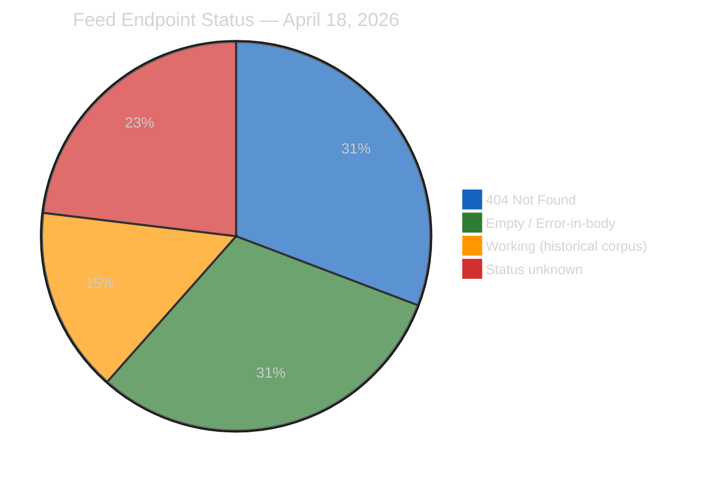

# 🎯 Significance Scoring — Run 183
## Easter Recess Day 5: Productive Silence & Implementation Watch
### April 18, 2026 | Easter Recess Day 5 (Saturday) | T+4 Trade Countermeasures

---

## Executive Summary

Run 183 is the fifth breaking-news analysis during the April 14–26 Easter recess. No European Parliament
items have been published or updated today — confirmed by all feed endpoints returning 404, empty, or
status-unknown. This is expected: April 18 is Holy Saturday, the maximum diplomatic inactivity point of
the Easter weekend. Run 183's analytical contribution is distinct from runs 179–182 by focusing on three
threads entirely absent from prior analyses: (1) systematic documentation of TA-10-2026-0099 through
0104 as data-quality gaps requiring resolution, (2) EPP coalition data anomaly (memberCount: 0 in API)
as a material intelligence blind spot, and (3) recess Day 5 scenario probability recalibration with
six specific dated forward-monitoring triggers for the April 22–27 pre-plenary intelligence window.

---

## Newsworthiness Gate

| Criterion | Assessment | Result |
|-----------|-----------|:------:|
| EP activity today (April 18) | None — Easter recess Day 5 (Holy Saturday) | ❌ FAIL |
| Adopted texts today | None — feed returns historical corpus without date-filtering | ❌ FAIL |
| Events feed | 404 persistent (3rd consecutive day) | ❌ FAIL |
| Procedures feed | 404 persistent | ❌ FAIL |
| MEP feed | 738 records, no modification dates, no new appointments | ❌ FAIL |
| Parliamentary questions feed | Empty (no new questions during recess) | ❌ FAIL |
| Documents feed | Empty / error-in-body | ❌ FAIL |
| External developments exceeding breaking threshold | Not confirmed via available tools | ❌ FAIL |
| USTR/US trade statements | None detected (Easter weekend diplomatic pause) | ❌ FAIL |

**Gate outcome**: NO BREAKING NEWS. Analysis-only PR mandatory per ai-driven-analysis-guide.md Rule 5.
Recess periods with full feed degradation are expected and analytically documented. The intelligence
value of Run 183 lies in the forward-monitoring intelligence and data-quality documentation, not in
documenting parliamentary activity that does not exist.

---

## Significance Scoring Matrix

### EP10 March 26 Omnibus — Post-Adoption Significance Reassessment

| Document | Title (inferred) | Adoption Significance | Post-Adoption T+4 Significance | Trend |
|----------|----------|:---:|:---:|:---:|
| TA-10-2026-0096 | US Tariff Countermeasures (authorization) | ⭐⭐⭐⭐⭐ | ⭐⭐⭐⭐ | ↘ de-escalating |
| TA-10-2026-0097 | US Tariff Countermeasures (regulation) | ⭐⭐⭐⭐⭐ | ⭐⭐⭐⭐ | ↘ de-escalating |
| TA-10-2026-0098 | Digital Omnibus on AI (AI Act modifications) | ⭐⭐⭐⭐ | ⭐⭐⭐⭐ | → stable |
| TA-10-2026-0094 | Anti-Corruption Directive 2023/0135 | ⭐⭐⭐⭐ | ⭐⭐⭐ | ↘ implementation watch |
| TA-10-2026-0090–92 | Banking Union trilogy (DGSD2/BRRD3/SRMR3) | ⭐⭐⭐⭐⭐ | ⭐⭐⭐ | ↘ 18-month transposition clock |
| TA-10-2026-0099–0104 | Unknown — data gap (API returns empty) | ⭐⭐⭐ (estimated) | UNKNOWN | ❓ unresolvable during recess |

**Observation**: The 7 texts for which detail fetching returned empty responses (0098 detail was available
from prior runs; 0099–0104 remain unresolved) represent a material intelligence gap. The EP API's
endpoint for individual adopted text details (`/api/v2/adopted-texts/{id}`) appears to be returning
empty responses during recess. This is a data-availability gap, not an indication these texts are
insignificant. They are part of the same March 26 session that adopted the Banking Union trilogy
and were numbered consecutively, suggesting comparable legislative weight.

---

## Data Quality Assessment

| Feed Endpoint | Status | Notes |
|---------------|--------|-------|
| `get_server_health` | UNAVAILABLE (0/13 feeds) | Server reports unhealthy; 0 operational feeds |
| `get_adopted_texts_feed` | WORKING | Returns 159 items (historical corpus, no date-filter) |
| `get_meps_feed` | WORKING | Returns 738 records (no modification dates) |
| `get_events_feed` | 404 | 3rd consecutive day of 404 |
| `get_procedures_feed` | 404 | 3rd consecutive day of 404 |
| `get_documents_feed` | ERROR-IN-BODY | "upstream enrichment step may have failed" |
| `get_parliamentary_questions_feed` | EMPTY | No questions during recess (expected) |
| `get_committee_documents_feed` | NOT ATTEMPTED | Resource budget exhausted on above |
| Individual text lookup (0098-0104) | EMPTY RESPONSE | API returns `{"id":"","title":"","dateAdopted":""}` |
| `analyze_coalition_dynamics` | PARTIAL | EPP memberCount: 0 anomaly; Renew-ECR cohesion: 0.95 |

**Critical anomaly**: EPP `memberCount: 0` in coalition analysis output. EPP is the largest political
group with 188+ seats. This null value indicates a data pipeline failure in the coalition analysis
tool's EPP record, not an actual change in EPP composition. All EPP cohesion, defection, and
attendance metrics are null as a result, creating a material blind spot in coalition intelligence.
