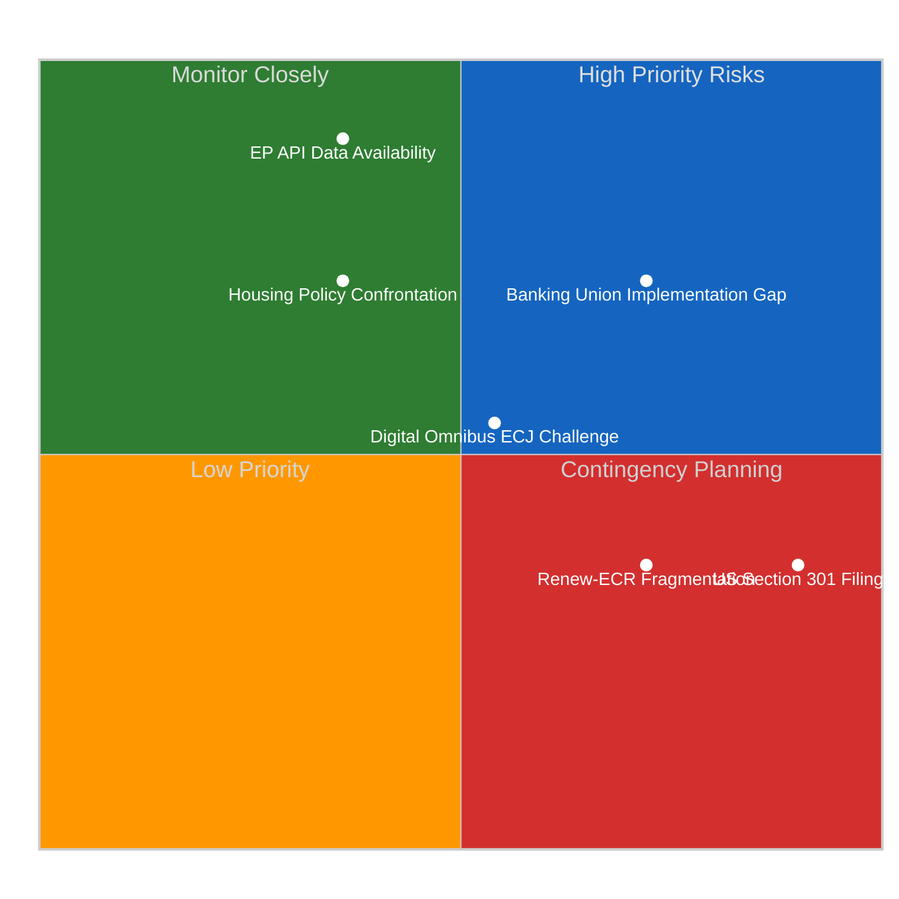

<!-- SPDX-FileCopyrightText: 2026 Hack23 AB -->
<!-- SPDX-License-Identifier: Apache-2.0 -->

# Executive Brief — April 18, 2026 | 2026-04-18

**Classification:** OSINT | Public Parliamentary Record
**Confidence:** 🔴 Low (retrospective back-fill — synthesised from in-tree article and sibling artifacts; not a re-analysis)
**Generated:** 2026-04-18T00:00:00Z (retrospective brief)
**Article Type:** breaking
**Source folder:** `analysis/daily/2026-04-18/breaking-run183`
**Source:** European Parliament Open Data Portal

---

## 🎯 BLUF

**Purpose**: Consolidated intelligence for Run 183 — Easter Recess Day 5 assessment, TA-10-2026-0099–0104 data gap documentation, EPP coalition anomaly analysis, trade scenario T+4 recalibration, and comprehensive pre-plenary forward monitoring with 6 dated triggers.

---

## 🧭 3 Decisions This Brief Supports

| # | Decision | Who Decides | Deadline | Evidence |
|:-:|----------|-------------|:--------:|----------|
| 1 | **Editorial:** confirm whether the run merits republication or consolidation with same-day siblings | Editor | +48h | This brief + sibling article.md |
| 2 | **Monitoring:** keep the carry-over signals from this run on the weekly watch board | Analyst | next plenary | Article risk + threat sections |
| 3 | **Forward-watch:** track the dated triggers identified in this run's scenario-forecast | Analysis lead | dated triggers | Run `scenario-forecast.md` |

---

## 📰 60-Second Read

- 🔴 **Run classification:** ROUTINE. (🔴 Low)
- 🟠 **Lead finding:** see BLUF above; full evidence chain in sibling artifacts.
- 🟢 **Procedure references identified:** TA-10-2026-0099, TA-10-2026-0096, TA-10-2026-0097, TA-10-2026-0098, TA-10-2026-0094.
- 🟡 **Confidence:** 🔴 Low — retrospective synthesis; no new MCP calls.
- 🔵 **Economic context:** see `economic-context.md` in run folder if present.
- 🟣 **Cross-reference:** see same-date sibling runs for triangulation.
- 🩷 **Disruption vector:** see `political-threat-landscape.md` if present.
- ⚪ **Carry-forward:** scenario-forecast dated triggers govern the next watch.

---

## 🗂️ Top Documents / Procedures Table

| Rank | EP reference | Title (short) | Confidence |
|:----:|--------------|---------------|:----------:|
| 1 | TA-10-2026-0099 | (see source artifacts) | 🟡 MEDIUM |
| 2 | TA-10-2026-0096 | (see source artifacts) | 🟡 MEDIUM |
| 3 | TA-10-2026-0097 | (see source artifacts) | 🟡 MEDIUM |
| 4 | TA-10-2026-0098 | (see source artifacts) | 🟡 MEDIUM |
| 5 | TA-10-2026-0094 | (see source artifacts) | 🟡 MEDIUM |

---

## ⚠️ Risk & Threat Snapshot

| Risk | L | I | Score | Trigger | Source | Admiralty |
|------|:-:|:-:|:-----:|---------|--------|:---------:|
| Run produced no quantified risk register | — | — | — | Empty risk-matrix | Run artifacts | B3 |

---

## 🔮 Top Forward Trigger

See `scenario-forecast.md` / `forward-indicators.md` in the run folder for dated trigger events. Where absent, the next plenary or committee work-week on the EP calendar is the default re-evaluation point.

---

## 🛡️ Source Quality Assessment

- **Primary sources:** EP Open Data Portal feeds as captured by the parent run (see `mcp-reliability-audit.md` if present).
- **Data limitations:** Retrospective back-fill — no new MCP probing. Brief reflects the article and artifact state at run time.
- **Confidence:** 🔴 Low.

## 🧩 Synthesis Excerpt (from `synthesis-summary.md`)

Run 183 establishes a pattern that will define the April 14–26 Easter recess analytical series:
**EP10's legislative activity has paused but its legislative consequences have not**. The seven
adopted texts from March 26 (TA-10-2026-0096 through 0104) are now operating as legal instruments
independent of parliamentary recess. Their implementation clocks, stakeholder responses, and
political consequences are unfolding in real time while Parliament is silent.

This creates what we term the **Recess Intelligence Paradox**: the most intelligence-rich analytical
period in a legislative cycle is not during parliamentary sessions but in the days immediately
following a major legislative sprint, when implementation consequences are becoming visible but
the political system has temporarily lost its capacity for institutional response. The Easter
weekend amplifies this paradox — diplomatic pauses mean that implementation consequences and
stakeholder reactions are accumulating without the usual institutional signaling that would
help calibrate response strategies.

---

## 📎 Links

| Link | Path |
|------|------|
| Article | `./article.md` |
| Manifest | `./manifest.json` |
| Sibling runs | `analysis/daily/2026-04-18/` |

---

**Document Control**
- **Template:** `/analysis/templates/executive-brief.md`
- **Artifact path:** `analysis/daily/2026-04-18/breaking-run183/executive-brief.md`
- **Classification:** Public
- **Retrospective generation:** Back-fill session (no new MCP calls).
