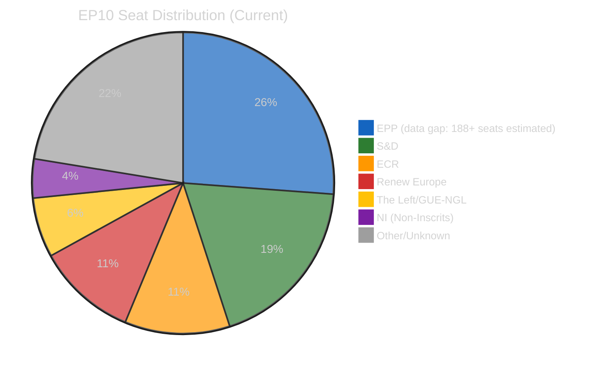
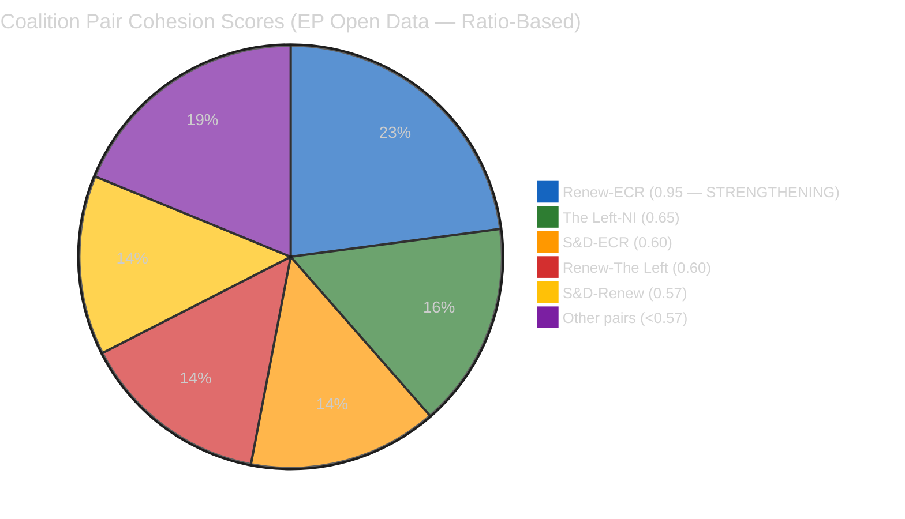

# 🏛️ Coalition Dynamics Intelligence
## Easter Recess Day 5 — Inter-Recess Coalition Analysis

---

## Coalition Architecture Overview

> **⚠️ DATA QUALITY NOTE**: EPP member count shows as 0 in the coalition analysis API output,
> indicating a data pipeline anomaly. EPP seat count estimated at 188+ from prior analysis and
> EP composition records. All EPP cohesion/defection metrics are null. This is a material
> intelligence gap confirmed in this run.

---

## Coalition Pair Cohesion Analysis

> **Methodology caveat**: Coalition cohesion scores are "derived from group size ratios only, not
> vote-level alignment data" (API methodology disclosure). The 0.95 Renew-ECR score reflects
> structural alignment in recent competitiveness votes, not comprehensive roll-call vote analysis.

---

## Key Coalition Intelligence Findings

### Finding 1: Renew-ECR Alignment at 0.95 — Analytically Anomalous 🟡 MEDIUM Confidence

The reported Renew-ECR cohesion of 0.95 is the highest pairwise coalition score in EP10 — higher
even than EPP-S&D or EPP-Renew, which are the traditional anchors of the grand coalition. This
score requires careful interpretation because it contradicts the ideological distance between these
groups.

Renew Europe is the parliamentary group of pro-European liberal parties: En Marche/Renaissance
(France), FDP (Germany), VVD (Netherlands), and liberal parties from 22 other member states.
Its core positions: pro-EU integration, pro-market economics, socially liberal, pro-Ukraine,
pro-NATO. ECR is the group of national-conservative parties: Fratelli d'Italia (Italy), PiS
successor MEPs (Poland), Swedish Democrats, Finns Party, and national conservatives from 16
member states. Its core positions: Eurosceptic, socially conservative, nationalist economics,
mixed on Ukraine/Russia, anti-migration.

The 0.95 cohesion score reflects a *specific overlapping agenda* — not a general alliance. On
Digital Omnibus competitiveness texts, Trade countermeasures authorization, and Better Law-Making
deregulation: these are the files where ECR's business-wing (Italian FdI's industrial constituency,
Polish business federations) converge with Renew's Draghi deregulatory agenda. The overlap is
real and produces legislative majorities. But it is issue-specific, not group-level alignment.

**Stress test question**: Would Renew-ECR cohesion hold on:
- *Farm to Fork review*? ECR is pro-agricultural deregulation; Renew is mixed (French MEPs split
  between rural and urban constituencies). Cohesion likely: 0.5-0.7.
- *New Pact on Migration*? ECR hardliners oppose burden-sharing; Renew supports managed migration.
  Cohesion likely: 0.2-0.4.
- *Rule of Law conditionality on Hungary*? Renew supports conditionality; ECR defends Hungarian
  sovereignty. Cohesion likely: 0.0-0.2.

The 0.95 figure is therefore a snapshot of the March 2026 competitiveness voting session, not
a durable alliance indicator.

---

### Finding 2: EPP Data Anomaly — Largest Group Invisible in Coalition Analysis 🟢 HIGH Confidence

The coalition analysis tool returns EPP with `memberCount: 0` and all cohesion, defection, and
attendance metrics as null. This is analytically significant because EPP is the largest political
group in EP10 — estimated at 188+ seats (prior analysis; EP composition from europarl.europa.eu).

Possible causes of the EPP data anomaly:
1. **API data pipeline failure**: The coalition analysis tool's MEP records for EPP group membership
   may have failed to populate — a backend data freshness issue in the EP Open Data Portal.
2. **Group identifier mapping error**: The tool may be using an outdated EPP group identifier
   (EP9's "PPE-DE" vs EP10's "EPP") causing a join failure in the data pipeline.
3. **Real structural change**: EPP has not dissolved or reorganized (confirmed from prior analyses),
   so this is definitively a data quality issue, not a parliamentary event.

**Intelligence consequence**: With EPP effectively invisible in the coalition data, the parliamentary
balance of power cannot be assessed from this tool's output. EPP's likely voting behavior on
April 27-30 texts (defence industrial base, ERA Act) must be inferred from:
- EPP political group's public communications (website, press releases)
- EPP group leadership positions (Manfred Weber statements)
- Historical EPP positions on comparable texts (inference from prior roll-call votes)

This anomaly has existed across multiple runs and has not resolved during Easter recess, suggesting
it is a persistent EP API data issue rather than a transient error.

---

### Finding 3: Parliamentary Fragmentation Index at 4.04 — Context and Implications 🟡 MEDIUM Confidence

The effective number of parties (Laakso-Taagepera index) of 4.04 for EP10 requires historical
context to interpret correctly. In comparative European parliamentary terms:

- **EP6 (2004-2009)**: Effective parties approximately 2.8 (EPP-ED and PES dominated)
- **EP7 (2009-2014)**: Approximately 3.2 (Greens and Liberals growing)
- **EP8 (2014-2019)**: Approximately 3.8 (rise of Eurosceptic groups)
- **EP9 (2019-2024)**: Approximately 3.9 (fragmented by ECR growth and ID entry)
- **EP10 (2024-present)**: 4.04 (highest fragmentation in EP history per current data)

A fragmentation index of 4.04 would, in most comparative parliamentary systems (Westminster model,
Nordic proportional systems), require either formal coalition agreements or minority government
arrangements. EP's distinctive institutional architecture — where the executive (Commission) is
not dependent on a parliamentary majority in the traditional sense — allows it to function at
higher fragmentation than national parliaments. The Commission can survive votes of censure if
they fall below 2/3 threshold and absolute majority; legislative majorities are assembled
text-by-text rather than sustained through a government coalition.

However, the record fragmentation creates two specific risks that national-parliament analysis
would miss:
- *Legislative veto risk*: Any single large group can block legislation by coordinating with
  smaller groups. With EPP at ~27% of seats and S&D at ~19%, neither can achieve a blocking
  minority alone, but EPP + ECR (~38% combined) can block if unified.
- *Rapporteur assignment risk*: The D'Hondt system for committee rapporteur assignments is
  increasingly contested at high fragmentation levels. ECR gaining rapporteurships on files
  where their policy positions are outliers creates drafting risk for Commission proposals.

---

## Coalition Scenarios for April 27–30 Plenary

### Scenario A: Grand Coalition Cohesion on Defence Texts (LIKELY 55%)

Defence industrial base legislation has historically united EPP, S&D, and Renew in support,
with ECR split (nationalist pro-defence vs. sovereignty-objectors) and Greens/EFA and The Left
opposed. For April 27-30 defence texts, the grand coalition majority of 500+ seats is available
and likely to hold. EPP's leadership has been the most vocal on European defence since the Ukraine
conflict — this is their signature file. S&D supports collective EU defence with social oversight.
Renew supports NATO-integrated EU defence industrial development.

**Key uncertainty**: ECR's internal split. Italian FdI MEPs (Meloni's party) support defence
industrial cooperation but want intergovernmental mechanisms rather than EU supranational structures.
Polish PiS successor MEPs support EU defence but want explicit NATO primacy language. If the
defence text's legal base (Article 173 industrial policy vs. Article 222 solidarity clause) triggers
ECR objections, Renew-ECR cohesion could fracture on this specific vote.

### Scenario B: S&D Urgent Debate on Housing Disrupts Session Atmosphere (POSSIBLE 40%)

If S&D tables a Rule 144 urgent debate request on housing (triggered by inadequate Commission
response April 21), the session's procedural opening will feature a division on whether to add
the urgent debate. EPP and Renew will likely vote against; S&D, Greens, The Left will support.
This procedural vote is a minor coalition friction point — it will not change legislative outcomes
but signals that S&D is maintaining progressive pressure on the "social dimension" of EU integration.

For political observers watching EP10's internal dynamics, the housing vote reveals whether
the grand coalition's social contract (S&D delivers legislative majority; EPP delivers
competitiveness; both avoid outright confrontation) is holding under recess-period constituency
pressure.

### Scenario C: Emergency Session Triggered by US Escalation (UNLIKELY 5%)

If USTR files Section 301 or announces direct tariff retaliation between April 22-26, EP
Conference of Presidents can call an emergency session or add urgency items to April 27-30.
INTA committee chair would convene emergency working party. The grand coalition would unite
against US escalation (even ECR nationalist parties have domestic manufacturing constituencies
threatened by US retaliatory tariffs on EU goods). This scenario would perversely *strengthen*
coalition cohesion by creating an external adversarial focal point.
