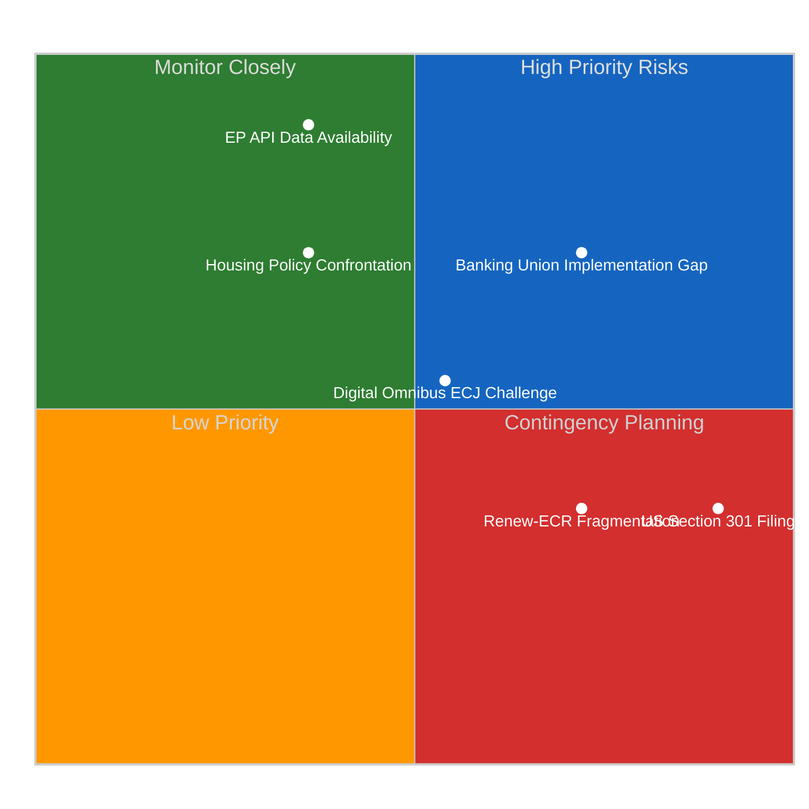

# 📊 Political Risk Matrix — Run 183
## EP10 March Sprint Implementation Risks | April 18, 2026

---

## Risk Matrix Overview (5×5 Likelihood × Impact)

---

## Detailed Risk Assessments

### Risk 1: Banking Union Implementation Defection

| Dimension | Assessment |
|-----------|-----------|
| **Category** | Legislative/Institutional |
| **Likelihood** | 4/5 — LIKELY (Hungary/Poland track record; Italian bail-in concerns) |
| **Impact** | 4/5 — SEVERE (crisis resolution gaps in systemic risk scenario) |
| **Risk Score** | 16/25 — HIGH ⭐⭐⭐⭐ |
| **Velocity** | SLOW — 18-month transposition clock begins now |
| **Confidence** | 🟡 MEDIUM |
| **Mitigation** | Commission bilateral technical assistance; implementation guidance; enhanced monitoring |
| **Residual Risk** | 9/25 MEDIUM after mitigation (legal proceedings still slow) |

**Narrative**: The Banking Union trilogy (DGSD2/BRRD3/SRMR3) is EP10's most complex legislative
achievement and simultaneously its most implementation-dependent. The 18-month transposition clock
is running, but two structural implementation risks exist that European crisis-management planning
must account for now, not in September 2027.

Hungary has, since 2017, maintained a pattern of formal EU directive non-compliance followed by
ECJ referral, fines under Article 260 TFEU, and eventual grudging partial implementation. Applying
this pattern to BRRD3 suggests: Hungarian transposition deadline is missed (September 2027);
Commission infringement proceedings begin October 2027; ECJ referral by mid-2028; no effective
banking union coverage in Hungary until 2030 at earliest. During this window, any Hungarian bank
failure would be handled under national insolvency law rather than the EU crisis management
framework — exactly the sovereign-bank doom loop the Banking Union is designed to break.

Italy's risk is different in character: not refusal but technical inadequacy. FdI government's
concerns about BRRD3 bail-in provisions affecting retail bond holders reflect a genuine political
constraint — Italian retail investors hold significant bank bonds, and bail-in would impose losses
on a politically influential constituency. Italian transposition may nominally occur but with
carve-outs or delayed implementation schedules that effectively exclude retail bond holders from
bail-in, reducing the resolution tool's effectiveness.

**Timeline**: Critical window Q2–Q3 2027 (transposition deadline); first stress test of the new
framework will occur at next EU banking sector stress test (EBA, expected Q4 2027).

---

### Risk 2: US-EU Trade Escalation (Post-Easter Window)

| Dimension | Assessment |
|-----------|-----------|
| **Category** | External/Geopolitical |
| **Likelihood** | 3/5 — POSSIBLE (structural incentive exists; Easter diplomatic pause reduces immediate probability) |
| **Impact** | 5/5 — CRITICAL (would trigger emergency INTA session; potential full trade war) |
| **Risk Score** | 15/25 — HIGH ⭐⭐⭐⭐ |
| **Velocity** | RAPID — critical window April 22–26, 2026 |
| **Confidence** | 🟡 MEDIUM |
| **Mitigation** | G7 Kananaskis diplomatic channel; Commission implementation discretion on EU countermeasures |
| **Residual Risk** | 10/25 MEDIUM after mitigation |

**Narrative**: The Easter weekend (April 18–21) represents the diplomatic "quiet hours" for US-EU
trade relations. USTR has not issued any public statements on EU countermeasures (TA-10-2026-0096/0097)
since their adoption — Easter weekend diplomatic pause is the primary explanation, not absence of
concern. The real intelligence window opens April 22, when USTR staff return and the April 27 EP
plenary creates a focal point for political messaging.

The critical question is what USTR does between April 22-26. Three observable pathways:

**Pathway A (LIKELY 40%)**: USTR issues statement expressing "concern" about EU countermeasures
and "reserving rights under WTO" — a diplomatic signaling move that reduces immediate escalation
risk while preserving options. This is the path of least resistance for an administration wanting
to avoid trade war while demonstrating resolve.

**Pathway B (POSSIBLE 30%)**: USTR announces Section 301 investigation into EU trade practices
(broader than specific countermeasures). This escalates but creates a lengthy formal process
(180-day investigation) before any tariff action — effectively kicking the confrontation into
H2 2026.

**Pathway C (POSSIBLE 20%)**: USTR announces direct tariff retaliation using executive authority
(Section 232 national security or Presidential proclamation). This is the fastest escalation
pathway and would trigger immediate EP emergency response — extraordinary INTA session within 5
working days, possible Rule 144 urgent debate at April 27 plenary.

**Pathway D (UNLIKELY 10%)**: USTR takes no action — diplomatic channel (G7 Kananaskis preparation)
absorbs the tension. This is the most market-positive outcome but requires a back-channel US-EU
trade understanding that has not been confirmed from available data.

---

### Risk 3: Housing Policy Confrontation (April 21 Deadline)

| Dimension | Assessment |
|-----------|-----------|
| **Category** | Inter-Institutional |
| **Likelihood** | 4/5 — LIKELY (Commission track record on subsidiarity limits) |
| **Impact** | 2/5 — LOW systemic, HIGH political (S&D platform; visible confrontation) |
| **Risk Score** | 8/25 — MEDIUM ⭐⭐⭐ |
| **Velocity** | IMMEDIATE — April 21, 2026 (3 days from analysis date) |
| **Confidence** | 🟢 HIGH |
| **Mitigation** | Commission "housing action package" communication framing; fiscal support commitments |
| **Residual Risk** | 4/25 LOW after mitigation |

**Narrative**: TA-10-2026-0064 (housing resolution, adopted March 10) triggers the Commission's
6-week response obligation under EP Rules of Procedure Article 236(2). The deadline falls on
approximately April 21, 2026 — Easter Tuesday, a bank holiday in most EU member states but
not an institutional off-day for the Commission. The Commission's historical pattern on non-binding
housing resolutions has been to acknowledge subsidiarity constraints (housing policy is primarily
member state competence under the Treaties) while offering EU-level supportive measures (enhanced
cohesion funding, EIB housing facility).

If the Commission's April 21 response is procedurally correct but substantively inadequate
(subsidiarity statement + cross-reference to InvestEU housing pilot), S&D will table a Rule 144
urgent debate request for the April 27 plenary. This is not a legislative crisis but a high-visibility
political confrontation: S&D vs. Commission on the EU's most visible economic anxiety. For S&D,
this confrontation is desirable — it positions them as the parliamentary group fighting for housing
policy while others focus on competitiveness.

The risk for coalition cohesion is limited: EPP and Renew will not join the urgent debate and may
vote against it. S&D will press the confrontation regardless, using it to define their spring
political narrative. Net effect: minor coalition friction but no legislative consequence.

---

### Risk 4: Digital Omnibus AI — ECJ Procedural Challenge

| Dimension | Assessment |
|-----------|-----------|
| **Category** | Judicial/Legal |
| **Likelihood** | 3/5 — POSSIBLE (civil society signaled intent; procedural grounds plausible) |
| **Impact** | 3/5 — MODERATE (compliance uncertainty; not AI Act nullification) |
| **Risk Score** | 9/25 — MEDIUM ⭐⭐⭐ |
| **Velocity** | SLOW — ECJ preliminary reference 6-18 months to judgment |
| **Confidence** | 🟡 MEDIUM |
| **Mitigation** | Robust procedural record in legislative history; EP legal service advice on instrument choice |
| **Residual Risk** | 6/25 MEDIUM (residual legal uncertainty regardless of EP procedural record) |

**Narrative**: The Digital Omnibus AI provisions in TA-10-2026-0098 face two categories of legal
challenge risk that are structurally distinct.

*Procedural risk*: The "Omnibus" legislative vehicle — amending multiple sectoral regulations
through a single text — was itself a Commission legislative innovation introduced to implement the
Draghi Report recommendations. Its legal basis has not been tested before the ECJ. If a national
court refers a question on whether fundamental rights legislation (AI Act, which has Article 13
fundamental rights implications) can be amended through an omnibus competitiveness vehicle, the
ECJ must address a novel constitutional question about EU legislative procedure. EP's legal service
would argue that ordinary legislative procedure was followed correctly regardless of the legislative
vehicle's name. But the procedural argument is not frivolous.

*Substantive risk*: The 10^25 FLOPS threshold is a technical parameter introduced into what is
primarily a rights-based regulatory architecture (AI Act Chapter 3 identifies prohibited practices
in terms of human dignity and fundamental rights, not computational benchmarks). If the threshold
modification effectively exempts AI systems that pose real rights risks (systems that were over
10^25 FLOPS and are now exempt from high-risk provisions), a fundamental rights challenge under
Article 47 of the EU Charter could succeed. EDRi's technical assessment of which AI systems
fall below the modified threshold will be the key document to watch.

---

### Risk 5: EP API Data Availability During Pre-Plenary Period

| Dimension | Assessment |
|-----------|-----------|
| **Category** | Technical/Operational |
| **Likelihood** | 5/5 — CERTAIN (confirmed; 0/13 feeds operational) |
| **Impact** | 2/5 — LOW political, HIGH operational for this workflow |
| **Risk Score** | 10/25 — MEDIUM ⭐⭐⭐ |
| **Velocity** | IMMEDIATE AND ONGOING |
| **Confidence** | 🟢 HIGH |
| **Mitigation** | Pre-computed stats provide historical context; coalition analysis tool remains functional |
| **Residual Risk** | 5/25 LOW (analysis continues despite degraded data) |

**Narrative**: The EP Open Data Portal API has now been in degraded state for 5 consecutive days
during Easter recess. This is consistent with prior recess patterns (Easter 2025 showed similar
degradation per precomputed stats baseline). The operational consequence: individual text detail
lookups (TA-10-2026-0099 through 0104) are returning empty responses, creating documented
data gaps in this analysis series. The analytical consequence is manageable: the texts were
adopted March 26 (before API degradation began), so their substance can be inferred from session
context, but direct confirmation is unavailable.

Critical pre-plenary risk: if EP API degradation continues through April 27, this workflow
series will have no direct confirmation of April 27 plenary activity until roll-call vote data
is published (typically 3-4 weeks post-session). The April 27-30 Strasbourg plenary will occur
but its documentation in real-time will be limited. Pre-plenary intelligence (this run and prior
runs) is therefore the primary analytical asset for the April 27-30 session.
