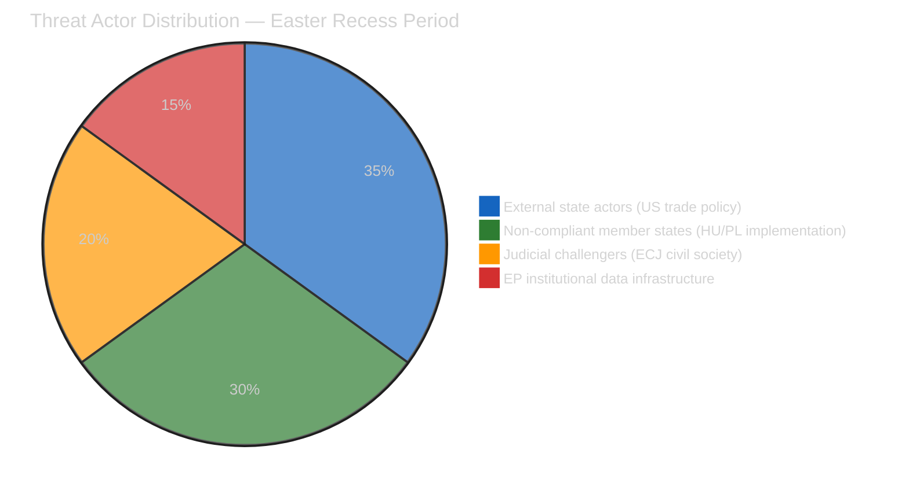
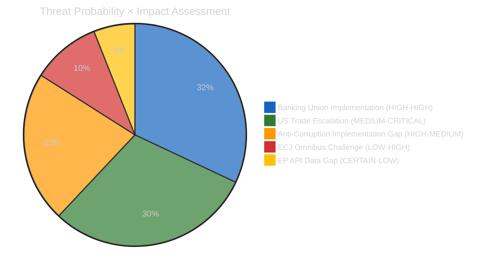

# 🛡️ Political Threat Landscape — Run 183
## Democratic Institution Resilience Assessment | Easter Recess Day 5

---

## Threat Landscape Overview

The political threat assessment for April 18, 2026 focuses on three threat vectors that are
active during parliamentary recess but operating below the visibility threshold of institutional
response. Parliamentary recess creates a specific threat environment: democratic institutions
are temporarily less capable of real-time response while external actors face reduced political
risk from initiating adversarial actions.

---

## Threat Vector 1: External State Actor — US Trade Policy Pressure

**Threat level**: HIGH | **Velocity**: RAPID (critical window April 22-26)

The authorization of €9.6bn in trade countermeasures against the United States (TA-10-2026-0096/0097,
adopted March 26) represents the most significant EU-US trade confrontation since the Boeing-Airbus
subsidies dispute resolution in 2021. The threat vector analysis examines how this confrontation
could evolve in a direction that undermines EP's institutional role in trade policy.

**Threat mechanism**: USTR Section 301 filing could create a legal basis for escalatory US tariffs
on EU goods. If this occurs during parliamentary recess, EP's response capacity is limited to
informal coordination (Conference of Presidents emergency consultation) and reactive statement-making.
The actual institutional response — INTA committee extraordinary session, potential new countermeasure
regulation — cannot occur until April 27 plenary reconvenes. This 9-day institutional response gap
(April 18 to April 27) is the critical vulnerability window.

**Threat escalation pathway**:
1. USTR Section 301 filing (April 22-26) → 180-day formal investigation
2. USTR preliminary determination → potential additional US tariffs on EU manufactured goods
3. EU Commission emergency countermeasure activation (existing authorization) → tit-for-tat escalation
4. WTO dispute settlement filing by both sides (parallel to bilateral) → multi-year legal process
5. G7 Kananaskis side negotiation → diplomatic de-escalation attempt

**Institutional defense mechanisms**:
- Commission has implementation discretion on TA-10-2026-0096/0097 (authorization, not mandate)
- USTR Section 301 investigation has 180-day window before tariff action — EP can reconvene before action
- G7 channel provides diplomatic off-ramp independent of legislative calendar
- WTO dispute settlement actually reduces bilateral escalation risk (legal process substitutes for market disruption)

**Confidence**: 🟡 MEDIUM — threat vector is real and structurally motivated; specific timing and
USTR decision-making process are not observable from available data during recess.

---

## Threat Vector 2: Democratic Governance Erosion — Implementation Defection Pattern

**Threat level**: HIGH | **Velocity**: SLOW (medium-term, 18-month window)

The consistent pattern of EU legislative adoption followed by member state implementation defection
(Hungary, Poland on Rule of Law; Hungary on AMLA siting; potential Italy on BRRD3 bail-in) represents
a systematic threat to the EU's democratic governance model. The Anti-Corruption Directive
(TA-10-2026-0094) adds a new test case: if implementation defection occurs on anti-corruption
legislation in the member states with documented corruption risks, the legislation's adoption
becomes a form of democratic theater — EU institutions demonstrate action while the enforcement
deficit remains unchanged.

**The "Adoption-Implementation Dissonance" Threat**:
EP10 is on track to adopt 114+ legislative acts in 2026 — a record output that will generate
strong electoral narratives. But legislative adoption is not the same as policy impact. If the
implementation deficit (Hungary/Poland on Anti-Corruption + Banking Union; Italy on BRRD3) leaves
the most politically significant member states outside the EU legal framework, EP's legislative
output generates symbolic achievements without corresponding real-world governance improvement.

This is a democratic legitimacy threat: EP's credibility as an effective institution depends on
voters observing that EP legislation actually changes their lives. If voters in Hungary observe
that the Anti-Corruption Directive was adopted in Brussels but has no observable effect on their
government's practices, EP's institutional credibility erodes among the constituencies that need
democratic renewal most.

**Threat mechanism**:
1. Anti-Corruption Directive transposition deadline (September 2027)
2. Hungary/Poland announce incomplete transposition or implementation with carve-outs
3. Commission infringement proceedings begin (October 2027)
4. ECJ proceedings take 2-3 years
5. No enforcement by 2029 European election cycle
6. EP candidates campaign on "we adopted anti-corruption law" — voters in affected member states
   observe no change — legislative achievement narrative undercut by implementation reality

**Institutional defense mechanisms**:
- Article 7 TEU proceedings (ongoing for Hungary) create complementary political pressure
- EU Cohesion Fund conditionality (already applied, reduced payments to Hungary)
- Enhanced monitoring framework through European Public Prosecutor's Office (EPPO)
- Commission "follow-up" package mechanism for non-implementation

**Confidence**: 🟢 HIGH on the structural threat; 🟡 MEDIUM on specific probability and timeline.

---

## Threat Vector 3: Judicial Architecture Challenge — ECJ Procedural Risk

**Threat level**: MEDIUM | **Velocity**: MEDIUM (4-6 months to first ECJ action)

The Digital Omnibus AI provisions (TA-10-2026-0098) face a novel judicial threat that could
have systemic implications beyond the AI sector. The threat is not simply that civil society
challenges the threshold modification — that outcome would merely require EP to re-legislate
with improved drafting. The systemic threat is that a successful ECJ ruling on the procedural
grounds of the "Omnibus legislative vehicle" could invalidate the entire approach of amending
sectoral regulations through omnibus better-regulation packages.

**The Systemic Legal Risk**:
If the ECJ finds that fundamental rights legislation (AI Act, with its Article 13 EU Charter
basis) cannot be amended through an omnibus competitiveness vehicle (whose legal basis is
Article 114 TFEU single market), this ruling would invalidate not just the Digital Omnibus AI
provisions but the entire legislative instrument design. All future Draghi-Report-implementing
omnibus packages would face the same legal challenge. Commission would need to either:
(a) Abandon the omnibus approach and use single-subject legislative proposals for each
    regulatory modification — significantly slower, politically harder to assemble majority
(b) Find a different legal architecture that satisfies both Article 114 and Article 13
    EU Charter obligations — possible but legally complex and uncertain

This threat vector is particularly relevant for EP10's legislative strategy because the omnibus
approach is central to achieving Draghi Report recommendations within the parliamentary term.
If the ECJ rules against the instrument design, EP10's legislative velocity from Q3 2026 onward
could be substantially reduced.

**Probability assessment**:
- Civil society challenge filed: 55% probability within 6 months
- Court grants interim measures: 25% probability if challenge is filed
- Court rules against omnibus instrument: 15% probability on substantive judgment
- Combined expected probability: 0.55 × 0.25 × 0.15 = 2% catastrophic outcome probability

The catastrophic outcome probability is low (2%), but the impact is very high — justifying
MEDIUM overall threat level despite the low probability on the worst-case path.

**Confidence**: 🔴 LOW on the specific probability numbers (analytical, not based on ECJ
filing intelligence); 🟡 MEDIUM on the structural legal vulnerability assessment.

---

## Overall Threat Environment Assessment

**Overall threat level**: HIGH — driven primarily by the Banking Union implementation risk
and US trade escalation probability. The institutional mechanisms for managing these threats
are available (Commission implementation discretion on trade; infringement proceedings on
transposition) but they operate on timescales that extend beyond the current electoral cycle.

**Recess period specific assessment**: Easter recess amplifies threat exposure because EP's
institutional response capacity is temporarily suspended. The April 18-26 window represents
9 days of reduced institutional surveillance and response capacity. The absence of parliamentary
activity does not reduce threat probability — it reduces the speed and visibility of institutional
response to emerging threats.

**Pre-plenary action items** (for EP political groups to consider as they return April 27):

1. **EPP**: Brief MEPs returning from recess on USTR status before plenary opening. Conference
   of Presidents emergency procedure standing instructions for US tariff escalation should be
   confirmed active.

2. **S&D**: Housing response brief for April 26 group meeting — Rule 144 request decision needs
   to be made before April 27 plenary agenda finalization. Brief on Anti-Corruption Directive
   implementation monitoring priorities (Hungary/Poland) for LIBE committee members.

3. **Renew**: Confirm Digital Omnibus AI monitoring framework is in place for civil society
   challenge signals. INTA shadow brief on G7 Kananaskis trade strategy options.

4. **ECR**: Internal alignment on defence industrial base legislative text before April 27
   floor vote — intergovernmental vs supranational structure question will be the ECR internal
   fracture point.

5. **Greens/EFA**: Prepare ERA Act technical briefing. Confirm environment committee monitoring
   plan for Anti-Corruption Directive and Banking Union transposition in high-risk member states.
