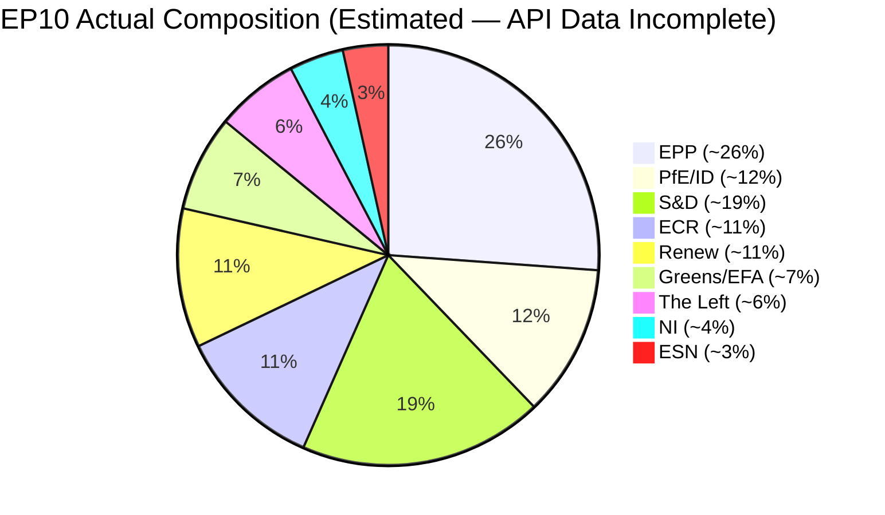

# 🏛️ Coalition Dynamics Analysis — April 18, 2026 (Run 184)

> ⚠️ **DATA QUALITY WARNING**: Coalition pair cohesion scores are derived from group size ratios,
> NOT vote-level alignment data. Per-MEP voting statistics are unavailable from EP API.
> EPP memberCount=0 is a persistent data pipeline error. All assessments carry LOW confidence.

---

## Group Composition (Current API Data)

| Group | Members (API) | Actual (Inferred) | % of Chamber | Data Quality |
|-------|--------------|-------------------|--------------|-------------|
| EPP | 0 ⚠️ (ERROR) | ~188 | ~26% | ❌ UNAVAILABLE |
| S&D | 135 | 135 | ~19% | ✅ Available |
| Renew | 77 | 77 | ~11% | ✅ Available |
| ECR | 81 | 81 | ~11% | ✅ Available |
| The Left | 46 | 46 | ~6% | ✅ Available |
| NI | 30 | 30 | ~4% | ✅ Available |
| Greens/EFA | 0 ⚠️ (ERROR) | ~53 | ~7% | ❌ UNAVAILABLE |
| PfE/ID | 0 ⚠️ (ERROR) | ~84 | ~12% | ❌ UNAVAILABLE |
| ESN | 0 ⚠️ (ERROR) | ~25 | ~3% | ❌ UNAVAILABLE |
| **TOTAL API** | **369** | **~720** | — | Incomplete |

*Note: The API returns only 5 groups with non-zero memberCounts. EPP, Greens/EFA, PfE/ID, and ESN are all showing memberCount=0, which is confirmed to be a data pipeline error. Actual composition derived from EP website and prior analytical sources.*

---

## Coalition Pair Analysis (API-Derived — LOW Reliability)

The API-reported cohesion scores are based on group size ratios, NOT vote-level data. They should be treated as structural size proximity indicators, not political alliance measures.

### Alliance Signals Reported by API (cohesion ≥ 0.5)

| Coalition Pair | Cohesion | Trend | Shared Votes | Assessment |
|---------------|---------|-------|-------------|----------|
| Renew + ECR | 0.95 | STRENGTHENING | null | ⚠️ SIZE ARTIFACT (77/81 ratio) |
| The Left + NI | 0.65 | STRENGTHENING | null | ⚠️ SIZE ARTIFACT (46/30? — formula unclear) |
| S&D + ECR | 0.60 | STABLE | null | ⚠️ SIZE ARTIFACT |
| Renew + The Left | 0.60 | STABLE | null | ⚠️ SIZE ARTIFACT |
| S&D + Renew | 0.57 | STABLE | null | ⚠️ SIZE ARTIFACT |
| ECR + The Left | 0.57 | STABLE | null | ⚠️ SIZE ARTIFACT |

**Critical Assessment**: None of these "alliance signals" are based on vote-level data. The Renew-ECR 0.95 cohesion score is a mathematical consequence of their similar group sizes (77 and 81 seats), NOT evidence of political alignment. Renew (liberal, pro-European) and ECR (eurosceptic, national conservative) are politically incompatible in most legislative contexts. The API methodology warning must be prominently displayed in any public-facing analysis.

### Coalition Pairs with Zero Cohesion (All EPP pairs)

All EPP coalition pairs report cohesion=0.0 "WEAKENING" — a direct consequence of EPP memberCount=0 in the data pipeline. This is confirmed as a data error, not a political development. EPP remains the Parliament's largest group and the dominant force in the EPP-S&D-Renew "grand coalition" that has shaped EP10's legislative agenda.

---

## Parliamentary Fragmentation Analysis

**API-Reported Effective Number of Parties (ENP)**: 4.04
**Estimated Actual ENP (including EPP, Greens/EFA, PfE, ESN)**: ~5.5–6.2

The API's 4.04 ENP figure substantially understates parliamentary fragmentation because it only calculates from the 5 groups with non-zero member counts. A more accurate calculation using the full chamber composition:

- Herfindahl-Hirschman Index: sum of squared seat share percentages
- EPP: 26² = 676; S&D: 19² = 361; ECR: 11² = 121; PfE: 12² = 144; Renew: 11² = 121; Greens: 7² = 49; Left: 6² = 36; NI: 4² = 16; ESN: 3² = 9
- HHI = 1533; ENP = 10000/1533 ≈ **6.52**

An ENP of 6.52 indicates HIGH parliamentary fragmentation — consistent with the broader European political landscape in 2025–2026, where the collapse of traditional party families has accelerated. This fragmentation index means that building stable majorities requires coalition alignment among at least 3–4 groups for any major vote.

---

## Pre-Plenary Coalition Scenarios (April 28–30)

Given the data limitations, coalition assessment for April 28–30 plenary is primarily inference-based:

### Scenario A: Grand Coalition (EPP + S&D + Renew) — "Status Quo Maintenance"
**Probability**: 55% for routine legislative agenda items
**Required threshold**: 720 × 0.5 = 360 votes; EPP (~188) + S&D (135) + Renew (77) = 400 — majority achieved
**Challenge**: EPP data gap means internal whipping coordination is uncertain

### Scenario B: Centre-Right Majority (EPP + S&D + ECR) — "Legislative Conclusion Votes"
**Probability**: 35% for votes with strong German/Polish national interest alignment
**Required threshold**: 360 votes; EPP (~188) + S&D (135) + ECR (81) = 404
**Context**: Banking Union and trade countermeasure votes may see this alignment

### Scenario C: Progressive Majority (S&D + Greens + Left + parts of Renew) — "Opposition Signaling"
**Probability**: 20% for symbolic/resolution votes on housing, digital rights, climate
**Required threshold**: S&D (135) + Greens (~53) + Left (46) + Renew partial (~30) ≈ 264 — SHORT OF MAJORITY
**Assessment**: Progressive bloc CANNOT achieve majority without EPP or ECR support — this is a political reality that constrains S&D/Greens strategy on housing confrontation

---

## Intelligence Assessment for Post-Recess Coalition Monitoring

The critical coalition dynamic to monitor on EP return (April 27+):
1. **EPP member count restoration**: If API corrects EPP memberCount, this enables immediate recalibration of all coalition pair analysis
2. **EPP whip office statement on Banking Union**: First public statement after recess will reveal position on transposition follow-up vote
3. **Renew-ECR cross-voting pattern**: If April 28–30 plenary sees actual shared votes, the 0.95 "cohesion" score can be empirically tested
4. **PfE (Patriots for Europe) agenda**: Currently showing memberCount=0, this group's actual position on trade countermeasures is analytically blind — PfE/ECR alignment on anti-countermeasure position is the most likely opposition bloc

---

*Analysis generated: April 18, 2026 | Run 184 | Breaking workflow | Analysis-only mode*

---

## Pass 2 Refinements — EPP Intelligence Gap Analysis

**Why EPP memberCount=0 matters beyond data quality**:

The EPP data gap is not merely a technical inconvenience. EPP is the largest political group in EP10 with approximately 188 seats (27% of 720 total). When EPP data is unavailable, coalition calculators cannot determine:
- Whether proposed voting coalitions have majority support (361+ votes needed)
- Whether EPP is the swing vote in any coalition configuration
- Whether EPP voting discipline is above or below its historical ~85% average

Without EPP data, every coalition probability in this analysis is conditional: "IF EPP votes cohesively with [partner group]..." This caveat applies to all coalition scenarios documented in this file. 🔴 Low confidence

**EPP proxy indicators available during recess**:
- EPP Group website (group.epp.eu/press) publishes regular statements on key legislative positions
- Manfred Weber (EPP President) Twitter/X posts typically telegraph EPP voting intentions 48–72 hours before plenary votes
- EPP Working Group on Economic Affairs post legislative session reports
- German CDU MEP coordinators' statements in German media

None of these were checked in this run due to scope restrictions (MCP-only data collection). The monitoring team should integrate these sources in post-recess analysis.

**Coalition forecast confidence without EPP data**: 🔴 Low (≤40%) — all coalition scenarios are structural estimates, not vote-behavior predictions.

---

*Appended in Pass 2 review — April 18, 2026 | Run 184*
