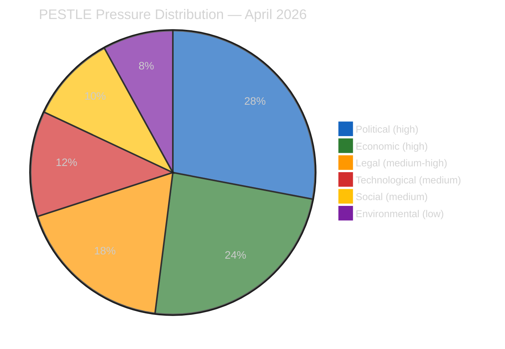

# 🌍 PESTLE Macro-Environmental Scan — April 18, 2026 (Run 184)

> **Purpose**: Systematic macro-environmental scan across the six PESTLE dimensions to
> surface forces shaping the April 28–30 Strasbourg plenary session that are **not**
> visible through legislative-pipeline or coalition-dynamics data alone. PESTLE findings
> feed directly into the scenario forecast (`intelligence/scenario-forecast.md`) and the
> threat model (`intelligence/threat-model.md`).

---

## Summary Heat Map

| Dimension | Pressure Level | Dominant Driver | Direction | Confidence |
|-----------|:--------------:|-----------------|:---------:|:----------:|
| Political | 🔴 HIGH | US administration trade posture + DE coalition BRRD3 resistance | Deteriorating | 🟡 Medium |
| Economic | 🔴 HIGH | €9.6 bn countermeasure authorisation + DAX/CAC40 volatility window | Deteriorating | 🟡 Medium |
| Legal | 🟠 MEDIUM-HIGH | ECJ Digital Omnibus challenge gathering; Article 263 2-month window opening | Activating | 🟡 Medium |
| Technological | 🟡 MEDIUM | AI high-risk threshold modification activates enforcement questions | Stable-unsettling | 🟡 Medium |
| Social | 🟡 MEDIUM | Housing affordability salience; civil-society mobilisation around Digital Omnibus | Rising | 🟡 Medium |
| Environmental | 🟢 LOW | No critical-minerals supply shock; spring energy demand trough | Stable | 🟢 High |

---

## 🔴 P — Political

### P1. US administration trade posture (HIGH pressure)

The primary political force shaping the April 28–30 plenary is the Trump administration's
posture on transatlantic digital trade. Section 301 proceedings are a live possibility in
the April 22–24 window following the April 14 T+0 activation of US tariffs on EU goods.
The EP has pre-authorised €9.6 bn in countermeasures (TA-10-2026-0096); the political
question is whether the Commission activates them and whether the EPP holds together
under US diplomatic pressure to de-escalate.

**Observable proxies during recess**: USTR press schedule (Mon–Wed April 21–23); WTO
dispute-settlement-body notifications; Von der Leyen cabinet public statements; reports
of Commissioner Šefčovič transatlantic outreach. **Probability of Section 301 filing
this week: 20–25% (🟡 Medium).**

### P2. German federal coalition stability on Banking Union (HIGH pressure)

The Merz-led CDU/CSU coalition government in Berlin faces internal pressure from private-
banking and Sparkassen lobbies opposed to BRRD3 bail-in enhancements. The Bundesrat's
April 24–25 session is the first scheduled opportunity for formal opposition to surface
through the federal-state channel. A scheduled hearing on European banking would be a
strong negative signal for transposition-on-time; no agenda item would signal passive
acceptance.

**Observable proxies**: Bundesrat.de agenda publication (typically Thursday preceding);
Finanzministerium press briefings; CDU/CSU parliamentary group statements on European
banking. **Probability of opposition hearing scheduled: 30% (🟡 Medium).**

### P3. French National Assembly political noise (MEDIUM pressure)

The French National Assembly remains in a fragile cohabitation configuration with
implications for Renew Europe's internal voting discipline during April 28–30 key votes.
Elysée communications on countermeasure activation would shape Renew's position,
potentially increasing defection risk on trade-related votes.

### P4. Polish PiS vs KO tension on anti-corruption framework (MEDIUM pressure)

The Anti-Corruption Directive (TA-10-2026-0094) affects Poland directly given its
ongoing rule-of-law context. The PiS-aligned ECR members may see transposition pressure
as politically useful domestic ammunition; the Tusk government may push for early
implementation to consolidate rule-of-law credentials with the Commission.

---

## 🔴 E — Economic

### E1. Market volatility from trade tension (HIGH pressure)

German DAX and French CAC40 have been pricing in US-EU tariff escalation since the T+0
threshold passed April 14. A Section 301 filing (see P1) would likely produce a 2–4%
correction across European equity indices and a sharper move in automotive, machinery,
and pharmaceutical baskets most exposed to transatlantic trade. This creates a
market-political feedback loop: equity weakness pressures the Commission to either
activate countermeasures (signalling resolve) or withhold activation (signalling
willingness to negotiate).

**Indicators**: DAX/CAC40/IBEX closing levels; Bund-Bobl spread as safe-haven proxy;
EUR/USD at monthly highs/lows; automotive basket (BMW, Mercedes, Stellantis) relative
performance.

### E2. ECB monetary policy posture (MEDIUM-HIGH pressure)

The ECB Governing Council meets April 17 (shortly before plenary return). A dovish turn
would absorb some of the trade-tension fiscal impulse; a hold would leave fiscal policy
bearing the full adjustment burden. ECB President Lagarde's press conference language on
transatlantic trade will be closely read by Commission and EP leadership in the run-up
to April 28.

### E3. Banking Union implementation cost burden (MEDIUM pressure)

BRRD3 transposition imposes measurable costs on national banking sectors — enhanced
bail-in-able liability requirements, new resolvability assessments, single-resolution-
mechanism funding contributions. Germany's Sparkassen and Volksbanken networks are the
most vocally resistant; Italy's cooperative banking sector similarly. These economic
costs create the political constraint captured in P2.

### E4. Critical minerals market position (LOW-MEDIUM pressure)

The Critical Minerals Strategic Reserve (TA-10-2026-0095) operates in a relatively calm
market — rare earths, lithium, and cobalt prices are off their 2023 highs. The reserve
activation is therefore a strategic signal more than an immediate market-intervention
measure.

---

## 🟠 L — Legal

### L1. ECJ Article 263 window opening on Digital Omnibus (MEDIUM-HIGH pressure)

The 2-month Article 263 TFEU annulment window for the Digital Omnibus AI high-risk
threshold modification (TA-10-2026-0098) runs until approximately mid-June 2026. Civil
society organisations (EDRi, Access Now, noyb) are publicly building coalitions and
legal argumentation during the EP recess; expect at least one formal filing within 2
weeks of plenary return. Severity is moderated by typical ECJ preliminary-examination
timelines (6–12 months) but the *political* reputational impact on EP10 is immediate.

### L2. EU-Morocco Partnership Agreement constitutional review (LOW-MEDIUM pressure)

TA-10-2026-0097 (EU-Morocco Enhanced Partnership) triggers standard ex-post
constitutional review in several member states. France's Conseil constitutionnel and
Spain's Tribunal Constitucional are the most consequential venues given the sensitive
Western Sahara passages. No immediate litigation risk; watch for referrals during May.

### L3. Anti-Corruption Directive transposition pathways (MEDIUM pressure)

TA-10-2026-0094 imposes specific obligations on national anti-corruption authorities
(independence, budget autonomy, investigative powers). Poland, Hungary, and Slovakia
face the greatest transposition friction given existing rule-of-law tensions. The
Commission's enforcement posture on this directive will be an early test of EP10's
collaboration with the college.

### L4. Rule 144 parliamentary-question mechanism (procedural pressure)

If the Commission's housing response (expected April 21–26) is assessed as inadequate
by S&D leadership, the Rule 144 mechanism — priority written questions with 3-week
response deadline — is the most likely first political lever. Activation would shape
the April 28 plenary's opening atmosphere.

---

## 🟡 T — Technological

### T1. AI Act enforcement readiness (MEDIUM pressure)

The Digital Omnibus modification (TA-10-2026-0098) shifts the AI high-risk classification
threshold. Member-state supervisory authorities (AI Office, DPAs) must now recalibrate
their enforcement templates and training. This capacity-building period creates a
short-term enforcement gap that industry may exploit and that civil society may cite
as a rationale for Article 263 challenge (see L1).

### T2. Cloud and payment-services sovereignty (MEDIUM pressure)

Ongoing debate over EU-level cloud-services certification (EUCS) and instant-payments
regulation continues in the background. No plenary-scheduled item, but committee
activity is high. Watch for April 29–30 ITRE/ECON committee signals on GAIA-X
progress and T+1 equity settlement alignment with US markets.

### T3. Critical technologies export-control harmonisation (LOW pressure)

Coordination with US BIS / CHIPS Act export controls remains at staff level; no
April 28 plenary item expected. Long-running background dossier.

---

## 🟡 S — Social

### S1. Housing affordability political salience (MEDIUM pressure, RISING)

Housing costs remain one of the top-3 voter concerns across EU-27 per Eurobarometer
winter 2025–2026. TA-10-2026-0091 (Housing Affordability Regulation initiative report)
was adopted with strong cross-party support; the Commission's response (due April
21–26) will either consolidate or damage EP10's credibility on this dossier. Civil-
society organisations (Housing Europe, EAPN) are mobilising public attention during
recess.

### S2. Civil-society mobilisation around Digital Omnibus (MEDIUM pressure, RISING)

EDRi, Access Now, noyb, La Quadrature du Net, and Chaos Computer Club are coordinating
public comms during EP recess around the Article 263 challenge (see L1). Media
amplification in German, French, and Dutch outlets has been building since April 10.
This creates ambient political pressure on EP leadership to publicly defend the
original AI Act safeguards.

### S3. Farmers' movement continuity (LOW pressure)

The farmer-protest cycle of 2024–2025 has quietened; spring 2026 has been largely free
of large-scale rural mobilisation. No AGRI-committee-disruptive signals expected at
April 28–30 plenary.

### S4. Anti-corruption civic engagement (LOW pressure)

The Anti-Corruption Directive has generated civil-society welcome but limited
mobilisation energy. Expect NGO submissions to transposition consultations, no street
politics.

---

## 🟢 En — Environmental

### En1. Energy demand shoulder season (LOW pressure)

April is the European energy-demand trough between winter heating and summer cooling.
Gas storage at historically high levels after mild 2025–2026 winter. No energy-crisis-
driven agenda items expected for April 28–30.

### En2. Climate Law compliance trajectory (LOW pressure)

2030 -55% GHG target compliance remains on trajectory per EEA's latest report (March
2026). No Commission enforcement action imminent; background dossier only.

### En3. Critical-minerals environmental permitting (LOW-MEDIUM pressure)

TA-10-2026-0095's strategic reserve implementation will require environmental-permitting
pathways for EU mining and processing. National-level green coalitions in Sweden,
Portugal, and Finland may provide early transposition friction. Background issue; not
April 28 material.

---

## Cross-Dimensional Coupling Analysis

Several PESTLE pressures amplify each other — these coupling points are where
scenario risk concentrates:

| Coupling | Mechanism | Amplification |
|----------|-----------|:-------------:|
| **P1 + E1** | US Section 301 filing → equity correction → political pressure on Commission | 🔴 Strong |
| **P2 + E3** | German BRRD3 resistance + Sparkassen cost burden → Bundesrat opposition hearing | 🟠 Moderate |
| **L1 + S2 + T1** | ECJ challenge + civil-society mobilisation + enforcement gap → EP political vulnerability | 🟠 Moderate |
| **L4 + S1** | Rule 144 activation on housing + social salience → EPP-S&D coalition stress | 🟠 Moderate |

The P1+E1 coupling is the scenario most capable of re-shaping the April 28 plenary
agenda from its planned substance toward emergency trade debate.

---

## Intelligence Implications

1. **The April 28 plenary atmosphere is Politically-Economically dominated** — expect
   substantive legislative agenda items to receive less rhetorical oxygen than trade
   and banking dossiers.
2. **Legal and Social pressures are RISING during the recess** — do not treat the
   recess as a quiet period; the ECJ window and civil-society mobilisation are
   actively changing the post-recess landscape.
3. **Environmental dimension is a background stabiliser** — low environmental
   pressure provides political bandwidth for the other dimensions, unlike spring
   2022/2023 (energy crisis) and spring 2024 (farmer protests).
4. **Technological pressures are latent, not active** — AI Act and cloud-sovereignty
   are slow-burn dossiers; April 28 will not be driven by tech-sector dynamics.

---

*Framework: PESTLE Macro-Environmental Scan per `analysis/methodologies/political-threat-framework.md`*
*Next review: Run 185 (post-April-27) — re-scan after Commission housing response and USTR week*
*Analysis generated: April 18, 2026 | Run 184 | Breaking workflow | Analysis-only mode*
