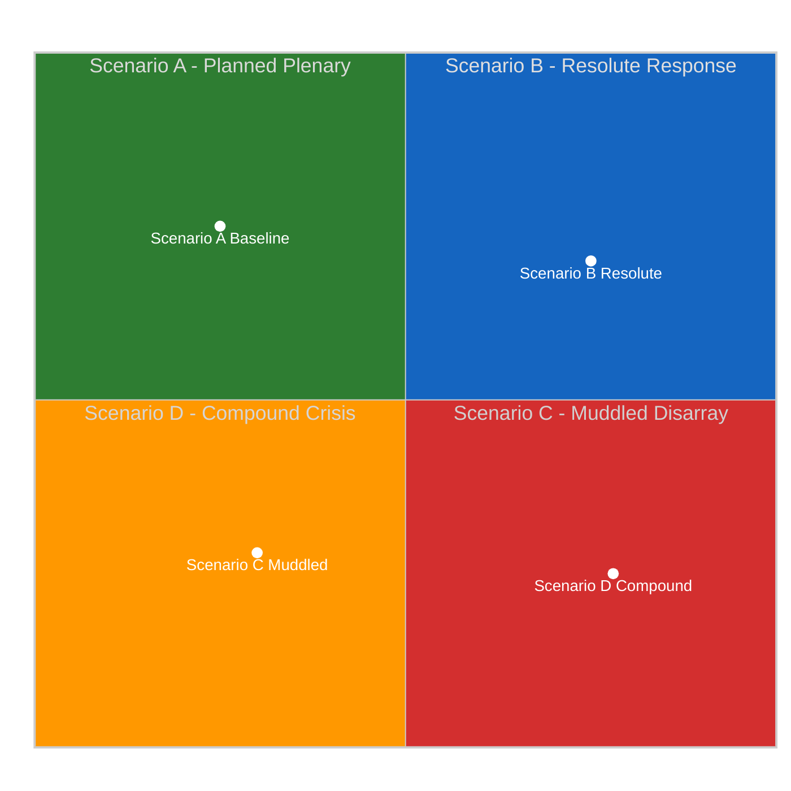
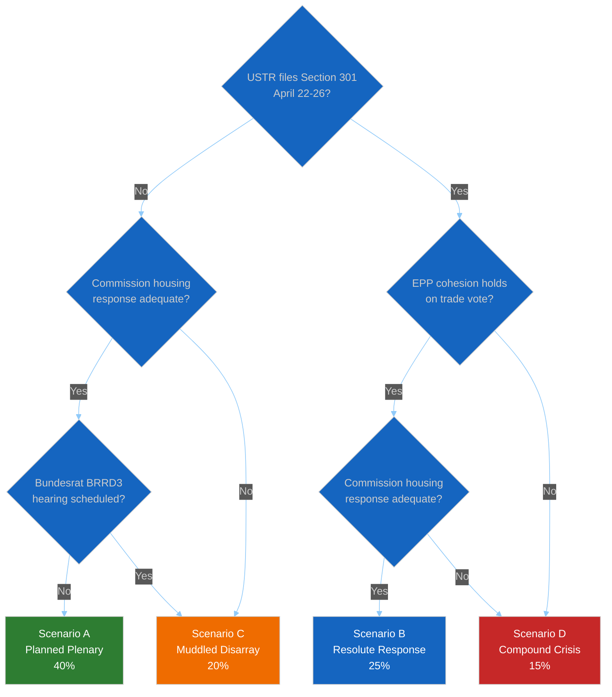

# 🎲 Scenario Forecast — Post-Recess Political Landscape (Run 184)

> **Purpose**: Structured multi-scenario forecast for the April 28–30 Strasbourg plenary
> and the subsequent two weeks. Each scenario is defined by a unique combination of the
> two most uncertain and most impactful variables identified in the PESTLE scan. Each
> carries a probability estimate, early-warning indicators, and a set of actions/outcomes
> that would confirm or falsify it.

---

## Scenario Axis Selection

From the PESTLE analysis the two driving variables are:

- **X-axis — US Trade Posture**: DE-ESCALATION (no Section 301 filing, back-channel
  negotiation) ⟷ ESCALATION (Section 301 filing in April 22–26 window).
- **Y-axis — EU Internal Coalition Integrity**: STABLE (grand coalition holds on trade
  and banking votes) ⟷ STRESSED (EPP defection on trade, German BRRD3 delay, housing
  confrontation).

| Scenario | US Posture | EU Coalition | Probability | Dominant Impact |
|----------|-----------|--------------|:-----------:|-----------------|
| **A. Planned Plenary** (baseline) | De-escalation | Stable | 40% | April 28–30 runs on planned agenda; Banking Union Phase-2 progress |
| **B. Resolute Response** | Escalation | Stable | 25% | Emergency trade debate + countermeasure activation vote; legislative agenda compressed |
| **C. Muddled Disarray** | De-escalation | Stressed | 20% | Housing confrontation dominates; Banking Union timeline slips; EPP internal fight visible |
| **D. Compound Crisis** | Escalation | Stressed | 15% | Trade + housing + banking simultaneously; EP10's worst-case plenary |

> Probabilities sum to 100%. Confidence: 🟡 Medium (probabilities derived from 6-run
> observation series; subject to revision on Run 185 with Tier-2 API data).

---

## Scenario A — Planned Plenary (Baseline, 40%)

### Narrative

US administration holds Section 301 filing beyond April 26 to preserve negotiating
flexibility. Commission publishes housing response April 23 — consultation-process-
heavy but with concrete commitment to draft legislation by Q4 2026, satisfying S&D
leadership. German Bundesrat no-agenda-item on BRRD3 April 24–25 signals passive
acceptance. EP API Tier-2 restores April 22; Tier-3 restores April 26. April 28
plenary opens with substantive legislative agenda (Banking Union Phase-2 review,
critical-minerals regulation follow-up, EU-Morocco ratification items) and routine
trade monitoring.

### Early-warning confirming indicators (watch by April 24)

- [ ] No USTR Federal Register filing between April 21 and April 24
- [ ] Commission housing response published with explicit Q4 2026 legislative
      commitment
- [ ] Bundesrat April 24–25 agenda shows no BRRD3 hearing
- [ ] Tier-2 EP API feeds (`events_feed`, `procedures_feed`) return data by April 23
- [ ] EPP Group public statements remain within established Weber framing

### Falsifying indicators

- ❌ USTR filing → Scenario B or D
- ❌ S&D Rule 144 activation on housing → Scenario C or D
- ❌ Bundesrat BRRD3 hearing → Scenario C or D

### April 28 outcomes

Plenary conducts routine legislative business. Commission representatives welcomed
normally. EP passes scheduled co-decision items. Media framing is competent-European-
institution.

### Impact on analytical framework

Confirms 6-run recess series' "normal plenary return" baseline. Run 185 produces a
standard breaking article with full-content TA-10-2026-0099–0104 retrievals. Risk
matrix composite score reduces to 12/50 (LOW-MEDIUM).

---

## Scenario B — Resolute Response (25%)

### Narrative

USTR files Section 301 petition April 22–24. Commission triggers 72-hour countermeasure-
activation framework April 25–26. Von der Leyen makes public statement framing activation
as proportionate, measured, and preserving dialogue-channels. EPP whip coordinator holds
group firm behind activation vote — German CDU/CSU delegation absorbs Sparkassen
pressure for industrial-sector concerns. Renew delegation votes cohesively pro-
activation after Élysée signal. April 28 plenary opens with emergency trade debate
(Commission + Council statement + political-group statements + rapid Rule 144 votes).

### Early-warning confirming indicators (watch by April 24)

- [ ] USTR Federal Register filing appears April 22–24
- [ ] Von der Leyen cabinet issues statement within 24h of filing
- [ ] Member-state COREPER II schedules emergency meeting
- [ ] EPP coordinators' public language hardens (Weber / Berger statements)
- [ ] Renew French delegation coordinates with S&D French delegation

### Falsifying indicators

- ❌ EPP public divisions between German and Southern European delegations → Scenario D
- ❌ Renew internal split along France-Netherlands axis → Scenario D
- ❌ Council fails to produce majority for activation → deferred to May plenary

### April 28 outcomes

Emergency trade debate displaces the first 2–3 hours of planned plenary. Countermeasure
activation vote passes with EPP + S&D + Renew majority (target: ≥400 votes in favour);
conditional on coalition integrity. Banking Union Phase-2 review items may be deferred
to May plenary. Media framing: assertive-European-Union narrative prevails.

### Impact on analytical framework

Confirms "stable coalition under external pressure" hypothesis. Upgrades EP10
credibility score on trade-policy execution. Housing and banking dossiers recede
temporarily. Post-plenary Run 186–187 will need to revisit with full intelligence on
US-EU negotiation trajectory.

---

## Scenario C — Muddled Disarray (20%)

### Narrative

No USTR filing (US de-escalation posture). Commission publishes housing response that
S&D leadership assesses as inadequate (55% probability of inadequacy per Risk Matrix
Risk #4). Rule 144 priority-questions-campaign launches April 26. Bundesrat schedules
BRRD3 opposition hearing April 24–25 under Sparkassen pressure. German EPP delegation
signals transposition-delay receptiveness. April 28 plenary opens with hostile S&D +
Greens/EFA reception of Commission representatives on housing, followed by visibly
strained EPP-S&D atmosphere on Banking Union Phase-2 debate.

### Early-warning confirming indicators (watch by April 24)

- [ ] Commission housing response published without Q4 2026 legislative commitment
- [ ] S&D parliamentary-group-coordinators social-media activity spikes
- [ ] Bundesrat BRRD3 opposition-hearing agenda item appears
- [ ] German CDU MEP signals on Twitter/X soften on BRRD3 timeline
- [ ] EPP internal divergence observable in committee coordinator statements

### Falsifying indicators

- ❌ USTR files Section 301 → Scenario D
- ❌ Commission publishes legislative-proposal alongside housing response → Scenario A

### April 28 outcomes

Housing confrontation consumes first 90 minutes of plenary. S&D + Greens/EFA
coordinated Rule 144 vote attracts >300 MEPs. Banking Union Phase-2 debate reveals
EPP internal disagreement on BRRD3 timing; resolution deferred. Media framing:
"Parliament returns with coalition cracks visible".

### Impact on analytical framework

Confirms EPP coalition stress hypothesis. Upgrades Risk Vector #1 (Banking Union) and
Risk Vector #4 (Housing) simultaneously. Post-plenary runs will track whether stress
escalates to structural realignment or resolves back to Scenario A baseline.

---

## Scenario D — Compound Crisis (15%)

### Narrative

Worst-case: USTR files Section 301 petition AND Commission housing response inadequate
AND Bundesrat schedules BRRD3 opposition hearing — all in the April 21–26 window.
April 28 plenary faces three-axis crisis simultaneously. EPP internal cohesion
fractures visibly on trade (Southern-Europe industrialist wing pushes
countermeasure-activation; German CDU/CSU wing resists to preserve US relationship
for banking-transposition negotiating leverage). Renew Europe splits on trade vote.
S&D + Greens/EFA dominate housing narrative. Commission under pressure on all three
files.

### Early-warning confirming indicators

- [ ] Three or more of these events occur in April 21–26:
  - USTR Section 301 filing
  - Bundesrat BRRD3 hearing
  - Commission inadequate housing response
  - EPP public divergence statement
- [ ] DAX drops >3% in response
- [ ] Commission issues multi-front communications response

### Falsifying indicators

- ❌ EPP issues unified-group statement of discipline → partial de-escalation to B or C
- ❌ US filing delayed to May → Scenario C only

### April 28 outcomes

Plenary agenda compressed. Emergency trade debate + housing confrontation + Banking
Union stress all compete for rhetorical time. Countermeasure activation vote passes
narrowly or fails (coin-flip on EPP cohesion). Multiple Rule 144 activations. Media
framing: "EP10's first coalition crisis".

### Impact on analytical framework

Would require a substantial revision of the 6-run series' coalition-stability
hypothesis. Triggers immediate Run 186 (not routine) on April 29 morning for
real-time coalition-shift tracking. Risk matrix composite score jumps to 32/50 (HIGH).

---

## Decision Tree (Integrated)

---

## Monitoring Priorities by Scenario

| Window | Priority Observable | Distinguishes Between |
|--------|--------------------|----------------------|
| April 21 (Mon) | USTR.gov front page | Scenarios A/C vs B/D |
| April 22–24 | Federal Register filings | Confirms/refutes B and D |
| April 22–26 | Commission press releases page | Scenarios A/B vs C/D |
| April 23–25 | Bundesrat.de weekly agenda | Scenarios A/B vs C/D on banking axis |
| April 26–27 | EPP.eu statements + Weber social media | EPP cohesion dimension |
| April 27 | EP plenary agenda finalisation | Final scenario selection |
| April 28 opening | First hour of plenary | Real-time confirmation |

---

## Aggregate Assessment

- **Central estimate**: Scenario A remains the modal outcome (40%) but with
  meaningful tail risk concentrated in B (25%) and C (20%).
- **Tail-risk concentration**: Scenario D (15%) is disproportionately consequential
  if it materialises, it reshapes EP10's Q2 2026 political narrative and invalidates
  the "March sprint legislative strength" framing.
- **Key intelligence gaps**: EPP internal positioning (MCP data gap) is the single
  highest-value unknown. A 5-percentage-point shift in EPP cohesion confidence would
  shift the probability mass between Scenarios A/B and C/D.

---

*Framework: Shell-style scenario planning per `analysis/methodologies/political-threat-framework.md` §Framework 5*
*Next review: Run 185 (post-April-27) — revise probabilities with Tier-3 API data and observed trigger evidence*
*Analysis generated: April 18, 2026 | Run 184 | Breaking workflow | Analysis-only mode*
