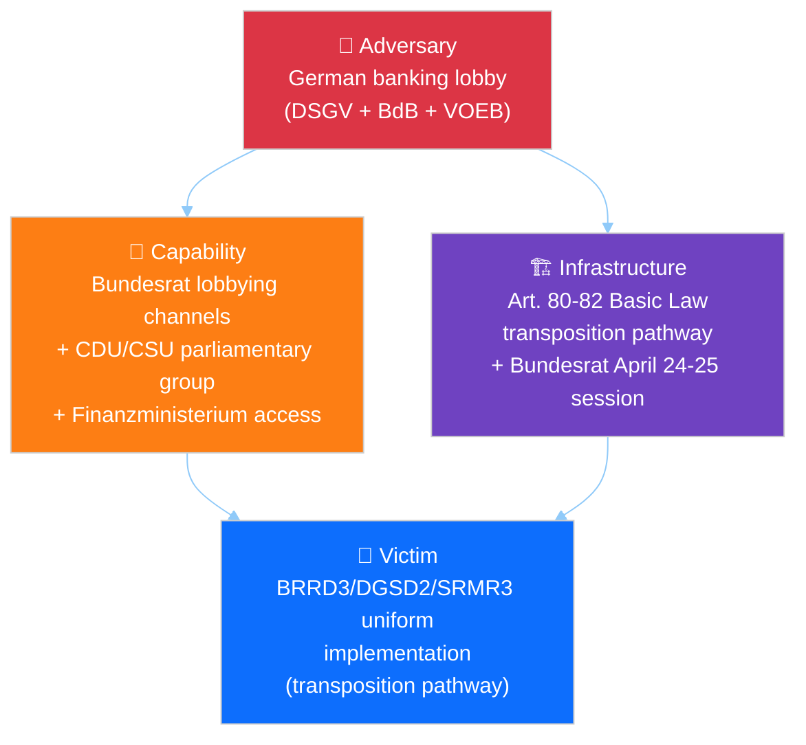
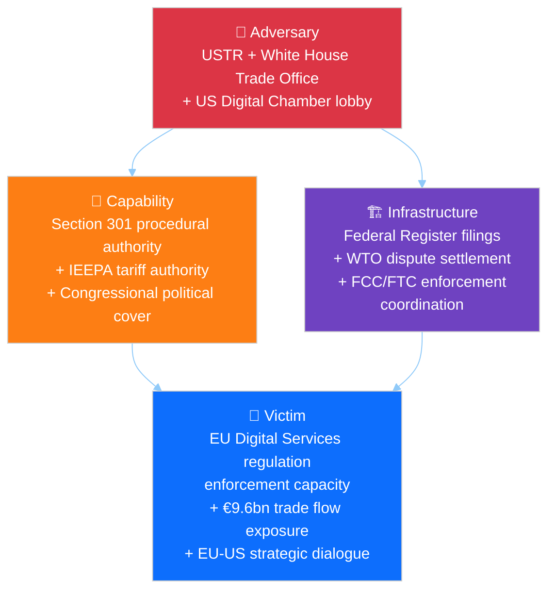
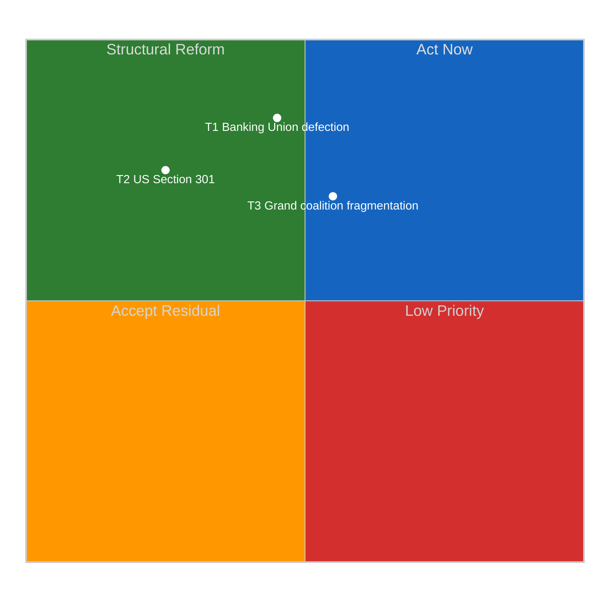

# 🎯 Threat Model — Pre-Plenary Political Threats (Run 184)

> **Purpose**: Apply the Diamond Model and Attack Tree frameworks from
> `analysis/methodologies/political-threat-framework.md` to the top three severity-4–5
> political threats identified in Run 184's risk matrix. Threat modelling complements
> risk scoring: risk tells you *what* may go wrong; threat modelling tells you *how* it
> can unfold and *where* to intervene.

---

## Threat Landscape Overview

From `risk-scoring/risk-matrix.md`, three threats crossed the severity-4+ bar:

| # | Threat | Severity | Framework Applied |
|:-:|--------|:--------:|-------------------|
| T1 | Banking Union transposition defection | 15/25 (HIGH) | Attack Tree + Diamond Model |
| T2 | US-EU trade escalation via Section 301 | 8/25 (MEDIUM-HIGH) | Diamond Model + Kill Chain |
| T3 | Grand coalition fragmentation (compound) | 9/25 (MEDIUM-HIGH) | Attack Tree + Kill Chain |

---

## 💎 T1. Banking Union Transposition Defection — Diamond Model

### Diamond elements

| Element | Specification |
|---------|---------------|
| **Adversary** | Coalition of German banking-sector associations: DSGV (Sparkassen, ~40% retail share), BdB (commercial banks), VOEB (public-sector banks). Historically effective at shaping German transposition of EU financial-services directives. Unified on BRRD3 bail-in resistance; divided on other Banking Union elements. |
| **Capability** | Access to CDU/CSU parliamentary group (Merz coalition); long-standing Finanzministerium relationships; technical-expertise credibility in Bundesrat committees; Handwerkskammern alliance for political amplification. |
| **Infrastructure** | German Basic Law transposition requirements (Art. 80–82); Bundesrat hearings schedule (April 24–25 session window); Finanzausschuss committee process; federal-state coordination mechanisms. |
| **Victim** | Banking Union Phase-2 uniform implementation: the DGSD2, BRRD3, and SRMR3 directives (adopted in earlier EP10 sittings; note that the TA-10-2026-0090–0092 docIds from the March 26 sitting cover DMA enforcement, Housing Affordability, and the European Research Area Act — see `documents/document-analysis-index.md`). Missed transposition deadlines create regulatory-arbitrage risks and undermine SSM supervisory effectiveness. |

### Observable intervention points

| Point | Who can intervene | How |
|-------|-------------------|-----|
| Pre-Bundesrat (April 20–23) | Commission | Early-warning letter on transposition expectations; DG FISMA technical assistance offer |
| Bundesrat April 24–25 | S&D German delegation | Shadow-hearing in Bundestag Europaausschuss |
| Post-hearing (April 26–27) | ECB SSM | Public statement on regulatory-arbitrage risks |
| April 28 plenary | Strong-pro-Banking-Union EPP MEPs (German Greens-aligned EPP) | Procedural statement on BRRD3 timeline |

### Indicators of successful execution (for adversary)

1. Bundesrat agenda item on European banking added by April 22
2. Finanzministerium briefing leaked to Handelsblatt suggesting transposition flexibility
3. CDU/CSU parliamentary-group position paper on BRRD3 modifications
4. German EPP MEP public expressions of "transposition realism"

### Indicators of failed execution

1. Bundesrat April 24–25 agenda omits European banking item
2. Finanzministerium public reaffirmation of transposition commitment
3. Merz cabinet coordination statement prioritising EU banking implementation

---

## 💎 T2. US Section 301 Escalation — Diamond Model + Kill Chain

### Kill Chain — Political Progression

Adapting the Lockheed Martin Cyber Kill Chain to political escalation:

### Current kill-chain position: Stage 2 (Weaponisation)

The USTR has completed reconnaissance (2024–2025 stakeholder-consultation process on
digital-services concerns) and is in the weaponisation stage — a Section 301 petition
text exists in draft form per industry reporting. The critical window April 22–26 is
the delivery decision point.

### Indicators of kill-chain advancement

| Stage | Observable |
|-------|-----------|
| Weaponisation → Delivery | USTR Federal Register publication notice |
| Delivery → Exploitation | Public-comment period opening |
| Exploitation → Installation | Tariff-implementation Executive Order |
| Installation → Actions | US digital-services negotiating position paper |

### EU counter-kill-chain

EU can disrupt at Delivery via:
- Commission pre-filing diplomatic outreach (Commissioner Šefčovič + Ambassador to US)
- Member-state Washington permanent-representation coordination
- WTO Appellate-Body preemptive consultation request
- Public statement on Article 218 TFEU readiness for trade-dialogue suspension

---

## 🌳 T3. Grand Coalition Fragmentation — Attack Tree

```mermaid
%%{init: {"theme":"dark","themeVariables":{"primaryColor":"#1565C0","primaryTextColor":"#ffffff","primaryBorderColor":"#0A3F7F","lineColor":"#90CAF9","secondaryColor":"#2E7D32","secondaryTextColor":"#ffffff","secondaryBorderColor":"#0F3F00","tertiaryColor":"#FF9800","tertiaryTextColor":"#000000","tertiaryBorderColor":"#7F4F00","mainBkg":"#1565C0","secondBkg":"#2E7D32","tertiaryBkg":"#FF9800","noteBkgColor":"#FFC107","noteTextColor":"#000000","noteBorderColor":"#7F6000","errorBkgColor":"#D32F2F","errorTextColor":"#ffffff","fontFamily":"Inter, Helvetica, Arial, sans-serif","pie1":"#1565C0","pie2":"#2E7D32","pie3":"#FF9800","pie4":"#D32F2F","pie5":"#FFC107","pie6":"#7B1FA2","pie7":"#9E9E9E","pie8":"#0288D1","pie9":"#388E3C","pie10":"#F57C00","pie11":"#C62828","pie12":"#FBC02D","pieTitleTextSize":"18px","pieSectionTextSize":"14px","pieLegendTextSize":"13px","pieStrokeColor":"#1e1e1e","pieOuterStrokeColor":"#1e1e1e","git0":"#1565C0","git1":"#2E7D32","git2":"#FF9800","git3":"#D32F2F","gitBranchLabel0":"#ffffff","gitBranchLabel1":"#ffffff","gitBranchLabel2":"#000000","gitBranchLabel3":"#ffffff","cScale0":"#1565C0","cScale1":"#2E7D32","cScale2":"#FF9800","cScale3":"#D32F2F","cScale4":"#FFC107","cScale5":"#7B1FA2","cScale6":"#9E9E9E","cScale7":"#0288D1","xyChart":{"backgroundColor":"#1e1e1e","plotColorPalette":"#1565C0,#2E7D32,#FF9800,#D32F2F,#FFC107,#7B1FA2,#9E9E9E"}}}}%%
graph TD
    Root["🔴 GOAL: Fragment EP10 Grand Coalition<br/>on April 28-30 votes"]

    Root --> A["Direct: Single-vote divergence<br/>on flagship issue"]
    Root --> B["Indirect: Third-group<br/>defection-cascade"]
    Root --> C["Structural: EPP internal split<br/>(N-S dimensions)"]
    Root --> D["External: Three-axis crisis<br/>(trade + housing + banking)"]

    A --> A1["Countermeasure activation vote<br/>EPP-S&D disagreement<br/>on conditions"]
    A --> A2["Housing Rule 144 vote<br/>EPP-S&D disagreement<br/>on aggressiveness"]
    A --> A3["BRRD3 timeline vote<br/>EPP-S&D disagreement<br/>on pressure level"]

    B --> B1["Renew French delegation<br/>breaks on trade vote<br/>(Elysée signal)"]
    B --> B2["Greens/EFA withdraws support<br/>on Digital Omnibus defence<br/>(civil-society pressure)"]

    C --> C1["German CDU/CSU wing resists<br/>BRRD3 strict timeline"]
    C --> C2["Southern Europe wing pushes<br/>aggressive countermeasure"]
    C --> C3["Northern European fiscal wing<br/>blocks housing regulation"]

    D --> D1["Three crises simultaneously<br/>(Scenario D)"]
    D --> D2["Media narrative compounds<br/>institutional weakness"]

    style Root fill:#dc3545,color:#fff
    style A fill:#fd7e14,color:#fff
    style B fill:#fd7e14,color:#fff
    style C fill:#e91e63,color:#fff
    style D fill:#6f42c1,color:#fff
```

### Attack-path probability-weighted analysis

| Path | Probability | Conditional on | Impact |
|------|:-----------:|----------------|--------|
| A1 (trade-vote split) | 15% | USTR filing occurs | MEDIUM |
| A2 (housing-vote split) | 30% | Commission inadequate response | MEDIUM |
| A3 (banking-vote split) | 25% | Bundesrat hearing scheduled | MEDIUM-HIGH |
| B1 (Renew French break) | 12% | Elysée counter-pressure | MEDIUM |
| B2 (Greens/EFA withdrawal) | 8% | Civil-society Article 263 filing | LOW-MEDIUM |
| C1 (German CDU resistance) | 35% | Independent of external trigger | MEDIUM |
| C2 (Southern push) | 20% | USTR filing | MEDIUM |
| C3 (Northern fiscal bloc) | 15% | Housing Rule 144 | LOW-MEDIUM |
| D1 (Scenario D realisation) | 15% | Multiple triggers | HIGH |

### Compound-probability considerations

The attack tree's root is reachable through *any* successful leaf. However, coalition
stability has redundancy: a single leaf success (e.g., A2 only) is absorbable; two
simultaneous leaves (e.g., A2 + C1) creates visible stress; three leaves corresponds
to Scenario D.

### Defensive intervention points

| Defender | Action | Targets |
|----------|--------|---------|
| EP President (Metsola) | Procedural-management of agenda order | Reduces compound-crisis visibility |
| EPP coordinators | Pre-plenary group-discipline session April 26–27 | Closes A1, A3, C1 |
| Commission | Adequate housing response | Closes A2 |
| S&D coordinators | Delayed Rule 144 activation | Reduces A2 probability |
| Renew coordinators | Pre-plenary French-delegation alignment | Closes B1 |

---

## Threat Mitigation Priority Matrix

**Implications**:
- T1 (Banking Union) is HIGH-IMPACT but only MODERATELY-MITIGABLE by EU actors
  primary lever lies in German federal politics.
- T2 (Section 301) is HIGH-IMPACT but LOW-MITIGABLE — US domestic-political drivers
  dominate; EU can at best shape timing and scope.
- T3 (Coalition fragmentation) is MEDIUM-HIGH-IMPACT and MODERATELY-HIGH-MITIGABLE
  EP-internal coordination can close most attack paths; this is where EP leadership
  can earn credit.

---

## Intelligence Implications

1. **T3 (coalition fragmentation) is the threat most within EP's own control**
   investment in pre-plenary coordination yields highest risk reduction per unit effort.
2. **T1 (Banking Union) demands external-partner engagement** — Commission DG FISMA
   and ECB public communications during April 22–25 are the leverage points.
3. **T2 (Section 301) is largely exogenous** — EP can prepare resilience (clear
   activation authority) but cannot unilaterally prevent filing.
4. **Kill-chain advancement on T2 provides warning** — Federal Register filings give
   24–72 hours' notice before market and political effects compound.

---

*Frameworks: Diamond Model + Attack Trees + Cyber Kill Chain per `analysis/methodologies/political-threat-framework.md`*
*Analysis generated: April 18, 2026 | Run 184 | Breaking workflow | Analysis-only mode*
