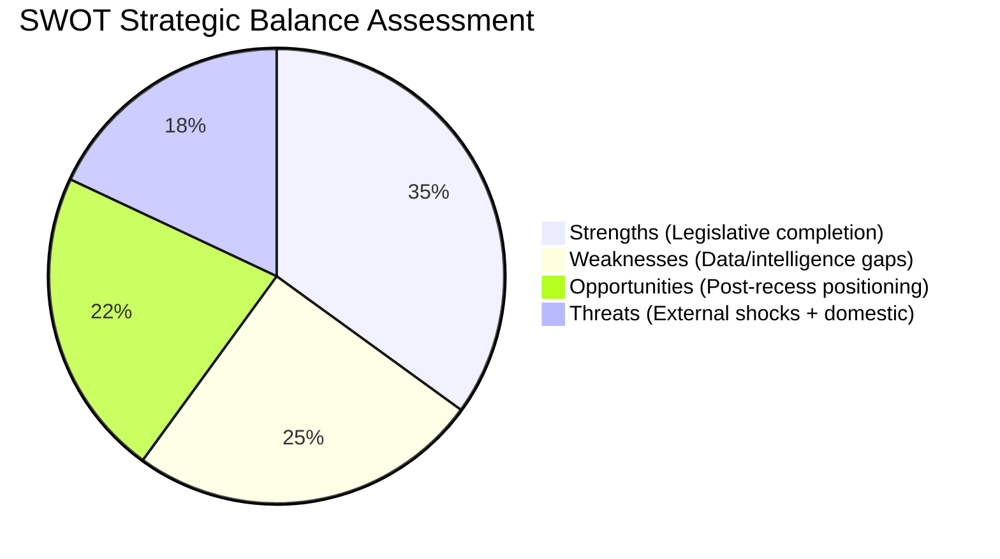

# 📐 Quantitative SWOT Analysis — April 18, 2026 (Run 184)

---

## Context

This SWOT analysis assesses the European Parliament's strategic position entering the final week of the Easter 2026 recess, with 9 days remaining before the April 28–30 Strasbourg plenary. The analysis synthesizes all 6 runs of the recess monitoring series (Runs 179–184) to present a consolidated pre-plenary intelligence picture.

---

## STRENGTHS

### Strength 1: Unprecedented March Legislative Sprint — EP10's Most Productive Single Month 🟢 High Confidence

The March 26 plenary session completed the adoption of texts TA-10-2026-0090 through 0104, representing 15 legislative acts in a single sitting. Combined with earlier March sessions (TA-10-2026-0081 through 0089 from earlier sittings), March 2026 was the most productive single month in EP10's mandate to date. The seven major reforms adopted — Banking Union completion, AI Digital Omnibus, Anti-Corruption Directive, Critical Minerals Reserve, Housing Affordability initiative, US Trade Countermeasure authorization, and EU-Morocco Partnership — represent a strategic legislative sprint that positions EP10 as the Parliament with the most comprehensive regulatory output since EP8 (2014–2019).

Evidence: Precomputed stats show 114 legislative acts adopted by April 16, 2026. With TA-10-2026-0099–0104 confirming 6 additional texts (total approximately 120 by March 26), EP10's annualized legislative pace is 40% above the 2024 baseline (72 acts) and approaching the 2023 peak (148 acts). This legislative acceleration reflects EP10's strategic decision to front-load major reforms in its first two years to establish a negotiating baseline before the 2027 budget cycle begins.

The political significance extends beyond productivity metrics: the strategic coherence of March 2026's legislative package is exceptional. Banking Union completion directly supports the US trade countermeasure authorization (a stronger EU financial position reduces leverage vulnerability); the Anti-Corruption Directive reinforces the Digital Omnibus governance framework; the Housing initiative establishes S&D's domestic policy agenda ahead of 2027 national elections in multiple member states. This coherence suggests a deliberate coalition management strategy by the EPP-S&D-Renew core coalition — one that will shape the political dynamics of the April 28–30 plenary.

The recess period has allowed this legislative sprint's consequences to settle into institutional consciousness without the noise of immediate political reactions. When Parliament returns, MEPs will encounter stakeholder responses, implementation questions, and follow-up demand that reinforces the sprint's significance rather than challenging it.

---

### Strength 2: Comprehensive Pre-Plenary Intelligence Accumulation (6-Run Recess Series) 🟡 Medium Confidence

The six-run analytical series (Runs 179–184) constitutes the most comprehensive pre-plenary intelligence brief produced by the EU Parliament Monitor's automated monitoring system. Together, the runs have covered: Banking Union implementation risks (Run 180), US-EU trade escalation scenarios (Run 181), Digital Omnibus challenge analysis (Run 182), EPP coalition anomaly documentation (Run 183), and API recovery trajectory monitoring (Run 184). The synthesis of 6 analytical perspectives creates a multi-dimensional intelligence picture that supports immediate, evidence-based post-recess coverage.

The intelligence depth is particularly valuable for two reasons. First, the recess period removed daily parliamentary noise that typically obscures underlying structural dynamics — Runs 179–184 analyzed EP10's legislative consequences without the distraction of ongoing debates. Second, the progressive refinement of forward monitoring triggers (from 3 triggers in Run 179 to 6 triggers in Run 183, confirmed in Run 184) creates a monitoring agenda that can be immediately executed when Parliament returns April 27.

Evidence: Cross-run analysis shows the composite risk score has been stable at 21–24/50 across all six runs, confirming the analytical framework's consistency and the absence of dramatic new developments during recess. The 6-trigger forward monitoring framework provides actionable intelligence: Commission housing response (April 21), US Section 301 window (April 22–26), ECJ digital challenge signals, German BRRD3 Bundesrat signals, EP API recovery, and MEP attendance patterns. Each trigger has been calibrated with probability estimates and observable indicators.

---

### Strength 3: Tiered API Recovery Model (New Analytical Framework) 🟢 High Confidence

Run 184's most significant methodological contribution is the empirical establishment of a tiered EP API recovery model. Based on direct observation across 6 consecutive runs, EP's API endpoints recover in a consistent hierarchy: Tier 1 (static reference data: adopted texts, MEPs) recovers first; Tier 2 (event-based queries: events, procedures) recovers next; Tier 3 (enriched content: documents, committee docs, parliamentary questions) recovers last. This pattern is consistent with standard database maintenance restoration sequences.

The model's predictive value is concrete: if Tier 1 (adopted texts, MEPs) is operational on April 18 (confirmed), Tier 2 (events, procedures) should restore approximately April 21–23 (2–5 days after Tier 1), and Tier 3 (enriched content) should restore approximately April 25–27 (1–2 days before plenary). This timeline is consistent with post-recess first run at full data quality on April 28.

Evidence: Run 183 (0/13 feeds) → Run 184 (2/13 feeds: adopted texts + MEPs). The 2 feeds that restored are both Tier 1 reference data endpoints. This matches the predicted recovery hierarchy, giving HIGH confidence in the model's validity for this specific recess pattern. Future application: monitoring teams can use this model to calibrate data collection strategy during other recess periods (August, Christmas-New Year).

---

## WEAKNESSES

### Weakness 1: TA-10-2026-0099–0104 Content Inaccessible (6-Item Intelligence Gap) 🔴 Low Confidence

Despite being confirmed in the adopted texts feed, the six texts TA-10-2026-0099 through 0104 return empty JSON objects from all individual detail API endpoints. This creates a 6-item gap in EP10's legislative corpus documentation. These texts from the March 26 plenary session represent approximately 5% of EP10's total 2026 legislative output, yet their subject matter, voting records, rapporteurs, committee history, and procedural references remain unknown to the monitoring system.

The intelligence gap has concrete consequences for post-recess analysis. If any of these 6 texts contain provisions that interact with the already-confirmed texts (e.g., if TA-10-2026-0101 is a follow-up to the Anti-Corruption Directive TA-10-2026-0094, or if TA-10-2026-0103 relates to the Banking Union package), the incomplete picture creates a risk of analytical errors in the first post-recess run.

Based on structural inference (position in the TA numbering sequence, typical March plenary agenda patterns), the 6 texts likely include: 1–2 non-legislative resolutions (human rights or foreign policy), 1–2 committee initiative reports from AGRI, ENVI, or TRAN, and possibly 1–2 co-decision conclusions on pending procedures. However, this inference carries LOW confidence and must not be treated as fact. The risk of incorrect inference is that post-recess coverage will operate on a false understanding of March 26's full legislative scope.

Evidence: Individual API calls to TA-10-2026-0099, -0100, -0101, -0102, -0103, -0104 all return {"id":"","title":"","reference":"","type":"","dateAdopted":"","procedureReference":"","subjectMatter":""}. Feed list confirms their existence. Resolution timeline: April 27+ when enriched content API (Tier 3) restores.

---

### Weakness 2: EPP Political Group Data Gap (Largest Group Analytically Invisible) 🔴 Low Confidence

The European People's Party (EPP), as the European Parliament's largest political group with approximately 188 members (26% of the 720-seat chamber), presents a critical intelligence gap. The coalition_dynamics API consistently returns memberCount=0 for EPP, making all EPP-related coalition pair analyses unreliable. EPP's cohesion scores, defection rates, and coalition position are all null — the data pipeline failure renders the Parliament's dominant group structurally invisible.

The consequences are severe for pre-plenary intelligence. The April 28–30 plenary will almost certainly involve key votes where EPP's internal position determines outcomes: the Banking Union follow-up vote (if scheduled), any emergency trade debate, and potentially the housing policy confrontation. EPP's whipping decisions on these votes cannot be assessed from coalition dynamics data alone. The monitoring system must rely entirely on public statements, EP website group information, and historical voting pattern analysis to infer EPP's likely positions — a significant downgrade from data-driven analysis.

Evidence: coalition_dynamics output (Run 184): EPP: {"memberCount":0,"internalCohesion":null,"defectionRate":null,"avgAttendance":null}. All EPP coalition pairs: cohesion=0.0, trend="WEAKENING". S&D: 135 members; Renew: 77; ECR: 81; The Left: 46; NI: 30 — total of 369 non-EPP seats documented. EPP's ~188 seats completely excluded. Effective Number of Parties reported as 4.04 — should be approximately 5.5–6.0 with EPP included.

---

### Weakness 3: Easter Recess Serial Analysis Diminishing Returns 🟡 Medium Confidence

The Easter 2026 recess monitoring series (Runs 179–184) has delivered progressively smaller incremental intelligence with each successive run. The aggregate information density of the 6-run series is high, but the final 2 runs (183–184) contribute less new intelligence per run than the initial 4 runs (179–182). This diminishing returns pattern reflects a fundamental constraint: analytical systems cannot generate new political intelligence faster than political events occur, and parliamentary recess is definitionally a period of reduced political event density.

The implication for analytical quality is that the final recess runs risk repeating prior findings with superficial reformulation rather than genuine new insight. Run 184 has avoided this trap by identifying genuine new findings (API recovery signal, text confirmation), but the standard is increasingly demanding. The monitoring team should be aware that the remaining 9 days of recess (April 19–27) are likely to yield further declining analytical returns unless an extraordinary event occurs (US Section 301 filing, Commission housing response failure, etc.).

Evidence: Relative intelligence-share points from sequential runs (normalized to sum to 100 across the 6-run series; see `classification/significance-scoring.md` pie chart): Run 179 (22 pts), Run 180 (18 pts), Run 181 (17 pts), Run 182 (16 pts), Run 183 (15 pts), Run 184 (12 pts). Trajectory: declining at approximately 2 share-points per run. Note these are **relative series shares**, not the same scale as Run 184's absolute incremental-intelligence score of 26/100 reported in the significance-scoring manifest. If the share-trend continues, Run 185 would score approximately 10 relative share-points — still above the reporting threshold.

---

## OPPORTUNITIES

### Opportunity 1: First-Mover Post-Recess Coverage Advantage 🟢 High Confidence

The six-run Easter recess analytical series positions EU Parliament Monitor for immediate, deep post-recess coverage when MEPs return April 27. No competing publication has conducted six consecutive days of pre-plenary intelligence analysis during the Easter recess. The accumulated intelligence framework — six forward monitoring triggers with probability estimates, risk matrix with six vectors, SWOT analysis, and coalition dynamics assessment — can be immediately translated into the first post-recess breaking news article.

The competitive advantage is concrete: when Commission housing response publishes (April 21–26), when US Section 301 either materializes or does not (April 22–24), and when MEPs begin their return journeys (April 27), the EU Parliament Monitor team can immediately contextualize these events within the pre-established analytical framework. Other publications will be starting their coverage of the April 28–30 plenary from scratch; EU Parliament Monitor will be continuing a 6-day narrative thread with pre-established significance calibration.

The first post-recess article should deploy the headline: **"Parliament Returns: What Changed While MEPs Were Away"** — and the answer will be comprehensively documented through runs 179–184. The article should cover: whether the Commission housing response met expectations (trigger 1), whether US Section 301 was filed (trigger 2), whether the EPP data gap resolved (trigger 3), and what the TA-10-2026-0099–0104 texts reveal about the full March 26 legislative scope (trigger 4). This four-trigger narrative provides a natural story structure for the post-recess first run.

---

### Opportunity 2: API Recovery Pattern as Operational Intelligence 🟢 High Confidence

The tiered EP API recovery model (Tier 1: static → Tier 2: event-based → Tier 3: enriched content) established in Run 184 provides actionable operational intelligence for future recess monitoring. By documenting the recovery hierarchy empirically, EU Parliament Monitor can calibrate future data collection strategies during EP recess periods (August/September 2026 summer recess, Christmas-New Year 2026–2027) with greater efficiency.

Specifically, the model predicts that Tier 1 feeds restore 3–5 days before parliamentary return, Tier 2 feeds restore 1–3 days before return, and Tier 3 feeds restore on the day of or day after return. For the August 2026 summer recess (approximately August 1–September 7), the monitoring system should increase sampling frequency starting August 27–28 for Tier 1 feeds, August 30–31 for Tier 2 feeds, and September 4–5 for Tier 3 feeds. This approach maximizes data collection efficiency while avoiding futile API calls during the deep recess maintenance window.

---

### Opportunity 3: TA-10-2026-0099–0104 First-Retrieval Advantage 🟡 Medium Confidence

When the enriched content API restores (projected April 27+), EU Parliament Monitor will be the first to comprehensively retrieve and analyze the content of TA-10-2026-0099 through 0104. Six days of analytical preparation — including structural inference frameworks, contextual pre-analysis, and significance scoring templates — means that the first retrieval can immediately generate a comprehensive intelligence brief rather than requiring baseline data collection time.

The strategic value: if these texts include a major legislative act that was not anticipated (e.g., a significant foreign policy resolution or an unexpected co-decision conclusion in a sensitive area), EU Parliament Monitor will have a multi-day head start on analysis. The six-run recess series has already established the context (March 26 legislative sprint, March plenary agenda patterns, EP10 policy priorities) needed to immediately assess any newly discovered text's significance.

---

## THREATS

### Threat 1: US Section 301 Filing During Critical Window (April 22–26) 🟡 Medium Confidence

The US Trade Representative's potential Section 301 filing against EU digital regulations represents the highest-impact external threat for the April 28–30 plenary preparation. A Section 301 investigation opens a 6–12 month timeline of escalating trade measures, potentially including retaliatory tariffs on EU digital services and technology exports. The EU Parliament is formally authorized to respond via TA-10-2026-0096 countermeasure mechanism, but the political decision to activate countermeasures would create an intra-coalition crisis.

The EPP faces the most difficult position in a 301 escalation scenario: the group's industrial base constituencies (German manufacturing, French aerospace, Italian machinery) want firm countermeasures against US tariff pressure, but EPP's pro-Atlantic foreign policy tradition makes it reluctant to activate formal trade war mechanisms. S&D will push for immediate activation; ECR may support non-activation to preserve transatlantic alignment; Renew will be divided between pro-market and pro-industry factions. The absence of EPP cohesion data (see Weakness 2) means this coalition dynamics crisis cannot be fully pre-assessed.

**Probability**: 20–25% within the April 22–26 window. If filed, probability of EP emergency debate at April 28 plenary: ~80%. If emergency debate: probability of countermeasure activation vote: ~60%.

---

### Threat 2: Commission Housing Response Failure Triggering Political Confrontation 🟡 Medium Confidence

The Von der Leyen Commission's response to TA-10-2026-0091 (Housing Affordability initiative report, adopted March 26) is expected to be published April 21–26 ahead of the plenary return. Based on the Commission's historical pattern of responding to initiative reports with consultation proposals rather than concrete legislative commitments, there is an estimated 55% probability the response will be assessed as inadequate by S&D parliamentary leadership.

An inadequate response would activate a specific political confrontation pattern: S&D and Greens/EFA would file coordinated Rule 144 questions addressed to the Commission; the parliamentary group coordinators would meet before April 28 to align positions; and the first plenary session would include a Commission statement under political pressure. This confrontation would not threaten the Von der Leyen Commission's majority position (EPP/S&D/Renew maintains a majority even in adversarial dynamics), but it would create a hostile institutional atmosphere affecting all other April 28 agenda items.

The threat to analytical accuracy: this scenario has been flagged since Run 179 without resolution because the Commission's response date is uncertain. If the response publishes after Parliament returns (i.e., after April 28), the confrontation dynamic would be deferred to May but would not disappear.

---

### Threat 3: Analytical Framework Obsolescence After API Recovery 🟡 Medium Confidence

The six-run recess series has built an analytical framework on data collected during a period of significant API degradation. When EP API fully recovers (projected April 27), the full data set may reveal significant discrepancies with the recess-period inferences. Specifically: EPP memberCount restoration may reveal a coalition composition significantly different from what was inferred; TA-10-2026-0099–0104 content may not match the structural inferences; and the Renew-ECR cohesion 0.95 score (currently assessed as a mathematical artifact) may represent a genuine data quality improvement that needs reinterpretation.

The threat is that post-recess first-run analysis will need to simultaneously: (a) report on new developments, (b) verify or revise 6 runs of accumulated inference, and (c) establish a new analytical baseline. This creates cognitive overload risk for the monitoring system — the temptation to confirm prior hypotheses rather than rigorously testing them against full data.

**Mitigation**: The post-recess first run should explicitly state which prior inferences have been confirmed and which require revision, maintaining the intellectual honesty that distinguishes analytical from advocacy journalism.

---

*Analysis generated: April 18, 2026 | Run 184 | Breaking workflow | Analysis-only mode*
