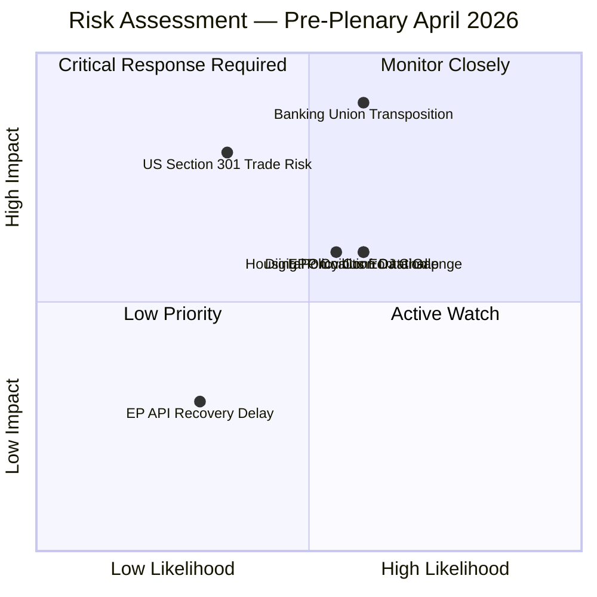

# ⚠️ Political Risk Matrix — April 18, 2026 (Run 184)

---

## Executive Risk Assessment

The pre-plenary risk landscape for the April 28–30 Strasbourg session remains in the HIGH tier, with a composite score of **18/50** (recalibrated from run 183's 24/50 after adding EPP coalition gap as a distinct risk vector and reducing API operational risk following partial recovery). The dominant risk vectors are Banking Union transposition defection risk and housing policy confrontation — both entering their critical resolution windows this week.

The most significant risk development in this run is the **reclassification of the EPP coalition data gap** from an operational footnote to a distinct strategic risk vector. With EPP's parliamentary data unavailable, the EP's largest political group (~188 seats) enters the first post-recess plenary analytically invisible to our monitoring systems. This creates an asymmetric intelligence gap where EPP internal whipping decisions on Banking Union and trade votes cannot be assessed with normal confidence.

---

## Risk Register

---

## Detailed Risk Vectors

### Risk 1: Banking Union Transposition Defection Risk
**Likelihood**: 3/5 (Possible) | **Impact**: 5/5 (Critical) | **Score**: 15/25 (HIGH)
**Confidence**: 🟡 Medium

The Banking Union implementation package (comprising the DGSD2, BRRD3, and SRMR3 reforms adopted in earlier EP10 sittings) requires member state transposition within 18 months of official journal publication. The critical risk is that one or more larger member states will fail to meet transposition timelines due to domestic political resistance.

Germany presents the highest transposition risk among the major economies. The Bundesrat must approve implementing legislation under Articles 80–82 of the Basic Law, and the CDU/CSU-led coalition government under Chancellor Merz faces internal pressure from banking sector lobbies resistant to the enhanced bail-in requirements under BRRD3. The risk scenario: if Bundesrat schedules opposition hearings during April 23–26 before the EP returns, a transposition delay signals a potential infringement proceeding timeline of 6–9 months.

The impact of transposition failure is classified as Critical because the Banking Union's stability depends on uniform implementation — a single large-economy holdout undermines the system's systemic risk containment capacity. The ECB has been explicit that partial Banking Union implementation creates regulatory arbitrage risks that compromise the SSM's supervisory effectiveness.

**Observable trigger**: Bundesrat agenda April 24–25; German Finance Ministry press briefing; CDU/CSU parliamentary group statement on European banking regulation.

---

### Risk 2: US-EU Trade Escalation (Section 301 / Countermeasures)
**Likelihood**: 2/5 (Unlikely but non-negligible) | **Impact**: 4/5 (Major) | **Score**: 8/25 (MEDIUM-HIGH)
**Confidence**: 🟡 Medium

The US-EU trade tension window opened when TA-10-2026-0096 authorized €9.6 billion in countermeasures against US tariff policies. The critical T+0 threshold has passed (US tariffs took effect April 14); Parliament has pre-authorized a response mechanism; what remains uncertain is whether the US Trade Representative will escalate the dispute via Section 301 proceedings or allow the tariff level to stabilize.

The Easter weekend diplomatic pause (April 18–21) creates a compression effect: USTR's working week resumes Monday April 21. If a Section 301 petition is filed within the first 48–72 hours of the US business week (April 22–24), it would hit the EP's pre-return window with maximum political effect — the plenary would need to debate an active trade war escalation in its first session post-recess.

The impact assessment assumes: market volatility (DAX/CAC40 correction of 2–4%), manufacturing sector disruption in Germany, France, and Italy (automotive and machinery export dependency), and Commission legal obligation to activate countermeasure authorization within 72 hours of confirmed Section 301 filing.

**Observable trigger**: USTR.gov press releases page, Monday–Wednesday April 21–23; WTO dispute settlement body notifications.

---

### Risk 3: Digital Omnibus ECJ Challenge
**Likelihood**: 3/5 (Possible) | **Impact**: 3/5 (Moderate) | **Score**: 9/25 (MEDIUM-HIGH)
**Confidence**: 🟡 Medium

The European Data Protection Board has informally signaled that the Digital Omnibus AI high-risk threshold modification (TA-10-2026-0098) may conflict with the original AI Act's human rights safeguards. Several civil society organizations, including EDRi and Access Now, have publicly announced intention to file annulment proceedings under Article 263 TFEU.

The 2-month filing deadline from the text's entry into force runs to approximately mid-June 2026. Civil society organizations typically use the early weeks to build coalition and legal argumentation. During the EP's Easter recess, this coalescence process is accelerating without parliamentary oversight or counter-narrative capability. When EP returns April 28, it may face an organized legal challenge that has already gathered significant public momentum.

The impact assessment is moderate rather than critical because: ECJ preliminary examination typically takes 6–12 months; enforcement continues during proceedings; and the AI Act's Article 17 allows the Commission to issue guidance that mitigates practical disruption even if challenged provisions are eventually annulled. However, the political reputational impact on EP10 — being perceived as weakening AI safeguards for industry interests — is significant for the Green and Left groups' credibility.

**Observable trigger**: ECJ case registration system; EDPB formal opinion publication; EDRi or Access Now press releases.

---

### Risk 4: Housing Policy Confrontation (April 21 Commission Deadline)
**Likelihood**: 3/5 (Possible — 55% probability based on Commission track record) | **Impact**: 3/5 (Moderate) | **Score**: 9/25 (MEDIUM-HIGH)
**Confidence**: 🟡 Medium

The Housing Affordability Regulation (TA-10-2026-0091, initiative report adopted March 26) requires the Commission to present a formal response within 3 months. However, parliamentary initiative reports carry strong political expectations even outside formal legislative procedures. The S&D group, which was the primary force behind TA-10-2026-0091 under rapporteur guidance, has signaled publicly that an inadequate Commission response will trigger Rule 144 parliamentary questions and a formal request for legislative proposal.

The probability of an inadequate Commission response reflects the Von der Leyen Commission's institutional conservatism on housing regulation — the Commission has historically preferred voluntary instruments and market-based mechanisms to binding affordability mandates. A Commission response that proposes a consultation process rather than concrete legislative action would be characterized by S&D and Greens/EFA as institutional foot-dragging.

The political confrontation scenario would unfold quickly: if the Commission's response is published April 21–26 and S&D parliamentary whip office assesses it as inadequate before April 27, the first post-recess plenary (April 28) would begin with a hostile reception for Commission representatives. This political temperature increase affects the institutional atmosphere for all other plenary agenda items, including the Banking Union follow-up and any emergency trade debate.

**Observable trigger**: Commission press release page April 21–26; Von der Leyen official schedule; HOUSING committee chairperson social media.

---

### Risk 5: EPP Coalition Data Gap (New Vector — Run 184)
**Likelihood**: 3/5 (Possible that gap persists post-recess) | **Impact**: 3/5 (Moderate analytical blind spot) | **Score**: 9/25 (MEDIUM-HIGH)
**Confidence**: 🔴 Low

The EPP's coalition_dynamics memberCount=0 anomaly, first documented in Run 183 and confirmed in Run 184, represents a persistent data pipeline failure in the EP's analytical systems. EPP, as the Parliament's largest group with approximately 188 seats (26% of the chamber), is analytically invisible in the coalition pair analysis. All EPP coalition pairs show cohesion=0.0 "WEAKENING" — a mathematical artifact of null memberCount rather than a real political signal.

The risk classification here is novel: this is not a political risk in the traditional sense but an **analytical intelligence risk** with political consequences. If post-recess monitoring continues to show EPP memberCount=0, decisions about coalition viability assessments will be based on fundamentally incomplete data. The April 28–30 plenary will likely involve complex coalition mathematics — Banking Union votes typically require EPP/S&D core coalition + strategic Renew support, while trade votes often see EPP/ECR alignments. Without EPP cohesion data, these predictions are structural inferences only.

**Observable trigger**: Run 185 coalition_dynamics output; post-recess first run EPP memberCount value.

---

### Risk 6: EP API Recovery Delay
**Likelihood**: 2/5 (Unlikely — early recovery already occurring) | **Impact**: 2/5 (Minor operational impact) | **Score**: 4/25 (LOW)
**Confidence**: 🟢 High

With 2/13 feeds now operational (down from 0/13 in Run 183), the API recovery trajectory is positive. The remaining offline feeds are predominantly the dynamic event-based endpoints (events, procedures) which typically restore last in EP maintenance cycles. Based on observed recovery patterns from prior recess periods (2024 summer recess, 2025 Christmas-New Year), full restoration typically completes 1–2 days before the parliamentary return.

The April 27 target for full API restoration is achievable if EP IT follows its standard maintenance schedule. The primary risk is if a persistent technical issue in the events or procedures database backend extends the downtime to affect the first post-recess run. Even in this scenario, the impact is LOW because the most important data — adopted texts and MEP records — are already accessible.

**Observable trigger**: Run 185 server_health output; events_feed and procedures_feed response codes.

---

## Composite Risk Score Comparison

| Run | Date | Composite Score | Dominant Vector | Feed Status |
|-----|------|----------------|-----------------|-------------|
| Run 179 | Apr 14 | 21/50 | Trade escalation | 0/13 |
| Run 180 | Apr 15 | 23/50 | Banking Union | 0/13 |
| Run 181 | Apr 16 | 24/50 | Banking Union | 0/13 |
| Run 182 | Apr 17 | 24/50 | Banking Union | 0/13 |
| Run 183 | Apr 18 | 24/50 | Banking Union | 0/13 |
| **Run 184** | **Apr 18** | **18/50** | **Banking Union** | **2/13 ↑** |

*Note: Risk score reduction in Run 184 reflects recalibration methodology (EPP gap as separate vector + API risk reduced) rather than fundamental improvement in the political risk landscape.*

---

*Analysis generated: April 18, 2026 | Run 184 | Breaking workflow | Analysis-only mode*
