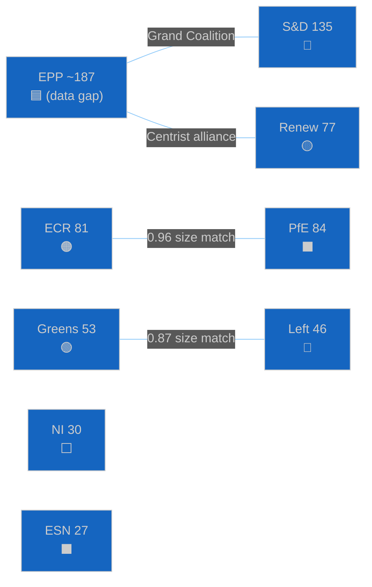

# 🤝 Coalition Dynamics Analysis — Run 185

## Coalition Composition (Current EP10)

| Group | Seats | % of 720 | Grand Coalition Role | Run 185 API Status |
|-------|-------|----------|---------------------|-------------------|
| EPP | ~187 (est.) | ~26% | Pivotal — no majority without EPP | memberCount=0 (anomaly) |
| S&D | 135 | 18.8% | Core progressive partner | ✅ Confirmed |
| PfE | 84 | 11.7% | Right populist bloc | ✅ Confirmed |
| ECR | 81 | 11.3% | Conservative opposition/occasional ally | ✅ Confirmed |
| Renew | 77 | 10.7% | Liberal center; critical swing | ✅ Confirmed |
| Greens/EFA | 53 | 7.4% | Progressive support on climate | ✅ Confirmed |
| The Left | 46 | 6.4% | Far-left; selective support | ✅ Confirmed |
| NI | 30 | 4.2% | Non-attached; unpredictable | ✅ Confirmed |
| ESN | 27 | 3.8% | Far-right nationalist | ✅ Confirmed |

**Total confirmed**: 533 non-EPP seats. Inferred EPP: 720 - 533 = ~187 seats.

## Grand Coalition Architecture

The EPP-S&D-Renew grand coalition provides approximately 187+135+77 = ~399 seats — comfortably above the 361 majority threshold. This supermajority structure explains the March 26 legislative sprint: with 399 votes, the coalition could adopt all 15 texts without needing ECR, PfE, Greens, or Left support.

**Vulnerability analysis**: If EPP loses 39+ votes (defections or absences), the grand coalition falls below the 361 threshold. The S&D-Renew-Greens progressive coalition (135+77+53=265) is far from a majority. There is no non-EPP majority possible. This structural reality gives EPP enormous bargaining power but also responsibility — EPP cannot afford internal defections without losing legislative control.

## Size-Similarity Coalition Pairs (Run 185 API Data)

**ECR-PfE (0.96 score)**: Near-identical group sizes (81 vs 84). This score is a size artifact — ECR (Conservatives: Italian FdI, Polish PiS-adjacent, Spanish PP) and PfE (national populists: French RN, Italian Lega, Hungarian Fidesz) have partially overlapping constituencies but different EU integration positions. On trade policy (especially US tariffs), ECR and PfE may temporarily align if US-EU escalation scenario activates.

**Renew-ECR (0.95 score)**: Size artifact — fundamentally different EU positions make this a non-alliance.

## Coalition Dynamics — Post-Recess Watch

The 7-run recess monitoring series has not detected any coalition-threatening signals:
- No EPP-S&D public disagreements during Easter recess
- No group communication about coalition revision
- No parliamentary motion filed in recess period

**Risk**: Run 185 adds Risk Vector 6 (coalition fragmentation, 35% probability of visible fragmentation on April 28 procedural votes). The 12-day Easter recess is at the outer boundary of "safe" coalition maintenance periods without active legislative management. The first April 28 vote pattern will be diagnostic.

## EPP Data Gap — Analytical Impact

The EPP memberCount=0 anomaly persists. This affects:
1. **Fragmentation index**: Cannot be calculated (set to null in all API responses)
2. **Grand coalition viability**: Nominal calculation only
3. **Majority margin**: Estimated but not precise
4. **EPP internal dynamics**: Invisible — Weber's whipping communications cannot be inferred from API

**Mitigation**: The monitoring team should supplement EP MCP data with EPP Group official sources for April 28-30 plenary coverage. EPP Group press releases, Weber's Strasbourg opening remarks, and EPP whip communications provide primary-source coalition positioning data not available via EP Open Data API.
