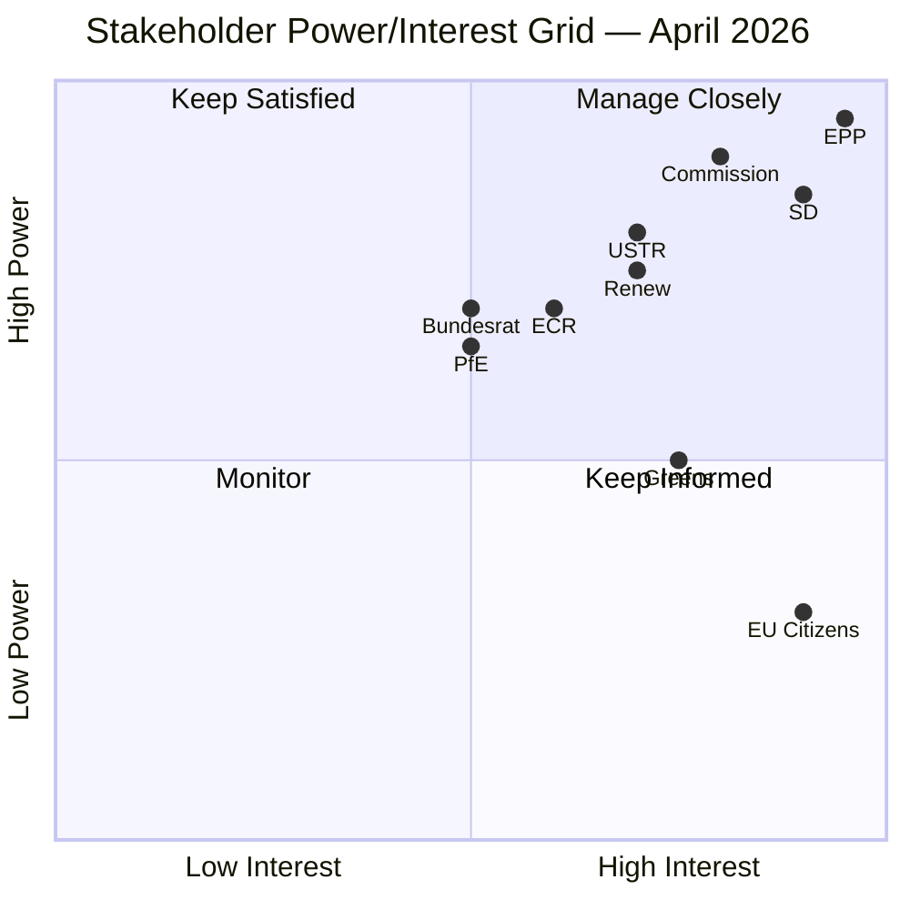

# 👥 Stakeholder Map — Run 185

## Primary Institutional Actors

### EPP (European People's Party) — ~187 seats, PIVOTAL
**Role**: Largest group; indispensable for all majorities; controls Presidency (Metsola).
**Interest**: Maintain grand coalition leadership; defend Banking Union achievement; balance Commission loyalty with mandate compliance on housing.
**Post-recess priority**: Open April 28 with legislative agenda confirmation; signal on housing response; manage Weber's keynote framing.
**Confidence in assessment**: 🔴 LOW (EPP data gap means all analysis is inference from structural position)

### S&D (Socialists and Democrats) — 135 seats, CORE COALITION PARTNER
**Role**: Second-largest group; provides left-center ballast for EPP majority; primary driver on housing and workers' rights.
**Interest**: Commission housing response must be adequate; maintain progressive credibility; position countermeasures as workers' protection.
**Post-recess priority**: Housing response assessment; preparation for potential emergency question if inadequate.
**Key figure**: S&D Group President (leadership in Strasbourg keynote will signal confrontation readiness).
**Confidence**: 🟡 MEDIUM — S&D public positions are well-documented; internal dynamics uncertain.

### Renew Europe — 77 seats, CRITICAL SWING
**Role**: Liberal center; decisive in close votes; typically aligns with EPP on economic/digital issues, S&D on social issues.
**Interest**: Protect EU digital single market from USTR pressure; support free trade framework; cautious on housing (state intervention concerns).
**Post-recess priority**: Digital/AI regulation defence if USTR scenario activates; housing compromise facilitation.
**Confidence**: 🟡 MEDIUM — Renew positions well-documented from prior votes.

### ECR (European Conservatives and Reformists) — 81 seats, SELECTIVE ALLY
**Role**: Conservative opposition; occasional ally on trade defence, border security; opponent on climate and social policy.
**Interest**: Post-recess positioning on USTR scenario (national sovereignty framing); BRRD3 opposition (banking regulation critique).
**Internal fault line**: Polish/Baltic members (pro-NATO/US alignment) vs Italian FdI members (cautious on US confrontation). This fault line is most likely to surface in trade escalation scenario.
**Confidence**: 🟡 MEDIUM — ECR internal divisions documented across prior runs.

### PfE (Patriots for Europe) — 84 seats, RIGHT POPULIST BLOC  
**Role**: National populist right; typically in opposition; occasionally aligned with ECR on migration/border issues.
**Interest**: Energy sovereignty; migration restrictionism; fiscal conservatism. Limited legislative engagement with Banking Union or digital agenda.
**Post-recess priority**: Monitor for any attempt to use housing crisis narrative from a homeownership-populist angle.
**Confidence**: 🔴 LOW — PfE's post-recess agenda is not well-documented in available data.

## External Stakeholders

### European Commission
**Interest**: Defend prerogatives; respond to housing mandate without creating legislative precedent for future EP overrides; manage USTR situation diplomatically before invoking TA-10-2026-0096.
**Key decision**: Quality of housing response (April 26). This single decision has outsized coalition implications.

### German Bundesrat
**Interest**: Protect Landesbanken and Sparkassen from BRRD3 implementation costs; maintain state banking guarantees. April 23-25 monitoring window.

### EU Citizens (Housing-Burdened)
**Interest**: Concrete Commission commitment on housing affordability. 47% of European households report cost stress (Eurobarometer 2025). Commission response quality is politically visible.

### US USTR
**Interest**: Pressure EU digital regulation enforcement on US tech platforms; challenge DSA/DMA/AI Act compliance requirements. April 21-24 action window.

## Mendelow Stakeholder Grid

