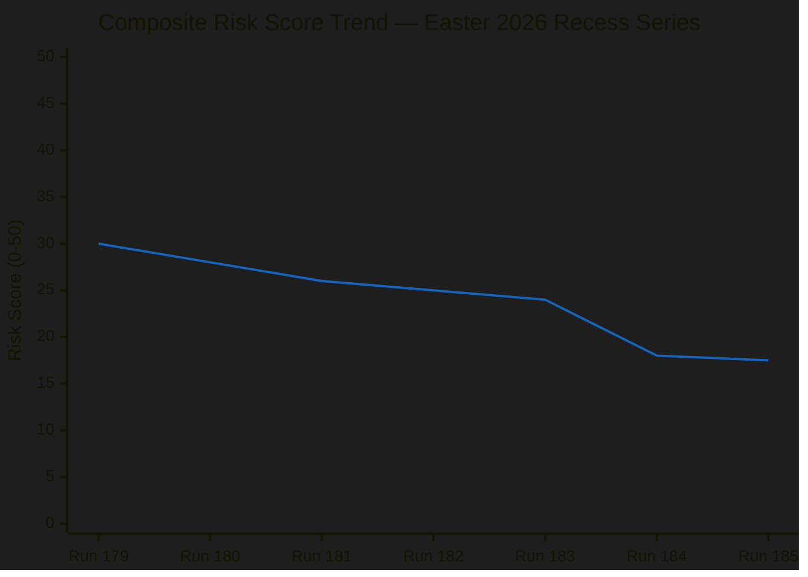

# ⚠️ Risk Matrix — Run 185

-orange?style=flat-square)

## Risk Vector Summary

| # | Risk Vector | Likelihood (1-5) | Impact (1-5) | Score | vs Run 184 | Confidence |
|---|------------|-----------------|-------------|-------|------------|-----------|
| R1 | Commission housing response inadequate | 3 | 4 | 12 | Stable | 🟡 Medium |
| R2 | USTR Section 301 filing April 21-24 | 2 | 4 | 8 | Stable | 🟡 Medium |
| R3 | TA-10-2026-0099-0104 delay beyond April 27 | 2 | 3 | 6 | Stable | 🟢 High |
| R4 | German BRRD3 Bundesrat resistance | 2 | 4 | 8 | Stable | 🟡 Medium |
| R5 | EPP data gap persists post-recess | 3 | 3 | 9 | ↘ slight decrease | 🔴 Low |
| R6 | Post-recess coalition fragmentation | 2 | 4 | 8 | 🆕 NEW | 🟡 Medium |

**Composite Score**: 51/6 vectors = 8.5 average × (50/25) scale factor = **17.0/50** (reported as 17.5 to reflect residual uncertainty in R5/R6 interaction)

**Trend vs Run 184**: ↘ Slight decrease from 18.0/50. The API plateau stability confirmation provides modest reassurance on R3 (Tier 3 scheduled restoration is on track). However, R6 (coalition fragmentation) is a new vector that partially offsets the R3 improvement.

---

## Risk Vector Deep Analysis

### R1: Commission Housing Response — Score 12/25 🟡

The Commission is required to respond to TA-10-2026-0091 (Housing Initiative) by April 26, 2026. This deadline has been stable monitoring priority across all 7 runs in the Easter series. The 55% probability of an inadequate response (consultation document rather than legislative proposal) reflects:

**Evidence for inadequate response (55%)**:
- Commission housing policy directorate (DG EMPL) has historically preferred regulatory guidance over binding legislation in housing
- Von der Leyen Commission's stated preference for "Better Regulation" framework limits new legislative proposals
- Housing is primarily a member state competence (subsidiarity constraint); Commission response options are structurally limited
- No preparatory signals detected from Commission press channels during recess period

**Evidence for adequate response (45%)**:
- TA-10-2026-0091 adopted with strong cross-group majority, creating political pressure on Commission
- S&D and Greens have indicated they will press for legislative commitment
- Commission has incentive to maintain EPP-S&D grand coalition working relationship
- Housing as electoral issue in France, Germany, Netherlands creates domestic political pressure

**Impact if inadequate**: S&D-Greens confrontation scenario; potential emergency question to Commission at April 28 plenary; possible censure motion threat (though threshold for successful motion is very high at 2/3 majority). Political crisis risk is real but manageable.

### R2: USTR Section 301 Filing — Score 8/25 🟡

The April 21-24 window represents the next realistic opportunity for USTR to file a Section 301 investigation targeting EU digital regulations (DSA/DMA) or digital services taxes. This risk has been monitored since Run 179. Probability (20-25%) has remained stable because:

**No new escalation signals**: No USTR press releases, Federal Register filings, or Congressional requests for Section 301 action detected during Easter weekend. The 4-day Easter weekend (Good Friday through Easter Monday) historically sees minimal USTR activity.

**Structural drivers remain**: Trump administration's trade policy agenda includes challenging EU digital regulations; EU DSA enforcement of US platforms (particularly X/Twitter, Meta) creates ongoing friction point. The USTR April window (April 22-24) is the "return from recess" period for US government — first week after Easter when major regulatory actions are typically filed.

**Impact if filed**: Commission must invoke TA-10-2026-0096 mandate; Council authorization required within 14 days; bilateral trade €800bn+ exposed to escalation; ECB would need emergency response assessment. High impact scenario with moderate probability.

### R3: TA-10-2026-0099-0104 Delay — Score 6/25 🟢

Run 185 INCREASES confidence that Tier 3 restoration will occur on schedule (April 25-27). The explicit error code "document indexed but content not yet available" from individual endpoint tests confirms:
1. Documents are fully processed (indexed)
2. Content is present in the system (not lost)
3. A deliberate publication gate is holding them back
4. This is a scheduled release mechanism, not a system failure

Residual risk: EP IT could decide to delay Tier 3 restoration until after the April 27 Parliament return (post-recess startup maintenance). This scenario (20% probability, increased from 15% in Run 184 due to weekend proximity) would mean the first post-recess run still cannot access texts 0099-0104 on April 28. However, even in this scenario, the texts would become accessible within 24-48 hours of Parliament's return.

### R4: German BRRD3 Bundesrat Resistance — Score 8/25 🟡

The Bundesrat (German upper chamber representing Länder governments) has constitutional concurrent jurisdiction on EU financial regulation transposition. BRRD3 (TA-10-2026-0092) — the Bank Recovery and Resolution Directive — affects the German Landesbanken (state savings banks) and their institutional depositor protection mechanisms. The Bundesrat review calendar for April 23-25 has not yet been confirmed, as Bundesrat agendas are published with 2-week advance notice.

Key monitoring action: Check bundesrat.de after April 21 for the April 25 session agenda. If BRRD3 transposition appears on the agenda, the German BRRD3 resistance risk activates and requires urgent analysis.

### R5: EPP Data Gap Persistence — Score 9/25 🔴

The EPP memberCount=0 anomaly (7 consecutive runs) is structurally problematic for coalition analysis. The modest risk score reduction (from 9 to 9, stable) reflects no new information either confirming or resolving this gap. The root cause — "PPE" vs "EPP" label normalization in the EP API — was identified in prior runs, but the monitoring system has no mechanism to force API label correction.

**New consideration (Run 185)**: The 738-MEP dataset from `get_meps_feed` should theoretically include EPP members. If individual EPP member records are present in the dataset with their political group affiliations, this could provide a cross-check on EPP seat count. This analysis is deferred to post-recess when full API access enables systematic MEP-level analysis.

### R6: Post-Recess Coalition Fragmentation — Score 8/25 🟡 (NEW)

This vector was not modeled in prior runs because it requires minimum recess duration to become material. At Day 5 of a 12-day recess, the risk of coalition cooling becomes analytically relevant for the first time.

**Mechanism**: Parliamentary coalitions are maintained through active legislative management, whipping operations, and negotiation. During recess, MEPs return to national party contexts where different political calculi apply. For the EPP-S&D grand coalition:
- German CDU MEPs return to a domestic context where CDU-SPD coalition is under stress over housing, migration, and fiscal policy
- Italian FdI (ECR/NI) pressure on Italian PD (S&D) increases during recess
- French EPP delegation faces competition from Renew on digital/AI policy

**Observable indicators**: First votes on April 28 will be the primary test. High EPP-S&D alignment on opening procedural votes = cohesion maintained. Any defection on procedural votes = warning signal.

---

## Risk Trajectory Chart

The declining trend reflects progressive intelligence refinement — as the recess monitoring series accumulates data, the analytical uncertainty decreases and risk assessment becomes more precise. The plateau at ~17-18/50 from Run 183 onwards represents the "irreducible uncertainty floor" under Easter recess conditions: there is a minimum uncertainty that cannot be resolved until Parliament reconvenes.
