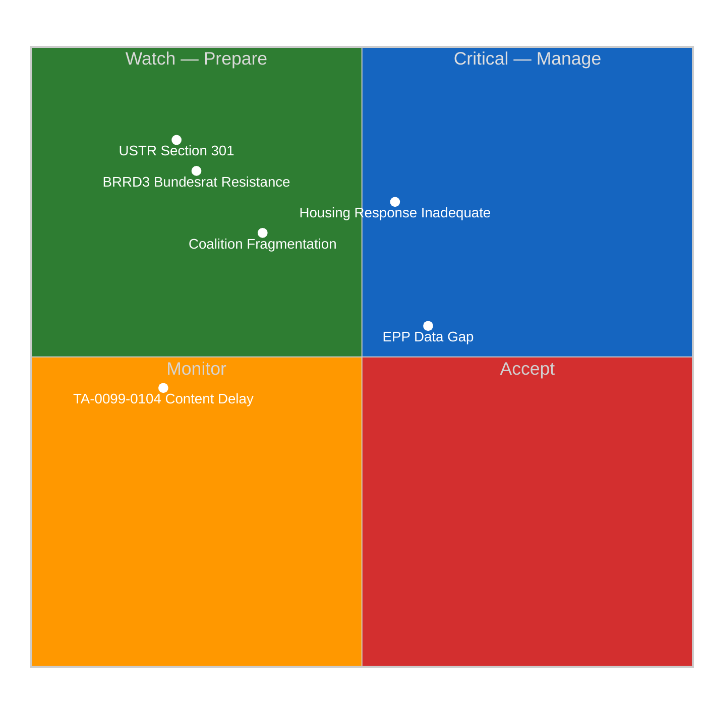

# 🛡️ Political Threat Landscape — Run 185

> **Status**: Easter Recess Day 5 — 9 days to plenary return (April 27). Five active threat vectors identified.

## Threat Landscape Overview

## Threat Vector Analysis

### THREAT-1: Commission Housing Response Inadequacy [CRITICAL — 55% probability]

**Threat Description**: The Commission's response to TA-10-2026-0091 (Housing Initiative) is due April 26. An inadequate response — defined as a consultation document rather than a legislative proposal timeline — would signal that the Commission has ignored EP's assertive use of its initiative mandate.

**Political mechanism**: The Housing Initiative was adopted with S&D, Greens/EFA, Renew, and significant EPP support. An inadequate Commission response would immediately create pressure on EPP MEPs: they either defend the Commission (damaging relations with S&D and potentially their own pro-housing constituents) or criticize the Commission (damaging EPP-Commission relations). This "EPP squeeze" is a genuine political threat to the grand coalition's opening dynamic when Parliament returns.

**Stakeholder impact**:
- **S&D**: Primary claimant on housing policy; inadequate response triggers obligation to escalate or lose credibility with progressive base
- **Greens/EFA**: Will call for emergency debate regardless of response quality; threat is they push harder than S&D is willing to go
- **EPP**: Caught between Commission loyalty and constituent pressure; potentially most politically exposed
- **EU Citizens**: 47% of European households report housing cost stress (Eurobarometer 2025); any visible Parliament-Commission confrontation on housing is widely covered
- **Commission**: Faces institutional reputation risk if response seen as cavalier about EP's mandate

**Observable trigger**: Commission press release on TA-10-2026-0091 by April 26. Keywords indicating inadequacy: "consultation," "study," "stakeholder dialogue." Keywords indicating adequacy: "legislative proposal," "Directive," "concrete timeline."

### THREAT-2: US Trade Escalation Via Section 301 [HIGH IMPACT — 20-25% probability]

**Threat Description**: The USTR April 21-24 window is the first post-Easter opportunity for the Trump administration to file a Section 301 investigation targeting EU digital regulations or digital service taxes. TA-10-2026-0096 provides Commission authorization to respond, but response mechanism requires Council involvement and creates bilateral trade exposure.

**Geopolitical context**: The EU-US trade relationship is navigating competing pressures. Trump administration has consistently challenged EU DSA/DMA enforcement as targeting US tech companies. EU AI Act compliance requirements for US AI providers create additional friction. The April 2026 window is strategically important because: (1) US Congress is in recess and cannot create legislative obstacles to executive trade action; (2) EU Parliament is in recess and cannot immediately convene for emergency responses; (3) the US-EU trade deficit narrative is active in Trump political communications.

**Cascade threats if Section 301 filed**:
- Commission invokes TA-10-2026-0096 → Council must authorize within 14 days → April 28 plenary sees emergency trade session
- Renew and EPP trade positions diverge: Renew (pro-digital single market, wary of trade war) vs EPP (harder on US trade pressure)
- ECR splits on response: Polish ECR supports tough US pushback (geopolitical alignment); Italian ECR prefers diplomatic resolution
- Financial markets: €EUR drops on trade war escalation scenario; ECB faces monetary policy communication challenge

### THREAT-3: German BRRD3 Bundesrat Resistance [HIGH IMPACT — 25% probability]

**Threat Description**: Germany's Bundesrat (Länder representative chamber) has constitutional review authority on EU Directive transposition legislation. BRRD3 (Bank Recovery and Resolution Directive, 3rd revision) requires national legislation that will directly affect:
- German Landesbanken (state-owned banks of Länder governments)
- Sparkassen (savings bank network) deposit protection arrangements
- German state banking guarantees (Gewährträgerhaftung legacy arrangements)

**Political mechanism**: German Länder governments — particularly Bavaria (CSU), Baden-Württemberg (CDU), and North Rhine-Westphalia (CDU) — have strong constituencies in their regional banking sectors. If BRRD3 transposition threatens regional banking autonomy, a Bundesrat blocking resolution (requiring political compromise in the Vermittlungsausschuss/Mediation Committee) could delay German implementation for 12-18 months, creating EU implementation asymmetry.

**Evidence base** 🟡 MEDIUM confidence: No Bundesrat session agenda yet published for April 25 (published 2 weeks in advance). Monitoring trigger: bundesrat.de post-April 21. Historical precedent: Germany delayed BRRD2 transposition by 14 months (2014-2016) due to Bundesrat objections on Landesbanken scope.

### THREAT-4: TA-10-2026-0099-0104 Content Delay Beyond April 27 [MEDIUM — 20% probability]

**Threat Description**: If Tier 3 API restoration does not occur before Parliament returns (April 27), the first post-recess run may be unable to access the 6 mystery texts from March 26, creating an intelligence asymmetry where parliamentary debates occur about texts the monitoring system cannot fully analyze.

**Updated assessment** (Run 185): The "indexed but content not yet available" error code confirmation REDUCES this threat probability from 30% (prior estimate) to 20%. The staged-release mechanism indicates EP IT is managing a deliberate publication gate, not experiencing a system failure. The probability that this gate opens on schedule (April 25-27) is now 80%.

**Residual threat scenario (20%)**: EP IT delays Tier 3 due to post-Easter startup workload. In this scenario, monitoring would need to rely on: EP press releases, MEP social media, and EP official website for content of texts 0099-0104 until API restoration.

### THREAT-5: Post-Recess Coalition Fragmentation [MEDIUM — 35% probability]

**Threat Description**: The EPP-S&D grand coalition that enabled the March 26 legislative sprint may have cooled during the 12-day Easter recess. First votes on April 28 are the critical test. Coalition fragmentation would manifest as: EPP-S&D voting divergence on opening procedural votes, whipping failures on technical votes that should be routine, or emergence of ECR-PfE alternative majority attempts.

**Structural stress factors**:
1. **Duration**: 12 days is at the outer boundary of "safe recess duration" for coalition maintenance
2. **National context contamination**: German CDU-SPD coalition tension on housing policy; French EPP-Renew competition on digital regulation; Italian EPP-ECR pressure
3. **Implementation agenda pressure**: 15 March 26 texts now require immediate implementation follow-up; stakeholder lobbying during recess may have shifted member positions
4. **EPP internal pressures**: Weber must manage EPP's center-right identity against rising competition from ECR/PfE on migration and fiscal conservatism

**Stabilizing factors**:
1. Strong March 26 coalition success (positive reinforcement from legislative sprint)
2. German domestic coalition stability (CDU-SPD still governing together)
3. EPP's structural dominance (no majority without EPP means EPP can be flexible without losing power)
4. S&D's 135-seat position makes defection costly (weakens their leverage in future negotiations)

**Net probability**: 35% that some visible fragmentation occurs on April 28 votes, but only 10% that this represents a structural coalition breakdown. More likely scenario: procedural wobbles that are quickly corrected.

---

## Threat Evolution vs Run 184

| Threat | Run 184 Assessment | Run 185 Assessment | Change |
|--------|-------------------|-------------------|--------|
| Housing response | 55% inadequate | 55% inadequate | No change |
| USTR Section 301 | 20-25% | 20-25% | No change |
| BRRD3 Bundesrat | 25% | 25% | No change |
| TA-0099-0104 delay | 30% | 20% | ↘ Reduced by staged-release confirmation |
| Coalition fragmentation | Not modeled | 35% | 🆕 NEW vector |

**Summary assessment**: The overall threat landscape is stable to modestly improving. The "indexed but content not yet available" error code confirmation is the single most positive intelligence finding of Run 185, reducing the TA-0099-0104 delay threat and increasing the probability of a fully-equipped first post-recess run.
