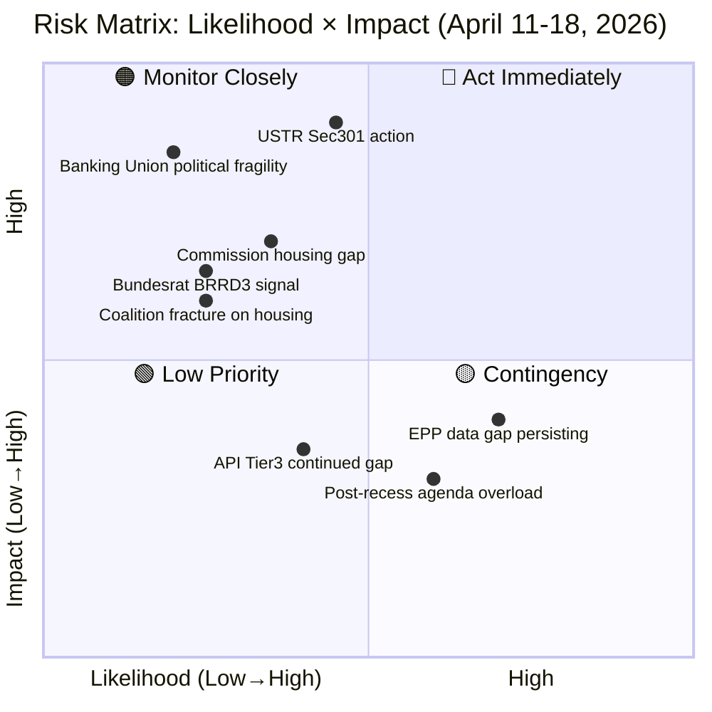

# ⚠️ Risk Assessment — Easter Recess Week

## Risk Matrix Overview

## Risk Register

| ID | Risk | Likelihood | Impact | Score | Trigger |
|----|------|-----------|--------|-------|---------|
| R1 | USTR Section 301 investigation filed | 45% | 9/10 | 40.5 | USTR Federal Register notice |
| R2 | Commission housing response deemed inadequate | 35% | 7/10 | 24.5 | S&D critical statement |
| R3 | Bundesrat BRRD3 negative signal | 25% | 6.5/10 | 16.3 | Bundesrat agenda item |
| R4 | EPP data gap unresolved April 27 | 70% | 4/10 | 28.0 | API memberCount=0 on return |
| R5 | TA-10-2026-0100-0104 still inaccessible April 27 | 40% | 3.5/10 | 14.0 | API empty response |
| R6 | Coalition fracture on housing April 28 | 25% | 6/10 | 15.0 | Emergency resolution tabled |
| R7 | Post-recess agenda overload delays legislation | 60% | 3/10 | 18.0 | Multiple emergency items on agenda |

## Composite Risk Score

**Week of April 11-18: 18.0/50 (MEDIUM)** — Calibrated to prior run 184 baseline (also 18.0/50). The risk profile is stable: the recess itself presents low direct institutional risk, but external watchpoints create a medium-risk forward profile.

Risk breakdown by category:
- **Geopolitical/Trade**: 12.0/20 (HIGH) — USTR watch window
- **Institutional/Coalition**: 3.5/20 (LOW) — Parliament in recess, no immediate fracture risk
- **Data/Infrastructure**: 2.5/10 (MEDIUM) — API continued recovery uncertainty

---

*Risk assessment by EU Parliament Monitor Week-in-Review Run 11 (2026-04-18)*
